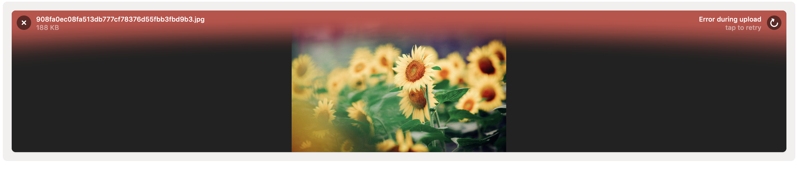

# JavaScript上传库：FilePond

**这是HelloGitHub 推出的[《讲解开源项目》](https://github.com/HelloGitHub-Team/Article)系列，今天给大家推荐JavaScript开源项目——FilePond**

## 一、介绍

### 1.1 Filepond

> Filepond是一个JavaScript文件上传库，可以上传你投入的任何内容，优化图像以加快上传速度，并提供出色的，可访问的，如丝般顺畅的用户体验。


### 1.2 特点和优势

- 接受目录，文件，blob，本地URL，远程URL和数据URI。
- 删除文件，选择文件系统，复制和粘贴文件，或使用API添加文件。
- 使用AJAX进行异步上传，或将文件编码为base64数据并沿表单发送。
- 图像优化，自动调整图像大小，裁剪和修复EXIF方向。
- 响应式，自动扩展到可用空间，可在移动和桌面设备上使用。

### 1.3 插件

* File Rename  (重命名客户端上的文件)
* File Encode (将文件编码为base64数据)
* File size Validation   (文件大小验证工具) 
* File Type Validation  （文件类型验证工具）
* File Metadata    （限制要添加的文件类型）
* File Poster  （在文件项目中显示图像）
* Image Preview  (显示图像文件的预览)
* Image Edit   （手动编辑图像文件）
* Image Crop  （设置图像文件的裁剪比例）
* Image Resize  （设置图像文件的输出尺寸）
* Image Transform  （上传之前在客户端上图像变换）
* Image EXIF Orientation (提取[EXIF](https://baike.baidu.com/item/Exif/422825?fr=aladdin)方向信息)
* Image Size Validation (限制要添加的图像的尺寸)
* Image Filter  (将颜色矩阵应用于图像像素)

### 1.4 推荐组件

> Doka.js -- A JavaScript Image Editor for your Website

Doka.js可能就是你想要的。它是一个现代JavaScript图像编辑器，多卡支持设置裁剪宽高比，调整大小，旋转，裁剪和翻转图像。最重要的是，它与FilePond完美结合。


需要注意的是Doka.js是一个收费组件，如果感兴趣可以前往Doka.js官网：https://pqina.nl/doka/#pricing

## 二、实战操作

### 2.1 快速使用（CDN）

```html
<!DOCTYPE html>
<html>
<head>
  // html 标题
    <title>FilePond from CDN</title>

    <!-- 引入Filepond的css -->
    <link href="https://unpkg.com/filepond/dist/filepond.css" rel="stylesheet">

</head>
<body>

<!-- input标签作为文件上传入口 -->
<input type="file" class="filepond">

<!-- 引入FilePond的js -->
<script src="https://unpkg.com/filepond/dist/filepond.js"></script>


<script>
  // FilePond.parse 使用类.filepond解析DOM树的给定部分，并将它们转换为FilePond元素。
  FilePond.parse(document.body);

</script>

</body>
</html>
```


### 2.2 引入插件

似乎单纯的上传功能是否无法满足我们的需求，FilePond可以根据自己的需求结合上面的插件一起来使用哦。下面我来介绍如何引入插件吧！

```html
// 一定要查阅清楚是否有css文件，如果有请在<head><link href="xxx.css" rel="stylesheet"></head>标签中引入哦
<head>
  <!-- 引入图像预览插件的css文件 -->
  <link href="https://unpkg.com/filepond-plugin-image-preview/dist/filepond-plugin-image-preview.css" rel="stylesheet">
</head>
<!-- 引入图像预览插件的js文件 -->
<script src="https://unpkg.com/filepond-plugin-image-preview/dist/filepond-plugin-image-preview.js"></script>

<script>

// 注册插件 FilePondPluginImagePreview 图像预览插件为已上传的图像呈现缩小的预览。
FilePond.registerPlugin(FilePondPluginImagePreview);
</script>
```

我们真理一下引入插件的步骤：

​		1.引入css文件（部分插件有css文件）

​		2.引入js文件

​		3.注册插件

​		4.配置插件（部分插件需配置）

### 2.3 配合插件使用

```html
<!DOCTYPE html>
<html>
<head>
    <title>FilePond from CDN</title>

    <!-- Filepond css -->
    <link href="https://unpkg.com/filepond/dist/filepond.css" rel="stylesheet">
    <!--    FilePondPluginImagePreview 插件css-->
    <link href="https://unpkg.com/filepond-plugin-image-preview/dist/filepond-plugin-image-preview.css" rel="stylesheet">
    <!--    FilePondPluginImageEdit 插件css-->
    <link href="https://unpkg.com/filepond-plugin-image-edit/dist/filepond-plugin-image-edit.css" rel="stylesheet">


</head>
<body>

<!-- 我们将把这个输入框变成上传文件框 -->
<input type="file" class="filepond">

<!-- FilePondPluginImagePreview 插件js-->
<script src="https://unpkg.com/filepond-plugin-image-preview/dist/filepond-plugin-image-preview.js"></script>
<!--FilePondPluginImageEdit 插件js-->
<script src="https://unpkg.com/filepond-plugin-image-edit/dist/filepond-plugin-image-edit.js"></script>
<!--FilePondPluginFileValidateSize 插件js-->
<script src="https://unpkg.com/filepond-plugin-file-validate-size/dist/filepond-plugin-file-validate-size.js"></script>
<!--FilePondPluginFileValidateType 插件js-->
<script src="https://unpkg.com/filepond-plugin-file-validate-type/dist/filepond-plugin-file-validate-type.js"></script>
<!--FilePondPluginImageCrop 插件js-->
<script src="https://unpkg.com/filepond-plugin-image-crop/dist/filepond-plugin-image-crop.js"></script>
<!--FilePondPluginImageExifOrientation 插件js-->
<script src="https://unpkg.com/filepond-plugin-image-exif-orientation/dist/filepond-plugin-image-exif-orientation.js"></script>
<!--引入Filepond的js-->
<script src="https://unpkg.com/filepond/dist/filepond.js"></script>


<script>
    // querySelector() 方法返回文档中匹配指定 CSS 选择器的一个元素。
    var inputElement = document.querySelector('input[type="file"]');

    // 注册插件
    // FilePondPluginImagePreview  上传时可以预览到上传的图片等
    // FilePondPluginImageEdit   由于doka收费，所以编辑功能就不演示了。
    // FilePondPluginFileValidateType  图片类型
    // FilePondPluginImageCrop 图像裁剪
    // FilePondPluginFileValidateSize   文件大小验证插件处理阻止太大的文件。
    FilePond.registerPlugin(
        FilePondPluginImagePreview,
        FilePondPluginImageEdit,
        FilePondPluginFileValidateSize,
        FilePondPluginImageCrop,
        FilePondPluginFileValidateType,
        FilePondPluginImageExifOrientation

    );

    FilePond.setOptions({
        // 设置单个URL是定义服务器配置的最基本形式。
        server: '/upload',
        // 设置图片类型只能为png才能上传
        allowFileTypeValidation: false,
        acceptedFileTypes: "image/jpg",
        // 启用或禁用图像裁剪
        allowImageCrop: true,

        // 启用或禁用文件大小验证
        allowFileSizeValidation: true,
        maxFileSize: null,

        // 启用或禁用提取EXIF信息
        allowImageExifOrientation: true

    });

    // 使用create方法逐步增强基本文件输入到FilePond元素。
    FilePond.create(inputElement)
</script>

</body>
</html>
```

上面引用了常用的FilePond方法，FilePond还有其他方法destroys(销毁FilePond实例),find(返回附加提供的元素的FilePond实例),getOptions(返回当前的配置项),supported(鉴别浏览器是否支持FilePond)



## 三、总结

这是一款很轻便的上传插件，并没有太多繁琐的配置，这里并没有针对所以插件引入进行演示，FilePond还是一款很值得参考使用的JavaScript库，如果想让自己网站快速加入上传功能，不妨试试它吧。

## 四、参考资料

- **[FilePond 官方文档](https://pqina.nl/filepond/docs/)**
- **[FilePond Plugins List](https://pqina.nl/filepond/plugins.html)**