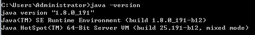
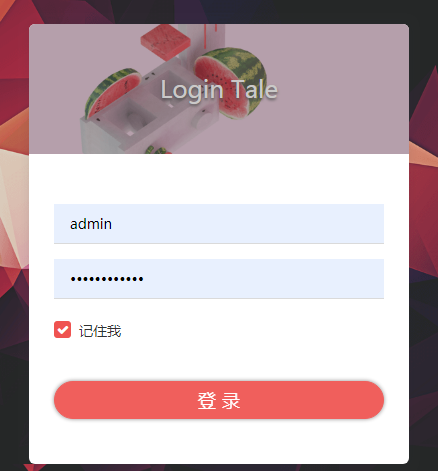

5分钟搭建私人Java博客系统——Tale

> 本文适用于刚学习完 Java 语言基础的人群，跟着本文可了解和运行 Tale 项目。注意：本文的示例是在 Windows 操作系统下演示


HelloGitHub 推出的[《讲解开源项目》](https://github.com/HelloGitHub-Team/Article)系列，今天给大家带来一款基于 Java 语言的轻量级博客开源项目——**Tale** 

它拥有小、美、快、稳的特点。该项目完全开源、免费，能够让你快速搭建包含前、后台的博客系统，大大节省了搭建私人博客的时间，开箱即用。让你可以专注于创作，让有故事的人更方便的表达想法。

> Tale 的项目地址：https://github.com/otale/tale

想要快速搭建一套自己的博客，那就跟着本文的步骤。你只需要花 5 分钟，就能拥有一个属于自己的私人博客了，并且可以对整个项目有一个完成的概念和感觉。下面是搭建完成的效果图：


那就让我们开始吧！

## 一、技术栈

Tale 基于的技术如下：
- **Blade 框架**：快速搭建 Web 应用程序的开源框架，该框架代码简洁、风格优雅。 
- **Jetbrick-template 模板引擎**：适合于动态 HTML 页面输出或者代码生成，可替代 JSP 页面或者 Velocity 等模板。 指令和 Velocity 相似，表达式和 Java 保持一致，易学易用。
- **SQLite 数据库**：是一种嵌入式数据库,它的数据库就是一个文件。

## 二、项目结构
该项目采用 MVC 模式：Model 数据层、View 展现层，Controller 逻辑层。下面简单介绍下项目的结构，便于我们翻阅源码、开发和运行。项目结构如下图：


项目分为前端、后台两部分，下面我们分开来介绍：

### 2.1 后台代码目录说明

- `annotation`：自定义注解目录，包括系统日志的注解类。
- `bootstarp`：初始化操作目录，包括初始化进程类， sqlite数据库初始化类，公共常量类等。
- `controller`：业务的控制器目录，包括文章控制器，分类控制器，初始化博客的控制器等。
- `extension`：底层公用代码目录，包括后台公共函数，主题公共函数。
- `hooks`：拦截器/过滤器目录，做一些拦截器的操作。
- `model`：数据模型目录，包括数据库模型，参数模型，业务模型。
- `service`：业务层目录，包括站点，系统配置，分类，标签，文章，评论的业务类。
- `task`：定时任务目录，可自定时添加定时任务。
- `utils`：业务层工具类目录，包括图像工具类，缓存工具类，公用工具类。
- `validators`：验证器目录，包括保存文章的校验，添加评论的校验功能。
- `Application`：入口类，在 IDE 中可直接运行。

### 2.2 前台代码目录说明

- `plugins`：插架存放目录，此目录作者废弃了
- `static`：静态资源目录，包括 css、images、js 和第三方插件
- `templates`：模板资源目录，包括后台管理界面、公共模板和主题模板，支持扩展主题
- `application*.properties`：项目环境配置文件

Tale 的项目的结构很简单和清晰，想把它运行起来也超级简单。你是不是开始手痒痒了，那接下来我们一起让它运行起来吧。

## 三、实战操作

### 3.1 准备工作

1. 确保本地已安装 Java8 开发环境：

    

2. 确保本地已安装 maven 工具：

    

### 3.2 下载项目

通过 `git clone` 命令把项目下载到本地：
```shell
git clone https://github.com/otale/tale.git
```

### 3.3 运行项目

我这里介绍了两种运行方式：通过 IDE 运行和命令行运行。

#### 3.3.1 通过 IDE 运行

1. 将项目导入到 IDE 中，这里我使用的是开发工具是 IDEA：

    

2. 找到 `com.tale.Application` 类，直接运行：

    

3. 运行成功，如下图：

    

#### 3.3.2 命令行运行

1. 切换到项目源码路径，编译源码命令如下：
    ```shell
    mvn clean package -Pprod -Dmaven.test.skip=true
    ```

    

2. 切换路径到 `tale\target\dist\` 目录

    

3. 解压 tale.zip 压缩文件

    

4. 运行 `tale-latest.jar`

    ```shell
    java -jar  tale-latest.jar
    ```

5. 启动成功如下图：

    


### 3.4 项目启动成功

1. 初始化配置，访问：<http://127.0.0.1:9000/> 首次登录，需要填写配置信息：

   

2. 登录后台管理系统，后台系统链接：<http://127.0.0.1:9000/admin/login> 输入管理员账号和密码：admin 即可登录：

   

   后台管理页面如下图：

   

3. 博客前台页面，博客前台链接：<http://127.0.0.1:9000/> 

   

Tale 博客包含的功能就不一一介绍了，跟着项目的文档，在 web 页面“点点点”就可以了。那么快去写自己博客上的第一篇博客吧！

## 四、最后

教程至此，这个项目应该已经在你的本地跑起来了。是不是很有成就感？后面怎么玩就看你自己了：部署到服务器正式上线、定制自己专属的功能、给项目贡献代码等，都是可以的。

本教程是针对有一定 Java 编程基础，但又不知道如果运行本项目的小伙伴。如果你是老手欢迎直接阅读下面参考资料，获取更多更详细的资料。

## 五、参考资料

- [tale wiki](https://github.com/otale/tale/wiki)

- [Blade 官方文档](https://lets-blade.com/docs/why-blade.html)

- [jetbrick-template 项目地址](https://gitee.com/sub/jetbrick-template)

- [Blade 项目地址](https://github.com/lets-blade/blade)
