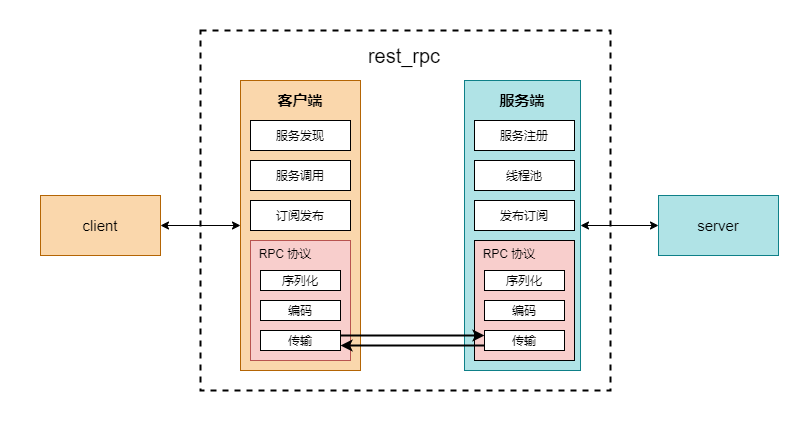
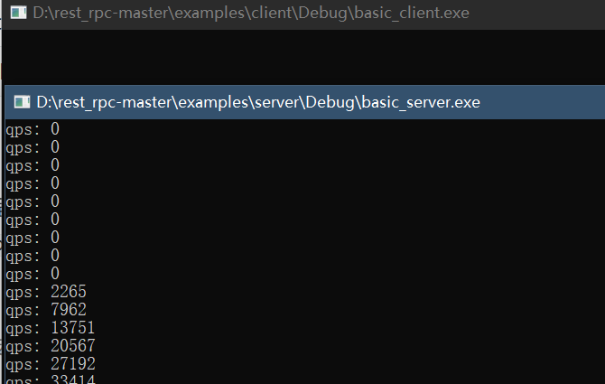
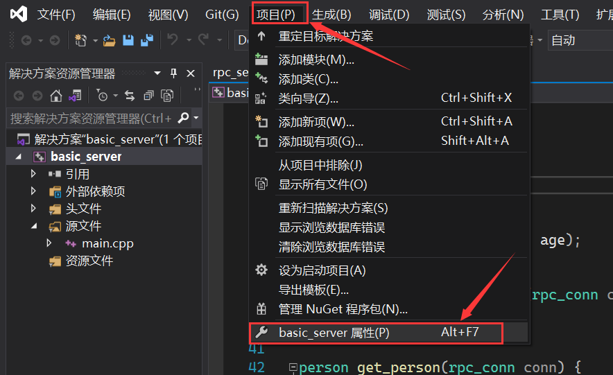
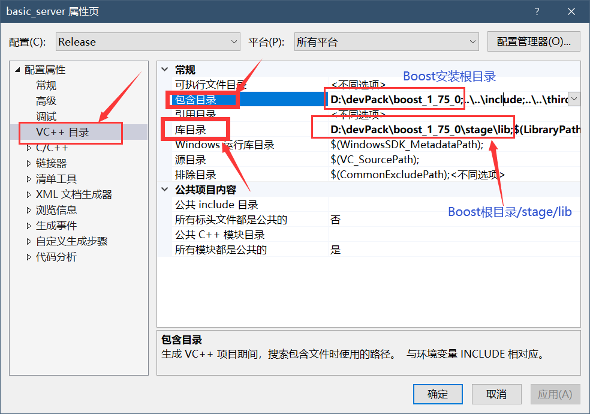

# 刚学会 C++ 的小白用这个开源框架，做个 RPC 服务要多久？

> 本文适合有 C++ 基础的朋友


<p align="center">本文作者：HelloGitHub-<strong>Anthony</strong></p>

HelloGitHub 推出的[《讲解开源项目》](https://github.com/HelloGitHub-Team/Article)系列，本期介绍基于 C++ 的 RPC 开源框架——**rest_rpc**，一个让小白也可以快速（10 分钟）开发 RPC 服务的框架。

> 项目地址：https://github.com/qicosmos/rest_rpc

rest_rpc 是一个高性能、易用、跨平台、header only 的 C++11 RPC 库，它的目标是让 TCP 通信变得非常简单易用，即使不懂网络通信的人也可以直接使用它、快速上手。同时使用者只需要关注自己的业务逻辑即可。



简而言之 rest_rpc 能让您能在**没有任何网络编程相关知识的情况下通过几行代码快速编写属于自己的网络程序**，而且使用非常方便，是入门网络编程及 RPC 框架的不二之选！

## 一、预备知识

### 1.1 什么是 RPC

RPC 是 Remote Procedure Call 即 远程过程调用 的缩写。

### 1.2 RPC 有什么用

举个例子来讲，有两台服务器 A、B 现在 A 上的程序想要远程调用 B 上应用提供的函数/方法，就需要通过网络来传输调用所需的消息。

但是消息的网络传输涉及很多东西，例如：

- 客户端和服务端间 TCP 连接的建立、维持和断开

- 消息的序列化、编组

- 消息的网络传输

- 消息的反序列化

- 等等

RPC 的作用就是屏蔽网络相关操作，**让不在一个内存空间，甚至不在一个机器内的程序可以像调用普通函数一样被调用。**

### 1.3 rest_rpc 优点

rest_rpc 有很多的优点：

- 使用简单
- 支持订阅模式
- 允许 `future` 和 `callback` 两种异步调用接口，满足不同人群爱好


## 二、快速开始

`rest_rpc` 依赖 `Boost` 在使用之前应正确安装 `Boost`.

### 2.1 安装

通过 `git clone` 命令将项目下载到本地：


```shell
git clone https://github.com/qicosmos/rest_rpc
```

### 2.2 目录结构

rest_rpc 项目根目录中文件及其意义如表所示：

| 文件名   | 作用                                        |
| -------- | ------------------------------------------- |
| doc      | rest_rpc 性能测试报告                       |
| examples | rest_rpc 例子，包含 client 和 server 两部分 |
| include  | rest_rpc 框架头文件                         |
| third    | msgpack 支持库，用于用序列化和反序列化消息  |

### 2.3 运行例程

rest_rpc 例程为 visual studio 工程，客户端和服务端例程分别存储在 `examples/client` 和 `examples/server` 中，直接使用 visual studio 打开 `basic_client.vcxproj` 或 `basic_server.vcxproj` 后直接编译即可，官方例程运行效果如图：



> **注意**：项目需要 `Boost/asio` 支持，如未安装 `Boost` 需要先正确安装 `Boost`后将 `Boost` 添加到工程。

**工程中添加 `Boost`  方法如下：**

1. 打开工程后点击菜单栏中的 `项目`→`属性`（快捷键  `Alt`+`F7`)
2. 选择左边的 `VC++ 目录` 选项，在右边的 `包含目录` 和 `库目录` 中添加 `Boost` 的 `根目录` 和 `依赖库` 后保存

我使用的为 `Boost 1.75` 安装目录为 `D:\devPack\boost_1_75_0`，配置过程如图所示：





## 三、详细教程

### 3.1 写在前面

无论 `服务端` 还是 `客户端` 都只用包含 `include/rest_rpc.hpp` 这一个文件即可。

所有**示例代码都是用了如下内容作为框架**：

```cpp
#include <iostream>
#include <rest_rpc.hpp>
#include <chrono>
using namespace rest_rpc;
using namespace rest_rpc::rpc_service;

int main(){
    // do something
}
```

### 3.2 编写服务端

生成一个能提供服务的客户端要经历一下几个过程：

1. `rpc_server` 对象的实例化，设置监听端口等属性
2. 服务函数的注册，定义服务端提供哪些服务
3. 服务的启动

#### 1）rpc_server

`rpc_server` 为 ` rest_rpc` 服务端对象，负责注册服务、发布订阅、线程池管理等服务端基本功能，位于 `rest_rpc::rpc_service` 命名空间。

使用时需要先实例化一个 `rpc_server` 对象并提供 监听端口、线程池大小，例如：

```cpp
rpc_server server(9000, 6); // 监听 9000 端口，线程池大小为 6
```

#### 2）服务端注册与启动

`rpc_server` 提供了 `register_handler` 方法注册服务以及 `run` 方法启动服务端，具体例子如下：

```cpp
/*服务函数第一个参数必须为 rpc_conn，然后才是实现功能需要的参数（为可变参数，数量可变，也可以没有*/
std::string hello(rpc_conn conn, std::string name){ 
	/*可以为 void 返回类型，代表调用后不给远程客户端返回消息*/
    return ("Hello " + name); /*返回给远程客户端的内容*/
}


int main(){
    rpc_server server(9000, 6);
    
    /*func_greet 为服务名，远程调用通过服务名确定调用函数*/
    /*hello 为函数，绑定当前服务调用哪个函数*/
    server.register_handler("func_greet", hello);
	
    server.run();//启动服务端
    
    return EXIT_SUCCESS;
}
```

其中 `function` 可以为 `仿函数` 或 `lambda`，例子分别如下：

**使用仿函数**：

```cpp
/*仿函数方法*/

struct test_func{
    std::string hello(rpc_conn conn){
        return "Hello Github!";
    }
};


int main(){
    test_func greeting;
    rpc_server server(9000, 6);
    
    /*greet 为服务名，远程调用通过服务名确定调用函数*/
    /*test_func::hello 为函数，绑定当前服务调用哪个函数*/
    /*greeting 为实例化仿函数对象*/
    server.register_handler("greet", &test_func::hello, &greeting);
    
    server.run();//启动服务端
    
    return EXIT_SUCCESS;
}
```

**使用 lambda 方法的例子**：

```cpp
/*使用 lambda 方法*/

int main(){
    rpc_server server(9000, 6);
    
    /*call_lambda 为服务名，远程调用通过服务名确定调用函数*/
    /*[&server](rpc_conn conn){...} 为 lambda 对象*/
    server.register_handler("call_lambda", 
                            /*除 conn 外其他参数为可变参数*/
                            [&server](rpc_conn conn /*其他参数可有可无*/) {
                                std::cout << "Hello Github!" << std::endl;
                                // 返回值可有可无
                            });
    
    server.run();//启动服务端
    
    return EXIT_SUCCESS;
}
```

#### 3）注册异步服务

有时因为各种原因我们无法或者不希望一个远程调用能同步返回（比如需要等待一个线程返回），这时候只需给 `register_handler` 方法一个 `Async` 模板参数（位于 `rest_rpc` 命名空间）：

```cpp
/*异步服务返回类型为 void*/
void async_greet(rpc_conn conn, const std::string& name) {
    auto req_id = conn.lock()->request_id();// 异步服务需要先保存请求 id

    // 这里新建了一个线程，代表异步处理了一些任务
    std::thread thd([conn, req_id, name] {
        
        std::string ret = "Hello " + name + ", Welcome to Hello Github!";
        
        /*这里的 conn 是一个 weak_ptr*/
        auto conn_sp = conn.lock();// 使用 weak_ptr 的 lock 方法获取一个 shared_ptr
        
        if (conn_sp) {
            /*操作完成，返回；std::move(ret) 为返回值*/
            conn_sp->pack_and_response(req_id, std::move(ret));
        }
    });
    
    thd.detach();
}

int main(){
    rpc_server server(9000, 6);
    
	server.register_handler<Async>("async_greet", async_greet);// 使用 Async 作为模板参数
    
    server.run();//启动服务端
    
    return EXIT_SUCCESS;
}
```

> rest_rpc 支持在同一个端口上注册多个服务，例如：

```cpp
server.register_handler("func_greet", hello);
server.register_handler("greet", &test_func::hello, &greeting);
server.register_handler("call_lambda", 
                        /*除 conn 外其他参数为可变参数*/
                        [&server](rpc_conn conn /*其他参数可有可无*/) {
                            std::cout << "Hello Github!" << std::endl;
                            // 返回值可有可无
                        });
// 其他服务等等 
server.run();
```

### 3.3 编写客户端

生成一个能进行远程服务调用的客户端要经历以下过程：

1. `rpc_client` 对象实例化，设定服务端地址与端口
2. 连接服务端
3. 调用服务

#### 1）rpc_client

`rpc_client` 为 ` rest_rpc` 客户端对象，有连接服务端、调用服务端服务、序列化消息、反序列化消息等功能，位于 `rest_rpc` 命名空间。

使用时需要先实例化一个 `rpc_client` 对象，然后使用其提供的 `connect` 或 `async_connect` 方法来 同步/异步 的连接到服务器，如：

```cpp
rpc_client client;

bool has_connected = client.connect("127.0.0.1", 9000);//同步连接，返回是否连接成功

client.async_connect("127.0.0.1", 9000);//异步连接，无返回值
```

当然，`rpc_client` 还提供了 `enable_auto_reconnect` 和 `enable_auto_heartbeat` 功能，用于不同情况下保持连接。

#### 2）调用远程服务

`rpc_client` 提供了 `async_call` 和 `call` 两种方式来 异步/同步 的调用远程服务，其中 `async_call` 又支持 `callback` 和 `future` 两种处理返回消息的方法，这部分介绍 同步 调用方法 `call`。

在调用 `call` 方法时如果我们的服务有返回值则需要设定模板参数，比如远程服务返回一个整数需要这样指定返回值类型 `call<int>`，如果不指定则代表无返回值。

在 **编写服务端** 部分我们说过每个服务在注册的时候都有一个名字，通过名字可以进行远程服务的调用，现在我们调用 **服务端** 部分写的第一个例子：

```cpp
int main(){
    /* rest_rpc 在遇到错误（调用服务传入参数和远程服务需要参数不一致、连接失败等）时会抛出异常*/
    try{

        /*建立连接*/
        rpc_client client("127.0.0.1", 9000);// IP 地址，端口号
        /*设定超时 5s（不填默认为 3s），connect 超时返回 false，成功返回 true*/
        bool has_connected = client.connect(5);
        /*没有建立连接则退出程序*/
        if (!has_connected) {
            std::cout << "connect timeout" << std::endl;
            exit(-1);
        }

        /*调用远程服务，返回欢迎信息*/
        std::string result = client.call<std::string>("func_greet", "HG");// func_greet 为事先注册好的服务名，需要一个 name 参数，这里为 Hello Github 的缩写 HG
        std::cout << result << std::endl;

    }
    /*遇到连接错误、调用服务时参数不对等情况会抛出异常*/
    catch (const std::exception & e) {
        std::cout << e.what() << std::endl;
    }
    
    return EXIT_SUCCESS;
}
```

当然，有些调用也许没有任何消息返回，这是时候直接使用 `client.call("xxx", ...)` 即可，此时 call 方法返回类型为 `void`。

#### 3）异步调用远程服务

有些时候我们调用的远程服务由于各种原因需要一些时间才能返回，这时候可以使用 `rpc_client` 提供的异步调用方法 `async_call` ，它默认为 callback 模式，模板参数为 timeout 时间，如想要使用 future 模式则需要特别指定。

**callback** 模式，**回调函数形参要与例程中一样**，在调用之后需要加上 `client.run()`：

```cpp
/*默认为 call back 模式，模板参数代表 timeout 2000ms，async_call 参数顺序为 服务名, 回调函数, 调用服务需要的参数(数目类型不定)*/
/*timeout 不指定则默认为 5s，设定为 0 代表不检查 timeout */
client.async_call<2000>("async_greet", 
                  /*在远程服务返回时自动调用该回调函数，注意形参只能这样写*/
                  [&client](const boost::system::error_code & ec, string_view data) {
                        
                        auto str = as<std::string>(data);
                        std::cout << str << std::endl;
                   }, 
                  "HG");// echo 服务将传入的参数直接返回
client.run(); // 启动服务线程，等待返回

// 其余部分和 call 的使用方法一样
```

**Future** 模式：

```cpp
auto f = client.async_call<FUTURE>("async_greet", "HG");

if (f.wait_for(std::chrono::milliseconds(50)) == std::future_status::timeout) {
    std::cout << "timeout" << std::endl;
}
else {
    auto ret = f.get().as<std::string>();// 转换为 string 对象，无返回值可以写 f.get().as()
    std::cout << ret << std::endl;
}
```

### 3.4 序列化

使用 rest_rpc 时如果参数是标准库相关对象则不需要单独指定序列化方式，如果使用自定义对象，则需要使用 msgpack 定义序列化方式，例如要传输这样一个结构体：

```cpp
struct person {
	int id;
	std::string name;
	int age;
};
```

则需要加上 `MSGPACK_DEFINE()`：

```cpp
/*
注意：无论是服务端还是客户端都要进行这样的操作
客户端和服务端 MSGPACK_DEFINE() 中的填入的参数顺序必须一致，这一点和 msgpack 的序列化方式有
如客户端和服务端中 MSGPACK_DEFINE() 中参数顺序不一致可能会导致解包时发生错误
*/
struct person {
	int id;
	std::string name;
	int age;

	MSGPACK_DEFINE(id, name, age);//定义需要序列化的内容
};
```

在对象中也是同理：

```cpp
class person{
    private:
    	int id;
        std::string name;
        int age;
    public:
    	MSGPACK_DEFINE(id, name, age);//需要在 public 中
}
```

然后即可将 person 作为参数类型进行使用。

## 四、特点：发布/订阅模式

rest_rpc 的一大特色就是提供了 发布-订阅 模式，这个模式在客户端和服务端之间需要不停传输消息时非常有用。

**服务端** 只需要使用 `rpc_server` 的 `publish` 或者 `publish_by_token` 方法即可发布一条订阅消息，其中如果使用 token 则订阅者需要使用相同的 token 才能访问，例如：

```cpp
int main() {
    rpc_server server(9000, 6);

    std::thread broadcast([&server]() {
        while (true) {
            /*发布订阅消息，所有订阅了 greet 的客户端都可以获得消息*/
            server.publish("greet", "Hello GitHub!");
            /*只有订阅了 secret_greet 并且提供了 www.hellogithub.com 作为 token 才可以获得消息*/
            server.publish_by_token("secret_greet", "www.hellogithub.com", "Hello Github! this is secret message");

            std::this_thread::sleep_for(std::chrono::seconds(1));// 等待一秒
        }
    });

    server.run();//启动服务端

    return EXIT_SUCCESS;
}
```

**客户端** 只需使用 `rpc_client` 的  `subscribe` 方法即可：

```cpp
void test_subscribe() {
    rpc_client client;

    client.enable_auto_reconnect();// 自动重连
    client.enable_auto_heartbeat();// 自动心跳包
    bool r = client.connect("127.0.0.1", 9000);
    if (!r) {
        return;
    }

    // 直接订阅，无 token
    client.subscribe("greet", [](string_view data) {
        std::cout << data << std::endl;
        });
    // 需要 token 才能正常获得订阅消息
    client.subscribe("secret_greet", "www.hellogithub.com", [](string_view data) {
        std::cout << data << std::endl;
        });
    
    client.run();// 不断运行
}

int main() {
    
    test_subscribe();

    return EXIT_SUCCESS;
}
```

#### 1）订阅时传输自定义对象

如果有这样一个对象需要传输：

```cpp
struct person {
	int id;
	std::string name;
	int age;

	MSGPACK_DEFINE(id, name, age);
};
```

**服务端** 直接将其作为一个参数即可，例如：

```cpp
person p{ 1, "tom", 20 };
server.publish("key", p);
```

**客户端** 需要进行 **反序列化**：

```cpp
client.subscribe("key", 
                 [](string_view data) {
                     msgpack_codec codec;
                     
                     person p = codec.unpack<person>(data.data(), data.size());
                     std::cout << p.name << std::endl;
                 });
```

## 五、最后

RPC 有很多成熟的工业框架如：
- 谷歌的 grpc 
- 百度的 brpc 等

但是相较 rest_rpc 来讲配置和使用较为复杂。新手将 rest_rpc 作为 RPC 的入门项目是一个非常好的选择。

至此，相信你已经掌握了 rest_rpc 的绝大部分功能，那么是时候动手搞一个 RPC 服务啦！

## 六、参考资料

- [什么是 RPC](https://www.jianshu.com/p/7d6853140e13)
- [RPC 的通俗解释](https://www.zhihu.com/question/25536695)