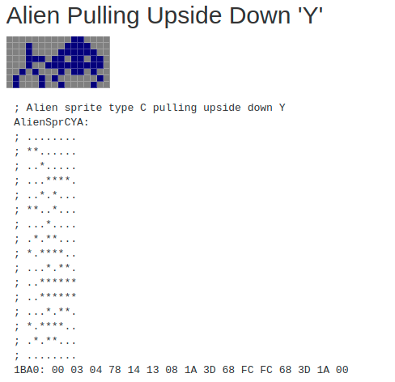
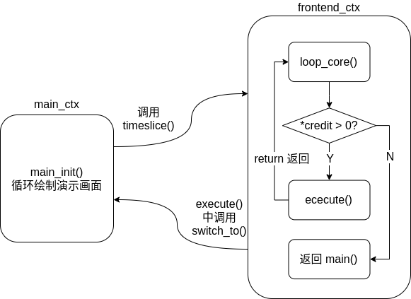

# C语言复刻40年前经典游戏-《太空侵略者》源码解读

> 本文适合有 C 语言基础的朋友

HelloGitHub 推出的[《讲解开源项目》](https://github.com/HelloGitHub-Team/Article)系列，本期为您讲解 1978 年经典街机游戏《太空侵略者》的 C 语言复刻源码——**si78c**。

> 项目地址：https://github.com/loadzero/si78c
>
> 《太空侵略者》原版 ROM 文件：https://archive.org/download/MAME_078/invaders.zip
>
> 《太空侵略者》原版汇编代码：https://computerarcheology.com/Arcade/SpaceInvaders/Code.html
>
> si78c 详细中文注释：https://github.com/AnthonySun256/easy_games/tree/main/si78c-%E6%BA%90%E7%A0%81%E8%A7%A3%E8%AF%BB


原版的《太空侵略者》由大约 2k 行的 8080 汇编代码写成，网友 **loadzero** 按照汇编代码写成了 《太空侵略者》的C语言版本并且最大程度还原了原版街机硬件的中断、协程逻辑，**在运行时其内存状态也几乎与原始版本相同，达到了像素级复刻**。

## 一、快速开始

**本文的实验环境为 Ubuntu 20.04 LTS**

**GCC 版本大于 GCC 3**

### 1. 事前准备

**si78c** 使用 ``SDL2`` 绘制游戏窗口，需要安装依赖：

```shell
$ sudo apt-get install libsdl2-dev
```

从仓库获取 **si78c** 源码：

```shell
$ git clone https://github.com/loadzero/si78c.git
```

> 推荐使用本人翻译的中文详细注释版本：https://github.com/AnthonySun256/easy_games/tree/main/si78c-%E6%BA%90%E7%A0%81%E8%A7%A3%E8%AF%BB

此外，**si78c** 会从原版的 ROM 中提取原版游戏的图片、字体，所以我们还需要下载原版的 ROM 文件

> 《太空侵略者》原版 ROM 文件：https://archive.org/download/MAME_078/invaders.zip

### 2. 文件结构

在 si78c 源码文件夹中新建名为 ``inv1`` 和 ``bin``的文件夹

```shell
$ cd si78c-master
$ mkdir inv1 bin
```

将 ``invaders.zip`` 中的内容解压到 ``inv1`` 中，最后目录结构如下：

```
si78c-master
├── bin
├── inv1
│   ├── invaders.e
│   ├── invaders.f
│   ├── invaders.g
│   └── invaders.h
├── Makefile
├── README.md
├── si78c.c
└── si78c_proto.h
```

### 3.  编译与运行

使用 ``make`` 进行编译：

```shell
$ make
```

之后会在 ``bin`` 文件夹中生成可执行文件，运行即可启动游戏：

```shell
$ ./bin/si78c 
```

游戏操控按键如下：

```
a   LEFT（左移）
d   RIGHT（右移）
1   1P（单人）
2   2P（双人）
j   FIRE（射击）
5   COIN(投币)
t   TILT（结束游戏）
```

## 二、 前置知识

### 2-1  简介

《太空侵略者》原版代码运行在 8080 处理器之上，其内容全部由汇编代码写成并涉及一些硬件操作，为了模拟原版街机代码逻辑以及效果，si78c 尽最大可能将汇编代码转换为 C 语言并使用一个 ``Mem`` 的结构体模拟了原版街机的硬件，所以有些代码从纯软件的角度来讲是比较奇怪甚至是匪夷所思的，**但限于篇幅原因作者无法将代码全部贴进文章进行解释，所以请读者配合本人详细注释代码阅读此文**。

> 关于街机硬件介绍请看 https://computerarcheology.com/Arcade/SpaceInvaders/Hardware.html

### 2-2 什么是协程

**si78c** 使用了 ``ucontex`` 库利用 ``协程`` 模拟原版街机的进程调度和中断操作

> 关于什么是协程可以参考这篇文章：https://zhuanlan.zhihu.com/p/172471249
>
> 总结一句话：协程 对于 线程 就相当于 线程 对于 进程。只不过协程更加轻便快捷、节省资源

``ucontext`` 提供了 ``getcontext()`` ``makecontext()`` ``swapcontext()`` 以及 ``setcontext()`` 函数实现协程的创建和切换，**si78c** 中初始化函数为 ``init_thread``，我们直接来看源码中的例子：

> 如果这里不够直观可以看后面状态转移图，图文结合更加直观。

***代码 2-1***

```c
// 切换协程时用的中间变量
static ucontext_t frontend_ctx;
// 游戏主要逻辑协程
static ucontext_t main_ctx;
// 游戏中断逻辑协程
static ucontext_t int_ctx;


// 用于切换两个协程
static ucontext_t *prev_ctx;
static ucontext_t *curr_ctx;

// 初始化游戏协程
static void init_threads(YieldReason entry_point)
{
    // 获取当前上下文，存储在 main_ctx 中
    int rc = getcontext(&main_ctx);
    assert(rc == 0);

    // 指定栈空间
    main_ctx.uc_stack.ss_sp = main_ctx_stack;
    // 指定栈空间大小
    main_ctx.uc_stack.ss_size = STACK_SIZE;
    // 设置后继上下文
    main_ctx.uc_link = &frontend_ctx;

    // 修改 main_ctx 上下文指向 run_main_ctx 函数
    makecontext(&main_ctx, (void (*)())run_main_ctx, 1, entry_point);

    /** 以上内容相当于新建了一个叫 main_cxt 的协程，运行 run_main_ctx 函数, frontend_ctx 为后继上下文
     * (run_main_ctx 运行完毕之后会接着运行 frontend_ctx 记录的上下文）
     * 协程 对于 线程，就相当于 线程 对于 进程
     * 只是协程切换开销更小，用起来更加轻便
     */

    // 获取当前上下文存储在 init_ctx 中
    rc = getcontext(&int_ctx);

    // 指定栈空间
    int_ctx.uc_stack.ss_sp = &int_ctx_stack;
    // 指定栈空间大小
    int_ctx.uc_stack.ss_size = STACK_SIZE;
    // 设置后继上下文
    int_ctx.uc_link = &frontend_ctx;

    // 修改上下文指向 run_init_ctx 函数
    makecontext(&int_ctx, run_int_ctx, 0);

    /** 以上内容相当于新建了一个叫 int_ctx 的协程，运行 run_int_ctx 函数, frontend_ctx 为后继上下文
     * (run_int_ctx 运行完毕之后会接着运行 frontend_ctx 记录的上下文）
     * 协程 对于 线程，就相当于 线程 对于 进程
     * 只是协程切换开销更小，用起来更加轻便
     */

    // 给 pre_ctx 初始值，在第一次调用 timeslice() 时候能切换到 main_ctx 运行
    prev_ctx = &main_ctx;
    // 给 curr_ctx 初始值，这时候 frontend_ctx 还是空的
    // frontend_ctx 会在上下文切换的时候用于保存上一个协程的状态
    curr_ctx = &frontend_ctx;
}
```

之后每次调用 ``yield()`` 都会使用 ``swapcontext()`` 进行两个协程间切换：

***代码 2-2***

```c
static void yield(YieldReason reason)
{
    // 调度原因
    yield_reason = reason;
    // 调度到另一个协程上
    switch_to(&frontend_ctx);
}

// 协程切换函数
static void switch_to(ucontext_t *to)
{
    // 给 co_switch 包装了一层，简化了代码量
    co_switch(curr_ctx, to);
}

// 协程切换函数
static void co_switch(ucontext_t *prev, ucontext_t *next)
{
    prev_ctx = prev;
    curr_ctx = next;

    // 切换到 next 指向的上下文，将当前上下文保存在 prev 中
    swapcontext(prev, next);
}
```

> 具体用法请见后文

### 2-3 模拟硬件

前文讲过，si78c 是原版街机游戏**像素级的复刻**，甚至大部分的内存数据也是相等的，为了达到这一点 si78c 模拟了街机的一部分硬件：RAM、ROM 和 显存，它们在代码中被封装成了一个名为 ``Mem`` 的大结构体，内存分配如下：

* 0000-1FFF 8K ROM
* 2000-23FF 1K RAM
* 2400-3FFF 7K Video RAM
* 4000- RAM mirror

可以看出当年机器的 RAM 只有可怜的 1kb 大小，每一个比特都弥足珍贵需要程序认真规划。

> 关于 RAM 分配情况可以看这张表：https://computerarcheology.com/Arcade/SpaceInvaders/RAMUse.html

### 2-4 从模拟显存到屏幕

在详细解释游戏动画显示原理以前我们需要先了解一下游戏的素材是怎么存储的：

***图 2-1***


> 图片来自于街机汇编代码解读：https://computerarcheology.com/Arcade/SpaceInvaders/Code.html

在街机原版 ROM 中，游戏素材直接以二进制格式保存在内存中，其中**每一位**二进制表示当前位置像素是黑还是白

比如**图 2-1** 中显示 ``0x1BA0`` 位置的内存数据为 ``00 03 04 78 14 13 08 1A 3D 68 FC FC 68 3D 1A 00`` **八位一行**排列和出来就是一个外星人带着一个颠倒字母 “Y” 的图片（图中的内容看起来像是旋转了 90 度这是因为图片是一列一列存储的，**每 8 bit 代表一列像素**）。

> si78c 的作者在显示图片的时候直接将 X Y 轴进行了交换来达到旋转图片的效果。

上文说到，在 ``si78c`` 的代码中我们可以找到名为 ``Mem`` 的结构体，其中的``m.vram`` （ ``0x2400`` 到 ``0x3FFF`` ）模拟了街机的显存，这里面**每一个 bit 代表一个像素**的黑（0）白（1），从左下角向右上角进行渲染，其对应关系如**图 2-2**：

***图 2-2***


游戏中所有跟动画绘制有关的代码都是在修改这部分区域的数据，例如 ``DrawChar()`` ``ClearPlayField()`` ``DrawSimpSprite()`` 等等。那么怎么让模拟现存的内容显示到玩家的屏幕上呢？注意看**代码 3-1** 中在循环的末尾调用了 ``render()`` 函数，它负责的就挨个读取模拟显存中的内容并在窗口上有像素块的地方渲染一个像素块。

> 仔细想想不难发现，这种先修改模拟显存再统一绘制的方法其实没有多省事，甚至有些怪异。这是因为 si78c 模拟了街机硬件的显示过程：修改相应的显存然后硬件会自动将显存中的内容显示到屏幕上。

### 2-5 按键检测

**代码 3-1** 中的``input()``函数负责检测并存储用户的按键信息，其底层依赖 ``SDL`` 库。

## 三、首次启动

 **si78c** 和所有的 C 程序一样，从 ``main()`` 函数开始运行：

***代码 3-1***

```c
int main(int argc, char **argv)
{
    // 初始化 SDL 和 游戏窗口
    init_renderer();
    // 初始化游戏
    init_game();
    int credit = 0;
    size_t frame = -1;
    // 开始游戏协程调度与模拟触发中断
    while (1)
    {
        frame++;
        // 处理按键输入
        input();
        // 如果退出标志置位推出循环清理游戏内存
        if (exited)
            break;
        // preserves timing compatibility with MAME
        // 保留与 MAME（一种街机） 的时序兼容性
        if (frame == 1)
            credit--;
        /**
         *  执行其他进程大概 CRED1 的时间
         * （为什么是这个数我也不知道，应该是估计值）
         * （原作者也说这种定时方法不是很准确但不影响游戏效果）
         */
        credit += CRED1;
        loop_core(&credit);
        // 设置场中间中断标志位，在下面的 loop_core() 中会切换到 int_ctx 执行一次，然后清除标志位
        irq(0xcf);
        // 道理同上
        credit += CRED2;
        loop_core(&credit);
        // 设置垂直消隐中断标志位，下个循环时候 loop_core() 中会切换到 int_ctx 执行一次，然后清除标志位
        irq(0xd7);
        // 绘制游戏界面
        render();
    }
    fini_game();
    fini_renderer();
    return 0;
}
```


**si78c** 的启动过程如图所示：

***图 3-1***


游戏原版代码（8080 汇编）使用的是**中断驱动**（这种编程方式和硬件有关，具体内容可以自行了解什么是 **中断**）配合**协程多任务操作**。为了模拟原版游戏逻辑作者以 ``main()`` 中大循环作为硬件行为模拟中心（实现中断管理、协程切换、屏幕渲染）。游戏大约三分之一的时间在运行 ``主线程``，``主线程`` 会被 ``midscreen`` 和 ``vblank`` 两个中断抢占，**代码 3-1** 中两个 ``irq()``  就实现了对中断的模拟（设置对应的变量作为标志位）。

在 **第一次** 进入 ``loop_core()`` 时其流程如下：

***图 3-2***



> 因为 ``yield_rason`` 这个变量是 ``static`` 类型其**默认值为零**

***代码 3-2***

```c
// 根据游戏状态标志切换到相应的上下文
static int execute(int allowed)
{
    int64_t start = ticks;
    ucontext_t *next = NULL;
    switch (yield_reason)
    {
    // 刚启动时 yield_reason 是 0 表示 YIELD_INIT
    case YIELD_INIT:
    // 当需要延迟的时候会调用 timeslice() 将 yield_reason 切换为 YIELD_TIMESLICE
    // 模拟时间片轮转，这个时候会切换回上一个运行的任务（统共就俩协程），实现时间片轮转
    case YIELD_TIMESLICE:
        next = prev_ctx;
        break;
    case YIELD_INTFIN:
        // 处理完中断后让 int_ctx 休眠，重新运行 main_ctx
        next = &main_ctx;
        break;
    // 玩家死亡、等待开始、外星人入侵状态
    case YIELD_PLAYER_DEATH:
    case YIELD_WAIT_FOR_START:
    case YIELD_INVADED:
        init_threads(yield_reason);
        enable_interrupts();
        next = &main_ctx;
        break;
    // 退出游戏
    case YIELD_TILT:
        init_threads(yield_reason);
        next = &main_ctx;
        break;
    default:
        assert(FALSE);
    }
    yield_reason = YIELD_UNKNOWN;
    // 如果有中断产生
    if (allowed && interrupted())
    {
        next = &int_ctx;
    }
    switch_to(next);
    return ticks - start;
}
```


需要注意的是，在 ``execute()`` 中进行了协程的切换，这个时候 ``execute()`` 的运行状态就被保存在了变量 ``frontend_ctx`` 之中，指针``prev_ctx`` 更新为指向 ``frontend_ctx`` , 指针 ``curr_ctx`` 更新为指向 ``main_ctx``，其过程如图所示：

***图 3-3***


> 实现解释请见代码 2-2

当 ``execute()`` 返回时他会按照正常的执行流程返回到 ``loop_core()``，就像它从未被暂停过一样。

仔细观察 ``main_init`` 中主循环我们可以发现其多次调用 ``timeslice()`` 函数（例如 ``OneSecDelay()`` 中），通过这个函数我们就可以实现 ``main_ctx`` 与 ``frontend_ctx`` 间的时间片轮转操作，其过程如下：

***图 3-4***


``main_init()`` 中主要做了如下事情：



> 在玩家投币前，游戏会依靠 ``main_init()`` 循环播放动画吸引玩家

如果只翻看 ``main_init()`` 中出现的函数我们会发现代码中并未涉及太多的游戏逻辑，例如外星人移动、射击，玩家投币检查等内容好像根本不存在一样，更多的时候是在操纵内存、设置标志位。那么有关游戏游戏逻辑处理相关的函数又在哪里呢？下一节我们来进行揭秘。

## 四、模拟中断

在 **代码 3-1 ** 中 ``loop_core()`` 函数被两个 ``irq()`` 分隔了开来。我们之前说过 **``main()`` 中的大循环本质上是在模拟街机的硬件行为**，在真实的机器上中断是只有在触发时才会执行，但在 si78c 上我们只能通过在 ``loop_core()`` 之间调用 ``irq()``  来**模拟产生中断**并在 ``execute()`` 中轮询中断状态来判断是不是进入中断处理函数，其过程如下：


这时其协程状态如下：


si78c 有两种中断：``midscreen_int()`` 与 ``vblank_int()`` ，这两种中断会轮流出现：

***代码 4-1***

```c
// 处理中断的函数
static void run_int_ctx()
{
    while (1)
    {
        // 0xcf = RST 1 opcode (call 0x8)
        // 0xd7 = RST 2 opcode (call 0x16)
        if (irq_vector == 0xcf)
            midscreen_int();
        else if (irq_vector == 0xd7)
            vblank_int();
        // 使能中断
        enable_interrupts();
        yield(YIELD_INTFIN);
    }
}
```

我们先来看 ``midscreen_int()`` :

***代码 4-2***

```c
/**
 * 在光将要击中屏幕中间（应该是模拟老式街机的现实原理）时由中断触发
 * 主要处理游戏对象的移动、开火、碰撞等等的检测更新与绘制（具体看函数 GameObj0到4）
 * 以及确定下一个将要绘制哪个外星人，检测外星人是不是入侵成功了
 */
static void midscreen_int()
{
    // 更新 vblank 标志位
    m.vblankStatus = BEAM_MIDDLE;
    // 如果没有运动的游戏对象，返回
    if (m.gameTasksRunning == 0)
        return;
    // 在欢迎界面 且 没有在演示模式，返回（只在游戏模式 和 demo模式下继续运行）
    if (!m.gameMode && !(m.isrSplashTask & 0x1))
        return;
    // 运行 game objects 但是略过第一个入口（玩家）
    RunGameObjs(u16_to_ptr(PLAYER_SHOT_ADDR));
    // 确定下一个将要绘制的外星人
    CursorNextAlien();
}
```

在这一部分中 ``RunGameObjs()`` 函数基本上包括了玩家的移动和绘制，玩家子弹和外星人子弹的移动、碰撞检测、绘制等等所有游戏逻辑的处理，``CursorNextAlien()``  则找到要绘制的下一个活着的外星人设置标志位等待绘制，并且检测外星飞船是否碰到了屏幕底端。

运行结束后会返回到 ``run_int_ctx()`` 继续运行直到 `` yield(YIELD_INTFIN)`` 表示协程切换回我们的 ``execute()`` ，并在 ``execute()`` 中重新将``next`` 设定为 ``main_ctx`` 使 ``main_init()`` 能够继续运行（**代码 3-2**）。 

> 文章篇幅限制，为展示代码请参照中文版注释源码进行理解

接下来是 ``vblank_int()``：

***代码 4-3***

```c
/** 
 * 当光击中屏幕最后一点（模拟老式街机原理）时触发
 * 主要处理游戏结束、投币、游戏中各种事件处理、播放演示动画
 */
static void vblank_int()
{
    // 更新标志位
    m.vblankStatus = BEAM_VBLANK;
    // 计时器减少
    m.isrDelay--;
    // 看看是不是结束游戏
    CheckHandleTilt();
    // 看看是不是投币了
    vblank_coins();
    // 如果游戏任务没有运行，返回
    if (m.gameTasksRunning == 0)
        return;
    // 如果在游戏中的话
    if (m.gameMode)
    {
        TimeFleetSound();
        m.shotSync = m.rolShotHeader.TimerExtra;
        DrawAlien();
        RunGameObjs(u16_to_ptr(PLAYER_ADDR));
        TimeToSaucer();
        return;
    }
    // 如果投币过了
    if (m.numCoins != 0)
    {
        // xref 005d
        if (m.waitStartLoop)
            return;
        m.waitStartLoop = 1;
        // 切换协程到等待开始循环
        yield(YIELD_WAIT_FOR_START);
        assert(FALSE); // 不会再返回了
    }
    // 如果以上事情都没发生，播放演示动画
    ISRSplTasks();
}
```

其主要作用一是检测玩家是否想要退出游戏或是进行了投币操作，如果已经处于游戏模式中则依次播放舰队声音、绘制在 ``midscreen_int()`` 中标记出的外星人、运行 ``RunGameObjs()`` 处理玩家和外星人开火与移动事件、``TimeToSaucer()`` 随机生成神秘飞碟。如果未在游戏模式中则进入 ``ISRSplTasks()`` 调整当前屏幕上应该播放的动画。

我们可以注意到，如果玩家进行了投币会进入 ``if (m.numCoins != 0)`` 里，并调用 ``yield(YIELD_WAIT_FOR_START)`` 而且后文会提示这个函数不会再返回。在 si78c 的代码中许多地方都会有这样的提示，这里并不是简单的调用一个不会返回的函数进行套娃。

观察**代码3-2**可以发现在 ``YIELD_PLAYER_DEATH`` 、 ``YIELD_WAIT_FOR_START``  、``YIELD_INVADED`` 、``YIELD_TILT`` 这四种分支中都调用了 ``init_threads(yield_reason)`` ，在这个函数里会重置 ``int_ctx``与``main_ctx`` 的堆栈并重新绑定调用 ``run_main_ctx`` 时的参数为 ``yield_reason``，这样在下一次执行的时候 ``run_main_ctx`` 就会根据中断的指示跳转到合适的分支去运行。

## 5、巧妙地节省RAM

开篇的时候我们就说过，当年街机的 RAM 只有可怜的 1kb 大小，这样小的地方必定无法让我们存储屏幕上每个对象的信息，但是玩家的位置、外星人的位置以及它们的子弹、屏幕上的盾牌损坏情况都是会实时更新的，如何做到这一点呢？

我们注意，《太空侵略者》游戏区域内容分布还是很有规律的，特殊飞船（飞碟）只会出现在屏幕上端，盾牌和玩家的位置不会改变，只有子弹的位置不好把握，所以仔细研读代码，从 ``DrawSpriteGeneric()`` 我们可以看出，游戏对于碰撞的检测只是简单的判断像素块是否重合，对于玩家子弹到底击中了什么在 ``PlayerShotHit()`` 进行判断时则只需要判断子弹垂直方向坐标（Y坐标），如果 >= 216 则是撞到上顶，>=206 则是击中神秘飞碟，其他则是击中护盾或者外星人的子弹。且由于外星飞船的是成组一起运动，只需要记住其中一个的位置就能推算出整体每一个外星飞船的坐标。

这样算下来，程序只需要保存外星飞船的存活状态、当前舰队的相对移动位置、玩家和外星人子弹信息，在需要检测碰撞时则去读取显存中的像素信息进行对比然后反推当前时哪两样物体发生了碰撞即可，相比存储每一个对象的信息节省了不少资源。

## 六、结语

**si78c** 不同于其他代码，它本质上是对硬件和汇编代码的仿真，从中可以看到当年程序员们在有限资源下制作出优秀游戏的困难。再次感谢 **loadzero** 所做的一切，没有他的完美复刻也就不会有这篇文章。
