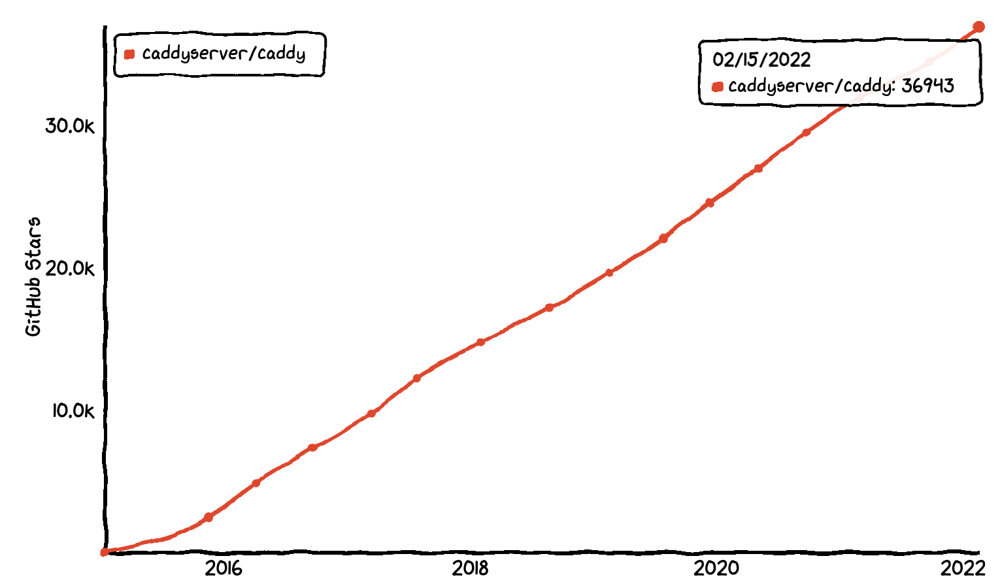
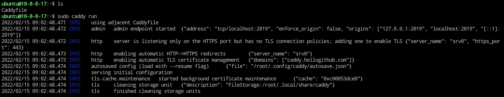
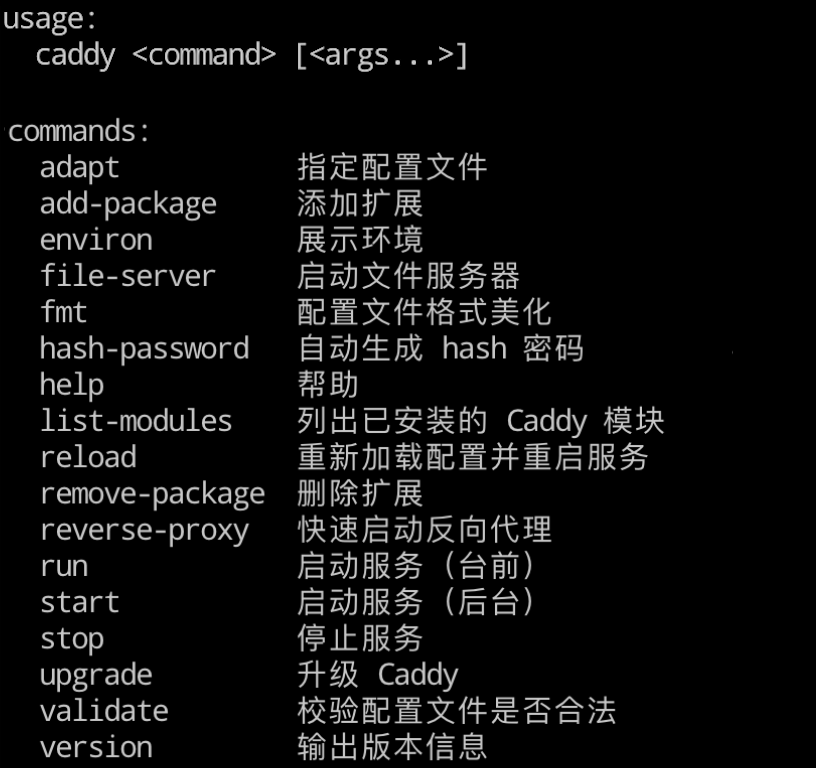

# 开源 Web 服务器后起之秀，自带免费 HTTPS 开箱即用


<p align="center">本文作者：HelloGitHub-<strong>Anthony</strong></p>

众所周知，Web 服务器是 Web 开发中不可或缺的基础服务，在开发中经常会用到。耳熟能详的开源 Web 服务器有久负盛名的 Apache、性能强劲的 Nginx。而我们今天要介绍的开源项目是采用 Go 编写的 Web 服务端“后起之秀”：**Caddy** 它拥有下载无需安装就能用、零配置实现 HTTPS 等特点，从而在强者如云的 Web 服务器中占据了一席之地。


在这个 HTTPS 必选的时代，Caddy 凭借无需额外配置自动 HTTPS，分分钟完成 HTTPS 站点搭建，使它成为了中小型 Web 服务的首选服务器。Caddy 深受开源爱好者们的喜爱，2014 年开源至今共收获了 3.6 万颗星。



> 项目地址：https://github.com/caddyserver/caddy

## 一、为什么使用 Caddy ?

> Caddy 是一个强大的、可扩展的平台，可以为您的站点、服务和应用程序提供服务。

使用 Caddy 可以在 Linux、Mac、Windows 上快速部署 http(s) 站点或反向代理服务。支持：

- HTTP/1.1 和 HTTP/2
- 同时接受 HTTPS 自动签发和手动管理
- 虚拟主机 (多个站点工作在单个端口上)
- 原生 IPv4 和 IPv6 支持
- 静态文件分发
- 平滑重启/重载
- 反向代理 (HTTP 或 WebSocket)
- 负载均衡和健康性检查
- Markdown 渲染
- 文件浏览服务
- 等等

与传统的 Nginx 或者 Apache 相比，Caddy 整体只有一个可执行文件，**安装便捷**不易出现奇怪的依赖问题，配置文件结构清晰语法简单**易于上手**，依托于模块化架构**可以使用 Go 语言快速开发扩展模块**。

下面让我们上手把玩一番吧。

## 二、安装

> 系统环境：Ubuntu 20.04 LTS

Caddy 可以作为一个系统服务安装，命令：

```shell
sudo apt install -y debian-keyring debian-archive-keyring apt-transport-https
curl -1sLf 'https://dl.cloudsmith.io/public/caddy/stable/gpg.key' | sudo tee /etc/apt/trusted.gpg.d/caddy-stable.asc
curl -1sLf 'https://dl.cloudsmith.io/public/caddy/stable/debian.deb.txt' | sudo tee /etc/apt/sources.list.d/caddy-stable.list
sudo apt update
sudo apt install caddy
```


`注意`：这种方式安装完成后会启动服务，开机自动启动。


还可以下载一个可执行文件使用。


1. 下载地址：https://caddyserver.com/download
2. 在网页上方选择自己的操作系统后，点击右侧蓝色的 Download 按钮即可
3. 下载好的文件不能够直接运行，需要为其添加权限
	```shell
	$ mv caddy_linux_amd64 caddy # 将下载后的文件重命名方便后面指令输入，根据系统不同文件名不一样
	$ sudo chmod a+x caddy # 为 Caddy 添加可执行权限
	$ mv caddy /bin/caddy # 将 Caddy 复制到 bin 目录这样可以在命令行随时使用
	```

命令行执行 `caddy version` 命令，出现版本信息：

```
v2.4.6 h1:HGkGICFGvyrodcqOOclHKfvJC0qTU7vny/7FhYp9hNw=
```

即为安装成功！


## 三、从零完成 HTTPS 站点


下面将演示如何通过 Caddy 完成 HTTPS 站点。只需要 4 步：

`Tips` 例子用的域名为：caddy.hellogithub.com 修改为你的域名即可。


**第一步**：安装，采用上面介绍的命令安装


**第二步**：设置域名解析地址，在购买域名的网站设置。如下图：


设置完生效需要几分钟，可通过下面的命令检查是否生效：

```
curl "https://cloudflare-dns.com/dns-query?name=caddy.hellogithub.com&type=A" -H "accept: application/dns-json"
```

域名设置生效，返回如下：

```
{"Status":0,"TC":false,"RD":true,"RA":true,"AD":false,"CD":false,"Question":[{"name":"caddy.hellogithub.com","type":1}],"Answer":[{"name":"caddy.hellogithub.com","type":1,"TTL":592,"data":"107.150.122.176"}]}
```

**第三步**：创建配置文件 `Caddyfile`，无需额外的开启 HTTPS 的设置：

```
caddy.hellogithub.com

respond "Hello HTTPS！"
```

1. 域名
2. 访问返回的内容

**第四步**：启动，在同一目录下执行命令：`sudo caddy run`



Caddy 默认使用执行命令目录下的 Caddyfile 文件内的配置。

最后，访问 `caddy.hellogithub.com` 检验效果吧！


## 四、上手教程

这里将从 Caddy 常用命令开始，再到配置讲解，最后会通过一个实际案例来展示如何用 Caddy 配置网站和上线。

### 4.1 常用命令




### 4.2 配置文件

Caddy 的原生配置文件使用的是 JSON 格式。但是为了用户编写方便它提供了 Caddyfile 作为接口让用户可以快速配置站点信息，运行时 Caddy 会自动将 Caddyfile 的配置信息转为 JSON 配置文件。

> Caddyfile 所能提供功能不如 JSON 配置文件强大，但是对于不需要复杂配置的用户而言完全够用了。

Caddyfile 的配置指令格式如下：

```ini
directive [<matcher>] <args...> { # matcher 代表匹配器，如果提供则该指令将只对 matcher 描述的资源进行响应
	subdirective [<args...>]	# 子指令
}
```

Caddyfile 的文件结构如图所示：


### 4.3 演示

下面将演示如何用 Caddy 搭建站点，加深理解配置格式和命令使用。

目录结构：

```shell
.
├── Caddyfile
├── index.html
└── public
    └── HG.html
```

两个页面文件 `index.html` 和 `HG.html` 的内容如下：

```html
<!-- index.html -->
<!DOCTYPE html>
<html lang="en">
<head>
    <meta charset="UTF-8">
    <title>Hello World!</title>
</head>
<body>
    你好，世界！
</body>
</html>
```

```html
<!-- HG.html -->
<!DOCTYPE html>
<html lang="en">
<head>
    <meta charset="UTF-8">
    <title>HelloGitHub</title>
</head>
<body>
    HelloGitHub
</body>
</html>
```

`Caddyfile` 配置内容如下：

```ini
# 如果本机没有 wordpress 则注释这一块儿的站点配置
#:80 { # 部署一个 wordpress 站点
#	root * /var/www/wordpress
#	php_fastcgi unix//run/php/php-version-fpm.sock # 配置一个 fastcig 服务
#	file_server	# 配置一个文件服务
#}

http://localhost:3000 {
	basicauth /public/* {
		# 匹配访问 localhost:3000/public/* 的请求，为其加上登陆保护
		HG JDJhJDE0JGEySk9janFMdHlBY2Y0aVdQZklQak9HcmwzNDZhNFg0N3V5Ny9EZkZMZHB1Nkt4ZE5BNGJt
		# 用户名 HG 密码 HelloGitHub，密码使用 caddy hash-passowrd 指令生成
	}

	root * ./ # 设置当前站点根目录为当前文件夹，* 表示匹配所有的 request
	templates
	file_server {
		# 配置当前站点为静态文件服务器，可用于博客系统的搭建
		hide .git # 隐藏所有的 .git 文件
	}
}

:4000 {
	reverse_proxy /public/* http://localhost:3000 # 配置反向代理
	# 只会匹配 locahost:4000/public 的请求，转发到 localhost:3000/public/
}

```

在当前目录输入：

```shell
$ caddy run # 启动 Caddy
```

最后，效果如下：

1. 访问：`http://localhost:3000` 可以看到页面展示 “你好，世界！”

2. 访问：`http://localhost:3000/public/HG.html` 提示输入用户名和密码，验证正确后才能看到页面。

3. 访问：`http://localhost:4000` 则会自动跳转到端口 3000 的页面


### 4.4 提供接口管理

Caddy 除了简单易懂的配置文件方式，还提供了管理配置的接口。通过这些接口可以轻松实现 Web 服务器管理自动化、集成发布等高级功能。


提供的接口和功能：

- **[POST /load](https://caddyserver.com/docs/api#post-load)** 设置或替换活动配置
- **[POST /stop](https://caddyserver.com/docs/api#post-stop)** 停止活动配置并退出进程
- **[GET /config/\[path\]](https://caddyserver.com/docs/api#get-configpath)** 导出指定路径的配置
- **[POST /config/\[path\]](https://caddyserver.com/docs/api#post-configpath)** 设置或替换对象；追加到数组
- **[PUT /config/\[path\]](https://caddyserver.com/docs/api#put-configpath)** 创建新对象或插入数组
- **[PATCH /config/\[path\]](https://caddyserver.com/docs/api#patch-configpath)** 替换现有对象或数组元素
- **[DELETE /config/\[path\]](https://caddyserver.com/docs/api#delete-configpath)** 删除指定路径的值
- **[在 JSON 中使用`@id`](https://caddyserver.com/docs/api#using-id-in-json)** 轻松遍历配置结构
- **[GET /reverse_proxy/upstreams](https://caddyserver.com/docs/api#get-reverse-proxyupstreams)** 返回配置的代理上游的当前状态

由于篇幅问题这里就不再进行演示了，如果您想深入了解可以阅读 Caddy 的[官方文档](https://caddyserver.com/docs/)。

## 五、总结

看到这里你应该对 Caddy 有了一些了解，有没有一种相见恨晚的感觉？

虽然它的性能比不了 Nginx，但如果论上手的难易度 Caddy 甩 Nginx 几条街！主要是默认开启 HTTPS 功能太香了，你什么都不用管就可以免费、快速、轻松开启网站 HTTPS。

最后，如果你想搭建个静态博客或小站，快去试试 Caddy 吧！香不香只有“吃”过才知道～

这里是 HelloGitHub 推出的[《讲解开源项目》](https://github.com/HelloGitHub-Team/Article)系列，为您叩开开源项目的大门。