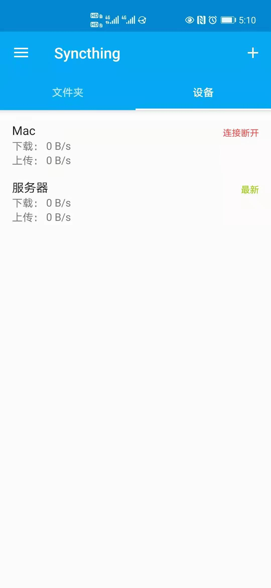

#

[ 头图 ]

本文作者：HelloGitHub-<strong>蔡文心</strong>

这是 HelloGitHub 推出的[《讲解开源项目》](https://github.com/HelloGitHub-Team/Article)系列，今天给大家推荐一个 Go 开源的文件同步项目——Syncthing

> 项目地址：https://github.com/syncthing/syncthing

大家在工作和生活中应该都遇到过文件同步或者文件上传的问题，一般都会使用微信、QQ 来处理这些问题，但是微信和 QQ 毕竟属于聊天工具，日常环境里用用还行，一旦换了电脑、换了办公室、换了对象就容易导致文件丢失，用来做文件管理确实不是很方便。

这时候有人会说：我可以用网盘呀

可是百度云这类云盘的下载速度实在是太 … 忄… 曼 … 了。

百度云：想快？给钱啊

你，不，我们：

所以今天就来带大家搭建一个自己的网盘！

## 一、介绍

Syncthing 是一个 P2P 的文件同步工具， 在 Github 上已经获得了 34.9k 的点赞数了

### 1.1 P2P

首先简单介绍下 P2P 技术。一般下载文件有两种方式 HTTP 和 FTP，这两种方式都难以解决单一服务器的带宽压力，因为它们都是采用的传统的客户端服务器的方式。

P2P 就是 peer-to-peer，资源开始并不集中地存储在某些设备上，而是分散地存储在多台设备上。这些设备我们称为 **peer ** 。想要下载一个文件的时候，你只要得到那些已经存在了文件的 peer ，并和这些 peer 之间，建立点对点的连接，而不需要到中心服务器上，就可以就近下载文件。

### 1.2 跨平台

Syncthing 支持非常多的平台，包括

- Windwos
- macOS
- Android
- Linux
- FreeBSD
- 群晖和威联通等 NAS
- 在 iOS 上只有一个第三方客户端 fsync

## 二、使用

### 2.1 下载安装

首先需要在电脑和手机上安装 Syncthing ，大家请根据自己的电脑和手机系统进行下载

> 源码下载地址：https://github.com/syncthing/syncthing/releases
>
> 安卓下载地址：Google Play 搜索 Syncthing
>
> mac下载地址：https://github.com/syncthing/syncthing-macos/releases

这里需要为华为手机的小伙伴补充一下，非花粉可以跳过 🪂

目前华为手机无法正常使用 Google Play 的小伙伴可以尝试在浏览器中访问 Google Play。然后在浏览器的扩展商店中搜索 **APK Downloader for Google Play Store** 插件。可以帮助你在浏览器中从 Google Play 下载 apk

### 2.2 开始

安装成功后，打开浏览器访问 **http://127.0.0.1:8384/** 进入 Syncthing。

### 2.3 与手机关联

在浏览器或者