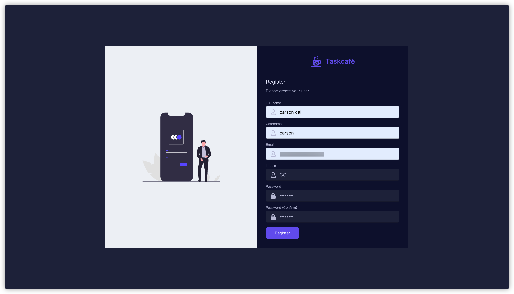
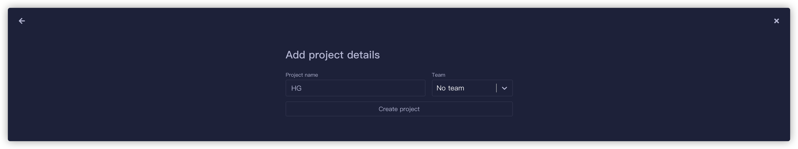
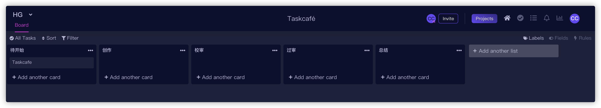
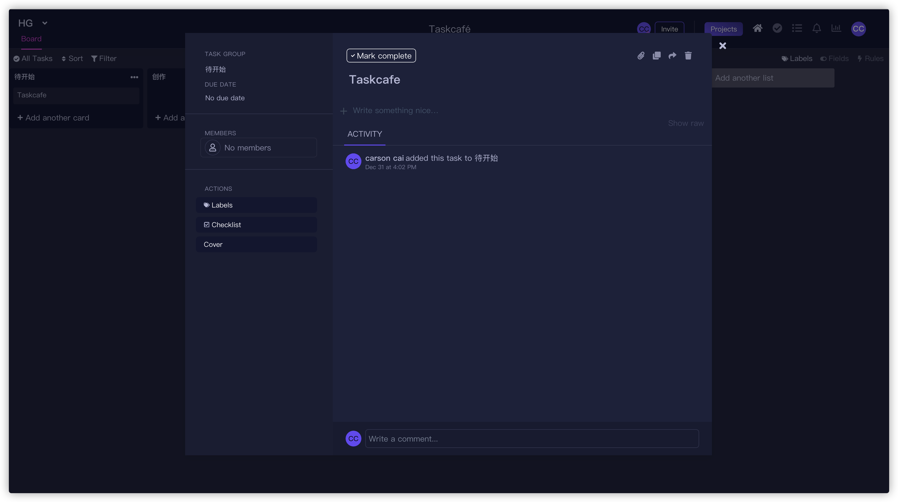
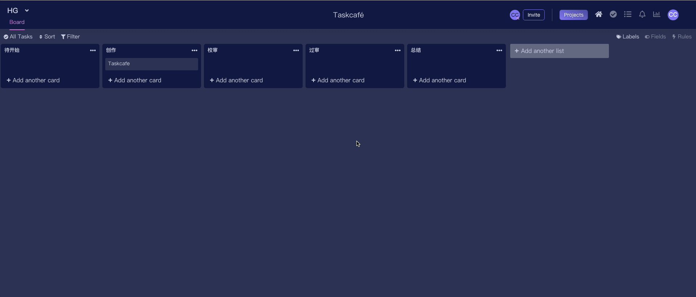

# 把“烦恼”放进看板，开源免费的项目管理工具来帮你啦！

> 本文适合喜欢倒腾效率工具的小伙伴和 Go 语言初学者


<p align="center">本文作者：HelloGitHub-<strong>蔡文心</strong></p>

这里是维护 4 年有余**开源爱好者的老朋友**——HelloGitHub 推出的[《讲解开源项目》](https://github.com/HelloGitHub-Team/Article)系列。

今天给大家带来的一款基于 Go+React 实现的**项目管理工具**开源项目——**Taskcafe**，该项目可以作为 Go Web 的实战项目学习，不会 Go 的读者也可以轻松通过 Docker 安装使用。

> 项目地址：https://github.com/JordanKnott/taskcafe


## 一、介绍

相信各位小伙伴们在工作中或多或少都有接触过项目管理工具。项目管理工具可以为我们提供**轻松量化工作内容**、**为团队提供高效协作的方法**、**项目进度可视化**等等的帮助，提高我们的工作效率和对目标的专注程度。**Taskcafe** 就能够让我们快速拥有一个属于自己的任务管理工具，帮助记录、管理、追踪任务，让你的生活和工作更加高效！


在项目管理工具中最常用的视图模式就是**看板**了，所以**看板**也被称为项目管理工具中的黄金圣杯。使用 **Taskcafe** 可以让我们轻松的将周身事物看板（任务），**万物皆可放入看板**。

目前 **Taskcafe** 支持的功能：

- 确保任务、项目、任务组等数据经过验证（例如：仅项目名称不能有空格）
- 任务视图筛选
- 用户界面
- 截止日期通知和提醒
- 项目收藏夹
- 团队设置
- 日历视图
- 列表显示
- 任务固定
- 等等

市面上已有种类繁多的任务管理工具，从 **MeisterTask** 到 **禅道** 再到 **Teambition**，他们使用从简单到复杂、功能从基础到丰富。但我印象中上述这些基本都是付费的，免费开源、部署方便的 **Taskcafe** 可以一试，让我们继续往下看吧！

### 1.1 私有部署

能够在个人服务器上搭建个人的项目管理工具，不用担心隐私**安全**问题和**收费**的烦恼。

### 1.2 可扩展

使用任务管理工具时总会遇到因为自身业务的特殊性导致现有工具不能满足需求的情况。因为 **Taskcafe** 是开源项目，所以能够自己动手添加适应自己工作流程的功能。

### 1.3 安装方式

- Docker
- 源码

考虑到此项目的受众可能包括非程序员人群，接下来本文中将演示最方便的一种方案 **使用 Docker 安装**。

## 二、安装

### 2.1 Docker

**准备**

1. [Docker 安装文档](https://docs.docker.com/engine/install/)
2. [Docker-compose 容器编排安装文档](https://docs.docker.com/compose/install/)

**Step 1 Clone 项目**

```shell
git clone https://github.com/JordanKnott/taskcafe && cd taskcafe
```

**Step 2 在项目根目录下执行**

```shell
docker-compose -p taskcafe up -d
```

**Step 3 成功**

访问：http://localhost:3333



## 三、使用

### 3.1 创建 Admin 用户


### 3.2 创建项目



### 3.3 创建看板（list）



### 3.4 添加任务（card）

在任务中可以添加成员、TODO 列表、查看操作记录、添加标签和添加附件等等



### 3.5 移动任务



Taskcafe 包含的功能就不一一介绍了，跟着项目的文档，在 Web 页面“点点点”就可以了。那么快去动手实践一番吧！

## 四、技术栈

### 1.1 前端
部分功能采用知名的 Kanban 面板实现。

- React
- Typescript
- GraphQL

### 2.1 后端

- Golang
- Chai 用于轻松构建 Restfull API
- JWT 用户态控制
- Postgres 数据库
- Machinery 一个分布式的消息队列

### 3.1 项目结构

```shell
...
├── README.md
├── cmd
│   ├── mage
│   └── taskcafe
│   		├── main.go //go的启动文件
├── frontend //前端工程
│   ├── .editorconfig
│   ├── .eslintignore
│   ├── .eslintrc.json
│   ├── .gitignore
│   ├── .prettierrc.js
│   ├── .storybook
│   ├── Makefile
│   ├── codegen.yml
│   ├── package.json
│   ├── public
│   ├── src
│   ├── tsconfig.json
│   └── yarn.lock
├── internal //后端工程主要内容
│   ├── auth
│   ├── commands
│   ├── db
│   ├── graph
│   ├── logger
│   ├── notification
│   ├── route //路由注册
│   └── utils
├── magefile.go
├── migrations //数据库迁移文件
...
```

后端使用 Golang 编写，属于 Golang 在 Web 项目的运用，采用了前后端分离模式，由于使用了 GraphQL 可以明显发现 API 数量有所减少。

**如果你是一个 Golang 新手那非常推荐你阅读下 Taskcafe 的源码，该项目结构清晰并且有非常友好的注释，常用的 Go 中间件都有用到，适合做为 Go 新手实战和学习项目。**

## 五、最后

至此，相信你对 Taskcafe 项目有了简单了解，并且已经能够成功在本地运行起来了。希望你在实际体验中融入自己的工作、生活和周围的事物来感受**看板**的魅力，充分体会到万物皆可**看板**。

如果这次推荐的 Taskcafe 能够为你带来一点点帮助，请在右下角帮我点个赞吧~

