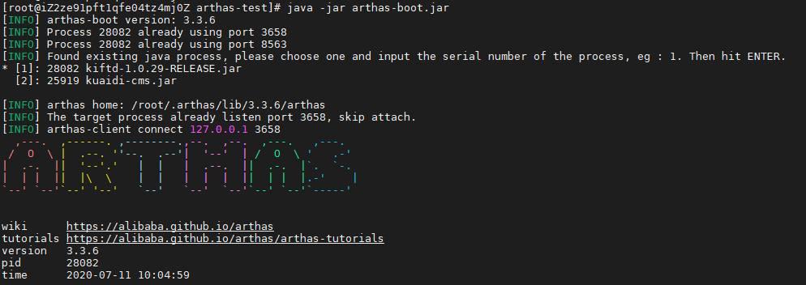
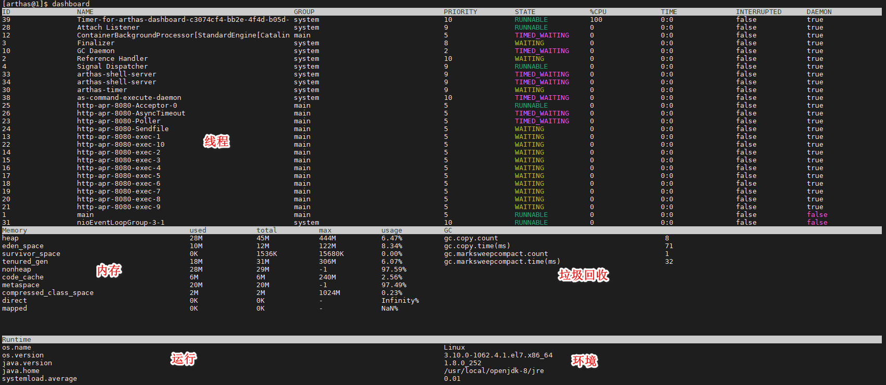
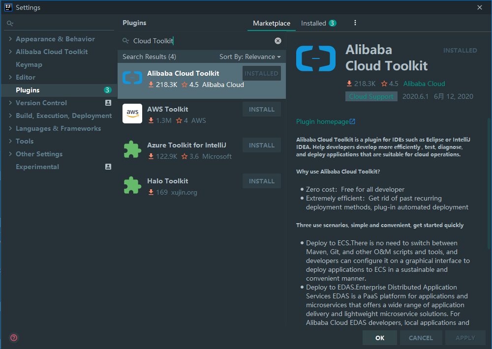
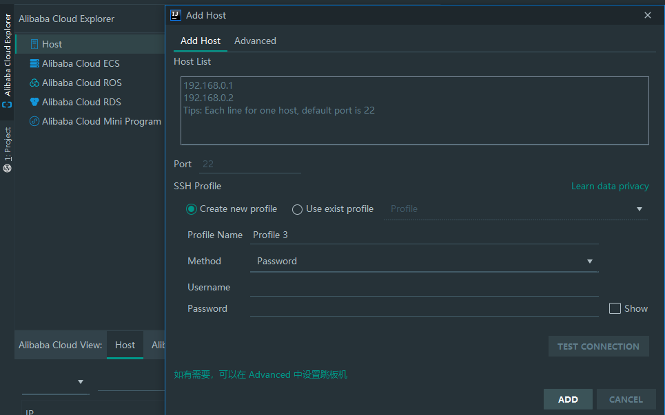
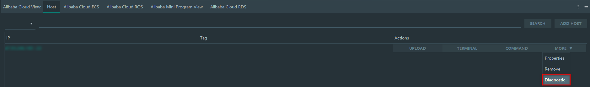
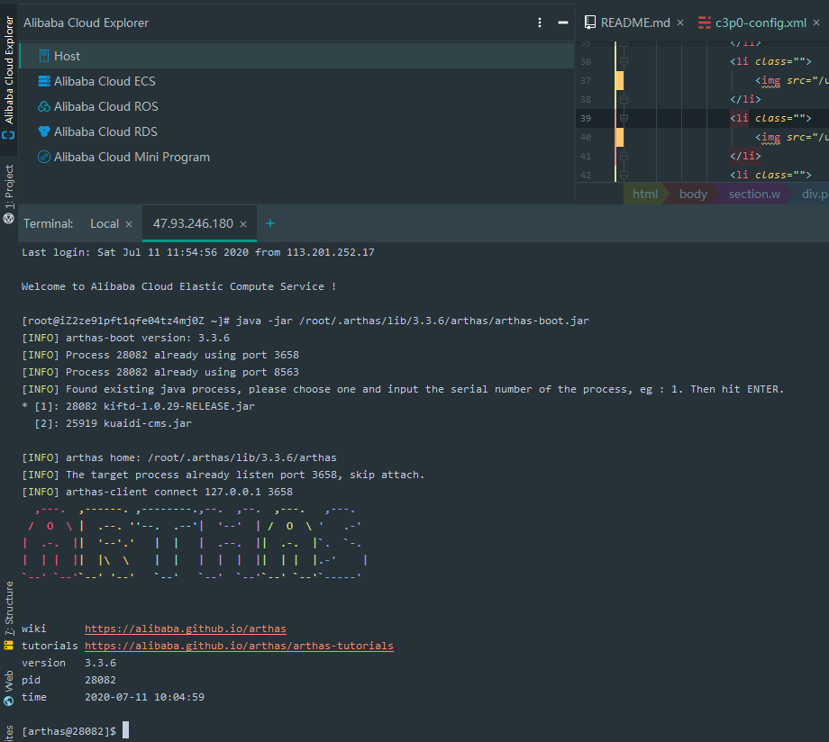
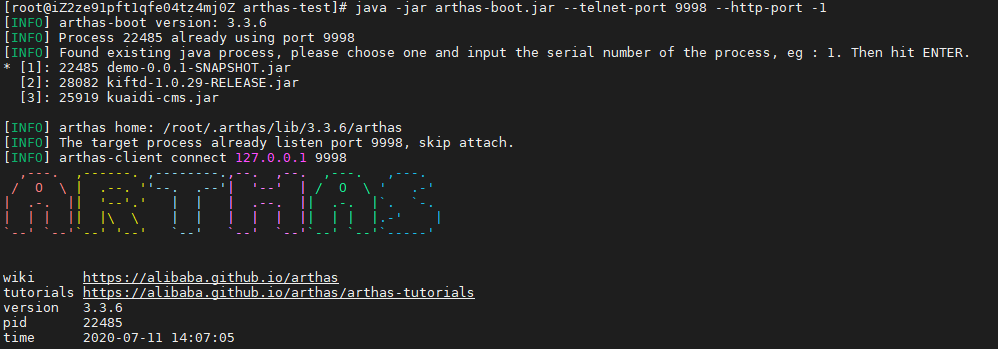

# 带你上手阿里开源的 Java 诊断利器：Arthas

> 本文适合有 Java 基础知识的人群。


<p align="center">本文作者：HelloGitHub-<strong>秦人</strong></p>

HelloGitHub 推出的[《讲解开源项目》](https://github.com/HelloGitHub-Team/Article)系列，今天给大家带来一款阿里开源的 Java 诊断利器 Arthas 项目—— [Arthas](https://github.com/alibaba/arthas) 

> 项目源码地址：https://github.com/alibaba/arthas

## 一、简介

为什么要用 Arthas？好多 Java 开发的小伙伴可能有遇到下面这些问题：
- 项目中导入了一个 jar 包的不同版本，那么这个类从哪个 jar 包加载的？线上环境为什么会报各种异常？
  
- 本地项目运行没问题，线上环境运行的结果为什么和本地不同？数据原因没有执行到？代码没有 commit？环境上使用的分支搞不对？
  
- 线上环境遇到偶先问题，难道只能通过加日志，调整项目日志级别，重新打包发布验证问题吗？
  
- 线上环境遇到某个用户的审批流程走的不对，线下环境无法重现，怎么在线上进行远程调试呢？
  
- 有没有一个监控系统的运行整体状况的功能？

- JDK 自带了一些监控工具，本地可动态监控 JVM 运行状态，那么线上环境有什么办法可以监控到 JVM 的实时运行状态？

- 在线上环境怎么快速定位应用的热点，生成火焰图？


### 1.1 实现原理

整体宏观模块调用图如下：


### 1.2 主要功能

Arthas 提供的功能主要可以分为以下三个方面：

1. 信息监控
   - 进程运行基本信息包括：内存、CPU占用、线程信息、线程堆栈、线程数统计、环境变量信息。
   - 对象信息：类对象静态属性、 Mbean 的属性信息、已加载类信息、类加载器、类方法信息。
2. 方法调用
   - 方法调用入参、返回值查看。
   - 方法被调用的调用路径、调用耗时、方法调用次数、成功次数、失败次数等统计。
   - 记录和重做方法调用。
3. 类文件处理
   - dump 已加载类的字节码、字节码反编译、类编译、类重新热加载。

## 二、安装和使用

### 2.1 Linux 环境使用
登录 `Linux` 环境，下载 `arthas-boot.jar`，然后使用命令 `java -jar xxx.jar` 直接运行 `jar` 包。

下面两个命令效果一样，都可以下载。
```bash
curl -O https://alibaba.github.io/arthas/arthas-boot.jar
wget https://alibaba.github.io/arthas/arthas-boot.jar
```

进入 Arthas 第一步需要选择项目



### 2.2 Docker 环境使用
进入一个之前已经启动的 Docker 容器，这里我进入了 tomcat7 容器。

```bash
docker ps -a #查看所有容器
docker cp arthas-boot.jar tomcat7:/home #拷贝 jar 到容器 home 目录
docker exec -it tomcat7 bash #进入名称叫 tomcat7 的容器
cd /home 
java -jar arthas-boot.jar #运行 jar 包
```

注意：选择的 Docker 容器必须是以 JDK 为基础依赖构建的。

在命令行输入 `dashboard` 就可以进入仪表板的所有数据。



### 2.3 在开发工具 IntelliJ IDEA 使用
Cloud Toolkit 是一个 IDE 插件，帮助开发者更高效地开发、测试、诊断并部署应用。方便地将本地应用一键部署到任意机器，或 ECS、EDAS、Kubernetes。这里只介绍一下连接远程服务器，使用 Arthas。

#### 2.3.1 安装插件
在 `File`->`Settings`->`Plugins` 搜索 `Alibaba Cloud Toolkit`



插件安装完重启 IDEA。

#### 2.3.2 使用工具
添加远程服务器，如下图操作：



服务器配置成功后，选择 `More`->`Diagnostic` 即可连接到服务器上。

  

#### 2.3.3 运行效果



## 三、实战案例分析
以线上代码热更新，这里我写了一个小的 `Sprinboot` 项目，主要就是一个获取学习信息的接口。
```java
@RestController
public class StudentConroller {

   @GetMapping("getUserInfo")
   public Student getUserInfo() {
      return new Student("小刘",12,"西安市雁塔区");
   }
}
```

通过 `curl http://localhost:9000/getUserInfo`，访问内容如下：

```json
{"name":"小刘","id":12,"address":"西安市雁塔区"}
```

在服务运行要测试的项目 `demo-0.0.1-SNAPSHOT.jar`

```bash
nohup java -jar demo-0.0.1-SNAPSHOT.jar & #后台运行
curl http://localhost:9000/getUserInfo #访问接口
```

运行 Arthas 主程序 `arthas-boot.jar`，选择进入`demo-0.0.1-SNAPSHOT.jar`


   
使用 `jad` 反编译 `StudentConroller.java` 代码

```bash
jad --source-only com.example.demo.controller.StudentConroller > /tmp/StudentConroller.java
```

打开 `/tmp/StudentConroller.java` 下的文件，修改反编绎出来的代码，修改内容如下：

```java
@RestController
public class StudentConroller {
   @GetMapping(value={"getUserInfo"})
   public Student getUserInfo() {
      return new Student("小刘1", 122, "西安市高新区");
   }
}
```

- `sc` 命令查找加载 `StudentConroller` 的 ClassLoader
   ```bash
   $ sc -d *StudentConroller | grep classLoaderHash
   classLoaderHash   2e0fa5d3
   ```

- `mc` 命令内存编绎代码
   ```bash
   $ mc -c 2e0fa5d3 /tmp/StudentConroller.java -d /tmp
   Memory compiler output:/tmp/com/example/demo/arthas/user/controller/StudentConroller.class
   Affect(row-cnt:1) cost in 346 ms
   ```
- `redefine` 命令热更新代码
   ```bash
   $ redefine /tmp/com/example/demo/controller/StudentConroller.class
   redefine success, size: 1
   ```
- 检测热更新结果
   再次访问 `curl http://localhost:9000/getUserInfo`，显示如下内容：
   

用 Arthas 的 `jad/mc/redefine` 一条龙命令来线上热更新代码非常强大，但也很危险，要做好权限管理哦。

## 四、总结
本文开头讲 Arthas 有什么作用、我们为什么要用它。接着讲了三种场景是如何使用 Arthas。最后以 Java 代码在线热部署为例，感受了 Arthas 的强大。看到这里我想你也对 Arthas 工具有了一个简单的认识。

现在的趋势开发人员做了久了慢慢就变为 DevOps，了解更多的底层逻辑也能更好的反馈到代码层面的**上层建筑**。

本文只能带大家入门，Arthas 还有更多强大的功能等待你的发现！

## 五、附录
- [Arthas 官方文档](https://alibaba.github.io/arthas/quick-start.html)
- [Arthas 脑图—常用命令汇总](https://github.com/alibaba/arthas/issues/1003)

