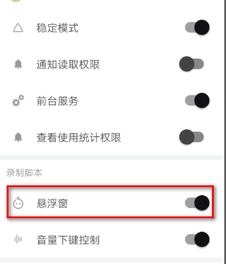
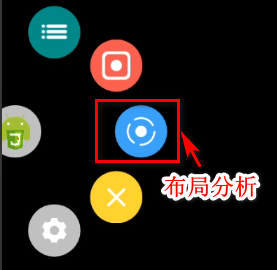

# 搞微服务用阿里开源的 Nacos 真香啊！

> 本文适合有 Javascript 基础知识的人群


<p align="center">本文作者：HelloGitHub-<strong>秦人</strong></p>

HelloGitHub 推出的[《讲解开源项目》](https://github.com/HelloGitHub-Team/Article)系列，今天给大家带来一款支持无障碍服务的Android平台上的JavaScript IDE，它是一款自动化软件，根据脚本内容便可以自动地执行相关的操作。

> 项目源码地址：https://github.com/hyb1996/Auto.js

## 一、项目介绍
- 由无障碍服务实现的简单易用的自动操作函数
- 悬浮窗录制和运行
- 更专业&强大的选择器API，提供对屏幕上的控件的寻找、遍历、获取信息、操作等。类似于Google的UI测试框架UiAutomator，您也可以把他当做移动版UI测试框架使用
- 采用JavaScript为脚本语言，并支持代码补全、变量重命名、代码格式化、查找替换等功能，可以作为一个JavaScript IDE使用
- 支持使用e4x编写界面，并可以将JavaScript打包为apk文件，您可以用它来开发小工具应用
- 支持使用Root权限以提供更强大的屏幕点击、滑动、录制功能和运行shell命令。录制录制可产生js文件或二进制文件，录制动作的回放比较流畅
- 提供截取屏幕、保存截图、图片找色、找图等函数
- 可作为Tasker插件使用，结合Tasker可胜任日常工作流
- 带有界面分析工具，类似Android Studio的LayoutInspector，可以分析界面层次和范围、获取界面上的控件信息


## 二、`Auto.js`官方实例
### 2.1下载`Auto.js`
    百度网盘下载地址: https://pan.baidu.com/s/1unTJauIjyhSadyattWOh-Q 
    提取码: 3pyw 
### 2.2 环境配置
 1.`VSCode`配置，安装插件
 在VS Code中菜单"查看"->“扩展”->输入"Auto.js"或"hyb1996"搜索，即可看到"Auto.js-VSCodeExt"插件，安装即可。

 快捷键Ctrl+Shift+P 或点击"查看"->"命令面板"可调出命令面板，执行`Auto.js: Start Server`.
    
 2.手机连接app设置
 将手机连接到电脑启用的Wifi或者同一局域网中。在手机上的Auto.js的侧拉菜单中启用调试服务，并输入IP地址。如下图：

   
 3.运行示例
 vscode中创建一个`js`文件

 ```javascript
 "ui";

var color = "#009688";

ui.layout(
    <drawer id="drawer">
        <vertical>
            <appbar>
                <toolbar id="toolbar" title="示例"/>
                <tabs id="tabs"/>
            </appbar>
            <viewpager id="viewpager">
                <frame>
                    <text text="第一页内容" textColor="black" textSize="16sp"/>
                </frame>
                <frame>
                    <text text="第二页内容" textColor="red" textSize="16sp"/>
                </frame>
                <frame>
                    <text text="第三页内容" textColor="green" textSize="16sp"/>
                </frame>
            </viewpager>
        </vertical>
        <vertical layout_gravity="left" bg="#ffffff" w="280">
            
            <list id="menu">
                <horizontal bg="?selectableItemBackground" w="*">
                    
                    <text textColor="black" textSize="15sp" text="{{this.title}}" layout_gravity="center"/>
                </horizontal>
            </list>
        </vertical>
    </drawer>
);


//创建选项菜单(右上角)
ui.emitter.on("create_options_menu", menu=>{
    menu.add("设置");
    menu.add("关于");
});
//监听选项菜单点击
ui.emitter.on("options_item_selected", (e, item)=>{
    switch(item.getTitle()){
        case "设置":
            toast("还没有设置");
            break;
        case "关于":
            alert("关于", "Auto.js界面模板 v1.0.0");
            break;
    }
    e.consumed = true;
});
activity.setSupportActionBar(ui.toolbar);

//设置滑动页面的标题
ui.viewpager.setTitles(["标签一", "标签二", "标签三"]);
//让滑动页面和标签栏联动
ui.tabs.setupWithViewPager(ui.viewpager);

//让工具栏左上角可以打开侧拉菜单
ui.toolbar.setupWithDrawer(ui.drawer);

ui.menu.setDataSource([
  {
      title: "选项一",
      icon: "@drawable/ic_android_black_48dp"
  },
  {
      title: "选项二",
      icon: "@drawable/ic_settings_black_48dp"
  },
  {
      title: "选项三",
      icon: "@drawable/ic_favorite_black_48dp"
  },
  {
      title: "退出",
      icon: "@drawable/ic_exit_to_app_black_48dp"
  }
]);

ui.menu.on("item_click", item => {
    switch(item.title){
        case "退出":
            ui.finish();
            break;
    }
})

 ```

 快捷键Ctrl+Shift+P，执行`Auto.js: Run`.

 运行效果如下：


## 三、实战-自动完成抖音评论

### 1.代码如下：
 ```javascript
launchApp("抖音");  //打开app
sleep(2000);    //延迟2s
id("aje").findOne().click(); //点击评论按钮
sleep(2000);
id("grg").findOne().click();  //打开评论输入框
setText("你好你好！"); //设置评论内容
id("ak7").findOne().click();  //发送评论
sleep(2000);
back();  //后退
 ```
 ### 2.选择元素
 如上面代码所示`id("aje").findOne().click()`, `aje`就是元素id。这和`Css`中id选择器器的用法是样。
  1.`auto.js`要开启`悬浮窗`。
  
  

  2.点击`悬浮窗`->`布局分析`->`布局范围分析`
  
  

  3.选择对应的元素，自动生成代码

  

  前端的小伙伴应该看出来了，这就是类似于`Chrome`的`Debug`调试工具。
 ### 3.应用打包
 前提：打包应用前，需要安装`Auto.js`的打包apk插件。

1.打开`Auto.js` app,选在对应的文件，选择`更多`
   

2.选择打包应用的文件，打包后文件存储位置，包名，版本号等信息，点击`✔`，即可完成打包。


## 四、最后


要完成一个复杂系统往往需要很多微服务单元，而衔接每个微服务，完成微服务的统一管理就非常有必要，所以集成服务管理中心和配置中心的产品就的就应运而生，而 `Nacos` 是其中的佼佼者！

教程至此，你应该也能对 `Nacos` 有一些了解！光看不练假把式，最快的学习方式莫过于模仿，再通过举一反三才能融会贯通。每一种新工具都是对老工具的革新，有兴趣的小伙伴可以参考我上面的案例，在实践中会发现更多乐趣！

## 五、参考资料
- 官方文档: [https://hyb1996.github.io/AutoJs-Docs/](https://hyb1996.github.io/AutoJs-Docs/)
- Auto.js下载地址： [https://easydoc.xyz/doc/25791054/uw2FUUiw/3bEzXb4y](https://easydoc.xyz/doc/25791054/uw2FUUiw/3bEzXb4y)