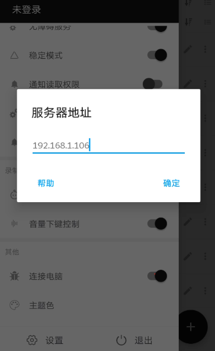
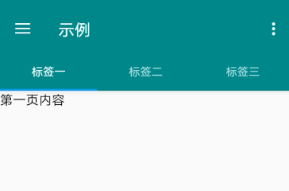
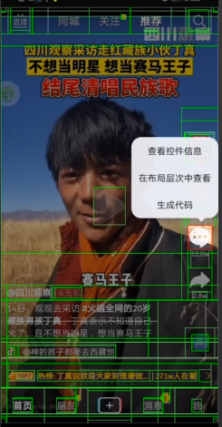
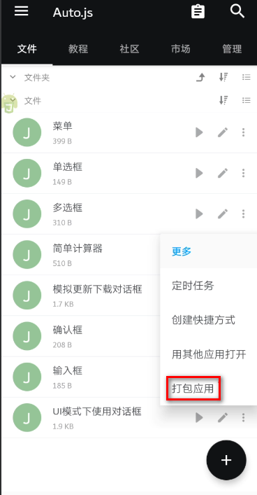

# Auto.js 一款安卓平台上的 JavaScript 自动化工具

> 本文适合有 Javascript 基础知识的人群


<p align="center">本文作者：HelloGitHub-<strong>秦人</strong></p>

HelloGitHub 推出的[《讲解开源项目》](https://github.com/HelloGitHub-Team/Article)系列，今天给大家带来一款支持无障碍服务的Android平台上的JavaScript 自动化工具，它可以根据脚本内容自动执行相关的操作。

> 项目源码地址：https://github.com/hyb1996/Auto.js

## 一、项目介绍
Auto.js 是一个安卓脚本框架，可以做很多事情，帮助我们手机实现全自动。功能清单如下：

- 控制台: 提供了一个和Web浏览器中相似的用于调试的控制台。用于输出一些调试信息、中间结果等。
- 基于坐标的操作：可以通过坐标进行点击、滑动的函数。这些函数有的需要安卓7.0以上，有的需要root权限。要获取要点击的位置的坐标，也可以在开发者选项中开启"指针位置"。
- 设备：device模块提供了与设备有关的信息与操作，例如获取设备宽高，内存使用率，IMEI，调整设备亮度、音量等。
- 对话框：提供了简单的对话框支持，可以通过对话框和用户进行交互。例如：`alert("您好");`
- 脚本引擎: 包含了一些与脚本环境、脚本运行、脚本引擎有关的函数。
- 事件与监听: 提供了监听手机通知、按键、触摸的接口。例如：按键事件、通知事件、Toast事件等。
- 悬浮窗：提供了悬浮窗的相关函数，可以在屏幕上显示自定义悬浮窗，控制悬浮窗大小、位置等。
- 文件系统：提供了一些常见的文件处理，包括文件读写、移动、复制、删掉等。
- HTTP：提供一些进行http请求的函数。
- 图片与颜色：Auto.js 有两种方式表示一个颜色。一种是使用一个字符串，例如："#AARRGGBB"，另一种方式是使用一个16进制的32位整数，例如 0xFF112233表示颜色"#112233"。
- 画布：提供了使用画布进行2D画图的支持，可用于简单的小游戏开发或者图片编辑。
- 按键模拟：按键模拟部分提供了一些模拟物理按键的全局函数，包括Home、音量键、照相键等。
- 多媒体：目前仅支持音乐播放和媒体文件扫描。
- 模块：一个简单的模块加载系统
- 基于控件的操作：基于控件的操作指的是选择屏幕上的控件，获取其信息或对其进行操作。
- 传感器：供了获取手机上的传感器的信息的支持，这些传感器包括距离传感器、光线光感器、重力传感器、方向传感器等。
- Shell：提供与操作系统交互的一系列命令。在Auto.js大致等同于用adb执行命令"adb shell"。
- 本地存储：提供了保存简单数据、用户配置等的支持。保存的数据除非应用被卸载或者被主动删除，否则会一直保留。
- 多线程：提供了多线程支持，可以启动新线程来运行脚本。
- 定时器：暴露了一个全局的 API，用于在某个未来时间段调用调度函数。
- 用户界面：提供了编写用户界面的支持。
- 调用Java：支持调用Java接口。

## 二、`Auto.js`官方示例
### 2.1下载`Auto.js`
    百度网盘下载地址: https://pan.baidu.com/s/1unTJauIjyhSadyattWOh-Q 
    提取码: 3pyw 
### 2.2 环境配置
 1.`VSCode` 配置，安装插件

 在 `VS Code` 中菜单 `查看`->`扩展`->输入 `Auto.js` 搜索，即可看到 `Auto.js-VSCodeExt` 插件，安装即可。

 快捷键 Ctrl+Shift+P 或点击 `查看` -> `命令面板` 可调出命令面板，执行 `Auto.js: Start Server`.
    
 2.手机连接 app 设置

 将手机连接到电脑启用的 `Wifi` 或者同一局域网中。在手机上的 `Auto.js` 的侧拉菜单中启用调试服务，并输入 `IP` 地址。如下图：

   

 3.运行示例

 下面是 `用户界面` 的例子，会创建三个tab页，可以自由切换。内容如下：

 ```javascript
 "ui";

var color = "#009688";

ui.layout(
    <drawer id="drawer">
        <vertical>
            <appbar>
                <toolbar id="toolbar" title="示例"/>
                <tabs id="tabs"/>
            </appbar>
            <viewpager id="viewpager">
                <frame>
                    <text text="第一页内容" textColor="black" textSize="16sp"/>
                </frame>
                <frame>
                    <text text="第二页内容" textColor="red" textSize="16sp"/>
                </frame>
                <frame>
                    <text text="第三页内容" textColor="green" textSize="16sp"/>
                </frame>
            </viewpager>
        </vertical>
        <vertical layout_gravity="left" bg="#ffffff" w="280">
            
            <list id="menu">
                <horizontal bg="?selectableItemBackground" w="*">
                    
                    <text textColor="black" textSize="15sp" text="{{this.title}}" layout_gravity="center"/>
                </horizontal>
            </list>
        </vertical>
    </drawer>
);


//创建选项菜单(右上角)
ui.emitter.on("create_options_menu", menu=>{
    menu.add("设置");
    menu.add("关于");
});
//监听选项菜单点击
ui.emitter.on("options_item_selected", (e, item)=>{
    switch(item.getTitle()){
        case "设置":
            toast("还没有设置");
            break;
        case "关于":
            alert("关于", "Auto.js界面模板 v1.0.0");
            break;
    }
    e.consumed = true;
});
activity.setSupportActionBar(ui.toolbar);

//设置滑动页面的标题
ui.viewpager.setTitles(["标签一", "标签二", "标签三"]);
//让滑动页面和标签栏联动
ui.tabs.setupWithViewPager(ui.viewpager);

//让工具栏左上角可以打开侧拉菜单
ui.toolbar.setupWithDrawer(ui.drawer);

ui.menu.setDataSource([
  {
      title: "选项一",
      icon: "@drawable/ic_android_black_48dp"
  },
  {
      title: "选项二",
      icon: "@drawable/ic_settings_black_48dp"
  },
  {
      title: "选项三",
      icon: "@drawable/ic_favorite_black_48dp"
  },
  {
      title: "退出",
      icon: "@drawable/ic_exit_to_app_black_48dp"
  }
]);

ui.menu.on("item_click", item => {
    switch(item.title){
        case "退出":
            ui.finish();
            break;
    }
})

 ```
代码很简单，创建了页面元素，并给元素绑定了事件。
使用快捷键 `Ctrl+Shift+P`，执行`Auto.js: Run`.

 运行效果如下：



更多示例参考：[https://github.com/hyb1996/Auto.js/tree/master/app/src/main/assets/sample](https://github.com/hyb1996/Auto.js/tree/master/app/src/main/assets/sample)

## 三、实战-自动完成抖音评论

使用 `Auto.js` 打开`DY` APP, 点击评论，自动评论我们预先设定好的内容，然后发布评论。

### 1.代码如下：
 ```javascript
"auto";

launchApp("抖音");  //打开app
sleep(2000);  //延迟2s
id("aje").findOne().click(); //点击评论按钮
sleep(2000);

id("grg").findOne().click(); //打开评论输入框
setText("你好！"); //设置评论内容
id("ak7").findOne().click(); //发送评论
sleep(2000);
back(); //后退
swipe(347,992,316,237,1500); //模拟向上滑动
 ```
### 2.代码说明
  1. launchApp: launchApp(appName),通过名称启动应用。如果该名称对应的应用不存在，则返回false; 否则返回true。如果该名称对应多个应用，则只启动其中某一个。
  2. id: 空间id选择器，其他选择器有文本(text), 描述(desc), 类名(className)等。
  3. findOne: 表示基于这个条件找到一个符合条件的控件。
  4. click: 点击一个控件，前提是这个控件的clickable属性为true。
  5. setText: 设置输入框内容。
  6. back: 模拟返回键返回值任务栏页面.
  7. swipe: swipe(x1, y1, x2, y2, duration)，模拟从坐标(x1, y1)滑动到坐标(x2, y2)，并返回是否成功。duration 是滑动时长，单位毫秒。只有滑动操作执行完成时脚本才会继续执行。坐标根据手机尺寸不同有一些差异。在开发者选项中打开 `指针位置`，就可以获取当前点击位置的坐标（x,y）。
 
 ### 3. debug调试
  
  1.`Auto.js` 开启 `悬浮窗 `
  
  

  2.点击 `悬浮窗` -> `布局分析` -> `布局范围分析`
  
  

  3.选择对应的元素，自动生成代码

  

  前端的小伙伴应该看出来了，这就是类似于`Chrome`的`Debug`调试工具。

 ### 4.应用打包

 前提：打包应用前，需要安装 `Auto.js` 的打包 `apk` 插件。

1.打开 `Auto.js` app,选在对应的文件，选择 `更多` ->`打包应用`

   

2.选择打包应用的文件，打包后文件存储位置，包名，版本号等信息，点击 `✔`，即可完成打包。


## 四、最后

教程至此，你应该也能对 `Auto.js` 有一些了解！官方文档和教程特别丰富，支持的功能也很全,特别容易上手。本编只是抛砖引玉，`Auto.js` 可以做很多事情，例如：每天定时给微信特定好友发消息、百度地图签到、蚂蚁森林能量自动收取等。有兴趣的小伙伴可以试试。

## 五、参考资料
- 官方文档: [https://hyb1996.github.io/AutoJs-Docs/](https://hyb1996.github.io/AutoJs-Docs/)
- Auto.js下载地址： [https://easydoc.xyz/doc/25791054/uw2FUUiw/3bEzXb4y](https://easydoc.xyz/doc/25791054/uw2FUUiw/3bEzXb4y)