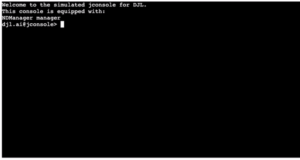
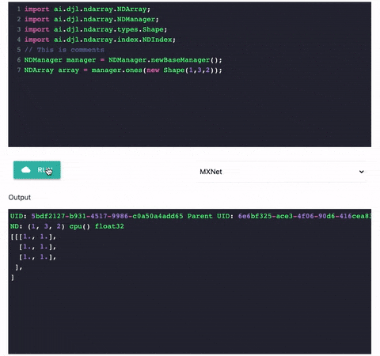

# 动手学 DJL — DJL未来实验室

许多年以来，一直都没有为 Java 量身定制的深度学习开发平台。用户必须要进行繁杂的项目配置，构建 class ，才能最终打造出属于 Java 的深度学习应用。在那之后，依旧要面临着依赖项匹配维护等各种麻烦的问题。为了解决这个这个痛点，亚马逊开源了[Deep Java Library (DJL)](https://djl.ai/), 一个完全使用 Java 构建的深度学习平台。 DJL 的开发者们也为它量身定制了各种有意思的运行环境，用户只需要少量配置，甚至直接在线就可以在 Java 上运行深度学习应用。

为了简化 Java 开发人员在深度学习上的痛点，我们推出了 DJL未来实验室计划：致力于打造一个极简的Java运行环境，创造属于 Java 自己的深度学习工具箱。你可以轻松在线使用，或者离线使用它们来构建你的深度学习应用。我们的目标是，将深度学习更好的贴近 Java 开发者。

## [深度学习JShell](https://djl.ai/website/demo.html#jshell)



深度学习JShell是一个[JShell](https://docs.oracle.com/javase/9/jshell/introduction-jshell.htm#JSHEL-GUID-630F27C8-1195-4989-9F6B-2C51D46F52C8) 的改版，包含了 DJL 的特性。你可以直接集成已有的 Java 功能和 DJL 的 class 在线使用。
我们为JShell提前准备了下面的引入:

```java
import ai.djl.ndarray.NDManager;
import ai.djl.ndarray.NDArray;
import ai.djl.ndarray.types.Shape;
import ai.djl.ndarray.index.NDIndex;
NDManager manager = NDManager.newBaseManager();
```
后端是基于 SpringBoot 的 server 架构，前端使用了 [xtermjs](https://xtermjs.org/) 。

目前这个命令行支持如下操作:

- `backspace`删除输入
- `<-` 和 `->` 移动光标
- 复制/粘贴代码功能
- 输入`clear`进行清屏操作

通过网页中提供的几种简单案例，你可以轻松使用 [`NDArray`](https://javadoc.io/doc/ai.djl/api/latest/ai/djl/ndarray/NDArray.html) 来完成你所需要的功能。
想了解我们是如何构建这个JShell应用的，请看[实现代码](https://github.com/aws-samples/djl-demo/tree/master/web-demo/interactive-console#jshell) 。

## [Block Runner](https://djl.ai/website/demo.html)



Block Runner 设计十分简单，它可以直接帮助你在线编译 Java 深度学习代码。如上所示，你只需点击 `Run` 就可以执行这些代码。我们提供了多种深度学习引擎供你选择。你可以轻松的在上面完成简单的深度学习运算以及推理任务。当你在构建完成之后，直接点击 `Get Template` 就可以获得一份直接在本地就能运行的 gradle 项目。所有的环境都已经配置好了，用编辑器打开就可以跑
简单举一个例子，如下是使用 Apache MXNet 模型构建的一份图片分类应用代码，你可以直接复制到在线编辑器：

```java
import ai.djl.inference.*;
import ai.djl.modality.*;
import ai.djl.modality.cv.*;
import ai.djl.modality.cv.transform.*;
import ai.djl.modality.cv.translator.*;
import ai.djl.repository.zoo.*;
import ai.djl.translate.*;

String modelUrl = "https://alpha-djl-demos.s3.amazonaws.com/model/djl-blockrunner/mxnet_resnet18.zip?model_name=resnet18_v1";
Criteria<Image, Classifications> criteria = Criteria.builder()
    .setTypes(Image.class, Classifications.class)
    .optModelUrls(modelUrl)
    .optTranslator(ImageClassificationTranslator.builder()
            .addTransform(new Resize(224, 224))
            .addTransform(new ToTensor())
            .optApplySoftmax(true).build())
    .build();
ZooModel<Image, Classifications> model = ModelZoo.loadModel(criteria);
Predictor<Image, Classifications> predictor = model.newPredictor();
String imageURL = "https://raw.githubusercontent.com/awslabs/djl/master/examples/src/test/resources/kitten.jpg";
Image image = ImageFactory.getInstance().fromUrl(imageURL);
predictor.predict(image);
```

在运行后，你会获得如下结果：

```
[
    class: "n02123045 tabby, tabby cat", probability: 0.41073
    class: "n02124075 Egyptian cat", probability: 0.29393
    class: "n02123159 tiger cat", probability: 0.19337
    class: "n02123394 Persian cat", probability: 0.04586
    class: "n02127052 lynx, catamount", probability: 0.00911
]
```

最后，你可以直接点击“Get Template”在本地运行。是不是很简单！现在这个组建支持 Apache MXNet/PyTorch/TensorFlow 三个后端引擎，后续还会增加更多的支持。

实现层面上，我们使用了[CodeMirror](https://codemirror.net/) 在线编辑器以及 SpringBoot 进行后端托管。想了解更多，欢迎参阅[实现代码](https://github.com/aws-samples/djl-demo/tree/master/web-demo/interactive-console#block-runner) 。

## [Java Jupyter Notebook](https://github.com/awslabs/djl/tree/master/jupyter)
什么?Jupyter Notebook? 我们难道说的不是 Python？不！ 100%纯 Java11


通过[Spencer Park’s IJava 项目](https://github.com/SpencerPark/IJava) 启发, 我们将DJL集成在了Jupyter Notebook 里面。
不需要繁杂的配置，直接启动就能用。我们准备了一系列使用Jupyter Notebook构建的[Java深度学习训练以及推理应用Notebook](https://github.com/awslabs/djl/tree/master/jupyter) 。想了解更多就[点击这里](http://docs.djl.ai/jupyter/index.html#djl-jupyter-notebooks) 吧。

Java版本的Notebook可以基本实现所有Jupyter在Python上的特性
- 支持每个代码块独立运行
- 展示一张图片
- 利用`Tablesaw`展示一个图表

相比于 Python, Java 的 Notebook 可以直接引入 Maven 的库，这样用户就无需担心项目配置等问题。同时这个 Notebook 也支持在 GPU 环境下运行，你可以轻松使用 Notebook 进行深度学习训练任务。

通过下面几个 Notebook , 可以帮助你快速了解DJL的用法以及新特性:

- [使用ModelZoo进行目标检测](object_detection_with_model_zoo.ipynb)
- [加载PyTorch预训练模型](load_pytorch_model.ipynb)
- [加载Apache MXNet预训练模型](load_mxnet_model.ipynb)
- [迁移学习案例](transfer_learning_on_cifar10.ipynb)
- [问答系统案例](BERTQA.ipynb)

P.S: 我们甚至还准备了基于 Java 的深度学习书，现在还处于预览版阶段，敬请期待。

## 关于DJL以及未来实验室计划


DJL还是一个很年轻的框架，2019年底发布，2020年3月才真正支持了所有主流的深度学习框架 (TensorFlow, PyTorch MXNet)。你可以轻松的使用DJL来训练以及部署你的深度学习模型。它也包含了丰富的模型库：70多种来自 GluonCV, HuggingFace, TorchHub 以及 Keras 的预训练模型。

关于未来实验室：我们仍旧还有很多功能处于开发阶段，需要大量小伙伴去参与并且体验我们的新功能。下面是几个正在进行中的项目:

* D2L - Java: 为[《动手学深度学习》](http://zh.d2l.ai/) 打造一本 Java 版本的书
* DJL NLP WordEmbedding: 为DJL提供更多 word embedding 的接口


想了解更多或者有任何疑问，欢迎猛戳下面的链接：

- [GitHub](https://github.com/awslabs/djl)
- [Slack](https://join.slack.com/t/deepjavalibrary/shared_invite/zt-ar91gjkz-qbXhr1l~LFGEIEeGBibT7w)
