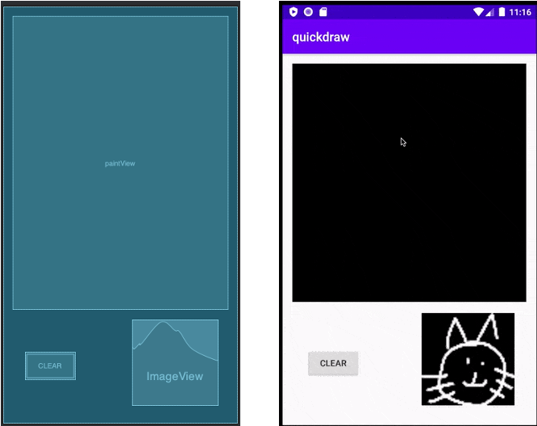
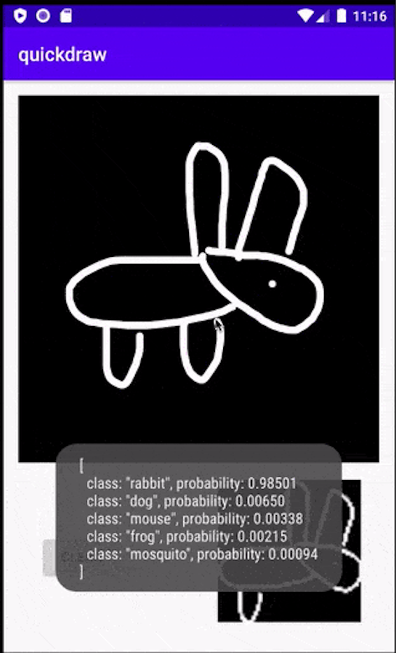
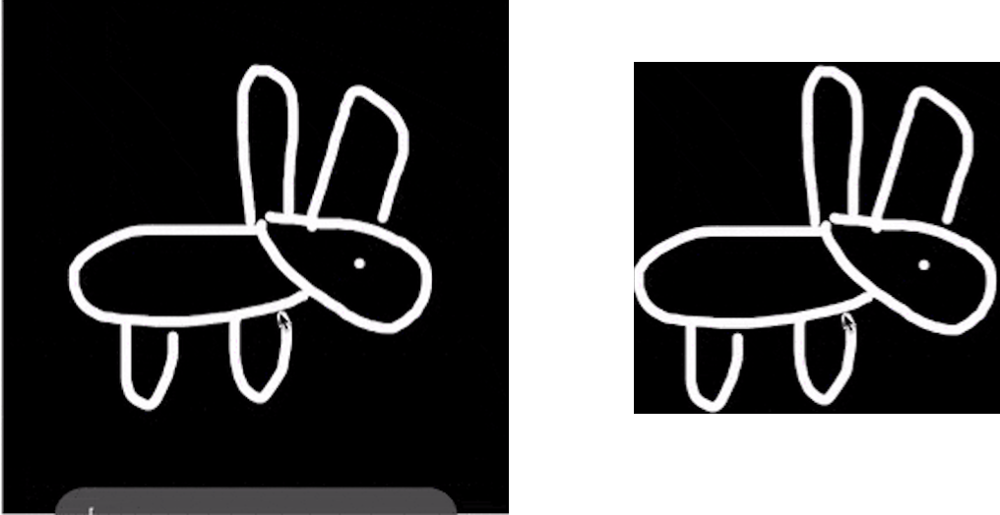

# 用PyTorch和DJL做涂鸦识别的小游戏

> 本文适合有 Java 基础的人群


作者：**DJL-Lanking**

HelloGitHub 推出的[《讲解开源项目》](https://github.com/HelloGitHub-Team/Article)系列。有幸邀请到了亚马逊 + Apache 的工程师：Lanking（ https://github.com/lanking520 ），为我们讲解 DJL —— 完全由 Java 构建的深度学习平台，本文为系列的第三篇。

## 一、前言

在2018年时，Google 推出了《猜画小歌》应用：玩家可以直接与AI进行你画我猜的游戏。通过画出一个房子或者一个猫，AI 会推断出各种物品被画出的概率。它的实现得益于深度学习模型在其中的应用，通过深度神经网络的归纳，曾经令人头疼的绘画识别也变得易如反掌。现如今，只要使用一个简单的图片分类模型，我们便可以轻松的实现绘画识别。试试看这个在线涂鸦小游戏吧：

> 在线涂鸦小游戏：https://djl.ai/website/demo.html#doodle

在当时，大部分机器学习计算任务仍旧需要依托网络在云端进行。随着算力的不断增进，机器学习任务已经可以直接在边缘设备部署，包括各类运行安卓系统的智能手机。但是，由于安卓本身主要是用 Java ，部署基于 Python 的各类深度学习模型变成了一个难题。为了解决这个问题，AWS开发并开源了 DeepJavaLibrary (DJL)，一个为 Java 量身定制的深度学习框架。

在这个文章中，我们将尝试通过PyTorch预训练模型在在安卓平台构建一个涂鸦绘画的应用。由于总代码量会比较多，我们这次会挑重点把最关键的代码完成。你可以后续参考我们完整的项目进行构建。

> 涂鸦应用完整代码：https://github.com/aws-samples/djl-demo/tree/master/android


## 二、环境配置

为了兼容 DJL 需求的 Java 功能，这个项目需要 Android API 26 及以上的版本。你可以参考我们案例配置来节约一些时间，下面是这个项目需要的依赖项：

> 案例 gradle: https://github.com/aws-samples/djl-demo/blob/master/android/quickdraw_recognition/build.gradle

```
dependencies {
    implementation 'androidx.appcompat:appcompat:1.2.0'
    implementation 'ai.djl:api:0.7.0'
    implementation 'ai.djl.android:core:0.7.0'
    runtimeOnly 'ai.djl.pytorch:pytorch-engine:0.7.0'
    runtimeOnly 'ai.djl.android:pytorch-native:0.7.0'
}
```

我们将使用 DJL 提供的 API 以及 PyTorch 包。

## 三、构建应用

### 第一步：创建Layout

我们可以先创建一个 View class 以及 layout （如下图）来构建安卓的前端显示界面。



如上图所示，你可以在主界面创建两个 `View` 目标。 `PaintView` 是用来让用户画画的，在右下角 `ImageView` 是用来展示用于深度学习推理的图像。同时我们预留一个按钮来进行画板的清空操作。

### 第二步: 应对绘画动作

在安卓设备上，你可以自定义安卓的触摸事件响应来应对用户的各种触控操作。在我们的情况下，我们需要定义下面三种时间响应：

* touchStart: 感应触碰时触发
* touchMove: 当用户在屏幕上移动手指时触发
* touchUp: 当用户抬起手指时触发

与此同时，我们用 paths 来存储用户在画板所绘制的路径。现在我们看一下实现代码。

#### 重写 `OnTouchEvent` 和 `OnDraw` 方法

现在我们重写 `onTouchEvent` 来应对各种响应:

```java
@Override
public boolean onTouchEvent(MotionEvent event) {
    float x = event.getX();
    float y = event.getY();

    switch (event.getAction()) {
        case MotionEvent.ACTION_DOWN :
            touchStart(x, y);
            invalidate();
            break;
        case MotionEvent.ACTION_MOVE :
            touchMove(x, y);
            invalidate();
            break;
        case MotionEvent.ACTION_UP :
            touchUp();
            runInference();
            invalidate();
            break;
    }

    return true;
}
```

如上面代码所示，你可以添加一个 `runInference` 方法在 `MotionEvent.ACTION_UP` 事件响应上。这个方法是用来在用户绘制完后对结果进行推理。在之后的几步中，我们会讲解它的具体实现。

我们同样需要重写 `onDraw` 方法来展示用户绘制的图像:

```java
@Override
protected void onDraw(Canvas canvas) {
    canvas.save();
    this.canvas.drawColor(DEFAULT_BG_COLOR);

    for (Path path : paths) {
        paint.setColor(DEFAULT_PAINT_COLOR);
        paint.setStrokeWidth(BRUSH_SIZE);
        this.canvas.drawPath(path, paint);
    }
    canvas.drawBitmap(bitmap, 0, 0, bitmapPaint);
    canvas.restore();
}
```

真正的图像会保存在一个 `Bitmap` 上。

#### touchStart

当用户触碰行为开始时，下面的代码会建立一个新的路径同时记录路径中每一个点在屏幕上的坐标。

```java
private void touchStart(float x, float y) {
    path = new Path();
    paths.add(path);
    path.reset();
    path.moveTo(x, y);
    this.x = x;
    this.y = y;
}
```

#### touchMove

在手指移动中，我们会持续记录坐标点然后将它们构成一个 quadratic bezier. 通过一定的误差阀值来动态优化用户的绘画动作。只有差别超出误差范围内的动作才会被记录下来。

> quadratic bezier 文档: https://developer.android.com/reference/android/graphics/Path#quadTo(float,%20float,%20float,%20float)

```java
private void touchMove(float x, float y) {
    if (x < 0 || x > getWidth() || y < 0 || y > getHeight()) {
        return;
    }
    float dx = Math.abs(x - this.x);
    float dy = Math.abs(y - this.y);

    if (dx >= TOUCH_TOLERANCE || dy >= TOUCH_TOLERANCE) {
        path.quadTo(this.x, this.y, (x + this.x) / 2, (y + this.y) / 2);
        this.x = x;
        this.y = y;
    }
}
```

#### touchUp

当触控操作结束后，下面的代码会绘制一个路径同时计算最小长方形目标框。

```java
private void touchUp() {
    path.lineTo(this.x, this.y);
    maxBound.add(new Path(path));
}
```

### 第三步: 开始推理

为了在安卓设备上进行推理任务，我们需要完成下面几个任务：

* 从URL读取模型
* 构建前处理和后处理过程
* 从 PaintView 进行推理任务

为了完成以下目标，我们尝试构建一个 `DoodleModel` class 。在这一步，我们将介绍一些完成这些任务的关键步骤。

#### 读取模型

DJL内建了一套模型管理系统。开发者可以自定义储存模型的文件夹。

```java
File dir = getFilesDir();
System.setProperty("DJL_CACHE_DIR", dir.getAbsolutePath());
```

通过更改 `DJL_CACHE_DIR` 属性, 模型会被存入相应路径下.

下一步可以通过定义 Criteria 从指定 URL 处下载模型. 下载的 zip 文件内包含:

* doodle_mobilenet.pt: PyTorch 模型
* synset.txt: 包含分类任务中所有类别的名称

```java
Criteria<Image, Classifications> criteria =
            Criteria.builder()
                    .setTypes(Image.class, Classifications.class)
                    .optModelUrls("https://djl-ai.s3.amazonaws.com/resources/demo/pytorch/doodle_mobilenet.zip")
                    .optTranslator(translator)
                    .build();
return ModelZoo.loadModel(criteria);
```

上述代码同时定义了 translator 。translator 会被用来做图片的前处理和后处理。
最后，如下述代码创建一个 `Model` 并用它创建一个 `Predictor`:

```java
@Override
protected Boolean doInBackground(Void... params) {
    try {
        model = DoodleModel.loadModel();
        predictor = model.newPredictor();
        return true;
    } catch (IOException | ModelException e) {
        Log.e("DoodleDraw", null, e);
    }
    return false;
}
```

更多关于模型加载的信息，请参阅如何加载模型.

> DJL模型加载文档: http://docs.djl.ai/docs/load_model.html

#### 用Translator定义前处理和后处理

在DJL中, 我们定义了 Translator 接口进行前处理和后处理。在 DoodleModel 中我们定义了 ImageClassificationTranslator 来实现 Translator:

```java
ImageClassificationTranslator.builder()
    .addTransform(new ToTensor())
    .optFlag(Image.Flag.GRAYSCALE)
    .optApplySoftmax(true).build());
```

下面我们详细阐述 translator 所定义的前处理和后处理如何被用在模型的推理步骤中。当你创建 translator 时，内部程序会自动加载 `synset.txt` 文件得到做分类任务时所有类别的名称。当模型的predict()方法被调用时，内部程序会先执行所对应的 translator 的前处理步骤，而后执行实际推理步骤，最后执行 translator 的后处理步骤。对于前处理，我们会将 Image转化NDArray，用于作为模型推理过程的输入。对于后处理，我们对推理输出的结果（NDArray）进行 softmax 操作。最终返回结果为 Classifications 的一个实例。
更多关于 translator 的工作原理以及如何个性化 Translator 的信息，请参阅 Inference with your model。

> 自定义Translator案例： http://docs.djl.ai/jupyter/pytorch/load_your_own_pytorch_bert.html

#### 用 PaintView 进行推理任务

最后，我们来实现之前定义好的 runInference 方法。

```java
public void runInference() {
    // 拷贝图像
    Bitmap bmp = Bitmap.createBitmap(bitmap);
    // 缩放图像
    bmp = Bitmap.createScaledBitmap(bmp, 64, 64, true);
   // 执行推理任务
    Classifications classifications = model.predict(bmp);
   // 展示输入的图像
    Bitmap present = Bitmap.createScaledBitmap(bmp, imageView.getWidth(), imageView.getHeight(), true);
    imageView.setImageBitmap(present);
   // 展示输出的图像
   if (messageToast != null) {
        messageToast.cancel();
    }
    messageToast = Toast.makeText(getContext(), classifications.toString(), Toast.LENGTH_SHORT);
    messageToast.show();
}
```

这将会创建一个 Toast 弹出页面用于展示结果，示例如下:



恭喜你！我们完成了一个涂鸦识别小程序！

### 可选优化:  输入裁剪

为了得到更高的模型推理准确度，你可以通过截取图像来去除无意义的边框部分。



上面右侧的图片会比左边的图片有更好的推理结果，因为它所包含的空白边框更少。你可以通过 Bound 类来寻找图片的有效边界，即能把图中所有白色像素点覆盖的最小矩形。在得到x轴最左坐标，y轴最上坐标，以及矩形高度和宽度后，就可以用这些信息截取出我们想要的图形（如右图所示）实现代码如下：

```java
RectF bound = maxBound.getBound();
int x = (int) bound.left;
int y = (int) bound.top;
int width = (int) Math.ceil(bound.width());
int height = (int) Math.ceil(bound.height());
// 截取部分图像
Bitmap bmp = Bitmap.createBitmap(bitmap, x, y, width, height);
```

恭喜你！现在你就掌握了全部教程内容！期待看到你创建的第一个 DoodleDraw 安卓游戏！

最后，可以在GitHub找到本教程的完整案例代码。

> 涂鸦应用完整代码：https://github.com/aws-samples/djl-demo/tree/master/android

## 关于 DJL


Deep Java Library (DJL) 是一个基于 Java 的深度学习框架，同时支持训练以及推理。 DJL 博取众长，构建在多个深度学习框架之上 (TenserFlow、PyTorch、MXNet 等) 也同时具备多个框架的优良特性。你可以轻松使用 DJL 来进行训练然后部署你的模型。

它同时拥有着强大的模型库支持：只需一行便可以轻松读取各种预训练的模型。现在 DJL 的模型库同时支持高达 70 个来自 GluonCV、 HuggingFace、TorchHub 以及 Keras 的模型。

> 项目地址：https://github.com/awslabs/djl/

在最新的版本中 DJL 0.7.0 添加了对于 MXNet 1.7.0、PyTorch 1.6.0、TensorFlow 2.3.0 的支持。我们同时也添加了 ONNXRuntime 以及 PyTorch 在安卓平台的支持。
