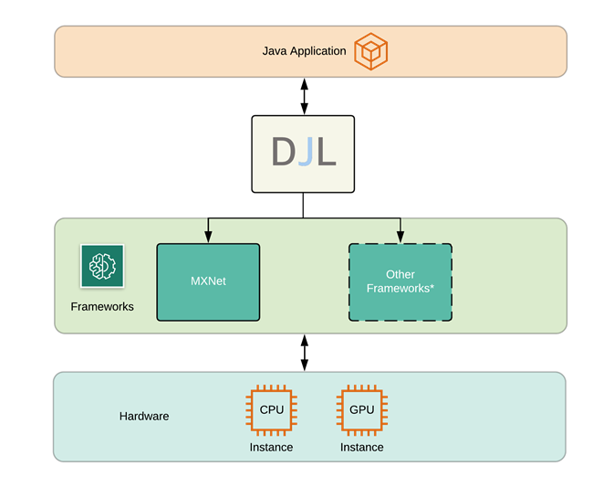
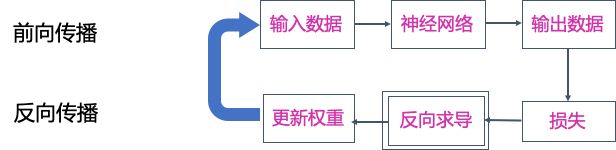

# 动手用Java训练深度学习模型

> 本文适合有 Java 基础的人群


作者：**DJL-Keerthan&Lanking**

HelloGitHub 推出的[《讲解开源项目》](https://github.com/HelloGitHub-Team/Article) 系列。这一期是由亚马逊工程师：Keerthan Vasist（ https://github.com/keerthanvasist ），为我们讲解 DJL —— 完全由 Java 构建的深度学习平台，本文为系列的第四篇。

## 一、前言

很长时间以来，Java 一直是一个很受企业欢迎的编程语言。得益于丰富的生态以及完善维护的包和框架，Java 拥有着庞大的开发者社区。尽管深度学习应用的不断演进和落地，提供给Java开发者的框架和库却十分短缺。现今主要流行的深度学习模型都是用 python 编译和训练的。对于 Java 开发者而言，如果要进军深度学习界，就需要重新学习并接受一门新的编程语言同时还要学习深度学习的复杂知识。这使得大部分 Java 开发者学习和转型深度学习开发变得困难重重。

为了减少 Java 开发者学习深度学习的成本，AWS构建了 Deep Java Library (DJL)，一个为 Java 开发者定制的开源深度学习框架。它为 Java 开发者对接主流深度学习框架提供了一个桥梁。DJL 同时对 Apache MXNet，PyTorch 和 TensorFlow 最新版本的支持，使得开发者可以轻松使用 Java 构建训练和推理任务。在这个文章中，我们会尝试用 DJL 构建一个深度学习模型并用它训练 MNIST 手写数字识别任务。

## 二、什么是深度学习？

在我们正式开始之前，我们先来了解一下机器学习和深度学习的基本概念。机器学习是一个通过利用统计学知识，将数据输入到计算机中进行训练并完成特定目标任务的过程。这种归纳学习的方法可以让计算机学习一些特征并进行一系列复杂的任务，比如识别照片中的物体。由于需要写复杂的逻辑以及测量标准，这些任务在传统计算科学领域中很难实现。

深度学习是机器学习的一个分支，主要侧重于对于人工神经网络的开发。人工神经网络是通过研究人脑如何学习和实现目标的过程中归纳而得出一套计算逻辑。它通过模拟部分人脑神经间信息传递的过程，从而实现各类复杂的任务。深度学习中的“深度”来源于我们会在人工神经网络中编织构建出许多层( layer )从而进一步对数据信息进行更深层的传导。深度学习技术应用范围十分广泛，现在被用来做目标检测，动作识别，机器翻译，语意分析等各类现实应用中。

## 三、训练MNIST手写数字识别

### 项目配置

你可以用如下的 `gradle` 配置来引入依赖项。在这个案例中，我们用 DJL 的 api 包 (核心 DJL 组件) 和 basicdataset 包 ( DJL 数据集) 来构建神经网络和数据集。这个案例中我们使用了 MXNet 作为深度学习引擎，所以我们会引入 `mxnet-engine` 和 `mxnet-native-auto` 两个包。这个案例也可以运行在 PyTorch 引擎下，只需要替换成对应的软件包即可。

```
plugins {
    id 'java'
}
repositories {                           
    jcenter()
}
dependencies {
    implementation platform("ai.djl:bom:0.8.0")
    implementation "ai.djl:api"
    implementation "ai.djl:basicdataset"
    // MXNet
    runtimeOnly "ai.djl.mxnet:mxnet-engine"
    runtimeOnly "ai.djl.mxnet:mxnet-native-auto"
}
```

### NDArray 和 NDManager

NDArray 是 DJL 存储数据结构和数学运算的基本结构。一个 NDArray 表达了一个定长的多维数组。NDArray 的使用方法类似于 Python 中的 numpy.ndarray 。

NDManager 是 NDArray 的老板。它负责管理 NDArray 的产生和回收过程，这样可以帮助我们更好的对 Java 内存进行优化。每一个 NDArray 都会是由一个 NDManager 创造出来，同时它们会在 NDManager 关闭时一同关闭。NDManager 和 NDArray都是由 Java 的 AutoClosable 构建，这样可以确保在运行结束时及时进行回收。想了解更多关于它们的用法和实践，请参阅这篇文章 (https://aws.amazon.com/cn/blogs/china/ndarray-java-based-n-dimensional-array-tool/)。

### Model

在 DJL 中，训练和推理都是从 Model class 开始构建的。我们在这里主要讲训练过程中的构建方法。下面我们为 Model 创建一个新的目标。因为 Model 也是继承了 AutoClosable 结构体，我们会用一个 try block 实现：

```java
try (Model model = Model.newInstance()) {
    ...
    // 主体训练代码
    ...
}
```

### 准备数据

MNIST ((Modified National Institute of Standards and Technology) 数据库包含大量手写数字的图，通常被用来训练图像处理系统。DJL 已经将 MNIST 的数据集收录到了 basicdataset 数据集里，每个 MNIST 的图的大小是 28 x 28。如果你有自己的数据集，你也可以通过 DJL 数据集导入教程来导入数据集到你的训练任务中。

> 数据集导入教程: http://docs.djl.ai/docs/development/how_to_use_dataset.html#how-to-create-your-own-dataset

```java
int batchSize = 32; // 批大小
Mnist trainingDataset = Mnist.builder()
        .optUsage(Usage.TRAIN) // 训练集
        .setSampling(batchSize, true)
        .build();
Mnist validationDataset = Mnist.builder()
        .optUsage(Usage.TEST) // 验证集
        .setSampling(batchSize, true)
        .build();
```

这段代码分别制作出了训练和验证集。同时我们也随机排列了数据集从而更好的训练。除了这些配置以外，你也可以添加对于图片的进一步处理，比如设置图片大小，对图片进行归一化等处理。

### 制作 model (建立 Block)

当你的数据集准备就绪后，我们就可以构建神经网络了。在 DJL 中，神经网络是由 Block (代码块) 构成的。一个 Block 是一个具备多种神经网络特性的结构。它们可以代表 一个操作, 神经网络的一部分, 甚至是一个完整的神经网络。然后 Block 可以顺序执行或者并行。同时 Block 本身也可以带参数和子 Block。这种嵌套结构可以帮助我们构造一个复杂但又不失维护性的神经网络。在训练过程中，每个 Block中附带的参数会被实时更新，同时也包括它们的各个子 Block 。这种递归更新的过程可以确保整个神经网络得到充分训练。

当我们构建这些Block的过程中，最简单的方式就是将它们一个一个的嵌套起来。直接使用准备好 DJL 的 Block 种类，我门就可以快速制作出各类神经网络。

根据几种基本的神经网络工作模式，我们提供了几种 Block 的变体。SequentialBlock 是为了应对顺序执行每一个子 Block 构造而成的。它会将前一个子 Block 的输出作为下一个 Block 的输入 继续执行到底。与之对应的，是 ParallelBlock。ParallelBlock 用于将一个输入并行输入到每一个子 Block 中，同时将输出结果根据特定的合并方程合并起来。最后我们说一下 LambdaBlock ，它是帮助用户进行快速操作的一个 Block ，其中并不具备任何参数，所以也没有任何部分在训练过程中更新。



我们来尝试创建一个基本的 多层感知机 (MLP) 神经网络吧。多层感知机是一个简单的前向型神经网络，它只包含了几个全连接层 (LinearBlock)。那么构建这个网络，我们可以直接使用 SequentialBlock 。

```java
int input = 28 * 28; // 输入层大小
int output = 10; // 输出层大小
int[] hidden = new int[] {128, 64}; // 隐藏层大小
SequentialBlock sequentialBlock = new SequentialBlock();
sequentialBlock.add(Blocks.batchFlattenBlock(input));
for (int hiddenSize : hidden) {
    // 全连接层
    sequentialBlock.add(Linear.builder().setUnits(hiddenSize).build());
    // 激活函数
    sequentialBlock.add(activation);
}
sequentialBlock.add(Linear.builder().setUnits(output).build());
```

当然 DJL 也提供了直接就可以拿来用的 MLP Block :

```java
Block block = new Mlp(
        Mnist.IMAGE_HEIGHT * Mnist.IMAGE_WIDTH,
        Mnist.NUM_CLASSES,
        new int[] {128, 64});
```

### 训练

当我们准备好数据集和神经网络之后，就可以开始训练模型了。在深度学习中，一般会由下面几步来完成一个训练过程：



* 初始化: 我们会对每一个 Block 的参数进行初始化，初始化每个参数的函数都是由 设定的 Initializer 决定的。 
* 前向传播: 这一步将输入数据在神经网络中逐层传递，然后产生输出数据。
* 计算损失: 我们会根据特定的损失函数  Loss 来计算输出和标记结果的偏差。
* 反向传播: 在这一步中, 你可以利用损失反向求导算出每一个参数的梯度。
* 更新权重: 我们会根据选择的优化器 (Optimizer) 更新每一个在 Block 上参数的值。

DJL 利用了 Trainer 结构体精简了整个过程。开发者只需要创建 Trainer 并指定对应的 Initializer , Loss 和 Optimizer 即可。这些参数都是由 TrainingConfig 设定的。下面我们来看一下具体的参数设置：

* `TrainingListener`:  这个是对训练过程设定的监听器。它可以实时反馈每个阶段的训练结果。这些结果可以用于记录训练过程或者帮助 debug 神经网络训练过程中的问题。用户也可以定制自己的 TrainingListener 来对训练过程进行监听。

```java
DefaultTrainingConfig config = new DefaultTrainingConfig(Loss.softmaxCrossEntropyLoss())
    .addEvaluator(new Accuracy())
    .addTrainingListeners(TrainingListener.Defaults.logging());
try (Trainer trainer = model.newTrainer(config)){
    // 训练代码
}
```

当训练器产生后，我们可以定义输入的 Shape 。之后就可以调用 fit 函数来进行训练。fit 函数会对输入数据，训练多个 epoch是并最终将结果存储在本地目录下。

```java
/*
 * MNIST 包含 28x28 灰度图片并导入成 28 * 28 NDArray。
 * 第一个维度是批大小, 在这里我们设置批大小为 1 用于初始化。
 */
Shape inputShape = new Shape(1, Mnist.IMAGE_HEIGHT * Mnist.IMAGE_WIDTH);
int numEpoch = 5;
String outputDir = "/build/model";

// 用输入初始化 trainer
trainer.initialize(inputShape);

TrainingUtils.fit(trainer, numEpoch, trainingSet, validateSet, outputDir, "mlp");
```

这就是训练过程的全部流程了！用 DJL 训练是不是还是很轻松的？之后看一下输出每一步的训练结果。如果你用了我们默认的监听器，那么输出是类似于下图：

```
[INFO ] - Downloading libmxnet.dylib ...
[INFO ] - Training on: cpu().
[INFO ] - Load MXNet Engine Version 1.7.0 in 0.131 ms.
Training:    100% |████████████████████████████████████████| Accuracy: 0.93, SoftmaxCrossEntropyLoss: 0.24, speed: 1235.20 items/sec
Validating:  100% |████████████████████████████████████████|
[INFO ] - Epoch 1 finished.
[INFO ] - Train: Accuracy: 0.93, SoftmaxCrossEntropyLoss: 0.24
[INFO ] - Validate: Accuracy: 0.95, SoftmaxCrossEntropyLoss: 0.14
Training:    100% |████████████████████████████████████████| Accuracy: 0.97, SoftmaxCrossEntropyLoss: 0.10, speed: 2851.06 items/sec
Validating:  100% |████████████████████████████████████████|
[INFO ] - Epoch 2 finished.NG [1m 41s]
[INFO ] - Train: Accuracy: 0.97, SoftmaxCrossEntropyLoss: 0.10
[INFO ] - Validate: Accuracy: 0.97, SoftmaxCrossEntropyLoss: 0.09
[INFO ] - train P50: 12.756 ms, P90: 21.044 ms
[INFO ] - forward P50: 0.375 ms, P90: 0.607 ms
[INFO ] - training-metrics P50: 0.021 ms, P90: 0.034 ms
[INFO ] - backward P50: 0.608 ms, P90: 0.973 ms
[INFO ] - step P50: 0.543 ms, P90: 0.869 ms
[INFO ] - epoch P50: 35.989 s, P90: 35.989 s
```

当训练结果完成后，我们可以用刚才的模型进行推理来识别手写数字。如果刚才的内容哪里有不是很清楚的，可以参照下面两个链接直接尝试训练。

> 手写数据集训练: https://docs.djl.ai/examples/docs/train_mnist_mlp.html
>
> 手写数据集推理: https://docs.djl.ai/jupyter/tutorial/03_image_classification_with_your_model.html

## 四、总结

在这个文章中，我们介绍了深度学习的基本概念，同时还有如何优雅的利用 DJL 构建深度学习模型并进行训练。DJL 也提供了更加多样的数据集和神经网络。如果有兴趣学习深度学习，可以参阅我们的 Java 深度学习书。

> Java 深度学习书: https://d2l.djl.ai


Deep Java Library (DJL) 是一个基于 Java 的深度学习框架，同时支持训练以及推理。 DJL 博取众长，构建在多个深度学习框架之上 (TenserFlow、PyTorch、MXNet 等) 也同时具备多个框架的优良特性。你可以轻松使用 DJL 来进行训练然后部署你的模型。

它同时拥有着强大的模型库支持：只需一行便可以轻松读取各种预训练的模型。现在 DJL 的模型库同时支持高达 70 个来自 GluonCV、 HuggingFace、TorchHub 以及 Keras 的模型。

> 项目地址：https://github.com/awslabs/djl/
