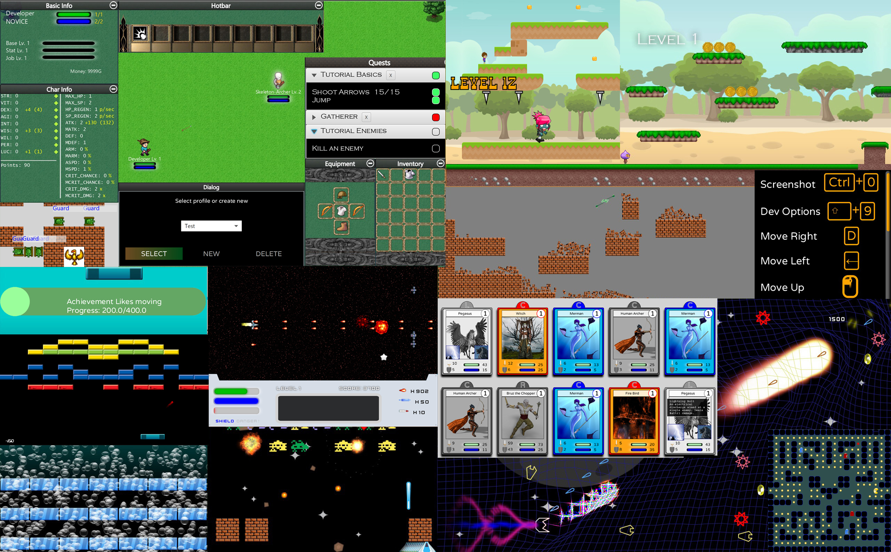
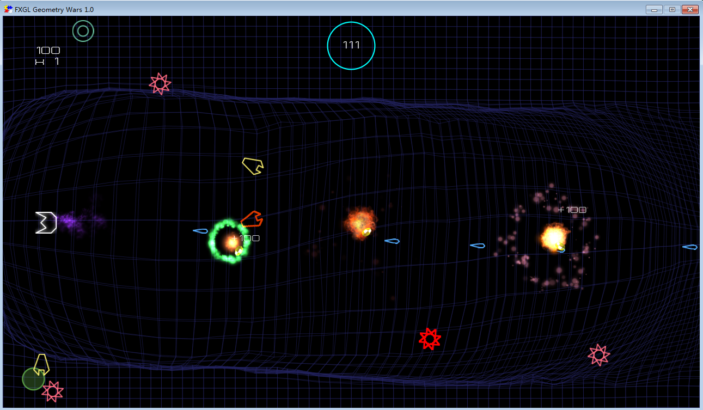
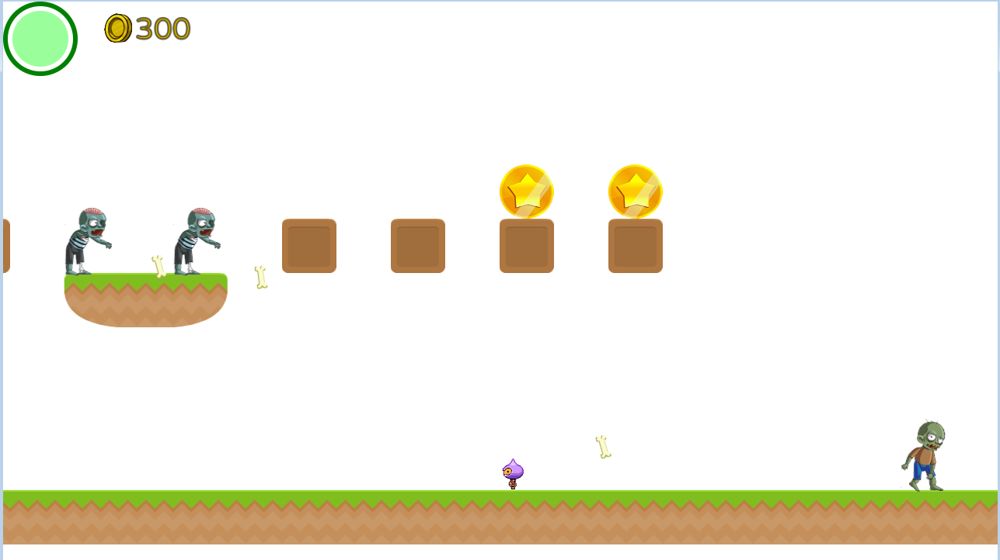
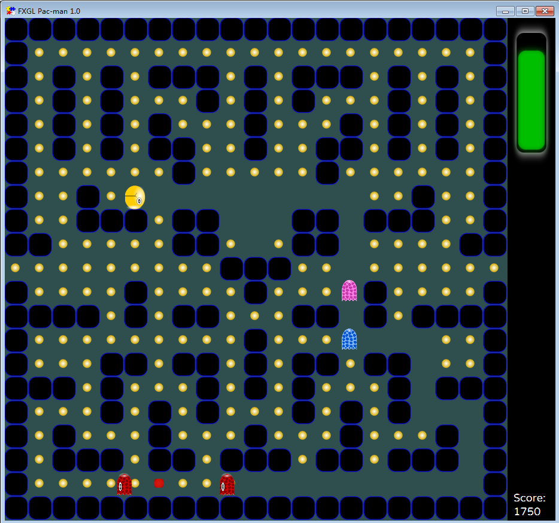
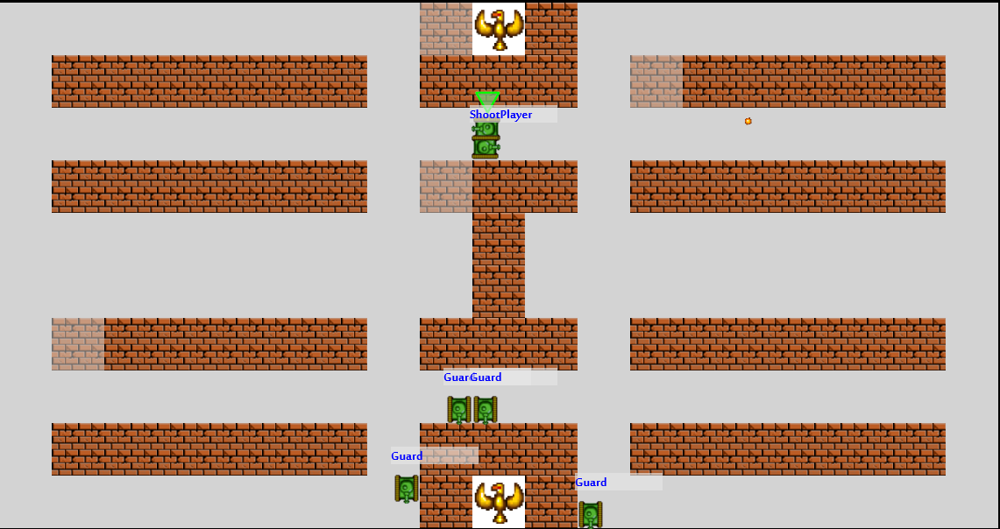
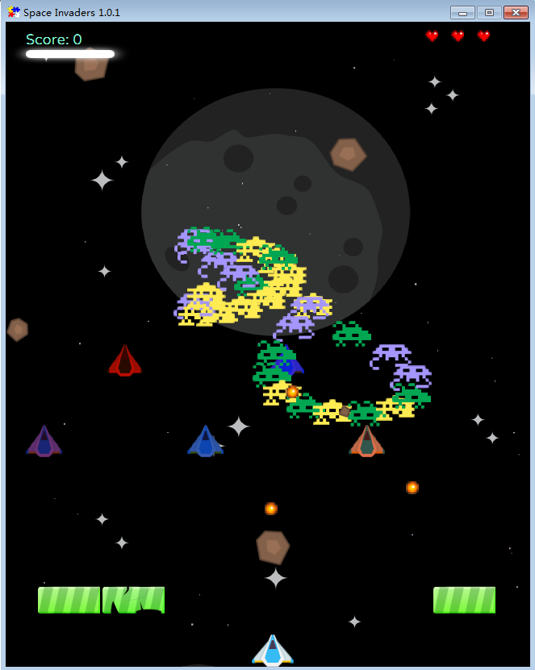
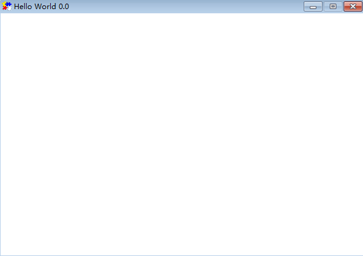

# Java 也可开发出炫酷的小游戏？

> 本文适合有 Java 基础知识的人群，跟着本文可学习和运行 `Java` 版游戏。



<p align="center">本文作者：HelloGitHub-<strong>秦人</strong></p>

HelloGitHub 推出的[《讲解开源项目》](https://github.com/HelloGitHub-Team/Article)系列，今天给大家带来一款命令行斗地主开源项目—— [FXGLGames](https://github.com/AlmasB/FXGLGames) 

> 项目源码地址：https://github.com/AlmasB/FXGLGames


## 一、项目介绍
都说 `Java` 语言无处不能，可以做桌面程序，可以做后台开发，可以做手机应用，也可以做游戏开发。本篇我们就重点讲一下一款 `Java` 游戏框架 `FXGL`，它无需安装或设置，开箱即用，只需本地安装 `jdk8+` 即可。游戏可轻松打包为可执行的 `*.jar` 文件，一行命令即可运行。

## 二、运行项目
### 2.1 前提

+ 安装 Jdk8 或者更高版本，全称 Java Development Kit，它是 Java 的库函数，是编译、运行java程序的工具包。
+ 安装 Maven3环境，进行项目构建和项目依赖包管理。
* 安装开发工具，例如：Idea，Eclipse，Spring Tool Suite 等。
- 安装 Git 工具，使用 GitBash 工具进行下载，提交代码等操作。

### 2.2 下载项目

执行如下代码，将项目下载到本地。
```bash
cd D:\devEnv
git clone https://github.com/AlmasB/FXGLGames.git
```

### 2.3 运行项目
#### 2.3.1 运行可执行文件
项目 `binaries` 目录下是已经构建好的游戏。

本地执行下面命令，就可以运行项目了。

```bash
java -jar xxx.jar
```

#### 2.3.2 源码构建项目
通过源码构建项目，这些项目都是 `maven` 项目，执行下面代码就可构建并运行项目。

```bash
cd project_name
mvn clean package -DskipTests
cd target
java -jar xxx.java
```
#### 2.3.3 游戏运行效果展示

1. GeometryWars
  这个游戏已有构建好的可执行文件，在 `binaries` 目录，运行效果如下图：
  

2. Mario（马里奥）
  这个游戏需要源码打包，参考上面步骤即可。注：此项目需要将 `jdk` 版本升级到 `11`，才可以构建和运行项目。运行效果如下图：
  

3. Pacman
  这个游戏已有构建好的可执行文件，在 `binaries` 目录，运行效果如下图：
  

4. BattleTanks
  这个游戏需要源码打包，参考上面步骤即可。运行效果如下图：
  

5. SpaceInvaders
  这个游戏已有构建好的可执行文件，在 `binaries` 目录，运行效果如下图：
  

## 三、项目入门
接下来通过构建一个简单的例子，我们来看看进行游戏开发需要怎么开始。
### 3.1 本地创建 `maven` 项目
`pom.xml` 文件添加依赖：
```xml
<dependency>
    <groupId>com.github.almasb</groupId>
    <artifactId>fxgl</artifactId>
    <version>11.7</version>
</dependency>
```
### 3.2 添加入口类
创建 `BasicGameApp.java`，文件内容如下：

```java
package demo;

import com.almasb.fxgl.app.GameApplication;
import com.almasb.fxgl.settings.GameSettings;

public class BasicGameApp extends GameApplication {

    @Override
    protected void initSettings(GameSettings settings) {
        settings.setWidth(600);
        settings.setHeight(400);
        settings.setTitle("Hello World");
    }

    public static void main(String[] args) {
        launch(args);
    }
}
```

### 3.3 运行效果
在开发工具直接右键 `运行` 入口类 `BasicGameApp.java` 即可，运行效果如下图：




## 四、最后

`Java` 无所不能是真的！本篇将的项目你 `get` 到了吗？ `Java` 开发小游戏还是相当炫酷的！学习英语可以听英文歌曲、看英文视频等等方式。学习编程我想也可以通过开发一款游戏的方式来增加学习兴趣，感受编码的魅力。有了直观的视觉冲击可能更加能激发你的学习和动手能力！ 通过我内容分享，能让更多的朋友们感受到开源项目的魅力，由而对编程产生兴趣，是我最大的乐趣！

教程至此，你应该也能快速运行游戏项目了。编程是不是也特别有意思呢？快邀请你的小伙伴一起加入到 `Java` 游戏开发乐趣中吧～

## 五、参考资料
+ [FXGL入门教程](https://github.com/AlmasB/FXGL/wiki)
+ [FXGL视频教程](https://www.youtube.com/playlist?list=PL4h6ypqTi3RTiTuAQFKE6xwflnPKyFuPp)

