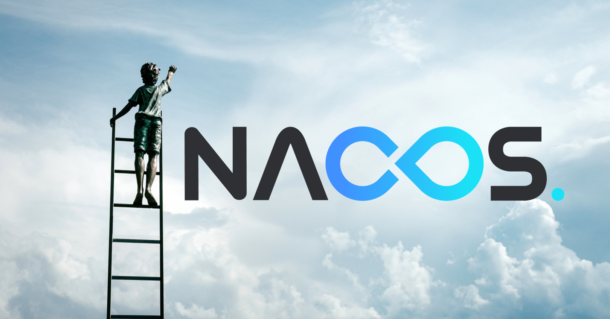
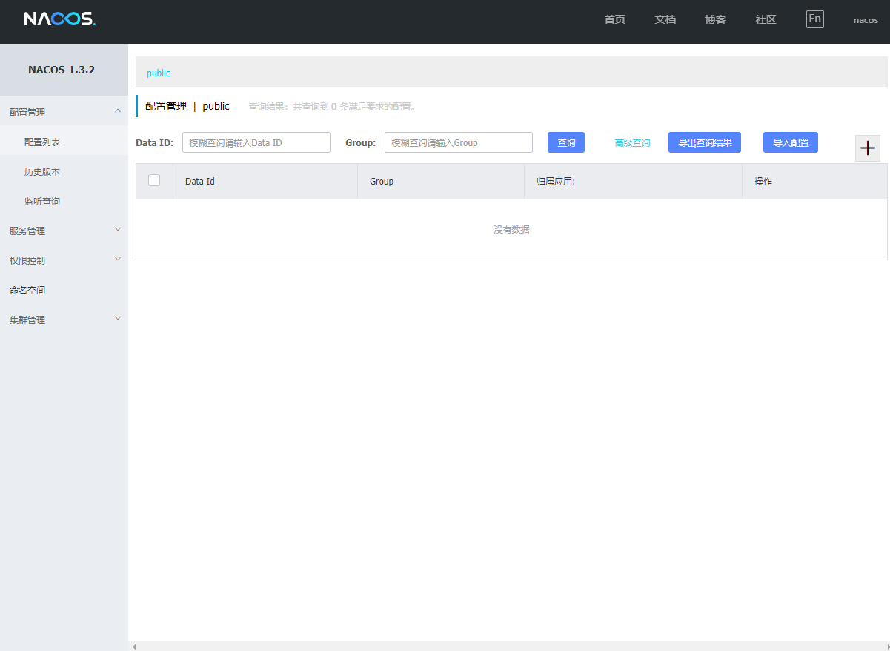
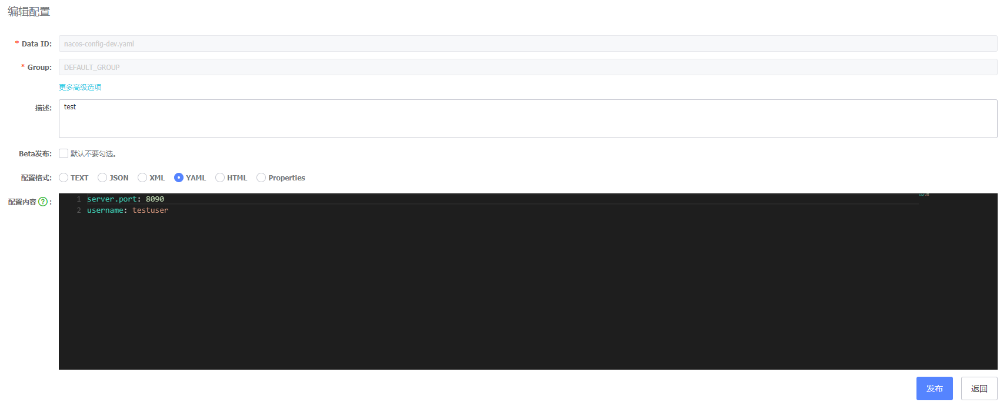
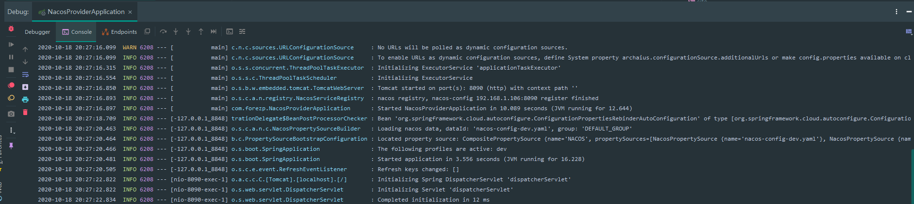
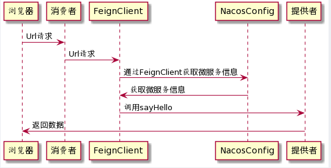

# 搞微服务用阿里开源的 Nacos 真香啊！

> 本文适合有 Java 基础知识的人群



<p align="center">本文作者：HelloGitHub-<strong>秦人</strong></p>

HelloGitHub 推出的[《讲解开源项目》](https://github.com/HelloGitHub-Team/Article)系列，今天给大家带来一款开源 Java 版可以实现动态服务发现，配置和服务管理平台——Nacos，它是阿里巴巴团队开源符合国人的一切使用习惯，并且中文文档丰富，开源社区也特别活跃。

> 项目源码地址：https://github.com/alibaba/nacos

## 一、项目介绍
在选择使用一个工具之前，我们先大概了解一下它的同类型产品，这样更能看出它的价值。

**三大注册中心**

| 名称       | 配置中心  |  注册中心 |依赖 |访问协议|版本迭代 |集成支持 |上手程度 |
| --------   | -----:   | :----: | :----:  |:----:  |:----:  |:----:  |:----:  |
| Eureka     | 不支持    |   支持  | 不依赖其他组件  |HTTP  | 无版本升级    |SpringCloud集成 |容易，英文界面，不符合国人习惯
| Consul     | 支持      |   支持  | 不依赖其他组件  |HTTP/DNS | 版本迭代中   |SpringCloud、K8S |复杂，英文界面，不符合国人习惯
| Nacos      | 支持     |   支持   | 不依赖其他组件   |HTTP/动态DNS/UDP | 版本迭代中   |Dubbo、SpringCloud、K8S |极易，中文文档和社区，符合国人习惯


提供了一组简单易用的特性集，帮助开发者快速实现动态服务发现、服务配置、服务元数据及流量管理。
主要特性：
- 服务发现：支持基于 DNS 和基于 RPC 的服务发现。服务提供者使用 原生SDK、OpenAPI、或一个独立的 Agent TODO 注册 Service 后，服务消费者可以使用 DNS TODO 或 HTTP&API 查找和发现服务。
- 服务健康监测：提供对服务的实时的健康检查，阻止向不健康的主机或服务实例发送请求。
- 动态配置服务：动态配置服务可以让您以中心化、外部化和动态化的方式管理所有环境的应用配置和服务配置。
- 动态 DNS 服务：动态 DNS 服务支持权重路由，使用者更容易地实现中间层负载均衡、更灵活的路由策略、流量控制以及数据中心内网的简单DNS解析服务。
- 服务及其元数据管理：Nacos 能让使用者从微服务平台建设的视角管理数据中心的所有服务及元数据，包括管理服务的描述、生命周期、服务的静态依赖分析、服务的健康状态、服务的流量管理、路由及安全策略、服务的 SLA 以及最首要的 metrics 统计数据。

`Nacos` 生态图


## 二、`SpringBoot` 实战

`Nacos` 主要的功能有配置中心和注册中心。
- 配置中心：通过在 `Nacos` 上配置用户名，在不重启微服务的情况下实现动态获取配置信息功能。
- 注册中心：创建两个微服务：服务提供者和服务消费者，实现微服务间调用。消费者要调用提供者的接口，只需要声明提供者的微服务名称和接口的请求地址，`Nacos` 就可准确的找到到对应的接口。

### 2.1 运行 Nacos

下载地址：https://github.com/alibaba/nacos/releases
```bash
unzip nacos-server-$version.zip  #解压
cd nacos/bin
startup.cmd -m standalone #单机模式
```

**访问首页**

Nacos 的访问地址：http://localhost:8848/nacos/
默认账号密码：nacos nacos
页面截图如下：


### 2.2 配置中心

**创建微服务项目**

创建 `SpringBoot` 项目主要有三种方式：通过网站创建，`IntelliJ IDEA` 的 `Spring Initializr` 工具创建，Maven 创建项目形式创建。

项目的`pom` 文件内容如下：
```xml
    <dependency>
        <groupId>org.springframework.boot</groupId>
        <artifactId>spring-boot-starter-web</artifactId>
    </dependency>

    <dependency>
        <groupId>org.springframework.boot</groupId>
        <artifactId>spring-boot-starter-test</artifactId>
        <scope>test</scope>
    </dependency>

    <!--nacos-config的Spring cloud依赖  -->
    <dependency>
        <groupId>org.springframework.cloud</groupId>
        <artifactId>spring-cloud-starter-alibaba-nacos-discovery</artifactId>
        <version>0.9.0.RELEASE</version>
    </dependency>
```
**bootstrap.yml 配置**

```yml
spring:
  application:
    name: nacos-config
  cloud:
    nacos:
      config:
        server-addr: 127.0.0.1:8848
        file-extension: yaml
        prefix: nacos-config
  profiles:
    active: dev
```
**Nacos 配置**

`Nacos` 上创建配置文件名称格式：`${prefix}-${spring.profile.active}.${file-extension}`，如上一步`bootstrap.yml`的配置可知，我要创建的配置名为：`nacos-config-dev.yaml`，内容如下：


**创建 Controller**

动态获取用户名称的功能为例：

创建一个对外接口 `/username` 代码如下：

```java
@RestController
@RefreshScope
public class ConfigController {

    @Value("${username:wangzg}")
    private String username;

    @RequestMapping("/username")
    public String userNameInfo() {
        return username;
    }
}
```
注意：`Controller` 上要添加 `@RefreshScope注解` 它实现了配置的热加载。

**验证结果**

本地运行项目，可以看到项目的启动时，端口已变为我们在 `Nacos` 上配置的端口`8090`。



在浏览器访问链接：`http://localhost:8090/username`，返回 `testuser`。修改 `Nacos` 上 `username` 的值，不需要重启微服务，重新请求链接 `username` 的值会动态变。可见 `Nacos` 作为配置中心实现了热加载功能。

### 2.3 注册中心

 1. 创建服务提供者

创建微服务可参上面**配置中心**的创建方式，创建对外接口 `/sayHello` 代码如下：

```java
@RestController
public class ProviderController {

    @GetMapping("/sayHello")
    public String sayHello(@RequestParam(value = "name",defaultValue = "helloWord")String sayHello){

        return "tom say: " + sayHello;
    }
}
```
启动服务，访问地址：[http://localhost:8099/sayHello](http://localhost:8099/sayHello)，可输出：
`tom say: helloWord`，表示微服务已创建成功。

 2. 创建服务消费者
   
这里采用 `FeignClient` 的方式实现跨服务间调用（有兴趣的同学也可以研究一下RestTemplate的方式）。 

**pom 文件**

在 nacos-consumer 的 pom 文件要添加 `Feigin-Client` 的 maven 依赖。

```xml
<dependency>
    <groupId>org.springframework.cloud</groupId>
    <artifactId>spring-cloud-starter-openfeign</artifactId>
</dependency>
```
**添加注解**

在微服务启动类 `*Application.java` 添加注解 `@EnableFeignClients`。

**创建 FeignClient**
```java
@FeignClient("nacos-provider")
public interface ProviderClient {

    @GetMapping("/sayHello")
    String sayHello(@RequestParam(value = "name", defaultValue = "wangzg", required = false) String name);
}
```
说明：FeignClient 注解传入的 `name`，指定 FeignClient 的名称，如果项目使用了 Ribbon，name 属性会作为微服务的名称，用于服务发现。

**创建 ConsumerController**

```java
@RestController
public class ConsumerController {

    @Autowired
    ProviderClient providerClient;

    @GetMapping("/hi-feign")
    public String hiFeign(){
       return providerClient.sayHello("feign");
    }
}
```
重启工程，在浏览器上访问[http://localhost:8090/hi-feign](http://localhost:8090/hi-feign)，可以在浏览器上展示正确的响应，这时 nacos-consumer 调用 nacos-provider 服务成功。


下面一张请求流转的时序图，这样理解清晰一些。   



项目地址：[https://github.com/hellowHuaairen/wangzgSpringBootTest](https://github.com/hellowHuaairen/wangzgSpringBootTest)

## 三、最后

微服务有四大特点：
- 小（微服务粒度小）
- 独（独立部署运行和扩展）
- 轻（系统简洁轻量化）
- 松（高内聚低耦合）

要完成一个复杂系统往往需要很多微服务单元，而衔接每个微服务，完成微服务的统一管理就非常有必要，所以集成服务管理中心和配置中心的产品就的就应运而生，而 `Nacos` 是其中的佼佼者！

教程至此，你应该也能对 `Nacos` 有一些了解！光看不练假把式，最快的学习方式莫过于模仿，再通过举一反三才能融会贯通。每一种新工具都是对老工具的革新，有兴趣的小伙伴可以参考我上面的案例，在实践中会发现更多乐趣！

## 四、参考资料
- 官方文档: [https://nacos.io/zh-cn/docs/what-is-nacos.html](https://nacos.io/zh-cn/docs/what-is-nacos.html)