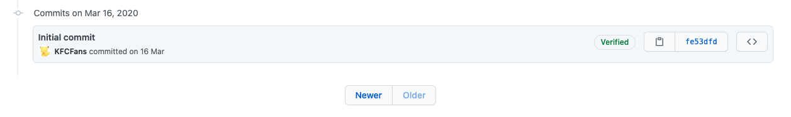

# PowerJob 的故事开篇：“玩够了，才有激情做开源啊！”

> 本文适合有 Java 基础知识的人群

作者：HelloGitHub-**Salieri**

HelloGitHub 推出的[《讲解开源项目》](https://github.com/HelloGitHub-Team/Article)系列。

经过几番的努力和沟通，终于邀请到分布式任务调度与计算框架：PowerJob 的作者 Salieri，加入 HG 的开源讲解系列，开启了他的 PowerJob 讲解系列 🎉。**后续每周三将更新一篇，希望你能从本系列中学到有用的知识提高自己的技术水平。**
> 项目地址：
>
> https://github.com/KFCFans/PowerJob

## 一、起因

大家好我是 PowerJob 的作者 Salieri，关于 PowerJob 故事要从一年前说起了。

一年前，我前往阿里巴巴集团，开启了自己的暑期实习。机缘巧合的是，我接到的第一个正式的开发类任务，就与分布式任务调度与计算紧密相关。

当时，集团内部研发出了一款全新的任务调度中间件（SchedulerX 2.0，也就是 README 中提到的本框架的参考对象），需要从老版本的 DTS 迁移到 SchedulerX 2.0。而这个光荣而伟大的任务，自然也被师兄委派到了我身上。也从那时候开始我开始正式接触并使用这种分布式任务调度与计算中间件。

迁移完毕后很长一段时间内，算是我和 SchedulerX 的蜜月期，不得不说 SchedulerX 的设计理念极其先进，比如通过控制台或 OpenAPI 动态传递运行时参数能让传统的任务变得非常灵活，无需更改代码即可实现不同的功能，再比如 MapReduce 处理器的存在使得开发者只需要寥寥数行代码就能实现分布式计算，解决大量数据的处理需求。然而好景不长，在即将迎来双十一之际，发生了两个比较悲伤的故事。

双十一临近，由于需要处理的数据量激增，之前在 SchedulerX 上运行完美的离线任务开始频频失败，整个双十一前夕报警电话的频率甚至能超过微信提醒的频率（好吧有一部分原因是没人找我 T_T）。经过与相关开发人员的一通排查，初步断定问题的原因在于我们的应用内存占用过高，导致 SchedulerX 没有足够的内存去完成必要的任务，进而导致任务失败。这个锅，SchedulerX 显然是不背的，也很合理，不符合最低运行要求嘛，就好比你买一台 Macbook Air 装个 Windows 准备玩 PUBG 结果发现连欢迎界面都看不到，你能说什么呢？人家最低运行要求写的明明白白，达不到配置要求无法运行只能怪你自己，你能做的只有接受。最后实在没办法，只能拆东墙补西墙勉勉强强撑过了双十一。

另一件事是限流。为了监控任务的运行状态，我在另一个应用单独写了轮询查询 SchedulerX 任务运行状态的逻辑，该功能一直四平八稳地运行着。直到某一天，我完成一个微小改动的发布后，本着安全生产的原则，登上在线日志平台查看应用的运行时日志。不看不知道一看吓一跳，满屏幕的 RuntimeException 甚至让我怀疑我是不是不小心删掉了某个模块，还是不小心把数据库删了，还是不小心发布错代码分支了。慌乱过后冷静下来看异常信息，才发现一直以来我调用的 SchedulerX 提供的查看任务运行状态接口报错了，被限流了。理由是双十一保障。嗯，因为需要保障双十一稳定性所以先弄挂一个虽然不在双十一圈内但好歹站在边上的应用。沟通无果，只能一顿魔改代码，自己去实现任务的状态监控。

其实这两件事情呢，SchedulerX 团队确实没有什么问题。毕竟服务于整个集团所有业务线，不做一些限制任由大家肆无忌惮使用是不可能的。但是中台模式下，某些个体的需求无法得到满足也是确实存在的现象。对于大部分接入用户来说，只需要依赖个 Jar 包，写点代码，去控制台一配置，任务就能跑起来，使用体验极好。毕竟，并不是所有用户都有我们这种动辄几百万子任务的变态需求......

双十一过后，实习期满，我也就从阿里离职回家，开启混吃等死模式，每天不是在打游戏就是在想怎么打游戏，对了，还有告诉自己明天一定要好好学习。

浑浑噩噩过了 N 个月后，终于想起还有毕业论文这事。没办法，为了卑微的学位，我只能暂时金盆洗手，投入到论文的撰写之中去。写完论文，疫情差不多结束了，一起“送人头”的小伙伴都差不多上班去了，构成我充满打游戏欲望的条件（人数==5）被破坏，我也就彻底闲了下来。重拾自己的传统艺能——Reading。

在看了很多本奇奇怪怪的书（甚至包括一本言情小说）以后，终于想起了以前一直想做但是一直被慵懒的自己所搁置的事情：自研一个 SchedulerX，万一哪天 SchedulerX 满足不了需求，至少还能自己就自己抢救一下～于是，OhMyScheduler 诞生了～（没错，一开始叫 OhMyScheduler，后面改名为 **PowerJob**）

## 二、介绍

实在是没事儿干了，也是时候扛起是“新一代分布式任务调度与计算框架”的大旗了（当然要走的路还很长），废话不多说接下来开始正文。

### 2.1 任务调度框架

定时任务相信大家都接触过，比如经典的 Linux crontab。定时调度、定时执行已经渐渐成为了各个系统普遍需要依赖的中间系统。在 Java 领域，也出现了许多优秀的任务调度框架。

当前市面上流行的作业调度框架有老牌的 Quartz、基于 Quartz 的 elastic-job 和原先基于 Quartz 后面移除依赖的 xxl-job，这里分别谈一些这些框架现存的缺点。

Quartz 可以视为第一代任务调度框架，基本上是现有所有分布式调度框架的“祖宗”。由于历史原因，它不提供Web界面，只能通过API完成任务的配置，使用起来不够方便和灵活，同时它仅支持任务的单机执行，无法有效利用整个集群的计算能力。 同时，Quartz 需要的调度和执行耦合在同一个应用中，没有平台化服务的能力。

xxl-job 可以视为第二代任务调度框架，在一定程度上解决了 Quartz 的不足，在过去几年中是个非常优秀的调度框架，不过放到今天来看，还是存在着一些不足的，具体如下：

- 数据库支持单一：仅支持 MySQL，使用其他DB需要自己魔改代码
- 有限的分布式计算能力：仅支持静态分片，无法很好的完成复杂任务的计算
- 不支持工作流：无法配置各个任务之间的依赖关系，不适用于任务之间存在复杂依赖的场景

正所谓长江后浪推前浪，在如今这个数据量日益增长、业务越来越复杂的年代，急需一款更为强大的任务调度框架来解决上诉问题，而 PowerJob 因此应运而生。

### 2.2 PowerJob 闪亮登场

PowerJob 可以被认为是第三代任务调度框架，在任务调度的基础上，还额外提供了分布式计算和工作流功能，其主要特性如下：

- 使用简单：提供 Web 界面，允许开发者可视化地完成调度任务的管理（增、删、改、查）、任务运行状态监控和运行日志查看等功能。
- 定时策略完善：支持 CRON 表达式、固定频率、固定延迟和API四种定时调度策略。
- 执行模式丰富：支持单机、广播、Map、MapReduce 四种执行模式，其中 Map/MapReduce 处理器能使开发者寥寥数行代码便获得集群分布式计算的能力。
- 工作流（workflow）支持：支持在线配置任务依赖关系，可视化得对任务进行编排，同时还支持上下游任务间的数据传递
- 执行器支持广泛：支持 Spring Bean、内置/外置 Java 类、Shell、Python 等处理器，应用范围广。
- 运维便捷：支持在线日志功能，执行器产生的日志可以在前端控制台页面实时显示，降低 debug 成本，极大地提高开发效率。
- 依赖精简：最小仅依赖关系型数据库（MySQL/PostgreSQL/Oracle/MS SQLServer 等），同时支持所有 Spring Data JPA 所支持的关系型数据库。
- 高可用&高性能：调度服务器经过精心设计，一改其他调度框架基于数据库锁的策略，实现了无锁化调度。部署多个调度服务器可以同时实现高可用和性能的提升（支持无限的水平扩展）。
- 故障转移与恢复：任务执行失败后，可根据配置的重试策略完成重试，只要执行器集群有足够的计算节点，任务就能顺利完成。

### 2.3 PowerJob 适用场景

综上所述，PowerJob 是全新一代分布式调度与计算框架，能让您轻松完成任务的调度与繁杂任务的分布式计算。适用于各个有任务调度需求的企业，统一部署 Server 做为整个公司的公共调度平台，成为分布式调度的中间件。

- 有定时执行需求的业务场景：如每天凌晨全量同步数据、生成业务报表等。
- 有需要全部机器一同执行的业务场景：如使用广播执行模式清理集群日志。
- 有需要分布式处理的业务场景：比如需要更新一大批数据，单机执行耗时非常长，可以使用 Map/MapReduce 处理器完成任务的分发，调动整个集群加速计算。

## 三、大纲

后面会逐步**从上手使用讲到核心技术剖析**，希望大家可以持续关注，从中有所收获，同时欢迎小伙伴们可以贡献代码哦！大纲太长了（10+篇）所以下面只简单罗列了一部分：

- 快速上手
- PowerJob 技术综述
- 技术剖析：Akka 框架
    - Actor模型
    - Akka-remote 简化通讯代码
    - Akka API 介绍
- 技术剖析：任务的调度与派发
    - 时间轮算法
    - 调度层：OmsSchedulerService
    - 派发层：DispatchService
- 技术剖析：Spring AOP 技术的应用
    - 拦截
    - exclude
- 等等

## 四、总结与预告

本章主要阐述了 PowerJob 诞生的故事，同时简单介绍了 PowerJob 这个框架的功能和适用场景，本系列的大纲。下一章节，我将会介绍 PowerJob 的快速入门，帮助大家快速熟悉并使用这款强大的分布式任务调度与计算框架。

那我们下期再见喽～