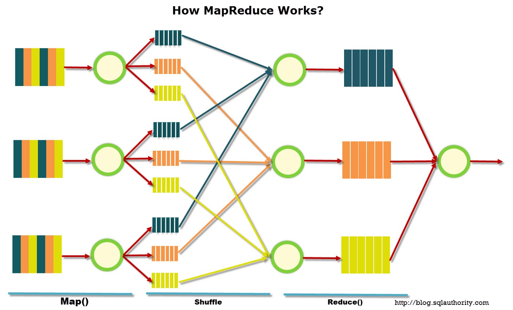
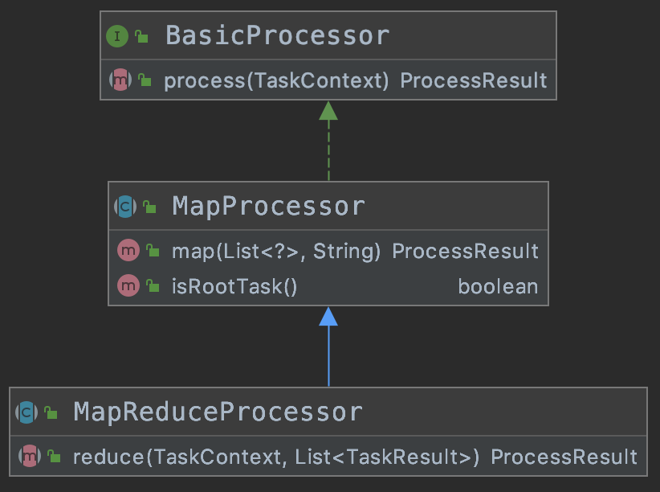
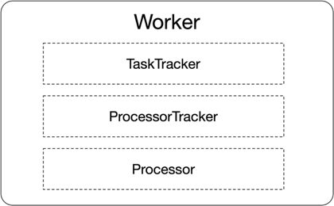
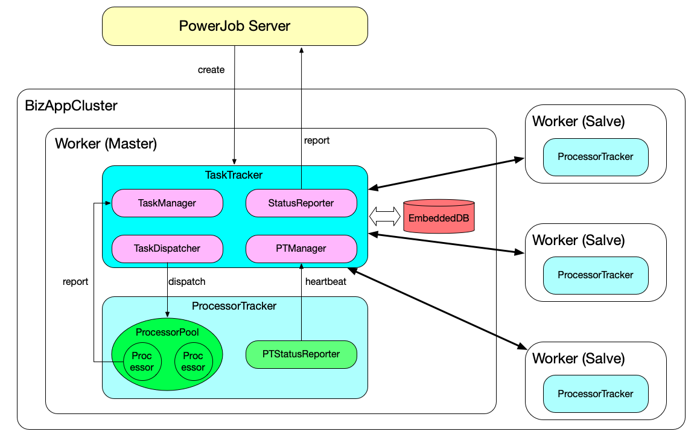

# PowerJob 应对庞大任务的锦囊妙计：MapReduce

> 本文适合有 Java 基础知识的人群


作者：HelloGitHub-**Salieri**

HelloGitHub 推出的[《讲解开源项目》](https://github.com/HelloGitHub-Team/Article)系列。讲解 PowerJob 系列即将接近尾声，本系列的干货你还喜欢吗？欢迎留言说下你的感受和后面想看的内容。

> 项目地址：
>
> https://github.com/KFCFans/PowerJob

## 一、MapReduce 概念介绍

> MapReduce 是一种编程模型，用于大规模数据集（大于1TB）的并行运算。概念 Map（映射）和 Reduce（归约），是它们的主要思想，都是从函数式编程语言里借来的，还有从矢量编程语言里借来的特性。它极大地方便了编程人员在不会分布式并行编程的情况下，将自己的程序运行在分布式系统上。当前的软件实现是指定一个 Map（映射）函数，用来把一组键值对映射成一组新的键值对，指定并发的 Reduce（归约）函数，用来保证所有映射的键值对中的每一个共享相同的键组。

以上这一大段不算难懂的文字就是 MapReduce 的官方概念，从“大规模数据集”这个关键字可以看出，MapReduce 是面向大数据处理领域设计的，是分治思想的一种经典实现，简单概括下就是把一大坨数据通过 Map 方法切分为较小的、单机能够处理的数据块进行处理（shuffle），处理完成后通过 Reduce 方法汇总结果，具体流程如下图所示。



## 二、需求背景

PowerJob 作为任务调度中间件，核心职责是负责任务的调度。而 MapReduce 作为一个大数据处理模型，核心功能是大规模数据的并行处理。从表象看，PowerJob 和 MapReduce 纯属八杆子打不着的关系～相信很多人第一眼看到 PowerJob 和 MapReduce 这两个关键词一起出现时，都会有以下心理活动：

“你一个任务调度框架咋就硬要扯上 MapReduce 那么高端的概念呢？就硬蹭呗？”

其实这个问题，换个角度来思考，就能找到答案。

一般来讲，需要定时调度执行的都是离线数据同步任务，对于一些有一定体量的业务来说，这个离线数据规模可能很大，单机无法很好的完成计算。为了解决这个问题，目前市面上的调度框架普遍支持静态分片这种相对比较简陋的方式来完成分布式计算，即通过指定分片数量来调动固定数量的机器执行固定区间的任务。但很显然，这种方式非常不灵活，局限性也非常大。

那么如何实现复杂且庞大任务的分布式计算呢？阿里巴巴的 SchedulerX 团队给出了 MapReduce 这样的答案。通过自己编程的形式，实现 Map 方法，完成任务的切分，再通过 Reduce 汇总子任务结果，即可完成高度可定制的分布式计算。

PowerJob 的 MapReduce 实现便是借鉴了这一先进的思想，这里再次感谢 SchedulerX 团队～

## 三、示例用法

> 在 PowerJob 中，MapReduce 不再是高高在上、难以触碰的概念。得益于强大的底层实现和优雅的 API 设计，开发者仅需要寥寥数行代码便可完成大型任务的分布式计算，具体示例如下。

对于有分布式计算需求的任务，我们需要继承特定的抽象类 `MapReduceProcessor` 来开启分布式计算能力，该接口要求开发者实现两个方法，分别是 `process` 和 `reduce`。前者负责任务的具体执行，后者负责汇集所有子任务得出具体的结果。同时，该抽象类默认提供两个可用方法：`isRootTask` 和 `map`。通过调用 `isRootTask` 方法可以判断出当前 Task 是否为根任务，如果是根任务，则进行任务的切分（PowerJob 支持任意级 map，并不只有在根任务才能切分任务），然后调用 `map` 方法分发子任务。



下面放一段简单的代码示例帮助大家理解。下面这段代码模拟了目前市面上主流的“静态分片”式分布式处理，即通过控制台指定分片数量和参数（比如分3片，分片参数为：1=a&2=b&3=c）来控制参与计算的机器数量和起始参数。虽然是“杀鸡焉用牛刀”的示例，不过还是能帮助大家很好理解 PowerJob MapReduce 处理器的强大之处！

首先，我们通过 context 的 getJobParams 方法获取控制台配置的参数，即分片参数 1=a&2=b&3=c。这个分片参数代表现在需要有 3 台机器参与执行，每台机器上子任务的起始参数分别为 a、b、c。因此，我们可以根据该规则创建子任务对象 SubTask，传入分片索引 index 和 分片参数 params。

完成子任务的切分后，即可调用 map 方法完成任务的分发。

分发后该子任务会再次进入 process 方法，只不过本次是以 SubTask 而不是 RootTask 的身份进入。我们可以通过 `context.getSubTask()` 方法获取之前 map 出去的对象，该方法的返回值是 Object，因此我们需要使用 Java instaneof 关键字判断类型（当然，如果没有多级 map，那么该对象只可能是 SubTask 类型，直接强转即可），如果该对象为 SubTask 类型，即进行了子任务处理阶段，开始编写子任务处理逻辑即可。

当所有子任务执行完毕后，PowerJob 会调用 reduce 方法，传入所有子任务的运行结果，便于开发者构建该任务的最终结果。

```java
@Component
public class StaticSliceProcessor extends MapReduceProcessor {

    @Override
    public ProcessResult process(TaskContext context) throws Exception {
        OmsLogger omsLogger = context.getOmsLogger();
        
        // root task 负责分发任务
        if (isRootTask()) {
            // 从控制台传递分片参数，假设格式为KV：1=a&2=b&3=c
            String jobParams = context.getJobParams();
            Map<String, String> paramsMap = Splitter.on("&").withKeyValueSeparator("=").split(jobParams);

            List<SubTask> subTasks = Lists.newLinkedList();
            paramsMap.forEach((k, v) -> subTasks.add(new SubTask(Integer.parseInt(k), v)));
            return map(subTasks, "SLICE_TASK");
        }

        Object subTask = context.getSubTask();
        if (subTask instanceof SubTask) {
            // 实际处理
            // 当然，如果觉得 subTask 还是很大，也可以继续分发哦
            
            return new ProcessResult(true, "subTask:" + ((SubTask) subTask).getIndex() + " process successfully");
        }
        return new ProcessResult(false, "UNKNOWN BUG");
    }

    @Override
    public ProcessResult reduce(TaskContext context, List<TaskResult> taskResults) {
        // 按需求做一些统计工作... 不需要的话，直接使用 Map 处理器即可
        return new ProcessResult(true, "xxxx");
    }

    @Getter
    @NoArgsConstructor
    @AllArgsConstructor
    private static class SubTask {
        private int index;
        private String params;
    }
}
```

## 四、原理实现

PowerJob 的 MapReduce 思想主要来源于《[Schedulerx2.0 分布式计算原理&最佳实践](https://developer.aliyun.com/article/704121?spm=a2c6h.12873581.0.0.3a41a115fWKJEC&groupCode=schedulerx)》这篇文章。

出于功能职责的划分（powerjob-server 仅负责任务的调度和运维），整个 MapReduce 任务的计算由执行器 powerjob-worker 自主完成。

为了便于模型的设计和功能的划分，PowerJob 为执行器节点分配了 3 种角色，分别是 TaskTracker、ProcessorTracker 和 Processor。

- TaskTracker 是每一个任务的主节点，充当集群中的 master 角色，因此每个任务每次只会产生一个 TaskTracker。它负责子任务的分发、状态监控和集群中各执行节点的健康检查，并定期将任务的运行时信息上报给 server。
- ProcessorTracker 是每一个执行器节点中负责执行器管理的角色，每个任务在每个执行器节点（JVM 实例）上都会产生一个 ProcessorTracker。它负责管理执行器节点任务的执行，包括接受来自 TaskTracker 的任务、上报本机任务执行情况和执行状态等功能。
- Processor 是每一个执行器节点中负责具体执行任务的角色，也就是真正的执行单元，每个任务在每个执行器节点都会生成若干个 Processor（没错！就是控制台“实例并发数”所决定的数量）。它接受来自 ProcessorTracker 派发的执行任务并完成计算。



当需要执行分布式任务时，powerjob-server 会根据集群中各个 worker 节点的内存占用、CPU 使用率和磁盘使用率进行健康度计算，得分最高的节点将作为本次任务的 master 节点，即承担 TaskTracker 的职责。TaskTracker 在接收到来自 server 的任务执行请求时被创建，并完成三个阶段的初始化：
- 首先需要初始化内嵌的 H2 数据库，用于存储所有子任务的派发情况和执行情况。
- 存储就位后，TaskTracker 会根据 server 派发下来的任务内容，构建根任务，并将其持久化到内嵌数据库。
- 最后 TaskTracker 会创建一系列定时任务，包括子任务定时派发、子任务执行状态检查、worker 健康度检查和任务整体执行状态上报。

ProcessorTracker 在接收到来自 TaskTracker 的子任务执行请求时被创建，并根据请求中携带的任务信息构建出执行所需要的线程池和对应的处理器。当子任务的运行状态发生变更后，ProcessorTracker 需要及时将最新状态反馈给 TaskTracker。

至于 Processor，本质上就是封装了每个子任务上下文信息的线程，由 ProcessorTracker 提交到执行线程池进行执行，并向上级汇报自己的执行状态。



上图清晰地展示了 PowerJob MapReduce 的工作原理，由于 MapReduce 确实算得上是非常复杂和精妙的实现，一篇文章的篇幅肯定是无法将细节说的一清二楚的。因此本文偏向于整体上的介绍，为大家讲述核心组件的划分依据和主要功能。如果对具体的细节有兴趣，那么源码是最好的资料～在本文的指导下，我个人认为花不了一天时间就能差不多看懂～

## 五、最后
好了，以上就是本文的全部内容了～也是 PowerJob 技术专栏的收官之作。本来打算在这里写点“离别感言”，讲一下自己这一路的心路历程，不过越写越长，都快赶上正文的篇幅了...so～就偷偷放到下期吧～