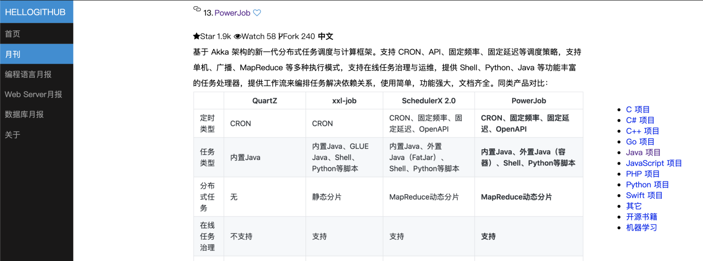
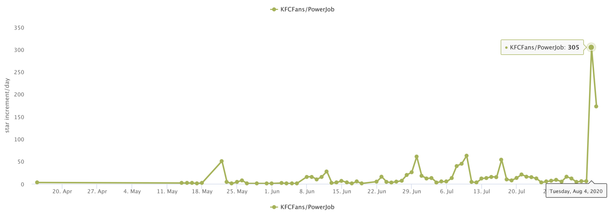
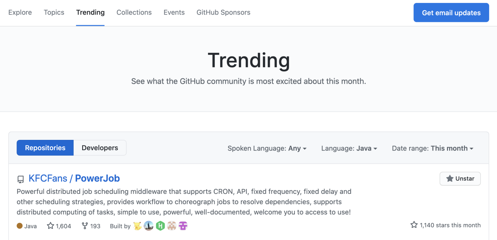
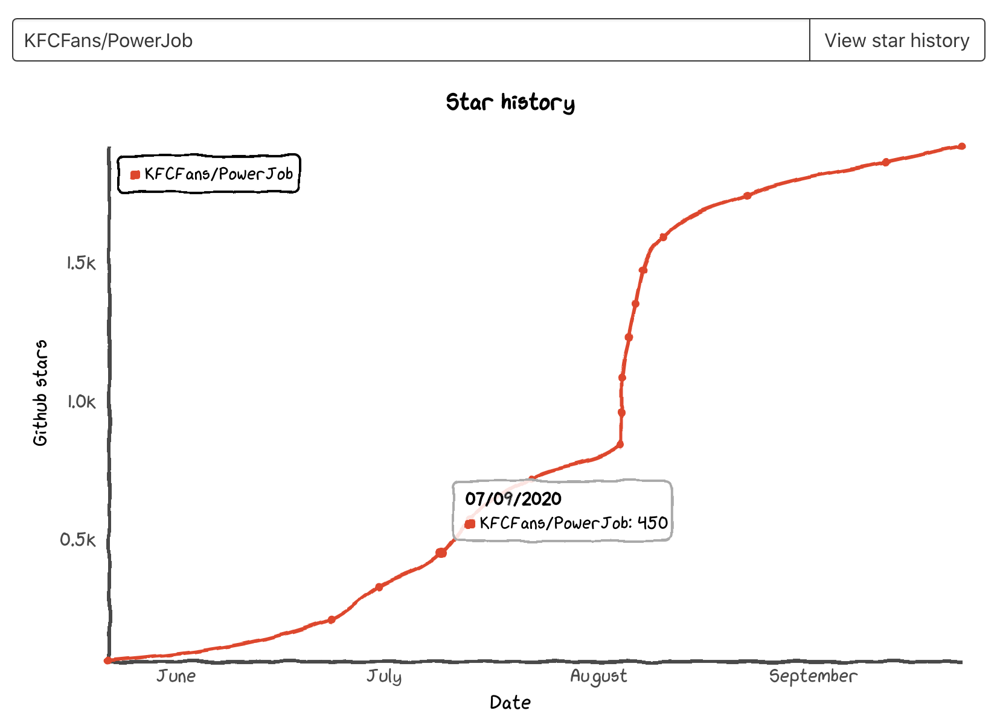

# PowerJob 从 0 到 1.9k star 的经历

> 本文适合有 Java 基础知识的人群

作者：HelloGitHub-**Salieri**

本文就是《讲解 PowerJob》系列的最后一篇文章了，纯粹是写点经历写点心路历程啥的，和大家道个别。

## 惨淡的开端
本专栏的第一篇文章问世的时候，PowerJob 几乎处于一个无人问津的状态，为了宣传我可以说是绞尽脑汁，几乎能尝试的渠道我都尝试过，不过显然结果都一样——石沉大海。那时候我特别羡慕那些大厂的开源项目，它们含着金钥匙出生，从诞生的那一刻就有了十足的曝光度和流量，只要足够好用，能解决实际问题，注定能成为开源界一颗闪亮的 star。而 PowerJob 呢，直到现在我仍然认为自己给出的客观评价就是这是目前这个世界上最强大的任务调度框架（SchedulerX 没开源不算），就凭一个分布式计算功能差不多就能打遍天下无敌手了。然而，功能强大、简单好用也并不等于成功。这个社会本质上还是头部决定尾部，对于 PowerJob 这种三无框架（没有学校背景、没有公司背景、没有开源组织背景）来说，知名度就是最大的硬伤。

其实我一开始写这个框架并没有开源，然后做到今天这个地步的打算。一开始只是想着，“oh～以前公司那个 schedulerx 还挺猛的，不过不能很好支撑我们较为变态的业务，要不自己写一个试试，哪怕是熟悉原理也能方便以后排查问题”。抱着这种随便玩玩的心态，写着写着呢，这框架就像模像样起来了。像模像样了以后呢，看着市面上一大票调度框架，就开始为自己的作品鸣不平。既然从功能上完成了超越，又凭什么要默默无闻下去呢？难道仅仅是因为 PowerJob 背后没有大众点评、当当这样的大公司撑腰吗？

于是，出于“鸣不平、求认可”这样的心态，我开始了 PowerJob 的宣传。虽然总体可以用艰难来形容，不过偶尔还是有一些贵人贵事带来的转折点。

## Gitee

第一个转折点，是 Gitee 的自荐功能，自荐成功以后，PowerJob 获取了 Gitee 开源推荐项目的一个推荐位，在那一周，OhMyScheduler（PowerJob 1.x 的名字）在 Gitee 上大概收获了 100 个 star。由于是第一次像模像样地搞开源，这 100 个 star 其实让我非常开心。虽然距离我期望的几千、甚至几万 star 还有这近乎无限的距离，但这至少是第一步。而第一步，往往是最让人有成就感的～感谢 Gitee 团队和红薯大大，让我走出了第一步，开始了开源的征程。

## HelloGitHub

热度总是难以维持的，仅靠一时的推广，一个小小的个人开源项目是无法掀起什么风浪的。很快，PowerJob 的 Gitee 仓库再次陷入了无人问津的状态，更别说更加没有曝光度的 GitHub 仓库了。正当我无计可施时，偶然发现了一个“分享 GitHub 上 有趣、入门级的开源项目”的网站 & 公众号。没错，也就是 HelloGitHub 了，PowerJob 的第二个转折点。经过一系列投稿、审核后，PowerJob 幸运地进入了第 51 期推荐月刊。同时，HelloGitHub 官方向我安利了[《讲解开源项目》](https://github.com/HelloGitHub-Team/Article)这件事，简单说就是写系列文章剖析一下开源框架，帮助读者更好的理解和使用。这对于追求曝光度和宣传量的我来说，自然是一件不可错过的事。于是～就有了《讲解 PowerJob》专栏和这一系列文章～在这期间，PowerJob 算是有了一个比较稳定的流量入口，GitHub 的 star 也渐渐开始有起色。从 6 月底到现在近 3 个月时间，感谢 HelloGitHub 一直以来的支持～

## 赞助者
第三个转折点，是某位公司的一位产品经理。他在项目选型中选择了 PowerJob，并二话不说的前往 GitHub 填写了接入登记。其实做到这里，我已经非常心满意足了。

好了，扯回正题。那位产品经理呢，不仅光速填了接入登记，同时还给出了一笔捐赠，一笔我认为非常大额的捐赠：**1000人民币**。当然，钱本身其实并不是很重要，毕竟我本身也从来没想过靠开源赚钱。重要的是，靠着这件事，PowerJob 获取了一波爆发式的关注。

其实这件事对我来说感触还蛮大的，无论是钱的面额大小也好，伸手党和捐赠者之间鲜明的对比也好，还是被别人认可的喜悦也好，总之，在集结了许多感触后，我前往 v2ex 发了个帖，稍微讲述了下那段时间的心路历程...然后，就这样了...斩获了单日 300 star 的成就......

顺势登顶了了 GitHub Trending 月榜（Java），总榜第三～

## 来日方长

截止目前，PowerJob 已经有了近 1.9K star，也有了大量的用户接入（虽然 GitHub 接入登记看起来不是很多的样子...），其中不乏包括 OPPO、Cisco 等知名大厂。虽然我仍需要苦恼宣传啊推广啊各种问题，可相对以前来说，最难的那段路算是走过去了。

PowerJob 背后没有团队、没有学校、没有公司，有的，只有口碑和来自用户的支持。这一路走来，真的非常感谢大家！

一直以来，我对 PowerJob 用户的要求其实非常简单，不求别的，只要你用了，花 2 分钟时间去 GitHub 填一下使用登记，说一些自己小小的感想，这就足矣。

可奈何伸手党无处不在，有大量的人一边在群里抛出各种问题（绝大部分还能在文档中找到答案），一边却从来不会考虑回馈一下作者。即便是动动手指、几分钟解决的、小的不能再小的事，也不愿意。

所以有一段时间其实我还是比较烦躁的。看群里呢，每天都有比较多的活跃用户问各种各样的问题，看看 GitHub 呢，接入登记该是哪些仍旧是哪些，丝毫没有增加的迹象...

至于我为什么那么看中接入登记...那还不是因为一开始就提到的，PowerJob 是个人开源的“三无”框架。在没有任何框架自身背书情况下，只能让用户群体作为背书，只有积攒足够多的用户，PowerJob 才能健康发展。

道阻且长，虽然不知道路在何方，但我也要坚定的走下去～

> 项目地址：
>
> https://github.com/KFCFans/PowerJob

---

HelloGitHub—**削微寒**：

首先，恭喜 PowerJob 完结讲解系列，从 HelloGitHub 顺利"毕业"（第一篇发布是 7.8 至 9.23 完结）。

在和 **Salieri** 合作的过程中，我发现他拥有很强的编程和执行力，文字透出的灵动（猥琐），源自真正的热爱。想把一件事情做好，不是想就完了。做讲解这段时间他经常是凌晨发稿给我，还会再加一句：“这篇文章全是干货！”，字里行间可以感觉到他对自己作品、文章的自豪。文章也确实有料！看过这个系列的同学，你们赚到了！

做开源贵在坚持，1.9k star 肯定不是 PowerJob 的终点，期待 PowerJob 能够越来越好。飞起来的时候，希望你还能想起曾经 PowerJob 和 HelloGitHub 一起登榜的那个时刻。

最后，欢迎广大开源作者加入 HelloGitHub 的讲解系列，把你的项目告诉给更多人。内容可以是单篇、也可以是系列讲解。增加我的微信：xueweihan（备注：讲解）