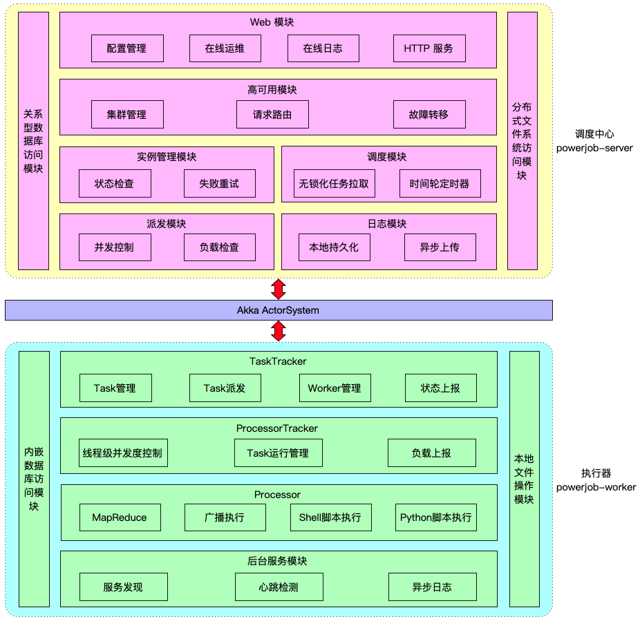

# PowerJob 技术综述，能领悟多少就看你下多少功夫了～
> 本文适合有 Java 基础知识的人群

作者：HelloGitHub-**Salieri**

HelloGitHub 推出的[《讲解开源项目》](https://github.com/HelloGitHub-Team/Article)系列。从本章开始，就正式进入 PowerJob 框架的技术剖析环节了。作为技术系列文章开篇的第一章，本文会讲述 PowerJob 整体的架构设计，同时介绍相关的技术，以便于后面的讲解。

> 项目地址：
>
> https://github.com/KFCFans/PowerJob

## 一、架构设计

前面说过，PowerJob 的设计目标是企业级的分布式任务调度框架，适合统一部署调度中心成为公司内部的任务调度中间件。因此，在架构设计时，不同于 QuartZ 这种自产自销一个 Jar 包搞定一切的模式，PowerJob 引入了调度中心来统一解决任务的配置和调度，具体的架构如下图所示：

由图可见，整个 PowerJob 系统由调度中心（powerjob-server）和执行器（powerjob-worker）构成。

调度中心是一个基于 SpringBoot 的 Web 应用，根据提供服务的对象可以划分为对外和对内两层。对外部分面向用户，即提供 HTTP 服务，允许开发者在前端界面上可视化得完成任务、工作流等信息的配置与管理；对内部分则负责完成开发者所录入任务的调度和派发，同时维护注册到本注册中心所有执行器集群的状态。

执行器是一个普通的 Jar 包，需要接入调度中心的应用依赖该 Jar 包并完成初始化后，powerjob-worker 便正式启动并提供服务。执行器的整体逻辑非常简单（复杂的是MapReduce、广播等高级处理任务的实现，敬请期待后面的文章），就是监听来自调度中心的任务执行请求，一旦接收到任务就开始分配资源、初始化执行器开始处理，同时维护着一组后台线程定期上报自身的健康状态、任务执行状态。

调度中心和执行器之间通过 akka-remote 进行通讯。调度中心可以多实例部署来进行水平扩展，提升调度性能的同时做到调度中心高可用，执行器也可以通过集群部署实现高可用，同时，如果开发者实现了 MapReduce 这一具有分布式处理能力的处理器，也可以调动整个集群的计算资源完成任务的分布式计算。

## 二、知识点概览

总体来讲，PowerJob 中主要涉及了以下的知识点，通过阅读源码和之后的一系列技术剖析文章，你将能学到：

- Java 基础：Java 8 新特性（Stream、Optional、Lambda、FunctionalInterface）
- Java 进阶：多线程与并发安全（线程池、并发容器、可重入锁、分段锁、ThreadLocal 等）、Java I/O（网络操作、文件流操作）、热加载（自定义类加载器、Jar包操作）
- Java Web：主要是 SpringBoot 相关的 Web 知识，包括基础 Controller 用法、WebSocket、文件上传下载、ControllerAdvice 全局处理异常、跨域 *CORS 等*
- Spring 相关：AOP（记录 Web 日志）、异步方法（@Async）、定时任务（@Scheduled）、自建容器（ClassPathXmlApplicationContext）、上下文使用（各种 Aware）
- 数据库：编写数据库无关的持久化层代码（Spring Data JPA）、数据库基础理论（各种SQL、索引用法等）、多数据源配置、MongoDB （GridFS）的使用
- 算法知识：图（DAG）、引用计数器（实现小型 GC）、分布式唯一 ID 算法（snowflake）、时间轮
- 分布式知识：远程通讯、集群高可用、服务发现、故障转移与恢复、分布式一致性、分布式锁（基于数据库实现可靠的分布式锁）
- 序列化相关：kryo、jackson-cbor、对象池技术
- Akka 基础：Actor 模型、akka-remote、akka-serialization

如果你是初学的萌新，通过本项目和本教程，相信你能更好地掌握 Java 相关的基础知识。

如果你是轻车熟路的老司机，通过本项目和本教程，相信你也会在分布式计算、任务调度等方面有所启发。

## 三、总结与预告

本章介绍了 PowerJob 整体的架构设计以及项目中所涉及的相关技术知识点。下一章，我将会为大家带来 PowerJob 的基石：Akka Toolkit 的介绍与使用教程。

那我们下期再见喽～预告：下期内容很干，需要带足水！