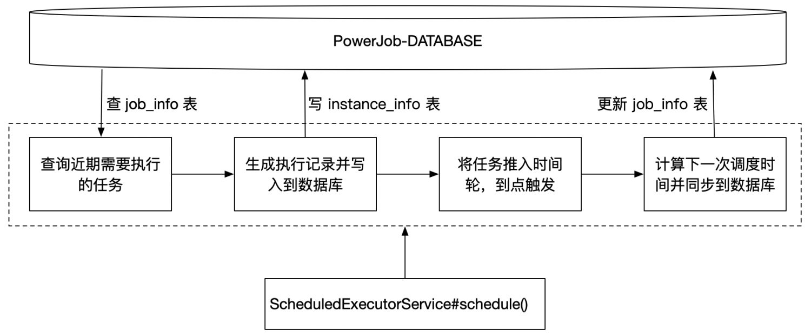
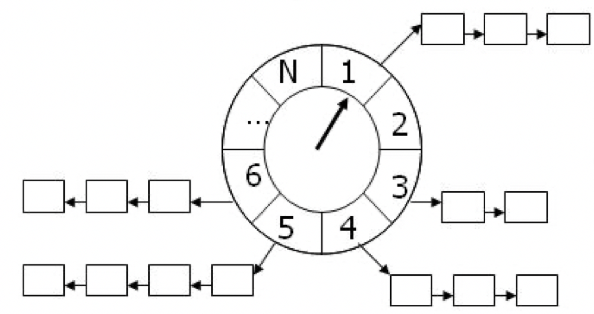
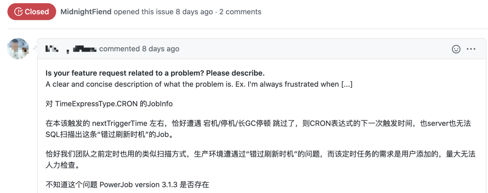

# 趣讲 PowerJob 超强大的调度层，开始表演真正的技术了
> 本文适合有 Java 基础知识的人群


作者：HelloGitHub-**Salieri**

HelloGitHub 推出的[《讲解开源项目》](https://github.com/HelloGitHub-Team/Article)系列。

> 写在前面的碎碎念：终于到了万众期待的调度层原理了。其实很早之前就想动笔把这部分好好给大家讲讲，因为问的人实在是太多了...大部分小伙伴进用户群的第一句话就是：“群猪，请问无锁化调度是怎么实现的？”，剩下的犀利点的小伙伴甚至直接问：“群猪，你这个性能强劲无上限体现在什么地方啊？”。

可惜不巧的是，鄙人在 7 月初给自己安排了一个惊险刺激的大西北旅游，每天不是在坐车就是在前往坐车的路上，虽然感受到了祖国疆域之辽阔、风景之秀丽、文化之璀璨，人累个半死也是确有其事。文章嘛，自然也就是一路鸽到了现在...

那么，是时候表演真正的技术了～

## 一、调度层概览

PowerJob 目前支持 4 种定时执行策略，分别是 CRON、固定频率、固定延迟 和 API。API 指的是通过 PowerJob 提供的客户端接口直接启动任务的方式，不需要 server 来支持调度，此处忽略。而剩下的 3 种调度策略，根据其执行频率的不同，可以划分为**常规任务**和**秒级任务**。我们先讲常规任务。

常规任务指由 CRON 表达式指定定时策略的任务，这一类任务的特点是 **执行频率不高。** 对于这类任务，PowerJob 采用基于数据库轮询的策略来进行调度，具体的原理图如下。



PowerJob 的任务表中，除了维护任务的基础元数据（如任务名称、定时策略、执行器信息等）之外，还会额外增加一个字段 **next_trigger_time**，也就是**下一次调度时间**，当任务被成功创建时，系统会使用 CRON 表达式去初始化该字段，保证每一个 CRON 任务都存在可用的**下一次调度时间**。

有了这个字段，具体的调度就好办了。powerjob-server 会启用一个后台线程定期扫描任务表，查找那些**由本机调度的**、即将执行（即下一次调度时间与当前时间的差值小于系统规定的阈值）的任务。

（这里埋个小小的伏笔，“由本机调度”其实是实现无锁化调度的关键，将在下一篇文章为大家揭秘，本文主要讲述调度流程，因此直接以单机为例）

一旦发现接下来的一段时间内有任务需要被调度执行，就会为这些任务生成执行记录并推入时间轮，最后完成任务的调度。

听起来似乎很平淡无奇的一个流程，存在着那些精彩的设计与实现呢？请听我细细分解～

## 二、高性能调度——时间轮

假如，现在给你一个任务，要求 2 秒后执行，你会怎么解决的？

最简单的方案，也就是利用休眠。1 秒后执行，那么我让当前线程 sleep 1 秒，不就达到目的了吗？没错，基于线程休眠的特性，可以用三行代码实现一个最简单的定时执行器，但是它的性能嘛...自然也是相当的拉垮...由于每一个任务都需要绑定一个单独的线程，当系统中存在大量任务时，这种方案消耗的资源极其庞大。

那么如何实现高效的调度呢？

也许，就和牛顿被苹果砸出万有引力引力一样，发明时间轮算法的大神，在为寻找高效调度方案而苦恼不已时，低头看了看自己的劳力士～觉得这个表如此的朴实无华的同时，似乎找到了那么一点点灵感～


根据前面分析，线程休眠型调度器之所以低效，是因为它需要用到大量的线程资源，这浪费了大量的 CPU 和内存资源。那么有没有办法来避免这个消耗呢？看着这个表，有人找到了答案。



时间轮是一种高效利用线程资源来进行批量化调度的一种调度模型。把大批量的调度任务全部都绑定到同一个的调度器（一个线程）上面，使用这一个调度器来进行所有任务的管理，触发以及运行，能够高效的管理各种延时任务，周期任务，通知任务等等。

时间轮的算法模型如上图所示，每个时间轮存在着 N 个槽，两个槽之间的间隔时间固定。每走一个时间间隔，指针就向前推进一格，然后开始处理当前槽内的所有任务。指针不断循环推进，直到时间轮中不存在任何任务。

当新增调度任务时，可根据任务的调度时间和当前时间计算出具体的时间槽。为了能以时间复杂度 O(1) 的代价将任务放入指定位置，需要时间槽具有随机访问的能力，为此该部分使用循环数组实现。每一个时间槽对应的任务队列长度不确定，且只需要提供顺序访问能力，为此任务队列使用单向链表实现。

每一个时间轮都有两个必备参数，时间间隔 tickDuration 和 刻度数量 ticksPerWheel。这两个参数也很好理解，时间间隔就是指针转动的频率，刻度数量就是这个表盘内任务槽的数量，拿现实中的手表来说，tickDuration 就是 1，ticksPerWheel 是 12。

讲了那么多理论，这里举个具体的例子来帮助大家理解时间轮（其实时间轮的概念非常好理解，具体的实现也不算很难，可以说是一种性价比超高的数据结构了～）

假如我现在有一个时间间隔为 1 秒，刻度数为 12 的时间轮，现在需要调度 3 个定时任务，分别在 1 秒、6 秒和 13 秒后执行，那么时间轮的工作流程是怎么样的呢？

首先，第一步是任务的插入。由于表盘的设计是环形数据，通过 `（预计执行时间 - 时间轮启动时间）% 刻度数` 这个公式便能算出该任务的插槽下标，即这些任务会分别被插入到 0、5 和 0 号槽对应的链表中。

完成任务的插入后，接下来就等着调度线程取出任务并执行了。调度线程通过休眠 tickDuration 的方式，循环读取下一个槽中链表中的任务并执行。由于链表中的任务可能不是本轮需要调度的（就比如 13 秒后执行的任务，其实是下一个调度周期才需要执行），需要额外对任务的预计执行时间做判断，只有符合要求的任务才会被调度执行，并从链表中移除。

这样就做到了 1 个线程完成大量任务的调度，兼备性能和效率。唯一的缺点是由于采取了 tickDuration，那么调度会存在着一定的误差。如果你对调度执行的时间精度要求极高，那时间轮可能不是你的菜，否则，还不赶紧抱走？

时间轮的概念讲完了，接下来回归框架本身。PowerJob 所使用的时间轮设计整体参考 Netty，并在一些地方做了定制化处理，比如由于 PowerJob 调度后执行任务有一定的开销（涉及数据库操作），因此除了指针线程，还额外引入了处理线程池来保证调度的精度。源码一共 326 行，有兴趣的话，快去看吧，类名都给你准备好啦！

```
com.github.kfcfans.powerjob.server.common.utils.timewheel.HashedWheelTimer
```

## 三、可靠调度——WAL

可靠调度也是大家广为关注的一个问题，甚至还有同学在 GitHub Issue 留言告诉我他们自研的调度系统在生产环境中遇到的不可靠调度问题：



那么 PowerJob 存在着错过调度的问题吗？**答案显然是否定的**。（作为一款一直强调极高可用性和稳定性的生产级调度中间件，要是这一点都做不到，那还有脸见人吗？

那么问题又来了，这，又是如何实现的呢？


不知道大家有没有听说过 **WAL（Write-Ahead Logging，预写式日志）**，这是主流关系型数据库（MS SQLServer、MySQL、Oracle）用来确保了事务原子性和持久性的关键技术。WAL 的核心思想是： **在数据写入到数据库之前，先写入到日志中。** 这样，在硬盘数据不损坏的情况下，预写式日志允许存储系统在崩溃后能够在日志的指导下恢复到崩溃前的状态，避免数据丢失。

PowerJob 为了实现任务的可靠调度，也借鉴了该思想。每一个任务被调度执行时，系统都会为其生成一条记录，这条记录包含了该任务实例（任务的一次运行叫任务实例）的预期调度时间。之后，PowerJob 会首先将该记录持久化到数据库中，只有持久化成功后，该任务才会被正式推入时间轮进行调度。

一旦这一台 server 宕机，任务没有被准时执行。其他 server 就能根据已经写入数据库中的任务实例记录将其恢复，做到可靠调度～

也就是说，只要你的系统中还有一台 powerjob-server 活着，就不会有缺失调度的情况。


## 四、秒级任务

> 说够了常规任务的调度，让我们来侃侃秒级任务～

秒级任务的特点是运行频率极高（吐槽：这不是废话吗），那么能不能用支持常规任务调度的这套方法来支撑秒级任务的调度呢？

首先是任务的获取。emmm...“一定时间间隔扫描任务表获取待执行任务”，这...等你获取到任务，黄花菜都凉了...这不中啊...没错，使用传统调度方案，第一步就挂了。（我想到了路途艰难，但没想到居然那么难！）


不过，比较聪明的同学可能想到了。既然秒级任务执行频率很高，那 server 获取这个任务后，可以将它保存起来，这样下一次调度就不需要单独查数据库了，而是选择内存遍历，要多快有多快，似乎就解决了这个问题。

然而，这种方式仍不完美。俗话说得好，物以稀为贵，秒级任务的执行频率那么高，在大部分情况下，其实失败个一两次也没什么关系，毕竟立即就会有下一个任务补上。因此，传统任务那一套为了可靠调度而生的机制并不适用于秒级任务，秒级任务使用了那套机制后，也会对数据库产生较大的冲击，导致 PowerJob 整体的性能大幅度下降。那么出路究竟在何方呢？

此时就不得不提解决计算机领域问题的终极神器了：分治。既然不强要求任务执行有非常高的可靠性，那么 powerjob-server 此时就可以放权了。

每一个秒级任务，都会直接被投递到集群中的某一台 powerjob-worker 上，由 powerjob-worker 全权负责执行。而 powerjob-server 此时只需要负责故障恢复即可。

这样一来，server 的压力进一步减轻，同时，由于秒级任务的调度与执行全部落在了 worker 身上，调度的精度也会上升（至少能省下通讯的网络延迟），可谓是一个完美至极的双赢方案。

## 五、最后
那么以上就是本篇文章全部的内容啦～

本篇文章讲述了 PowerJob 调度层的实现与其中一些精巧的设计。不过限于篇幅，整个调度层其实并没有完全呈现在大家眼前，目前还是犹抱琵琶半遮面的状态～大家最关心的多 server 下任务如何避免重复调度、多 server 如何实现水平的能力扩展本文都没有详细提及，只是简单说了几个字。具体的内容，就放在下一篇文章讲啦～提前剧透一下吧，核心就四个字：**分组隔离**。等不及的话，自己去代码中寻找答案吧，少年～

> 项目地址：
>
> https://github.com/KFCFans/PowerJob