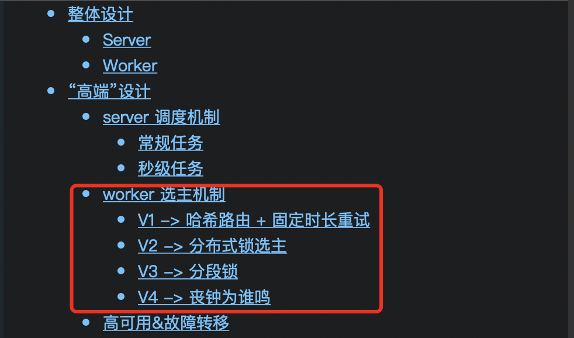
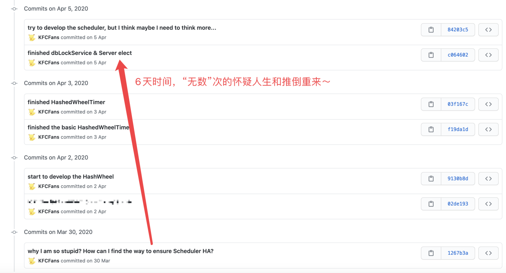

# PowerJob 的自实现高可用方案，妙妙妙！
> 本文适合有 Java 基础知识的人群

作者：HelloGitHub-**Salieri**

HelloGitHub 推出的[《讲解开源项目》](https://github.com/HelloGitHub-Team/Article)系列。

## 碎碎念

高可用放到今天已经不是一个新颖的词汇了，怎么实现高可用大家也已经了然于心。多实例部署 + 服务注册 + 服务发现这一套组合拳打下来，实现高可用那还不是分分钟的事情。所以很多人看到 PowerJob 的介绍页面中写了**任意组件支持集群部署以实现高可用**，想当然的以为也是走了上述的那套流程。然后看到系统依赖组件时，发现......emmm...... Zookeeper 呢？没看着。那找找 Nacos ？emmm......也没找着......不仅没找着，还发现文档中明明白白的写着，**最小依赖仅为关系型数据库**。许多用户看到这里就有点百思不得其解了，正常来讲都会有两个疑惑。

首先，为什么不用注册中心呢？

要做到分布式环境下的高可用，肯定是需要服务注册、服务发现这样的概念的。没有外部注册中心，说白了就是自己去实现了一套类似的机制。那为什么要怎么做呢？

其实答案很简单——成本。这个成本指的是用户的接入成本。对于一个需要部署的重型开源项目来说，每少一个外部依赖，就多一份潜在的用户。额外的系统依赖代表着额外的技术栈和额外的维护成本，如果企业本身没有这一套技术体系（比如没用到 zookeeper），而 PowerJob 又强依赖 zookeeper，那大概率只能说再见喽～

第一个问题解决了，接下来进入第二个问题～

## 简单高“可用”

PowerJob 系统中的基础组件为调度服务器 server 和执行器 worker，server 负责调度定时任务，并派发到 worker 执行，是一个典型的 C/S 架构。

C/S 架构下，如果目标是 server 和 client 可以相互联通的“高可用”，那么实现起来其实非常容易。

首先，启动多个 server 应用实例，集群部署。然后将多个 server 的 IP 地址统统填入 worker 的配置文件中，worker 启动时，随机找一个 IP 进行连接，失败则重试。一旦成功连接到某一台 server，就开始上报自己的地址信息。server 通过持有这个信息也可以和 worker 进行通讯。如此一来，一个最简单版本的“高可用”集群就搭建完成了。但是......它真的可用吗？

答案显然是否定的（否则也不会有这篇文章了是不是～）。以上方案主要存在两个问题：

1. 任务调度需要保证唯一性，即某个任务在某一个时刻只能被一台机器调度，否则就会导致重复执行。而前文提及的方案中，每一台 server 都是完全等价的，因此只能依靠分布式锁来保证唯一性，即抢到锁的 server 执行调度，其他 server 只能充当战地记者，默默地边缘 OB。这种方案下，无论部署多少台 server，系统整体的调度性能其实是固定的，多实例部署只能做到高可用，而不能做到高性能。
2. server 无法持有完整的 worker 集群信息。PowerJob 的定位是**任务调度中间件**，旨在为企业下各部门各业务线提供精准的调度和分布式计算能力。因此肯定会有集群分组的概念，就像 RocketMQ 中存在 ProducerGroup 和 ConsumerGroup 一样，PowerJob 有着 AppName 的概念。一个 AppName 逻辑上对应了某个应用下的一组任务，物理上对应了这个应用所部署的集群。为了便于 server 统一管理以及一些额外功能的实现（分布式计算），server 持有某一个 AppName 下完整的集群信息是一个强诉求，而前文提及的“瞎猫撞上死耗子”式方案，显然没办法做到这一点。

基于以上两点，征途是星辰大海的 PowerJob 需要探索出一种更合理、更强大的高可用架构。

## 分组隔离

其实根据前面遇到的问题，这一套机制的雏形也差不多出来了。

server 既然需要持有某一个分组下完整的集群信息，那么可以顺其自然的想到，能不能让某一个分组的所有 worker 都连接到某一台 server 呢？一旦某个分组下所有机器全部连接到了某一台 server，那么其实这就形成了一个小型的子系统。虽然整个 PowerJob 系统中存在着多台 server 和多个 worker 集群，但是对于这个分组的运行来说，只要有这个分组对应的 worker 集群以及它们连接的那一台 server 就够了。那么在这个小型“子系统”内部，只存在着一台 server，也就不存在重复调度问题了（server 只调度连接到它的 AppName 下面的任务就能实现这一点）。

所以，经过一层层的剥丝抽茧，问题已经转化为了：**如何让某个分组下的所有机器都连接到同一台 server 上去呢？**

看到这个问题的时候，相信很多人会有和我当时一样的想法，那就是：就这？

“让所有机器都连接到同一台 server 上去，那也太简单了吧，你只配置一个 IP 不就行了吗？”

“配置一个 IP 怎么做高可用，怎么利用多台 server 资源？”

“🤔好像有点道理，那就 hash(appName) 取余作为下标，这样就能保证同一个同一个分组下所有机器的初始 IP 相同，不同分组也能连接到不同的 server”

“那，万一连接的 server 挂了怎么办？”

“这好办，可以采取类似于解决哈希冲突的那个什么开放定址法，从挂掉的 server 下标开始，依次向后重试就行了，同一个分组集群内所有的机器都从某个下标依次向后重试，还是能连接到同一台 server 的”

“🤔好像很有道理，哼，worker 选主也就不过如此，方案搞定，英雄联盟 启动！”

正当我浴血奋战直指敌将首级时，画面...永远定格在了见血前的那一瞬。“正在尝试重新连接”几个大字映入眼帘，也把我带入了深深的沉思。

虽说每次玩游戏必骂腾讯那***的土豆服务器，但骂归骂，心里其实还是明白，大部分情况下都是自己网络波动导致游戏掉线（~~谁叫我贪便宜办了个移动宽带呢，哎，雷电法王杨永信也就图一乐，真要戒网瘾还得看移动宽带~~）。

嗯？自己的原因？网络波动？掉线？重连？这一连串词汇，把我拉回了刚刚设计的方案之中，然后给我当头一棒。一旦 worker 因为自己的网络波动导致它以为 server 不可用，而重新连接另一台 server，就会导致所有 worker 都连接同一台 server 这个约束被破坏......因此，这个方案自然也就是一个充满漏洞的不可行方案。

在这之后的一周，可以说是支离破碎的一周。为了解决这个问题，我设计了无数个堪称“奇珍异兽”的方案，然后再一个个否定和枪毙。

其实这段经历现在回过头来想特别搞笑，也有被自己蠢到。那无数个方案的失败原因其实都是同一个，也就是**出发点错了**。我一直在尝试让 worker 决定连接哪台 server，却一而再再而三忽略 worker 永远不可能获取 server 真正的存活信息（比如心跳无法传达，可能是 worker 本身的网络故障），因此 **worker 不应该决定连接哪台 server，这应该由 server 来决定。worker 能做的，只有服务发现**。想明白了这点，具体的方案也就应运而生了。

PS：这个方案的诞生，我大概付出了1斤脑细胞的代价（不得不说这个减肥方法还蛮好的）...脑细胞不能白死，尽管那些奇奇怪怪得方案没有活到正式版本，但没有他们就无法通往真理的大门。为了表达纪念和“哀悼”之情，我将最终的设计命名为——V4：丧钟为谁鸣。

## V4：丧钟为谁鸣

> 想明白了不能由 Worker 发起 Server 的重新选举，这个问题就基本上解决了......由于篇幅原因以及网上已经有小伙伴写了这一块源码分析的博客，我这里就不重复“造轮子”了，在这里主要讲一下设计思路。

就像前面说的那样，worker 因为没办法获取 server 的准确状态，所以不能由 worker 来决定连接哪一台 server。因此，worker 需要做的，只是**服务发现**。即定时使用 HTTP 请求任意一台 server，请求获取当前该分组（appName）对应的 server。

而 server 收到来自 worker 的服务发现请求后，其实就是进行了一场小型的分布式选主：server 依赖的数据库中存在着 server_info 表，其中记录了每一个分组（appName）所对应的 server 信息。如果该 server 发现表中存在记录，那就说明该 worker 集群中已经有别的 worker 事先请求 server 进行选举，那么此时只需要发送 PING 请求检测该 server 是否存活。如果发现该 server 存活，那么直接返回该 server 的信息作为该分组的 server。否则就完成篡位，将自己的信息写入数据库表中，成为该分组的 server。

细心的小伙伴可能又要问了？发送 PING 请求检测该 server 是否存活，不还是有和刚才一样的问题吗？请求不同，发送方和接收方都有可能出问题，凭什么认为是原先的 server 挂了呢？

确实，在这个方案下，依旧没办法解决 server 到底挂没挂这个堪比“真假美猴王”的玄学问题。但是，这还重要吗？我们的目标是某个分组下所有的 worker 都连接到同一台 server，因此，即便产生那种误打误撞篡位的情况，在服务发现机制的加持下，整个集群最终还是会连接到同一台 server，完美实现我们的需求。

至此，耗时 6 天，从原来的怀疑人生，到完美方案的落地实现，真是曲折～

## 最后
最后，贴上两位小伙伴贡献的源码分析文章，我亲自 check 过，没有质量问题（~~这话说的我感觉自己好飘哈哈哈~~），请各位观众老爷放心查看～

- [PowerJob源码分析-分组隔离设计](https://zhuanlan.zhihu.com/p/163487886)

- [PowerJob源码解读1：Server和Worker之间的通信解读](https://juejin.im/post/6854573208524800008)

那么以上就是本篇文章全部的内容了～相信通过这篇文章和上篇文章，大家已经对 PowerJob 的调度层和高可用高性能架构有了一定的了解了。接下来就是下期预告环节了～

为了保留神秘感，这次就选择不预告了（~~才不会告诉你是我还没想好具体写什么~~）～

所有惊喜，下期再见～

> 项目地址：
>
> https://github.com/KFCFans/PowerJob