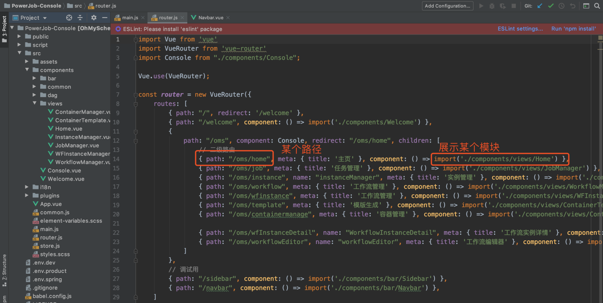
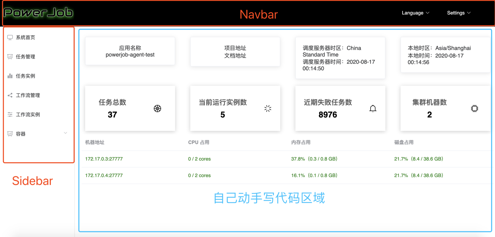

# 感谢 Vue.js 拯救我这个前端渣渣，让 PowerJob 有了管理后台界面

> 本文适合有 Java 基础知识的人群


作者：HelloGitHub-**Salieri**

HelloGitHub 推出的[《讲解开源项目》](https://github.com/HelloGitHub-Team/Article)系列。

对于大部分非前端程序员来说，写网页无疑是一件非常痛苦的时间。如果说 JavaScript 还属于能够勉强搏一搏的水平，那 HTML 无疑是那座无法逾越的大山。什么，你说你翻过 HTML 这座大山了？没想到吧，CSS 在天上正望着你呢。总而言之，对我来说，写前端页面一直以来都是令我头疼不已的事情，就不提 DOM 元素操作这种高端操作了，就一个最简单的文字水平加垂直居中，一百度都能搜出一堆千奇百怪各不相同的方法来。关键是，在我全部尝试以后，字，依旧没有出现在我预期的地方。不知道大家有没有经历过这种前端开发的绝望，反正作为过来人，我可是有倒不完的苦水呐！

看了上面这一大段话，如果你以为本文的主旨是吐槽前端的话，那你就大错特错了。曾经，我的前端世界一片黑暗，直到我遇见了 vue～

## 一、《记录 Vue.js》观后感

PowerJob 呢，是一个用 Java 写的任务调度中间件，自然用武之地也是在后端。而 vue 呢，是一个非常强大的前端框架。PowerJob 除了前端页面是用 vue 写的以外，看上去和 vue 没有任何交集（实际上呢也没什么交集）。而我之所以在这里单开一个章节净扯这些有的没的，也不纯是为了凑字数，主要还是借这个机会，写一篇观后感。

“观后感？这个人在说什么？最近写 bug 脑子写坏掉了吧～”


不知道大家有没有看过《记录 Vue.js》这部纪录片。作为一个非纪录片爱好者和非前端爱好者这样一个双非人员，我居然无比认真无比投入的看完了这部纪录片。

看这部纪录片的时候，PowerJob（OhMyScheduler） 的 1.0.0 版本刚发布不久，虽说 1.0.0 版本功能并没有现在那么丰富，稳定性和用户体验也没有现在那么好，但依旧可以说是比别的任务调度框架强上一截。所以，在正式发布之前，我常常会去幻想这个框架能够掀起的大风大浪，然后暗自窃喜，每天快乐得活在自己幻想出来的乌托邦里面，不亦乐乎。然而，正式发布后别说风浪了，连涟漪都没有。仿佛这件事从来没有发生过。

所以在那一段时光，我其实还是蛮丧的。之前幻想的有多美好，现实带来的反差感就越强烈。也是在这样的环境下，我偶然得知 vue 有一部纪录片，讲述了 vue 诞生至今的故事。

当然，我并没有直接去看，毕竟我是“双非”人士，一般情况是对这种东西提不起兴趣的。但不知怎么的，我最后还是打开了（YouTube 发现是英文的然后打开了 ）bilibili。

我想，我可能是为了寻找心理平衡而准备去看这个视频的。毕竟即便是我，也知道 vue 起源于尤大大的个人项目。那既然是个人项目，是不是也会有我这样的窘境嘞～要是全球闻名的前端框架起步阶段都有我这种伯乐难寻的烦恼，那我还烦恼个啥呢～

然而，我想要寻找的东西并没有找到。Vue 发布初期，就取得了不小的关注度，也迅速在 GitHub 上积累了一群小用户。而我...emmmm，不过，虽然心理慰藉没找到，但看完整个视频，我找到了动力。


最后，贴一段尤大大的结束语来结束本章节：

> 我下定决心离开了朝九晚五的岗位，做着一件基本能让我热情投入的工作，这确实挺让我感到自豪的。有时候我会看看统计数据，比如看下我们有多少用户，多少下载量之类的。但要说什么最能给我对工作的某种成就感，或者说满足感的话，那还是当我看到（自己所影响的）人的时候。尤其是在会议结束以后，很多人会来找我。比如大家经常会跟我握手，说「谢谢 Evan 你做的东西，它真的让我的生活方便了很多」这样子。这些时候我都会感觉到，这就是我做 Vue 的动力。我把它做了出来，我把它分享给了大家，希望它能让大家生活更方便。然后还真的会有人来单独找我，会有人来感谢我所做到的事情。于是整个循环就这样连通起来了。

## 二、双剑合璧：vue + element-ui

> 讲完了故事，讲“技术”。

对于后台管理类型的前端项目，说白了其实就那几个功能（侧边导航栏、顶部导航栏、表单、表哥、输入框、按钮等），因此选择一款好的模版组件能让开发效率大大大大大大提升。比如，用了 element-ui 以后，我就从写代码转变成了**拷代码**，可以说是很愉悦了～

废话环节结束，下面就让我们进入 vue + element-ui 构成的不一样的前端世界～

### 2.1 新建项目

首先，后台管理网站虽然简单，但好歹也是个前端项目。因此，不能再用小白最爱的新建 html 文件打开方式了。而是需要先初始化一个完整的前端项目，好在 vue 为我们提供了完整的工具包，只需要运行命令：

```
vue create powerjob-console
```

根据提示选择指定的配置就能生成完整的 vue 工程。命令行运行结束后，cd 进去创建的工程，运行本地调试命令 npm run serve 即可看到你的第一个 vue 网页服务了～

### 2.2 引入 element-ui

element-ui 的官方标语是“Element，一套为开发者、**设计师**和**产品经理**准备的基于Vue 2.0 的桌面端组件库”。可见其使用有多简单～element-ui提供了大量的常用模版，同时每一个模版下面都携带了大量的代码实例，是一个真·只需要复制黏贴改几个参数就能用的组件库。那还等什么，安装啊～

element-ui 为 vue-cli 准备了专用的插件，安装也十分简单，只需要进入项目目录，执行

```
vue add element
```

等待进度条走完之后，element-ui 就安装完毕了～

### 2.3 安装插件

至此，项目主体初始化完毕，理论上可以正式开始开发了。然而，此时面对一个原始的 vue 工程，我等前端小白还是难以下手。因此这个时候就要各种功能强大的框架出马进一步降低我们的开发成本了，以下列举一些我常用的（应该也是大家常用的）插件供大家参考：

- axios：网络请求库，简化网络操作
- vue-router：vue 的路由插件，用于构建单页面 web 程序
- vuex：中心化状态管理方案，我主要用来存储一些公共数据

插件的安装是一条 npm 通用名称，格式为 npm install 插件名称 --save。--save 参数才会把模块写入到 packages.json，当换个环境运行 npm install 时就会自动安装，否则还需重新安装该插件。

### 2.4 依葫芦画瓢

到这里，前置开发准备可以说是全部完成了，接下来就正式进入开发环节。在这里，我推荐使用的方法是在 GitHub 找一个现成的项目工程（比如 PowerJob-Console）照着改。对于一个后台管理项目来说，网页的布局是固定的，整体风格也是类似的，具体的组件也几乎都是重合的，因此很容易上手和修改。拿 PowerJob-Console 来说，需要重点关注的其实就4个文件，分别是：main.js、router.js、Navbar.vue 和 Sidebar.vue。

main.js 主要完成各个插件的初始化，要改的东西不多，无非就是 baseURL、请求拦截等看一眼就知道这里要改的内容。

router.js 则定义了单页面下的跳转规则，里面的东西虽然看不懂，但结合 Sidebar.vue 一起看，就知道要怎么改了～这...大概就是复制黏贴的快乐吧。



Navbar.vue 和 Sidebar.vue 可以直接拷贝过来，里面的东西也是看一眼就知道怎么改的那种。

经过这一阵折腾，你已经有了如下样式的通用后台，只需要完成具体页面的开发即可～而具体的页面嘛...无非就是表单什么的，打开 element-ui 官网，你就明白了什么是真正的**面向复制编程**～




好了，这就是本文的全部内容了。本周对我来说是动荡的一周......大部分时间都在处理线上问题，因此本文行文仓促，还请大家多多包涵～

下一期，可能会给大家带来 MapReduce 处理器的原理剖析（核心科技了解一下），当然也可能是～其他～～～

“什么？你说我讲了半天，vue 相关的知识一点都没讲？”

“什么？vue 相关的知识还要讲？看一遍文档就能写了。对小白，就是那么友好～”

> 项目地址：
>
> https://github.com/KFCFans/PowerJob