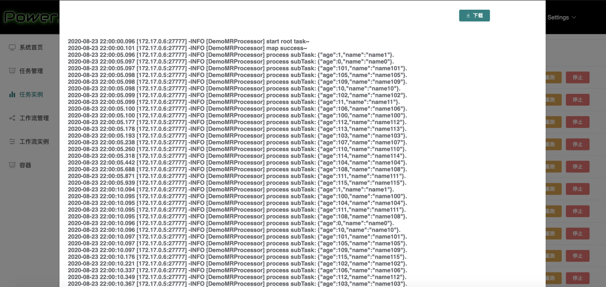
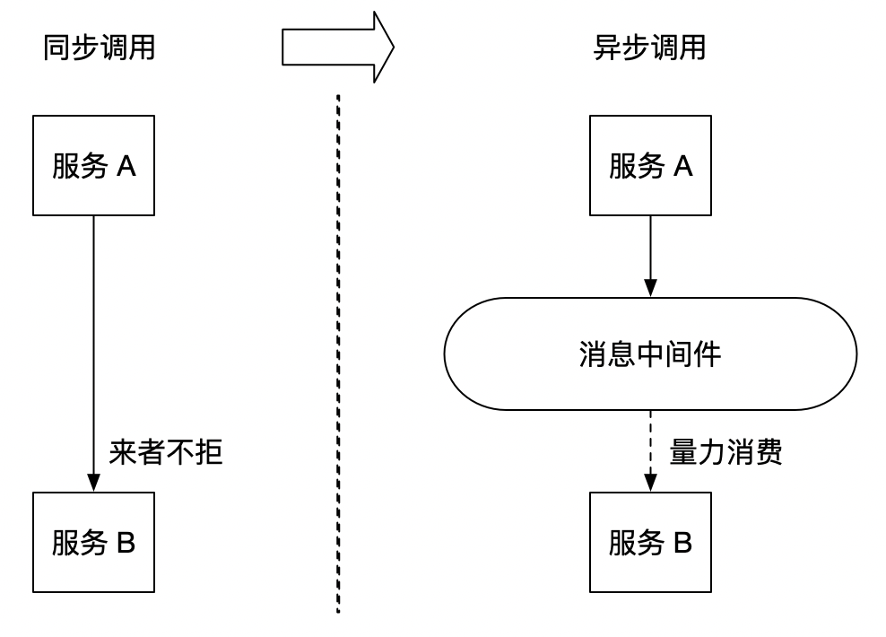

# PowerJob 在线日志饱受好评的秘诀：小但实用的分布式日志系统

> 本文适合有 Java 基础知识的人群


作者：HelloGitHub-**Salieri**

HelloGitHub 推出的[《讲解开源项目》](https://github.com/HelloGitHub-Team/Article)系列。

> 项目地址：
>
> https://github.com/KFCFans/PowerJob

PowerJob 的在线日志一直是饱受好评的一个功能，它能在前端界面实时展示开发者在任务处理过程中输出的日志，帮助开发者更好的监控任务的执行情况。其功能展示如下图所示（前端界面略丑，请自动忽略～）。



在线日志这个功能，乍一听很简单，无非 worker 向 server 发日志数据，server 接受后前端展示。但对于 PowerJob 这种任意节点都支持分布式部署且支持分布式计算的系统来说，还是存在着不少难点的，简单来说，有以下几点：

1. 多对多问题：在 PowerJob 的理想部署模式中，会存在多个 server 和多个 worker，当某个任务开始分布式计算时，其日志散布于各台机器上，要想在前端统一展示，需要有收集器将分散的日志汇集到一起。
2. 并发问题：当 worker 集群规模较大时，一旦执行分布式计算任务，其产生的日志 QPS 也是一个不小的数目，要想轻松支持百万量级的分布式任务，需要解决并发情况下 QPS 过高的问题。
3. 排序问题：分布式计算时，日志散布在不同机器，即便收集汇总到同一台机器，由于网络延迟等原因，不能保证日志的有序性，而日志按时间排序是强需求（否则根本没法看啊...），因此，还需要解决大规模日志数据的排序问题。
4. 数据的存储问题：当日志数据量非常大时，如何高效的存储和读取这一批数据，也是需要解决的问题。

因此，为了完美实现在线日志功能，PowerJob 在内部实现了一个麻雀虽小五脏俱全的**分布式日志系统**。话不多说，下面正式开始逐一分析～

## 一、多对多问题

这个问题，其实在 PowerJob 解决多 worker 多 server 的选主问题时顺带着解决了。简单来说，PowerJob 系统中，某一个分组下的所有 worker，在运行时都只会连接到某一台 server。因此，日志数据上报时，选择当前 worker 进行上报即可。由于任务不可能跨分组执行，因此某个任务在运行过程中产生的所有日志数据都会上报给该分组当前连接的 server，这样就做到了日志的收集，即日志会汇总到负责当前分组调度的 powerjob-server，由该 server 统一处理。

## 二、并发问题

并发问题的解决也不难。

大家一定都听说过消息中间件，也知道消息中间件的一大功能为削峰。引入消息中间件后，把原来同步式的调用转化为异步的间接推送，中间通过一个队列在一端承接瞬时的流量洪峰，在另一端平滑地将消息推送出去。消息中间件就像水库一样，拦蓄上游的洪水，削减进入下游河道的洪峰流量，从而达到减免洪水灾害的目的。



PowerJob 在处理日志的高并发问题时也采用了类似的方式，通过引入本地队列，对需要发送给 server 的消息进行缓存，再定时将消息批量发送给 server，化同步为异步，并引入批量发送的机制，充分利用每一次数据传输的机会发送尽可能多的数据，从而降低对 server 的冲击。

## 三、排序问题

### 3.1 日志的存储

将排序问题之前，先来聊一聊 server 怎么处理接收到的日志数据，也就是如何**存储**日志。

这个抉择其实并不难，用一下简单的排除法就能获取正确答案：

1. 存内部还是存外部？PowerJob 作为任务调度中间件，最小依赖一直是需要牢牢把控的指导思想。因此，在已知最小依赖仅为数据库的情况下，似乎不太可能使用外部的存储介质，至少不能把收到的日志直接发送到外部存储介质，否则又是一波庞大的 QPS，会对依赖的外部组件有非常高的性能要求，不符合框架设计原则。因此，在线日志的第一级存储介质应该由 server 本身来承担。
2. 存内存还是磁盘？既然确定了由 server 来存储原始数据，那么就面临内存和磁盘二选一的问题了。但，这还用选吗？成百上千万的文本数据存内存，这不妥妥的 OutOfMemory 吗？显然，存磁盘。

经过一波简单的排除法，日志的一级存储方案确定了：server 的本机磁盘。那么，存磁盘会带来什么问题呢？

且不说文件操作的复杂性和难度，一个最简单的需求就能让这个方案跌入万丈深渊，那就是：排序。

众所周知，日志必须按时间排序，否则根本没法看。而 PowerJob 又是一个纯粹的分布式系统，显然不可能指望所有的日志数据按顺序发到 server，因此对日志的再排序是一件必须要做的事情。但让我们来考虑一下难度。

- 首先，日志是纯文本数据，要想做排序，首先要将整个日志文件变为一堆日志记录，即分行。
- 其次，分完行后，由于日志是给人看的，时间肯定已经被转化为 yyyy-MM-dd HH:mm:ss.SSS 这种方便人阅读的格式，那么将它反解析回可排序的时间戳又是一件麻烦事。
- 最后，也是最终 BOSS，就是排序了。要知道，之所以会选择磁盘存储这个方案，是因为没有足够的内存。这也就意味着，这个排序没办法在内存完成。外部排序的难度和效率，想必不用我多说了吧。同时，我也相信，大部分程序员（包括我在内）应该从来没有接触过外部排序，这趟浑水，我又何必去趟呢？


### 3.2 H2 数据库简介

那么，有没有什么既能使用磁盘做存储，又有排序能力的框架/软件呢？世上会有这等好事吗？你别说，还真有。而且是远在天边，近在眼前，可以说是和程序员形影不离的一样东西——数据库。

“等等，你刚才不是说，不拿数据库作为一级存储介质吗？怎么滴，出尔反尔？”

“哼，年轻人。此数据库非彼数据库，这个数据库啊，是 powerjob-server 内置的嵌入式数据库 H2”

H2 是一个用 Java 开发的嵌入式数据库，它本身只是一个类库，即只有一个 jar 文件，可以直接嵌入到应用项目中。嵌入式模式下，应用在 JVM 中启动 H2 数据库并通过 JDBC 连接。该模式同时支持数据持久化和内存两种方式。

H2 的使用很简单，在项目中引入依赖后，便会自动随 JVM 启动，应用可以通过 JDBC URL 进行连接，并在 JDBC URL 中指定所使用的模式，比如对于 powerjob-server 来说，需要使用嵌入式磁盘持久化模式，因此使用以下 JDBC URL 进行连接：

```
jdbc:h2:file:~/powerjob-server/powerjob_server_db
```

同时，H2 支持相当标准的 SQL 规范，也和 Spring Data Jpa、MyBatis 等 ORM 框架完美兼容，因此使用非常方便。在 powerjob-server 中，我便通过 Spring Data Jpa 来使用 H2，用户体验非常友好（当然，多数据源的配置很不友好！）。

综上，有了内置的 H2 数据库，日志的存储和排序也就不再是难以解决的问题了～

### 3.3 存储与排序

引入 H2 之后，powerjob-server 处理在线日志的流程如下：

1. 接收来自 worker 的日志数据，直接写入内嵌数据库 H2 中
2. 在线调用时，通过 SQL 查询语句的 order by log_time 功能，完成日志的排序和输出

可见，合适的技术选型能让问题的解决简单很多～

## 四、一些其他的优化

以上介绍了 PowerJob 分布式日志组件的核心原理和实现，当然，在实际使用中，还引入了许多优化，限于篇幅，这里简单提一下，有兴趣的同学可以自己去看源码～

- 高频率在线访问降压：如果每次用户查看日志，都需要从数据库中查询并输出，这个效率和速度都会非常慢。毕竟当数据量达到一定程度时，光是磁盘 I/O 就得花去不少时间。因此，powerjob-server 会为每次查询生成缓存文件，一定时间范围内的日志查询，会通过文件缓存直接返回，而不是每次都走 DB 查询方案。
- 日志分页：成百上千万条数据的背后，生成的文件大小也以及远远高于正常网络带宽所能轻松承载的范围了。因此，为了在前端控制台快速显示在线日志，需要引入分页功能，一次显示部分日志数据。这也是一项较为复杂的文件操作。
- 远程存储：所有日志都存在 server 本地显然不符合高可用的设计目标，毕竟换一台 server 就意味着所有的日志数据都丢了，因此 PowerJob 引入了 mongoDB 作为日志的持久化存储介质。mongodb 支持用户直接使用其底层的分布式文件系统 GridFS，经过我仔细的考量，认为这是一个可接受且较为强大的扩展依赖，因此选择引入。

## 五、最后
好了，本期的内容就到这里结束了，下一期，我将会大家讲述 PowerJob 作为一个各个节点时刻需要进行通讯的框架，底层序列化框架该如何选择，具体的序列化方案又该如何设计～

那么我们下期再见喽～