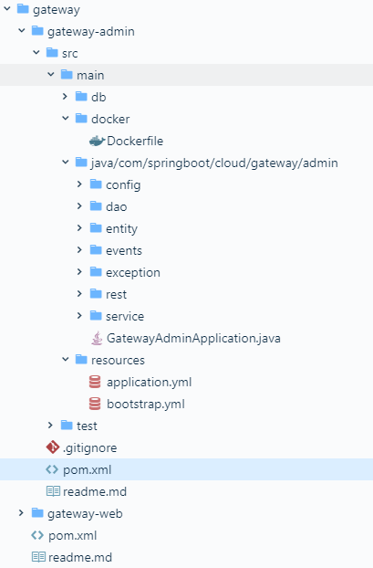
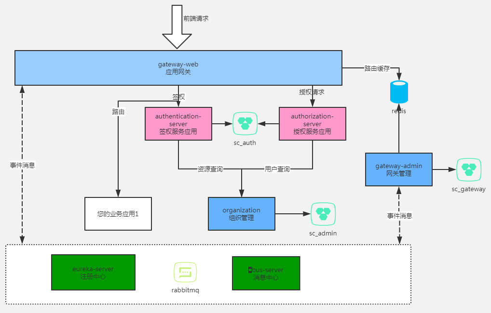
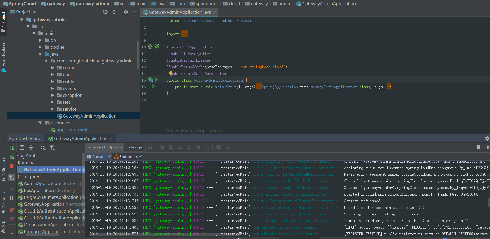
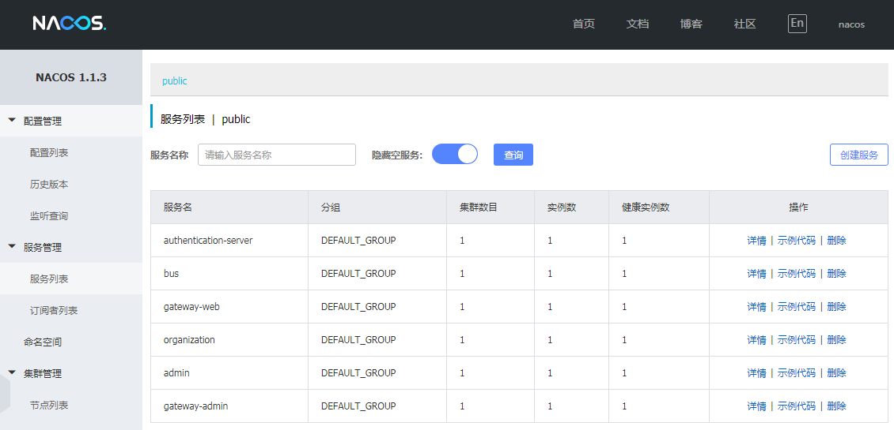
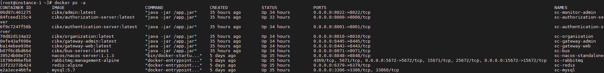
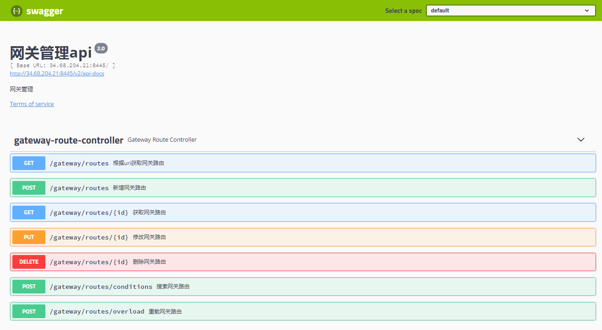

# 快速搭建 SpringCloud 微服务开发环境的脚手架

> 本文适合有 SpringBoot 和 SpringCloud 基础知识的人群，跟着本文可使用和快速搭建 SpringCloud 项目。


<p align="center">本文作者：HelloGitHub-<strong>秦人</strong></p>

HelloGitHub 推出的[《讲解开源项目》](https://github.com/HelloGitHub-Team/Article)系列，今天给大家带来一款基于 SpringCloud2.1 的微服务开发脚手开源项目——**SpringCloud**

> 项目源码地址：https://github.com/zhoutaoo/SpringCloud

## 一、微服务的简介

微服务是可以独立部署、水平扩展、独立访问的服务单元。Java 中常见最小的微服务单元就是基于 SpringBoot 框架的一个独立项目。一个微服务只做一件事（单一职责），多个微服务组合才能称之为一个完整的项目或产品。那么多个微服务的就需要来管理，而 SpringCloud 就是统筹这些微服务的大管家。它是一系列有序框架的集合，简单易懂、易部署易维护的分布式系统开发工具包。

今天介绍的开源项目就是基于 SpringCloud2.1 的脚手架，让项目开发快速进入业务开发，而不需过多时间花费在架构搭建上，下面就让我们一起来看看这个项目的使用吧。

## 二、项目结构

这里以一个网关（gateway-admin）微服务来说明。

项目目录结构如下图：

    

目录说明：

1. db：项目初始化数据库脚本。
2. docker：Docker 配置文件目录，将微服务打包为 docker 镜像（image）。
3. config：项目配置信息目录，包括数据库配置，消息转化配置等。
4. dao：数据库操作目录，主要对底层数据进行增删查改。
5. entity：项目实体类目录。
6. events：事件处理目录。
7. exception：异常处理目录，通过面向切面处理全局异常。
8. rest：微服务控制器目录，也就是对外提供的接口。
9. service：微服务业务层目录。
10. GatewayAdminApplication：微服务 SpringBoot 入口类。
11. resources：项目配置文件目录。
12. test：项目单元测试目录。
13. pom.xml：maven 项目对象模型文件。

## 三、实战操作

### 3.1 前提

- 确保本地安装 Git、Java8、Maven。
- 懂一些 SpringMVC 的知识，因为 SpringBoot 是基于 SpringMVC 演化而来的。
- 懂一些应用容器引擎 Docker、Docker-compose 的知识。

### 3.2 微服务架构说明

一个完整的项目，微服务架构一般包括下面这些服务：

- 注册中心（常用的框架 Nacos、Eureka）
- 统一网关（常用的框架 Gateway、Zuul）
- 认证中心（常用技术实现方案 Jwt、OAuth）
- 分布式事务（常用的框架 Txlcn、Seata）
- 文件服务
- 业务服务



### 3.3 运行项目

下面介绍了三种运行的方式：

#### 第一种：一键运行

Linux 和 Mac 系统下可在项目根目录下执行 `./install.sh` 快速搭建开发环境。 


#### 第二种：本地环境运行

> **不推荐此方法**，但还是简单介绍下。

1. 基础环境安装：mysql、redis，rabbitmq 

2. 环境运行：
    ```bash
    git clone https://github.com/zhoutaoo/SpringCloud.git #克隆项目
    ```

3. 安装认证公共包到本地 maven 仓库，执行如下命令：
    ```bash
    cd common
    mvn clean install #安装认证公共包到本地 maven 仓库
    ```

4. 安装注册中心 Nacos
    - 下载 [Nacos](https://github.com/alibaba/nacos/releases)
    - 执行如下命令：
      ```bash
      unzip nacos-server-0.9.0.zip  OR tar -xvf nacos-server-0.9.0.tar.gz
      cd nacos/bin
      bash startup.sh -m standalone # Linux 启动命令
      cmd startup.cmd # Windows 启动命令
      ```

5. 运行网关服务、认证服务、业务服务等

这里以网关服务为例：执行 `GatewayAdminApplication.java`



**注意**：认证服务（auth）、网关服务（gateway）、组织管理服务（sysadmin）需要执行数据库初始化脚本。

可通过 swager 接口：http://localhost:8445/swagger-ui.html 测试是否搭建成功，如果能正常访问表示服务启动成功。

**说明：**

- application.yml 文件主要配置 rabbitmq，redis， mysql 的连接信息。
  ```bash
  spring:
    rabbitmq:
      host: ${RABBIT_MQ_HOST:localhost}
      port: ${RABBIT_MQ_PORT:5672}
      username: ${RABBIT_MQ_USERNAME:guest}
      password: ${RABBIT_MQ_PASSWORD:guest}
    redis:
      host: ${REDIS_HOST:localhost}
      port: ${REDIS_PORT:6379}
      #password: ${REDIS_PASSWORD:}
      lettuce:
        pool:
          max-active: 300

    datasource:
      driver-class-name: com.mysql.jdbc.Driver
      url: jdbc:${DATASOURCE_DBTYPE:mysql}://${DATASOURCE_HOST:localhost}:${DATASOURCE_PORT:3306}/sc_gateway?characterEncoding=UTF-8&useUnicode=true&useSSL=false
      username: ${DATASOURCE_USERNAME:root}
      password: ${DATASOURCE_PASSWORD:root123}
  ```

- bootstrap.yml 文件主要配置服务基本信息（端口，服务名称），注册中心地址等。
  ```bash
  server:
    port: ${SERVER_PORT:8445}
  spring:
    application:
      name: gateway-admin
    cloud:
      nacos:
        discovery:
          server-addr: ${REGISTER_HOST:localhost}:${REGISTER_PORT:8848}
        config:
          server-addr: ${REGISTER_HOST:localhost}:${REGISTER_PORT:8848}
          file-extension: yml
      sentinel:
        transport:
          dashboard: ${SENTINEL_DASHBOARD_HOST:localhost}:${SENTINEL_DASHBOARD_PORT:8021}
  ```

#### 第三种：Docker 环境运行

1. 基础环境安装
    - 通过 docker 命令安装
      ```bash
      # 安装redis
      docker run -p 6379:6379 --name redis -d docker.io/redis:latest --requirepass "123456" 
      # 安装mysql
      docker run --name mysql5.7 -p 3306:3306 -e MYSQL_ROOT_PASSWORD=root123 -d docker.io/mysql:5.7
      # 安装rabbitmq 
      docker run -d -p 15672:15672 -p 5672:5672 -e RABBITMQ_DEFAULT_USER=admin -e RABBITMQ_DEFAULT_PASS=admin --name rabbitmq docker.io/rabbitmq:latest
      ```

    - 也可以通过 docker-compose 命令安装
      ```bash
      cd docker-compose
      docker-compose up -d  #docker-compose 安装mysql，redis，rabbitmq 服务
      ```

2. 下载项目到本地
    ```bash
    git clone https://github.com/zhoutaoo/SpringCloud.git #克隆项目
    ```

3. 安装认证公共包到本地 maven 仓库执行如下命令：
    ```bash
    cd common && mvn install #安装认证公共包到本地maven仓库
    ```

4. docker-compose 运行 Nacos
    ```bash
    cd docker-compose
    docker-compose -f docker-compose.yml -f docker-compose.nacos.yml up -d nacos #启动注册中心
    ```

5. 构建消息中心镜像
    ```bash
    cd ./center/bus
    mvn package && mvn docker:build
    cd docker-compose
    #启动消息中心
    docker-compose -f docker-compose.yml -f docker-compose.center.yml up -d bus-server
    ```

需要构建镜像的其他服务有：（注：操作和消息中心镜像构建方式类似）

- 网关管理服务 （gateway-admin、gateway-web）

- 组织服务（sysadmin/organization）

- 认证服务 （auth/authentication-server）

- 授权服务（auth authorization-server）

- 管理台服务（monitor/admin）


#### 3.4 运行效果

**Nacos 服务中心**

所有服务都正常启动，在 nacos 管理中心可查看，实例数表示运行此服务的个数，值为 1 可以理解为服务正常启动。



**查看后台服务**

命令行执行：`docker ps -a` 查看 docker 所有进程信息 



通过访问微服务对外暴露的接口（swagger）检测服务是否可用。

swager 接口地址：http://IP:port/swagger-ui.html

测试如下图：




## 四、最后

微服务（SpringBoot、SpringCloud、Docker）现在吵得特别火，它并不是一门新的技术，而是在老技术的基础上衍生出来的，增加了一些新的特性。

教程至此，你应该能够通过 SpringCloud 这项目快速搭建微服务了。那么就可以开始你的微服务学习之旅了，是时候更新一下自己的技能树了，让我们一起来学习微服务吧！

## 五、参考资料

- [本地安装 Nacos](https://nacos.io/en-us/docs/quick-start.html)

- [nacos注册中心的使用](https://my.oschina.net/u/726964/blog/2989480)

- [docker-compose教程](https://blog.csdn.net/pushiqiang/article/details/78682323)

- [Docker技术](https://blog.csdn.net/qq_43371556/article/details/102631158)

