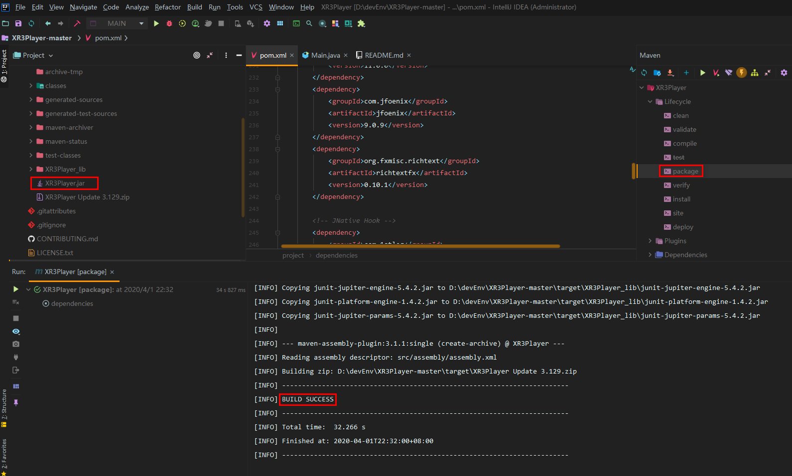
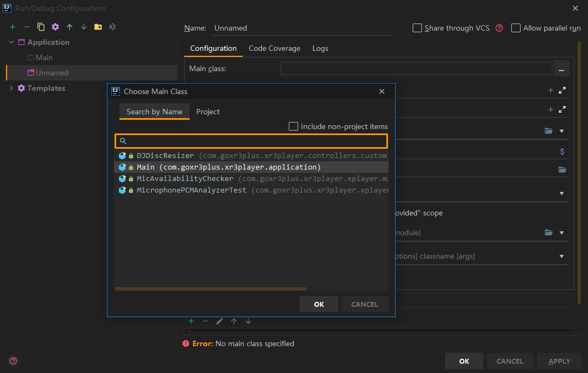
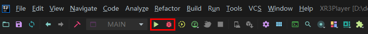
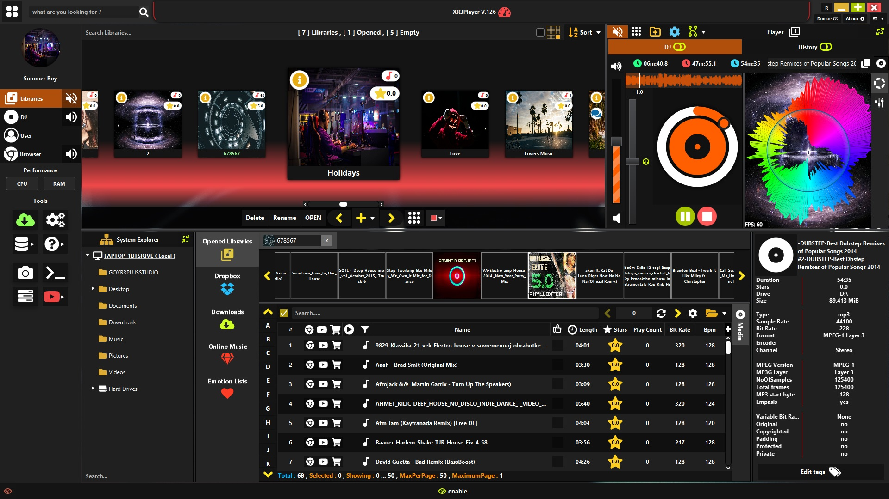
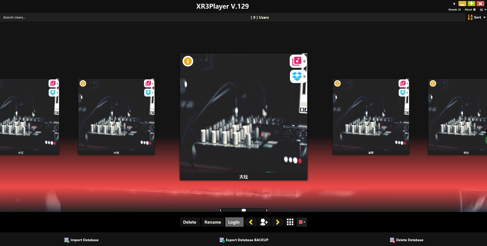
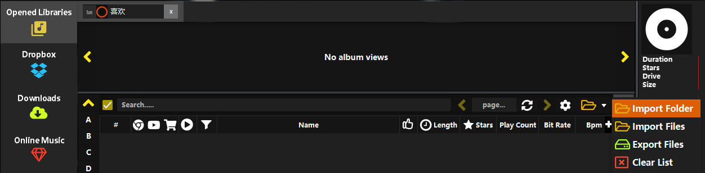
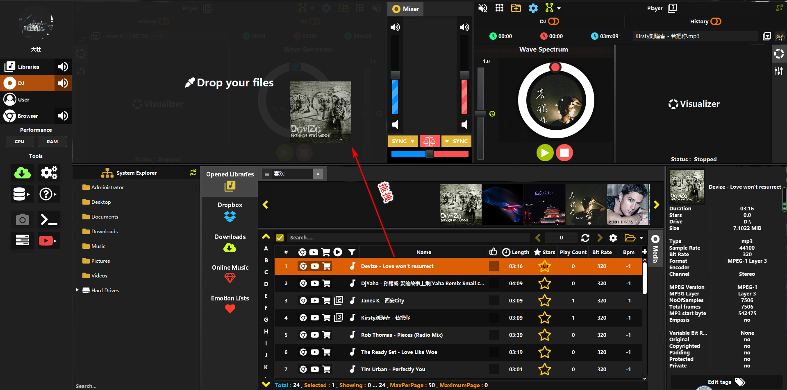
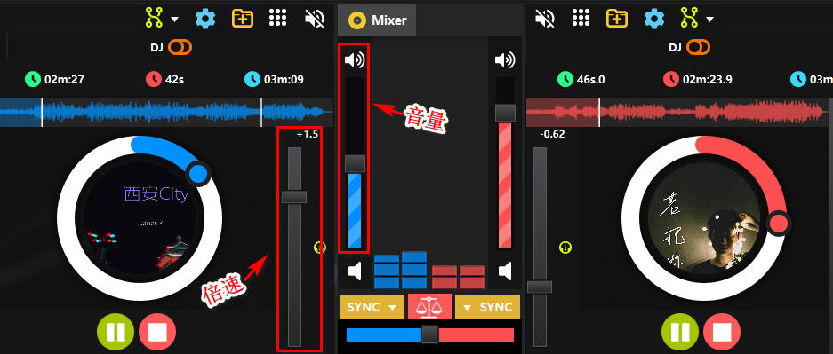
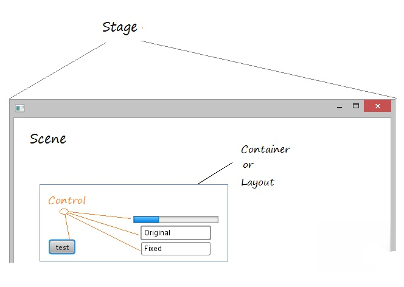
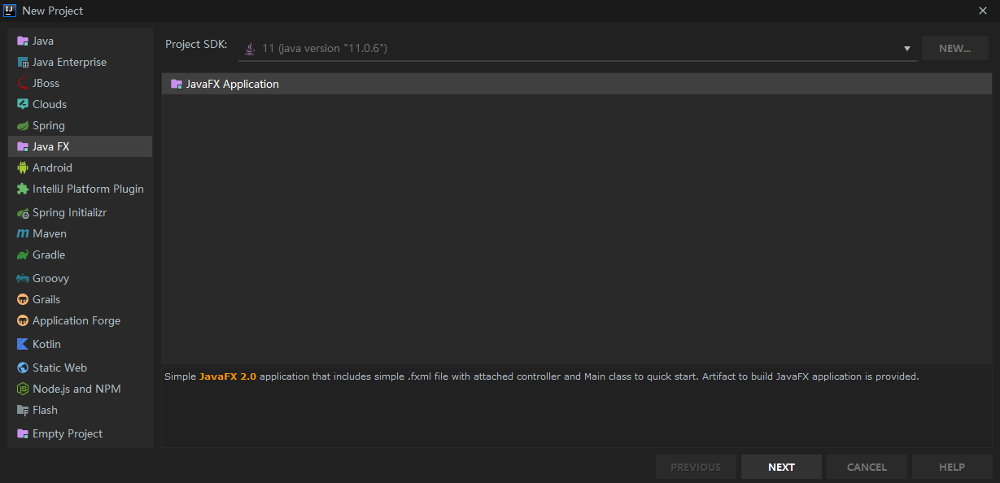

# 有了这个开源 Java 项目，开发出炫酷的小游戏好像不难？

> 本文适合有 Java 基础知识的人群，跟着本文可学习和运行 `Java` 版桌面`DJ`音乐播放器。


<p align="center">本文作者：HelloGitHub-<strong>秦人</strong></p>

HelloGitHub 推出的[《讲解开源项目》](https://github.com/HelloGitHub-Team/Article)系列，今天给大家带来一款开源 Java 版桌面 `DJ` 音乐播放器项目—— [XR3Player](https://github.com/goxr3plus/XR3Player)，它强大的功能和炫酷的展示效果，你肯定会喜欢上它的！ 

> 项目源码地址：https://github.com/goxr3plus/XR3Player


## 一、项目介绍
OpenJFX 是一个开源的下一代客户端应用程序平台，适用于基于 Java 构建的桌面、移动和嵌入式系统。
本篇我们就重点讲一下一款 `Java` 版桌面`DJ`音乐播放器，先看运行效果吧！

也可以直接下载音乐播放器安装包，[下载地址](https://xr3player.netlify.com/)<br/>
更多`Java` 桌面程序可以从这里获取：[openjfx.io](https://openjfx.io/)

## 二、运行项目

### 2.1 前提

- 安装 Jdk11.2 或者更高版本，全称 Java Development Kit，它是 Java 的库函数，是编译、运行 Java 程序的工具包。
- 安装 Maven3 环境，进行项目构建和项目依赖包管理。
- 本地安装开发工具 IntelliJ IDEA。
- 本地安装 `GitBash` 工具，主要用于下载项目。

### 2.2 下载项目

下载项目到本地，使用`GitBash` 工具，执行如下命令：

```bash
git clone https://github.com/goxr3plus/XR3Player.git

```
将项目导入 `Idea` ,Maven会自动下载所需的依赖。等待几分钟后项目依赖包都可以下载下来。使用 `Idea` 自带的 Maven 构建工具，就可以将项目轻松打包。如下图：


**注意**
项目有一个依赖 `jxbrowser-win64` 可能会下载失败，这个 `jar` 竟然有40Mb,建议手动下载后导入项目依赖。[jxbrowser-win64下载地址](https://jxbrowser.support.teamdev.com/support/discussions/topics/9000054587)


### 2.3 运行项目

**创建入口类**

打开`Run/Debug Configurations` 创建一个 `Application` ,并选择入口类，如下图：


**VM options设置**

`VM options` 添加下面配置参数,然后点击保存即可。

```bash
--add-exports
javafx.controls/com.sun.javafx.scene.control.behavior=com.jfoenix
--add-exports
javafx.controls/com.sun.javafx.scene.control=com.jfoenix
--add-exports
javafx.base/com.sun.javafx.binding=com.jfoenix
--add-exports
javafx.graphics/com.sun.javafx.stage=com.jfoenix
--add-exports
javafx.base/com.sun.javafx.event=com.jfoenix
--add-exports
javafx.graphics/com.sun.javafx.scene=org.controlsfx.controls,
--add-exports
javafx.graphics/com.sun.javafx.scene.traversal=org.controlsfx.controls

```
然后点击 `Run Main`/`Debug Main`就可以本地运行项目了。如下图：


## 三、音乐播放器使用

项目运行起来长这样子，如下图：


1.需要创建一个用户，点击登录就可以进入音乐播放器管理页面。

2.进入音乐播放器，需要创建自己的音乐播放列表，并导入本地音乐。

3.导入本地音乐后可选择，选择需要播放的音乐，这里直接拖动你想播放的音乐。

4.`DJ`版播放器可以同步播放两首歌曲，并可以分别控制音量和播放速度。

5.音乐播放器内嵌了浏览器，和在线音乐的功能。
6.其他的功能期待你的发掘，如果你也喜欢这款音乐播放器的话。

## 四、JavaFx工作原理

JavaFX的原理是这样的(如下图)：舞台(Stage)，场景(Scene)，容器(Container)，布局(Layout )和控件(Controls)之间的关系：

在JavaFX中，Stage是应用程序窗口，其中包含称为Scene的空间。 Scene包含界面的组件，如UI空间（按钮，输入框，复选框），容器等。


**创建 `JavaFx` 项目**

打开 `Idea` 开发工具，`File` ->`New` ->`Project...` ->`Java Fx` 创建项目，如下图：

`Idea` 会自动生成代码，这里我做了一些改动，代码如下：

```java
public class Main extends Application {

    @Override
    public void start(Stage primaryStage) throws Exception{
        primaryStage.setTitle("JavaFX 登录");
        //创建网格面板
        GridPane grid = new GridPane();
        grid.setAlignment(Pos.CENTER);
        grid.setHgap(10);
        grid.setVgap(8);
        grid.setPadding(new Insets(20, 20, 20, 20));

        //设置背景色
        Paint backgroundColor = new Color(0.32,0.6,0.32,1);
        grid.setBackground(new Background(new BackgroundFill(backgroundColor,null,null)));
        Text sceneTitle = new Text("欢迎进入系统");
        sceneTitle.setFont(Font.font("Tahoma", FontWeight.NORMAL, 20));
        grid.add(sceneTitle, 0, 0, 2, 1);

        //创建用户名标签
        Label userName = new Label("用户名:");
        grid.add(userName, 0, 1);

        //创建用户名输入框
        TextField userTextField = new TextField();
        grid.add(userTextField, 1, 1);

        //创建密码标签
        Label pwLabel = new Label("密码:");
        grid.add(pwLabel, 0, 2);

        //创建密码输入框
        PasswordField passwordField = new PasswordField();
        grid.add(passwordField, 1, 2);

        //创建提交按钮
        Button commitBtn = new Button("登录");
        HBox hbBtn = new HBox(10);
        hbBtn.setAlignment(Pos.BOTTOM_RIGHT);
        hbBtn.getChildren().add(commitBtn);
        grid.add(hbBtn, 1, 4);

        final Text actionTarget = new Text();
        grid.add(actionTarget, 1, 6);

        commitBtn.setOnAction(new EventHandler<ActionEvent>() {

            @Override
            public void handle(ActionEvent e) {
                actionTarget.setFill(Color.FIREBRICK);
                actionTarget.setText("已发送请求到后台！");
            }
        });

        Scene scene = new Scene(grid, 300, 275);
        primaryStage.setScene(scene);
        primaryStage.show();
    }
    public static void main(String[] args) {
        launch(args);
    }
}
```

了解`Java Swing` 的伙伴应该很熟悉，两者的原理很相似。上面代码的意思是：创建一个面板，然后在面板上添加标签，输入框和按钮，并对按钮添加绑定事件，然后把这个面板添加到场景中，这个窗口就完成了。


## 五、最后

`Java` 桌面`DJ` 音乐播放器是真的香！不知道你对这款音乐播放器有什么感受，欢迎在评论区说说自己的想法。人们都喜欢美的好的事物，而今天的这个项目是通过 `Java` 代码撸出来的，难道你还不会不喜欢 `Java` 这门编程语言吗？ 有了成品的直观呈现，才能在视觉上产生更强的冲击，可能会更加能激发你的学习动力！ 如果通过我的内容分享，能让你对编程产生兴趣，我是真的开心。如果渐渐喜欢上开源项目，平时也喜欢 `coding`,并且愿意分享你的经验和成果，那就更完美了，编程使我快乐，内容分享让我们认识更多伙伴！

教程至此，你应该也能快速运行`DJ`版音乐播放器了。编程是不是也特别有意思呢？手痒痒了那就赶紧安装这款音乐播放器吧，对源码感兴趣的朋友可以开始学习项目源码了～

## 六、参考资料
- [官方文档](https://openjfx.io/openjfx-docs/)
- [入门教程](https://www.yiibai.com/javafx/javafx-tutorial-for-beginners.html)


