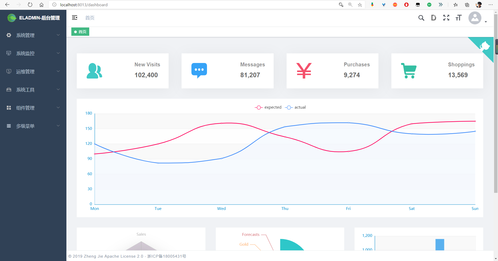
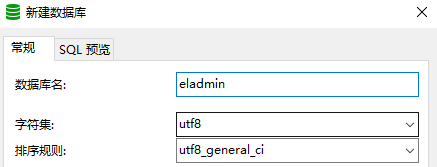
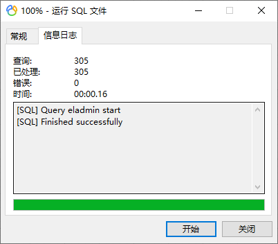
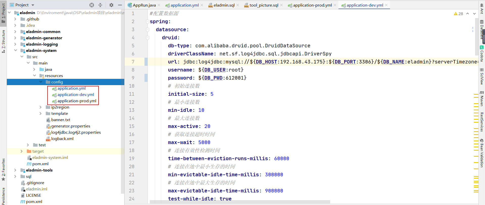
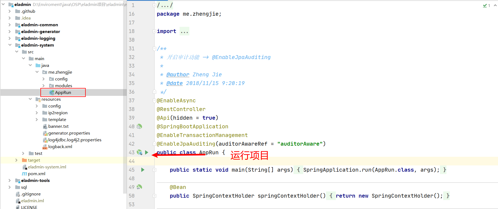
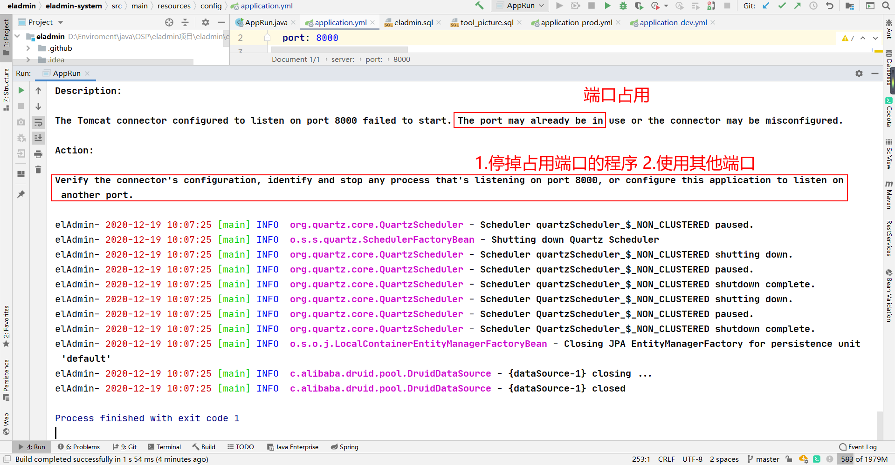
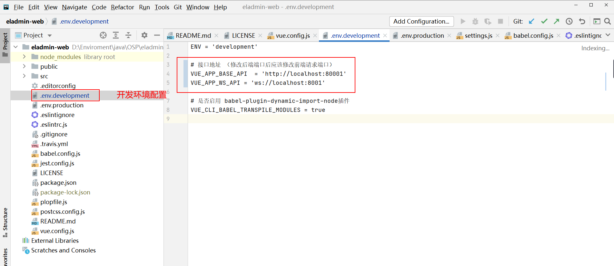

# 不想加班开发管理后台了，试试这个 Java 开源项目吧！

> 本文适合有 Java 基础并了解 SpringBoot 框架的同学


<p align="center">本文作者：HelloGitHub-<strong>嘉文</strong></p>

这里是 HelloGitHub 推出的[《讲解开源项目》](https://github.com/HelloGitHub-Team/Article)系列，今天给大家带来一款开源的 Java 后台管理框架——**EL-ADMIN**

它是一个基于 Spring Boot、Spring Data JPA、JWT、Spring Security、Redis、Vue、Element-UI 的前后端分离的后台管理系统。如果你想要学习上面这些框架的使用、增加实战经验、学习代码规范，又或者找接私活开发的脚手架，提高赚钱的效率，EL-ADMIN 都能满足你的需求。

> 项目地址：https://github.com/elunez/eladmin



简单配置后可直接运行，极大地提高了你在开发管理后台的效率，从而有更多时间逛 HelloGitHub。不信？跟着本文，让你 **5 分钟** 跑起来一个功能丰富的管理后台项目。


## 一、快速开始

### 1.1 环境准备

后端环境：

1. JDK 1.8+
2. Maven 3.0+
3. MYSQL 5.5+
4. Redis 3.0+

前端环境：

1. Node v10+

开发工具

1. IDE：IDEA
2. MySQL 可视化：Navicat 

### 1.2 快速开始

**（1）clone 项目**

- GitHub：

```bash
# 后端项目
git clone https://github.com/elunez/eladmin.git
# 前端项目
git clone https://github.com/elunez/eladmin-web.git
```

- Gitee（国内访问网速较快）：

```bash
# 后端项目
git clone https://gitee.com/elunez/eladmin.git
# 前端项目
git clone https://gitee.com/elunez/eladmin-web.git
```

**（2）导入 MySQL 数据库**

打开 Navicat，连接 MySQL，新建数据库 eladmin，设置字符集和排序规则如下图所示：



右键你新建的数据库，选择「运行 SQL 文件」，选择 clone 的下来的 `eladmin/sql/eladmin.sql` 文件。



导入 SQL 数据成功，一共有 27 张表。

**（3）运行后端项目**

配置文件：使用 IDEA 打开后端项目 eladmin，等待 maven 下载结束后，打开配置文件 yml 配置数据库，改成你机器上的 MySQL 或者 Redis 的 IP、端口和密码。

> MySQL 默认：
>
> * url：localhost:3306
> * 密码：123456
>
> Redis 默认：
>
> * url：localhost:6379
> * 密码：无



运行后端项目：



**（4）运行前端项目**

在 clone 的前端项目「eladmin-web」文件夹下打开 cmd 命令行窗口。

```bash
# 安装
npm install
# 运行 
npm run dev
```

### 1.3 效果预览

运行成功会自动弹出下面界面：


## 二、可能遇到的坑

### 2.1 端口占用

报错信息：



我们这里使用其他端口，修改配置文件 `application.yml` 端口为 8001：

```yaml
server:
  port: 8001
```

**注意：修改后端端口后，需要修改前端对应的请求接口。**




### 2.2 `npm install` 安装缓慢或者安装失败

设置淘宝镜像源来解决

```bash
npm config set registry https://registry.npm.taobao.org
```

检查是否设置成功

```bash
npm config get registry
```


## 三、如何学习这个项目

### 3.1 基本用途

EL-ADMIN 是**一个简单且易上手的 Spring boot 后台管理框架**，你可以通过它学习到：

* Spring Boot、Spring Data JPA、JWT、Spring Security、Redis、Vue、Element-UI 等框架的使用
* 增加项目经验
* 学习代码规范
* 作为接私活开发的「脚手架」，提高赚钱效率（比如 [项目代码生成模块](https://el-admin.vip/guide/hdsc.html) 可以直接生成前后端代码）

### 3.2 深入学习

了解完**基本用途**和**快速开始**之后，你想要更深层的学习这个开源项目的话，可以：

1. 了解技术框架：如果你没有了解 Spring Boot、Spring Data JPA、JWT、Spring Security、Redis、Vue、Element-UI 这些技术框架你应该先去了解它们，这是项目基石，不会的请网上搜索，因为 **搜索是基本技能**
2. 了解项目结构：[了解各个模块和文件的主要作用](https://el-admin.vip/guide/kslj.html)
3. 了解项目功能：了解项目实现的功能（比如说 [权限验证](https://el-admin.vip/guide/hdsc.html) ），这个项目使用了什么技术来实现「权限验证」（JWT 和 Spring Security），你需要在源代码里面将这个功能实现的大致流程看懂（你可以找到功能入口一层一层点进去或者 Debug 或者 自己写一个类似功能）

### 3.3 怎么学习

学习一个开源项目，你应该首先要明确的是 **你学习开源项目的目的**，因为很多开源项目（比如 EL-ADMIN）代码量还是比较大的，不同学习目的应该有不同的学习深度，而不是仅限于快速开始然后**无从下手**。


## 四、最后

很多同学学习 SpringBoot 的相关课程之后并不知道应该继续学习什么、做些什么实战项目。因为我就有类似的经历 ，这里我的个人建议：**学习不是目的，使用起来才是**，学了就要用，学了却不去用，还不如不学，因为不久就会忘的一干二净。如果只是学习却不巩固你的大脑就会将其忘记，而「实践」就是巩固的最佳方法，希望你能在实践中体验设计程序的快乐！

至此，感谢您的阅读。项目涉及到的知识点比较多，如果你时间不够充裕，建议选择感兴趣或者合适的功能去学习，有基础建议直接阅读 [官方文档](https://el-admin.vip/guide/)。


## 五、参考

1. [官方文档](https://el-admin.vip/guide/)

2. [如何学习开源项目](https://www.cnblogs.com/bodhitree/p/4831504.html)

