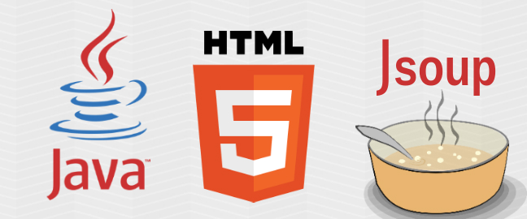
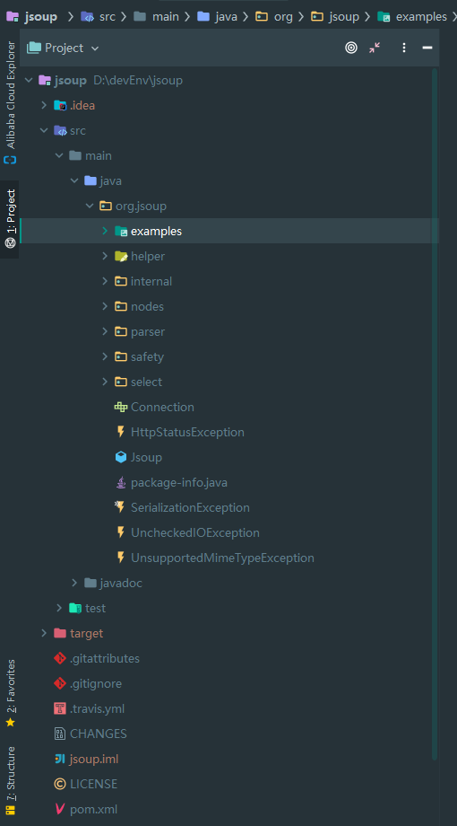
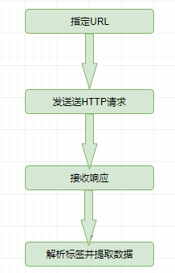
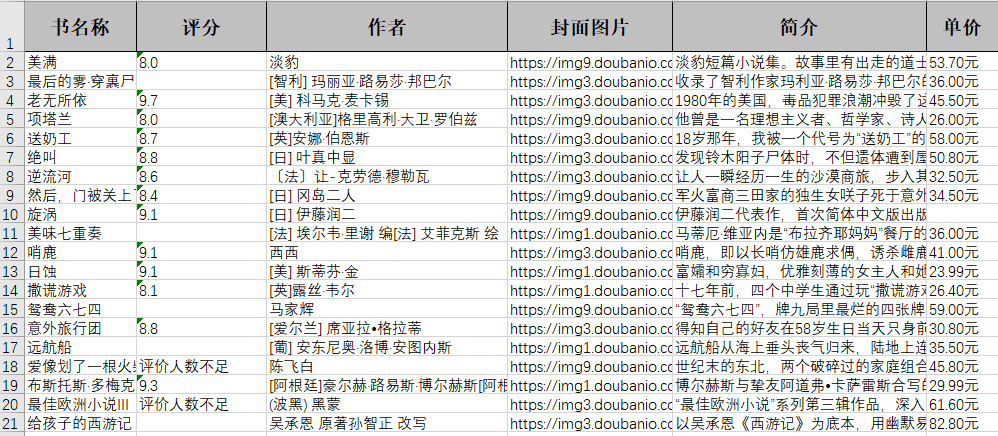

# 一款网页元素抓取框架`jsoup`

> 本文适合有 Java 基础知识的人群，跟着本文可学习一款网页元素抓取框架`jsoup`。



<p align="center">本文作者：HelloGitHub-<strong>秦人</strong></p>

HelloGitHub 推出的[《讲解开源项目》](https://github.com/HelloGitHub-Team/Article)系列，今天给大家带来一款开源 Java 版一款网页元素抓取框架——Jsoup，通过程序自动获取网页数据。

> 项目源码地址：https://github.com/jhy/jsoup

## 一、项目介绍
 `jsoup` 是一款Java 的HTML解析器。可直接解析某个URL地址、HTML文本内容。它提供了一套很省力的API，可通过 DOM，CSS 以及类似于 jQuery 的操作方法来取出和操作数据。

**jsoup主要功能**

1. 从一个URL，文件或字符串中解析HTML。
2. 使用DOM或CSS选择器来查找、取出数据。
3. 可操作HTML元素、属性、文本。

## 二、使用框架
### 2.1 准备工作
- 掌握 `html` 语法
- `Chrome` 浏览器调试技巧
- 掌握开发工具 `idea` 的基本操作


### 2.2学习源码

**学习源码**
将项目导入 `Idea` 开发工具，会自动下载 maven 项目需要的依赖。源码的项目结构如下：


快速学习源码是每个程序员必备的技能，我总结了以下几点：
- 1.阅读项目 `ReadMe` 文件，可以快速知道项目是做什么的。
- 2.概览项目 `pom.xml` 文件，了解项目引用了哪些依赖。
- 3.查看项目结构，源码目录，测试用例目录，好的项目结构清晰，层次明确。
- 4.运行测试用例，快速体验项目。
  
**下载项目**
```
git clone https://github.com/jhy/jsoup
```
**运行项目测试代码**
通过上面的方法，我们很快可知 `example` 目录是测试代码，那我们直接来运行。注：有些测试代码需要稍微改造一下才可以运行。
例如：Wikipedia测试代码
```java
public class Wikipedia {
    public static void main(String[] args) throws IOException {
        Document doc = Jsoup.connect("http://en.wikipedia.org/").get();
        log(doc.title());

        Elements newsHeadlines = doc.select("#mp-itn b a");
        for (Element headline : newsHeadlines) {
            log("%s\n\t%s", headline.attr("title"), headline.absUrl("href"));
        }
    }

    private static void log(String msg, String... vals) {
        System.out.println(String.format(msg, vals));
    }
}
```
说明：上面代码是获取页面（http://en.wikipedia.org/）包含（#mp-itn b a）选择器的所有元素，并打印这些元素的 `title` , `herf` 属性。 `维基百科` 可能有些人无法访问，所以上面这段代码运行会报错。
改造后可运行的代码：
```java
public static void main(String[] args) throws IOException {
    Document doc = Jsoup.connect("https://www.baidu.com/").get();
    Elements newsHeadlines = doc.select("a[href]");
    for (Element headline : newsHeadlines) {
        System.out.println("href: " +headline.absUrl("href") );
    }
}
```

### 2.3工作原理
Jsou p的工作原理，首先需要指定一个URL，框架发送 `http` 请求，然后获取响应页面内容，然后通过各种选择器获取页面数据。整个工作流程如下图：<br/>


以上面例子为例：

**发请求**
```java
Document doc = Jsoup.connect("https://www.baidu.com/").get();
```
这行代码就是发送http请求，并获取页面响应数据。<br/>
**数据筛选**

```java
Elements newsHeadlines = doc.select("a[href]");
```
定义选择器，获取匹配选择器的数据。

**数据处理**

```java
for (Element headline : newsHeadlines) {
        System.out.println("href: " +headline.absUrl("href") );
    }
```
这里对数据只做了一个简单的数据打印。当然这些数据可写入文件或数据的。

### 2.4实战
获取`豆瓣读书`->`新书速递`中每本新书的基本信息。包括：书名，书图片链接，作者，内容简介（详情页面），作者简介（详情页面），当当网书的价格（详情页面），最后将获取的数据保存到 `Excel` 文件。
`新书速递`的链接：`https://book.douban.com/latest?icn=index-latestbook-all`
#### 2.4.1 项目`pom.xml`文件
项目引入 jsoup，lombok，easyexcel 三个依赖。
```xml
<?xml version="1.0" encoding="UTF-8"?>
<project xmlns="http://maven.apache.org/POM/4.0.0"
         xmlns:xsi="http://www.w3.org/2001/XMLSchema-instance"
         xsi:schemaLocation="http://maven.apache.org/POM/4.0.0 http://maven.apache.org/xsd/maven-4.0.0.xsd">
    <modelVersion>4.0.0</modelVersion>

    <groupId>org.example</groupId>
    <artifactId>JsoupTest</artifactId>
    <version>1.0-SNAPSHOT</version>
    <properties>
        <maven.compiler.target>1.8</maven.compiler.target>
        <maven.compiler.source>1.8</maven.compiler.source>
    </properties>
    <dependencies>
        <dependency>
            <groupId>org.jsoup</groupId>
            <artifactId>jsoup</artifactId>
            <version>1.13.1</version>
        </dependency>
        <dependency>
            <groupId>org.projectlombok</groupId>
            <artifactId>lombok</artifactId>
            <version>1.18.12</version>
        </dependency>
        <dependency>
            <groupId>com.alibaba</groupId>
            <artifactId>easyexcel</artifactId>
            <version>2.2.6</version>
        </dependency>
    </dependencies>
</project>
```
#### 2.4.1 解析页面数据
```java
public class BookInfoUtils {

    public static List<BookEntity> getBookInfoList(String url) throws IOException {
        List<BookEntity>  bookEntities=new ArrayList<>();
        Document doc = Jsoup.connect(url).get();
        Elements liDiv = doc.select("#content > div > div.article > ul > li");
        for (Element li : liDiv) {
            Elements urls = li.select("a[href]");
            Elements imgUrl = li.select("a > img");
            Elements bookName = li.select(" div > h2 > a");
            Elements starsCount = li.select(" div > p.rating > span.font-small.color-lightgray");
            Elements author = li.select("div > p.color-gray");
            Elements description = li.select(" div > p.detail");

            String bookDetailUrl = urls.get(0).attr("href");
            BookDetailInfo detailInfo = getDetailInfo(bookDetailUrl);
            BookEntity bookEntity = BookEntity.builder()
                    .detailPageUrl(bookDetailUrl)
                    .bookImgUrl(imgUrl.attr("src"))
                    .bookName(bookName.html())
                    .starsCount(starsCount.html())
                    .author(author.text())
                    .bookDetailInfo(detailInfo)
                    .description(description.html())
                    .build();
//            System.out.println(bookEntity);
            bookEntities.add(bookEntity);
        }
        return bookEntities;
    }
    /**
     *
     * @param detailUrl
     * @return
     * @throws IOException
     */
    public static BookDetailInfo getDetailInfo(String detailUrl)throws IOException{

        Document doc = Jsoup.connect(detailUrl).get();
        Elements content = doc.select("body");

        Elements price = content.select("#buyinfo-printed > ul.bs.current-version-list > li:nth-child(2) > div.cell.price-btn-wrapper > div.cell.impression_track_mod_buyinfo > div.cell.price-wrapper > a > span");
        Elements author = content.select("#info > span:nth-child(1) > a");
        BookDetailInfo bookDetailInfo = BookDetailInfo.builder()
                .author(author.html())
                .authorUrl(author.attr("href"))
                .price(price.html())
                .build();
        return bookDetailInfo;
    }
}
```
这里的重点是要获取网页对应元素的`选择器`。<br/>
例如：获取 `li.select("div > p.color-gray")` 中 `div > p.color-gray` 是怎么知道的。<br/>
使用 `chrome` 的小伙伴应该都猜到了。打开 `chrome` 浏览器 `Debug` 模式，`Ctrl + Shift +C` 选择一个元素,然后在 `html` 右键选择 `Copy` ->`Copy selector`,这样就可以获取当前元素的`选择器`。如下图：


#### 2.4.2 存储数据到`Excel`
为了数据更好查看，我将通过 `Jsoup` 抓取的数据存储的 `Excel` 文件，这里我使用的 `easyexcel`,快速生成 `Excel` 文件。

**Excel表头信息**
```java
@Data
@Builder
public class ColumnData {

    @ExcelProperty("书名称")
    private String bookName;

    @ExcelProperty("评分")
    private String starsCount;

    @ExcelProperty("作者")
    private String author;

    @ExcelProperty("封面图片")
    private String bookImgUrl;

    @ExcelProperty("简介")
    private String description;

    @ExcelProperty("单价")
    private String price;
}
```

**生成Excel文件**
```java
public class EasyExcelUtils {

    public static void simpleWrite(List<BookEntity> bookEntityList) {
        String fileName = "D:\\devEnv\\JsoupTest\\bookList" + System.currentTimeMillis() + ".xlsx";
        EasyExcel.write(fileName, ColumnData.class).sheet("书本详情").doWrite(data(bookEntityList));
        System.out.println("excel文件生成完毕...");
    }
    private static List<ColumnData> data(List<BookEntity> bookEntityList) {
        List<ColumnData> list = new ArrayList<>();
        bookEntityList.forEach(b -> {
            ColumnData data = ColumnData.builder()
                    .bookName(b.getBookName())
                    .starsCount(b.getStarsCount())
                    .author(b.getBookDetailInfo().getAuthor())
                    .bookImgUrl(b.getBookImgUrl())
                    .description(b.getDescription())
                    .price(b.getBookDetailInfo().getPrice())
                    .build();
            list.add(data);
        });
        return list;
    }
}
```

#### 2.4.3 最终展示效果
最终的效果如下图：

这样从想法到实践，我们就在实战中使用了 `Jsoup` 的基本操作。<br/>
完整代码地址：https://github.com/hellowHuaairen/JsoupTest

## 五、最后

`Java` 版爬虫框架 `Jsoup` 用起来还是很方便的吧！由于篇幅有限只能泛泛而谈，不知道你对 `Jsoup` 有什么感受，欢迎在评论区说说自己的想法。为什么会讲爬虫？大数据，人工智能时代玩的就是数据，数据很重要。作为懂点技术的我们，也需要掌握一种获取网络数据的技能。当然也有一些工具 `Fiddler`,`webscraper` 等也可以抓取你想要的数据。

教程至此，你应该也能对 `Jsoup` 有一些感觉了吧。编程是不是也特别有意思呢？参考我上面的实战案例，有好多网站可以实践一下啦～

## 六、参考资料
- [官方文档](https://jsoup.org/): https://jsoup.org/
- [api文档](https://jsoup.org/apidocs/): https://jsoup.org/
- [easyexcel文档](https://www.yuque.com/easyexcel/doc/write):https://www.yuque.com/easyexcel/doc/write


