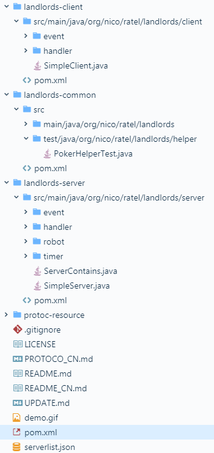
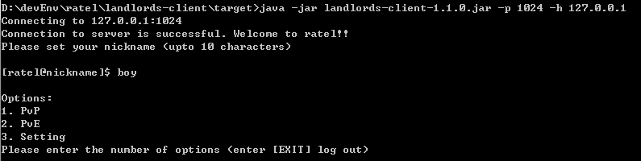
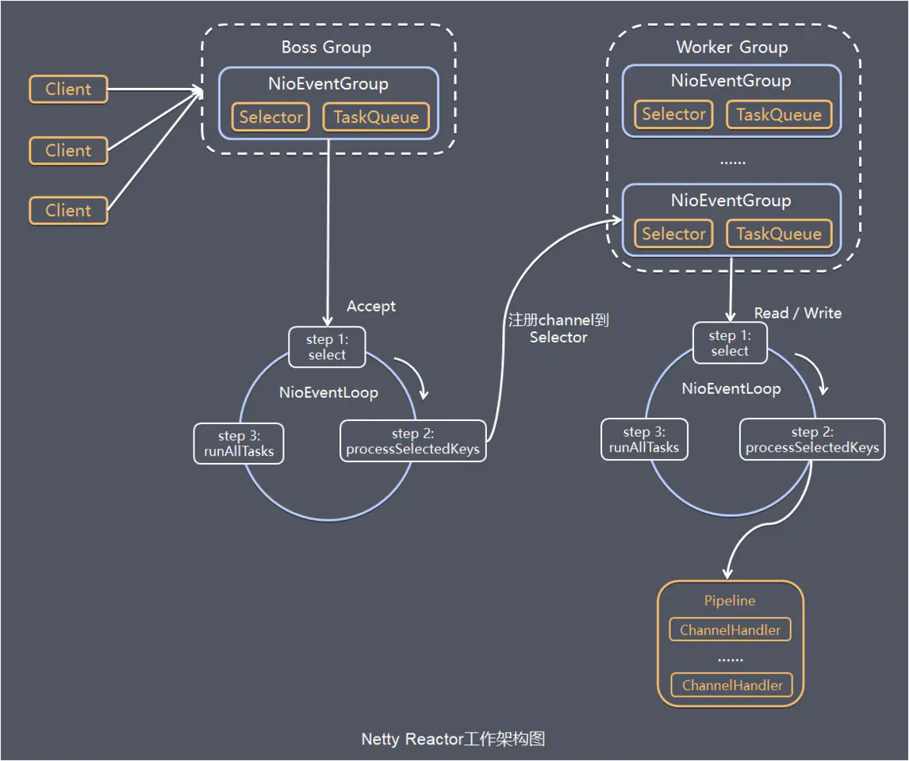

# 命令行版的斗地主你玩过没？

> 本文适合有 Java 基础知识的人群，跟着本文可使用和快速搭建命令行斗地主项目。


<p align="center">本文作者：HelloGitHub-<strong>秦人</strong></p>

HelloGitHub 推出的[《讲解开源项目》](https://github.com/HelloGitHub-Team/Article)系列，今天给大家带来一款命令行斗地主开源项目—— [ratel](https://github.com/ainilili/ratel) 

> 项目源码地址：https://github.com/ainilili/ratel

## 一、项目简介

斗地主我想大家都会玩吧，今天分享一个 Java 命令行斗地主的开源项目！项目是基于 Netty 实现，Netty 是一个高性能、异步事件驱动的 NIO 框架。下面就让我们一起来把这个项目跑起来，然后看看它的代码。

## 二、项目结构

项目目录结构如下图：



目录说明：

1. 客户端：`landlords-client`
   - event：客户端事件包
   - handle：客户端事件处理包
   - SimpleClient：客户端启动程序
2. 基础包：`landlords-common`
   - channel：管道工具包
   - entity：实体类目录
   - enums：枚举类型目录
   - exception：异常处理目录
   - handler：业务处理，包含消息转码工具类
   - helper：工具类包，包括时间工具类等
   - print：打印工具包目录，包括格式化输出的工具类
   - robot：机器人出牌目录，人机对战时使用
   - transfer：类型转换工具包目录
   - utils：基础工具类，包括集合、正则等工具类
3. 服务端：`landlords-server` 
   - event：服务端端事件包
   - handler：客户端事件处理包
   - robot：机器人出牌目录，人机对战时使用
   - timer：定时任务目录，计算房间存活时间。
   - SimpleServer：服务端启动程序
4. 服务器配置 `serverlist.json`：默认配置

## 三、实战操作

### 3.1 运行项目

1. 构建项目
	```
	git clone https://github.com/ainilili/ratel.git
	cd ratel
	mvn install package
	```

2. 运行客户端和服务端
	```
	java -jar landlords-server/target/landlords-server-1.1.0.jar -p 1024
	java -jar landlords-client/target/landlords-client-1.1.0.jar -p 1024 -h 127.0.0.1
	```

- 客户端运行效果

  

- 服务端运行效果

  


### 3.2 开始斗地主

客户端、服务端都已启动，我们就可以开始娱乐一下了。

进入游戏有三个菜单：

- 真人模式（PvP）：需要三个人加入房间，才可以开始。
- 人机模式（PvE）：一个人加入，其他两个人是机器。
- 设置（Setting）：可以设置卡牌的显示样式。

运行效果如下：


**注意**

1. 小王是`S`，大王为`X`。
2. 牌的别名
	```
	poker-> |10   |J  |Q  |K  |A    |2 |S  |X  |
	alias-> |T t 0|J j|Q q|K k|A a 1|2 |S s|X x|
	```

## 四、工作原理

### 4.1 Netty 工作原理



以`server`为例：

1. 初始化创建 2 个 `EventLoopGroup`，其中 `parentGroup` 用于 Accetpt 连接建立事件并分发请求。`childGroup` 用于处理 I/O 读写事件和业务逻辑。

2. 基于 `ServerBootstrap` (服务端启动引导类)，配置 `EventLoopGroup`、`Channel` 类型，连接参数、配置入站、出站事件 `handler`

3. 绑定端口，开始工作

### 4.2 命令行运行

```bash
java -jar xxx.jar -p/port 1024
```

看到 `Server` 的入口方法可知，`-p 1024` 是通过入口 `main` 接参数的。`-p` 和 `-port` 都表示为端口。

```java
public static void main(String[] args) throws InterruptedException {
	if(args != null && args.length > 1) {
		if(args[0].equalsIgnoreCase("-p") || args[0].equalsIgnoreCase("-port")) {
			ServerContains.port = Integer.valueOf(args[1]);
		}
	}
｝
```

### 4.3 斗地主规则

斗地主的规则文件是：`landlords-common/helper/PorkerHelper.java`

`distributePoker` 方法是构建发牌的集合。扑克牌共 54 张，分成 3 堆 17 张和一堆 3 张。

```java
public static List<List<Poker>> distributePoker(){
	Collections.shuffle(basePokers);
	List<List<Poker>> pokersList = new ArrayList<List<Poker>>();
	List<Poker> pokers1 = new ArrayList<>(17);
	pokers1.addAll(basePokers.subList(0, 17));
	List<Poker> pokers2 = new ArrayList<>(17);
	pokers2.addAll(basePokers.subList(17, 34));
	List<Poker> pokers3 = new ArrayList<>(17);
	pokers3.addAll(basePokers.subList(34, 51));
	List<Poker> pokers4 = new ArrayList<>(3);
	pokers4.addAll(basePokers.subList(51, 54));
	pokersList.add(pokers1);
	pokersList.add(pokers2);
	pokersList.add(pokers3);
	pokersList.add(pokers4);
	for(List<Poker> pokers: pokersList) {
		sortPoker(pokers);
	}
	return pokersList;
}
```

## 五、最后

俗话说：兴趣是学习的老师，当一个人对做一件事产生兴趣时，慢慢地就开始喜欢这件事。编程也是一样的。也许你觉得编程很枯燥，那是因为你觉得编程这件事让你产生不了兴趣。那么如何让我们对编程产生兴趣呢？那就回到本文的主旨，通过我的内容分享，让更多的朋友感受到开源项目的魅力，由而对编程产生兴趣。

教程至此，你应该也能快速搭建斗地主项目了。编程是不是也特别有意思呢？快邀请你的小伙伴一起加入到命令行斗地主的项目和乐趣中吧～

## 六、参考资料

- [Netty原理框架](https://juejin.im/post/5be00763e51d453d4a5cf289 )

- [Netty 入门初体验](https://juejin.im/post/5ba35a76f265da0a951ed4db )