# 和付费网盘说再见，跟着本文自己起个网盘（Java 开源项目）

> 本文适合有 Java 基础知识的人群，跟着本文可学习和运行 `Java` 网盘项目。


<p align="center">本文作者：HelloGitHub-<strong>秦人</strong></p>

HelloGitHub 推出的[《讲解开源项目》](https://github.com/HelloGitHub-Team/Article)系列。

今天给大家带来一款开源 Java 版网盘项目—— [kiftd-source](https://github.com/KOHGYLW/kiftd-source)，本文将用 3 分钟带大家搭建一个个人网盘，技术便利生活，你值得拥有～

> 项目地址：https://github.com/KOHGYLW/kiftd-source


## 一、项目介绍
kiftd 是一款开源、使用简单、功能完整的 Java 网盘/云盘系统。支持在线视频播放、文档在线预览、音乐播放、图片查看等功能的文件云存储平台。

**技术栈**
- JDK 版本：1.8.0_131
- 项目管理框架：Maven（m2e 1.8.0 for Eclipse）
- Archetype：mavem-archetype-quickstart 1.1
- Spring Boot：SpringBoot 基于 Spring 开发，旨在提高微服务的开发效率。
- MyBatis：一款优秀的持久层框架，它支持自定义 SQL、存储过程以及高级映射。
- H2 DB：一款开源的嵌入式数据库引擎，采用 Java 语言编写，不受平台的限制。

## 二、网盘搭建

### 2.1 Windows 环境运行

**2.1.1 下载安装包**

直接从官网下载最新的安装包，安装地址：https://kohgylw.gitee.io/

项目比较温馨，支持三种下载方式：Github、阿里云、Gitee 下载。如下图：


**2.1.2 检查配置**

这里主要检查一下本地 `JDK` 是否已安装，在命令行窗口执行 `java -version` 查看 `Java` 版本。如下所示表示已安装，就可以进行下一步操作。
```bash
java version "1.8.0_181"
Java(TM) SE Runtime Environment (build 1.8.0_181-b13)
Java HotSpot(TM) 64-Bit Server VM (build 25.181-b13, mixed mode)
```

**2.1.3 运行 jar**

双击 `kiftd-1.0.29-RELEASE.jar`，或者在命令行执行 `java -jar kiftd-1.0.29-RELEASE.jar` 命令都运行可以`jar` 文件，会弹出安装的界面，如下图：

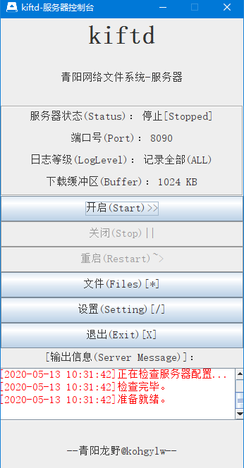

这个界面的这几个按钮说明一下：
- 开启（Start）：运行网盘服务，初次启动的端口默认是 `8080`。
- 文件（Files）：这个按钮菜单中主要有网盘文件导入，导出，删除，刷新功能。
- 设置（Setting）：设置功能主要可以设置网盘的服务端口，网盘的物理存储路径等信息。
- 退出（Exit）：关闭网盘系统。

点击 `开启(Start)` 按钮即可运行网盘，这里我设置的端口是 `8090`，在浏览器访问: `localhost:8090`，运行效果如下图：

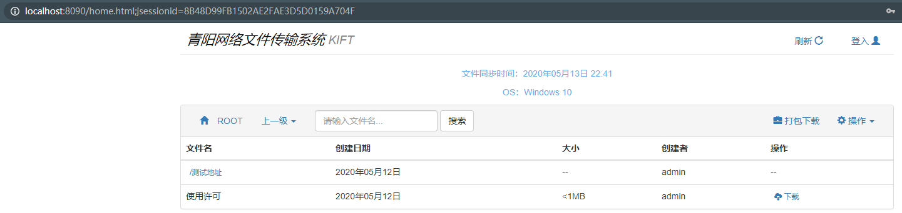

项目是运行了，发现一个问题无法上传文件？因为我们忘了登录这个操作。点击系统 `登录按钮`，填入账号和密码即可登录。那么登录密码在哪里呢？这里我直接告诉大家，用户信息在 `conf/account.properties`，文件内容如下：

```bash
#<This is the default kiftd account setting file. >
#Sun May 10 21:56:28 CST 2020
admin.pwd=000000  #用户名.密码=000000
authOverall=l
admin.auth=cudrm
```

- 用户名：admin 
- 密码：000000

这样登录之后就可以使用网盘的所有功能了。

### 2.2 Linux 环境运行

**2.2.1 安装 Screen 工具**

Screen 工具能够虚拟出一个终端并执行相应的操作。因为本篇所讲的网盘需要一个终端。执行如下命令安装 `Screen`：

```bash
yum install screen
```

**2.2.2 `Screen` 常用命令**

```bash
screen -S myScreen #创建虚拟终端
java -jar kiftd-1.0.29-RELEASE.jar -console #在虚拟终端中以命令模式启动 kiftd
screen -r myScreen #返回之前的虚拟终端并继续操作 kiftd。
```

**2.2.3 命令行操作**

在 `Linux` 环境上使用 `console` 模式启动的效果是这样的：

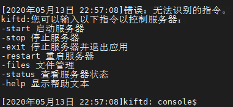

命令行输入 `-start` 即可运行项目。例如输入 `-files` 控制台显示是这样的：

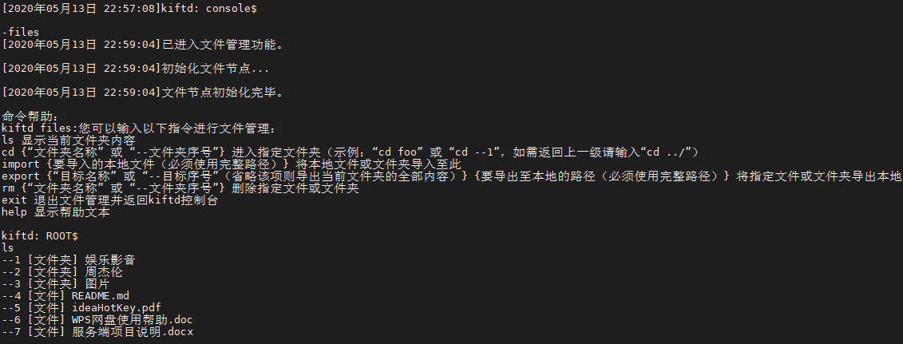

其实和 `Windows` 上一样，包括文件导入，导出，删除功能，多了几个命令是查看文件，切换目录等功能。


## 三、开发环境运行

### 3.1 下载项目
两种方式下载项目，使用 `GitBash` 下载项目：

```bash
git clone https://github.com/KOHGYLW/kiftd-source.git
```

另外一种方式直接下载 `zip` 压缩包，如下图：

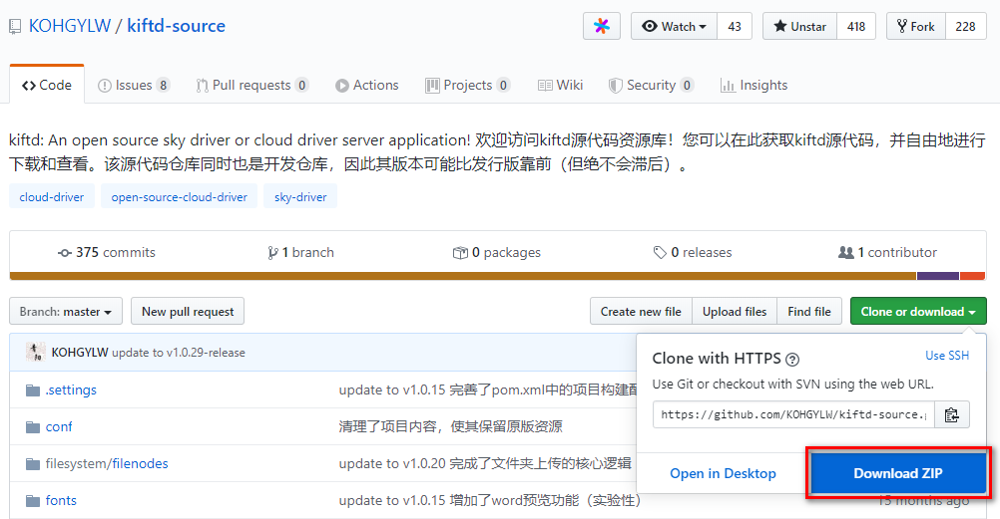


### 3.2 运行

打开 `kohgylw.kiftd.mc.MC` 类，进行测试运行。注意：本文使用 `Eclipse` 工具打开。

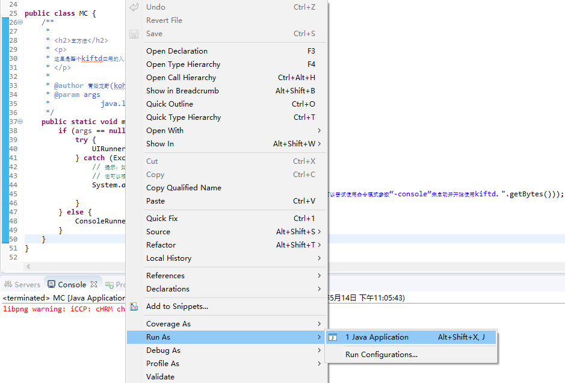

### 3.3 阅读代码

**3.3.1 前台请求**

就以创建目录这个功能为例。我们先看前端功能。点击“操作”->“新建文件夹”，填写文件夹名称，点击保存如下图：

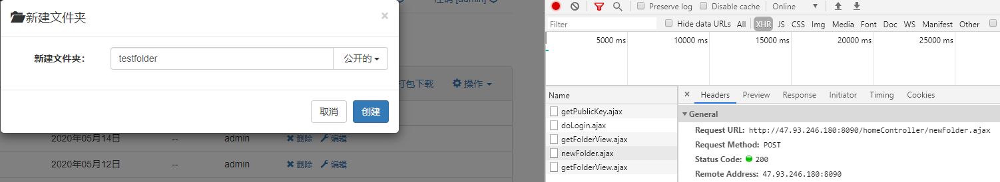

我们知道前台 `新建文件夹` 功能调用的后台接口是 `newFolder.ajax`

**3.3.2 后端接口**
通过前台请求可知调用的后台接口为 `homeController/newFolder.ajax`。打开代码实现，我们会看到下面这个方法。

```java
public String newFolder(final HttpServletRequest request) {
		
        ...
        //参数校验的部分代码已省略
		Folder f = new Folder();
		f.setFolderId(UUID.randomUUID().toString());
		f.setFolderName(folderName);
		f.setFolderCreationDate(ServerTimeUtil.accurateToDay());
		if (account != null) {
			f.setFolderCreator(account);
		} else {
			f.setFolderCreator("匿名用户");
		}
		f.setFolderParent(parentId);
		int i = 0;
		while (true) {
			try {
                // 数据库插入新建文件夹的数据
				final int r = this.fm.insertNewFolder(f);
				if (r > 0) {
					if (fu.isValidFolder(f)) {
						this.lu.writeCreateFolderEvent(request, f);
						return "createFolderSuccess";
					} else {
						return "cannotCreateFolder";
					}
				}
				break;
			} catch (Exception e) {
				f.setFolderId(UUID.randomUUID().toString());
				i++;
			}
			if (i >= 10) {
				break;
			}
		}
		return "cannotCreateFolder";
	}
```


## 四、功能说明

### 4.1 上传
1. 点击 `操作`，可以上传文件和上传文件夹，如下图：
	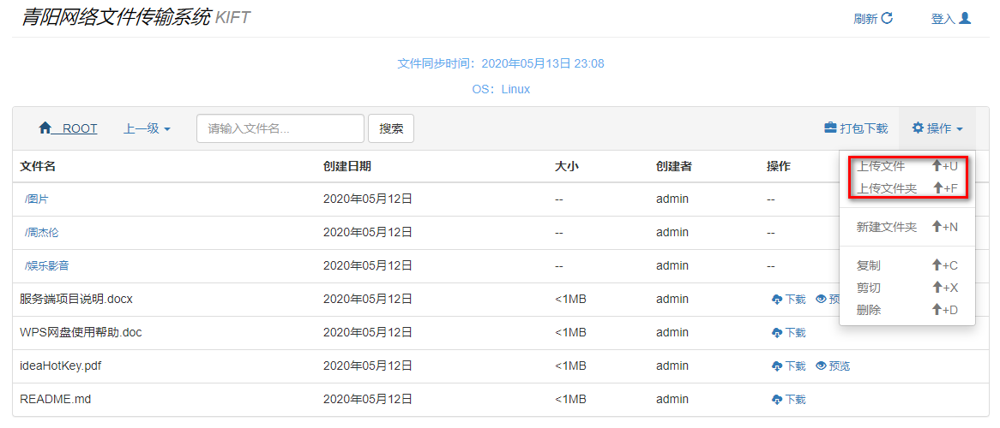
2. 将本地需要上传的文件，拖拽网盘页面也可以上传此文件。

### 4.2 视频/音频播放
1. 上传视频到网盘，网盘也支持在线视频播放，效果如下图：
	
2. 上传音频，例如我最喜欢 `周杰伦` 的歌曲，可以在线播放了。
	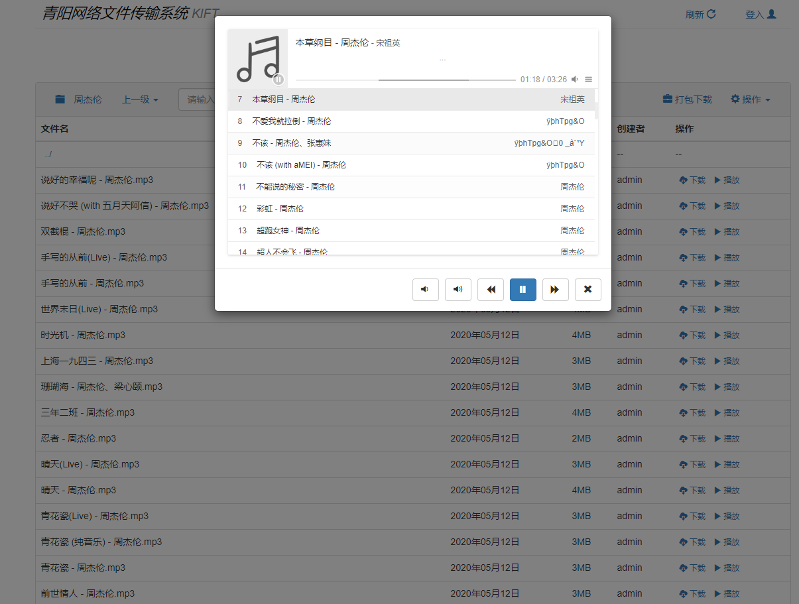

### 4.3 快捷键使用
网盘还对一些常用功能添加了快捷键。功能和快捷键参照如下：

|  功能        | 快捷键           |
|------------- | ----------------|
| 上传文件夹       | Shift +U     |
| 上传文件       | Shift +F     |
| 新建文件       | Shift +N      |
| 复制           | Shift +C      |
| 剪切          | Shift +X       |
| 删除          | Shift +D       |

### 4.4 配置文件修改
配置文件在项目 `conf` 目录，包括两个配置文件：
- `account.properties`：配置账号信息，权限信息
- `server.properties`：服务器的配置文件，可配置服务器端口，缓冲文件大小等

### 4.5 在线预览
网盘支持文档 `txt`、`pdf`、`docx`、`ppt` 在线预览功能，支持图片的在线预览。图片预览效果如下：


`pdf` 文件预览效果如下：

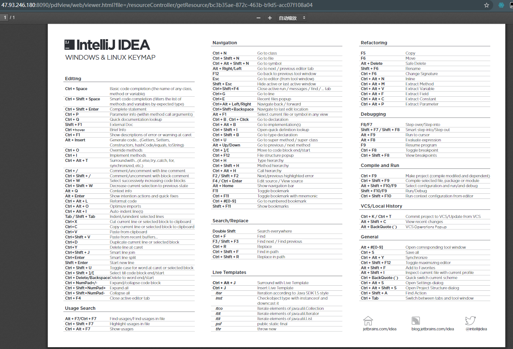

### 4.6 分享下载链接

网盘也考虑文件的分享，它可以生成下载链接，浏览器访问下载链接就可以直接下载文件。选择需要下载的文件，点击 `下载` 按钮，选择 `下载链接+`，既可以生成文件下载链接。如下图：

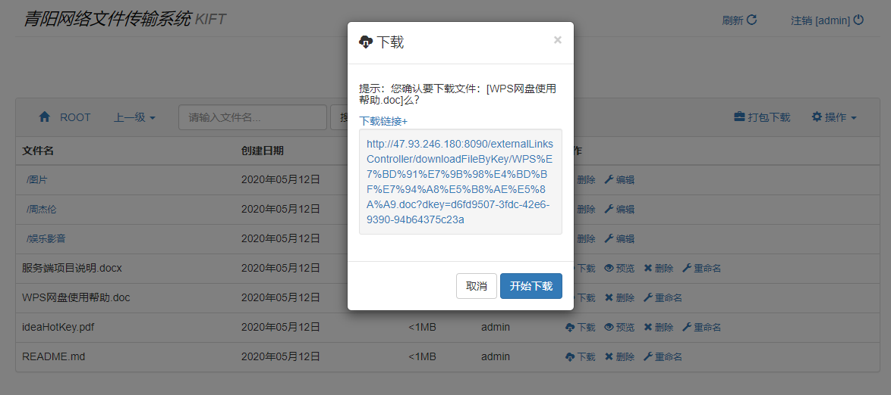

## 五、最后

教程至此已经结束，你自己的网盘跑起来了吗？网盘是不是还不错？而且搭建也特别简单。一些重要的东西就可以存放到自己的网盘啦！说到底，编程语言只是工具，我们只要很好的使用工具，再加上自己天马行空的思想，我想会创造出更多不可思议的项目。

`Java` 语言为什么经久不衰，因为它能做的事情太多了，而且生态也特别丰富。如果你也有兴趣那就加入 `Javaer` 开发者的大家庭吧！开源分享让我们彼此认识，有了开源项目让我们看到编程语言的绚丽多彩。

教程至此，你应该也能快速运行个人网盘了。编程是不是也特别有意思呢？先下载安装包给自己部署一套网盘系统吧。对源码感兴趣的朋友可以开始学习项目源码了～


