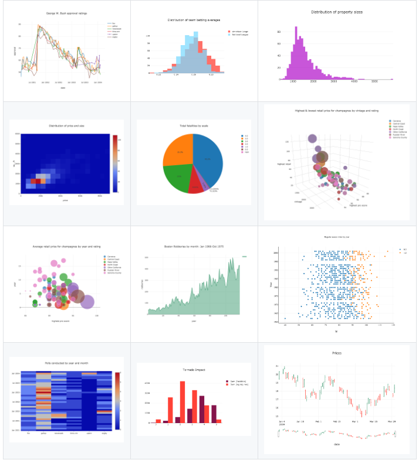
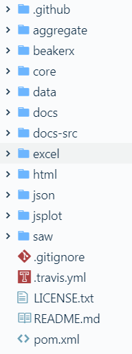
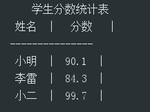
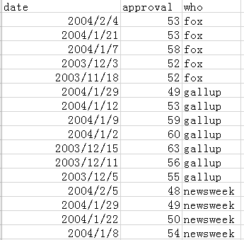
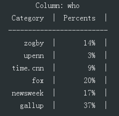
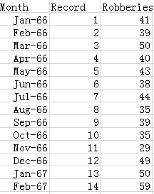
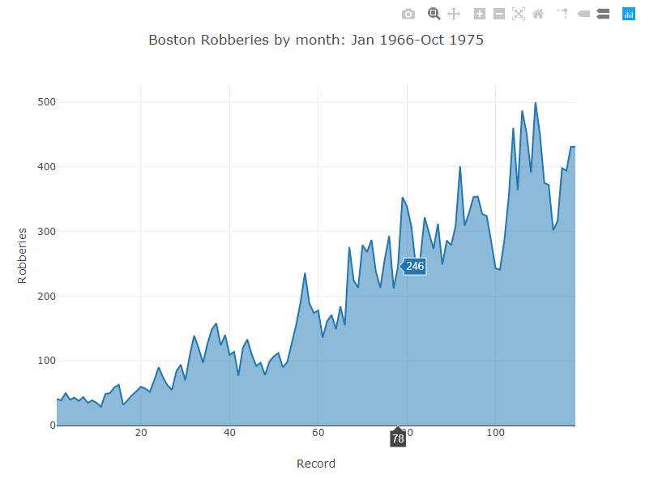

# 超级好用的 Java 数据可视化库：Tablesaw

> 本文适合刚学习完 Java 语言基础的人群，跟着本文可了解和使用 Tablesaw 项目。示例均在 Windows 操作系统下演示



<p align="center">本文作者：HelloGitHub-<strong>秦人</strong></p>

HelloGitHub 推出的[《讲解开源项目》](https://github.com/HelloGitHub-Team/Article)系列，今天给大家带来一款基于 Java 语言的数据可视化库开源项目——**Tablesaw** 

Tablesaw是一款 Java 的数据可视化库。它主要包括两部分：一部分是数据解析库，另一部分是数据可视化库。数据解析库主要是加载数据，对数据进行操作（转化，过滤，汇总等）。数据可视化库就是将目标数据转化为可视化的图表。

> 项目源码地址：https://github.com/jtablesaw/tablesaw



## 一、项目结构



目录说明：

1. aggregate：maven 的项目父级项目，主要定义项目打包的配置。
2. beakerx：tablesaw 库的注册中心，主要注册表和列。
3. core：tablesaw 库的核心代码，主要是数据的加工处理操作：数据的追加，排序，分组，查询等。
4. data：项目测试数据目录。
5. docs：项目 MarkDown 文档目录。
6. docs-src：项目文档源码目录，主要作用是生成 MarkDown 文档。
7. excel：解析 excel 文件数据的子项目。
8. html：解析 html 文件数据的子项目。
9. json：解析 json 文件数据的子项目。
10. jsplot：数据可视化的子项目，主要作用加载数据生成可视化图表。
11. saw：tablesaw 读写图表数据的子项目。

## 二、实战操作

### 2.1 准备工作

项目中引入 Tablesaw 依赖包

```xml
<dependency>
    <groupId>tech.tablesaw</groupId>
    <artifactId>tablesaw-core</artifactId>
    <version>LATEST</version>
</dependency>
```

### 2.2 数据解析

#### 2.2.1 内部数据制作数据表格

```java
@Test
public void tableSawTest6() {
	String[] students = {"小明", "李雷", "小二"};
	double[] scores = {90.1, 84.3, 99.7};
	Table table = Table.create("学生分数统计表").addColumns(
					StringColumn.create("姓名", students),
					DoubleColumn.create("分数", scores));
	System.out.println(table.print());
}
```

代码超级简单，首先定义要展示列数据 students 和 scores。然后创建数据展示的 table 定义表格名称，添加表格列数据即可。

效果展示如下：



#### 2.2.2 加载数据文件制作数据表格

```java
@Test
public void tableSawTest10() throws Exception{
	Table table = Table.read().csv("/data/bush.csv");
	Table whoPercents = table.xTabPercents("who");
	whoPercents.columnsOfType(ColumnType.DOUBLE)
	.forEach(x -> ((NumberColumn) x).setPrintFormatter(
		NumberColumnFormatter.percent(0)));
	System.out.println(whoPercents.toString());
}
```

首先 `Table.read` 加载数据文件，加载数据支持 csv、数据库结果集、文件、URL 等

指定表格 x 轴的字段，并对 数据进行百分比数据的转化。

bash.csv 文件内容如下：

  

运行效果如下：



### 2.3 数据可视化

```java
Table robberies = Table.read().csv("./data/boston-robberies.csv");
Plot.show(
	AreaPlot.create(
		"Boston Robberies by month: Jan 1966-Oct 1975", 
		robberies, "Record", "Robberies"));
```

首先加载数据 `Table.read`，绘制图表 `AreaPlot.create` ，然后 `Plot.show` 在本地生成图表的 html 页面，自动打开浏览器显示。

boston-robberies.csv 文件内容如下：



运行效果如下：



Tablesaw 还可以绘制出很多种类的图表，期待你的发掘。

## 三、最后

教程至此，你应该对 Tablesaw有一个简单的了解。这里告诉大家一个方法，可以快速掌握开源库：**在源码中找项目的单元测试代码。然后，我们再将项目导入开发工具，直接运行项目中的单元测试。** 这是可能是最快捷、有效的掌握、上手开源库的方法。

本教程是针对有一定 Java 编程基础，如果你的项目正好需要数据可视化的库，Tablesaw 库是个不错的选择！