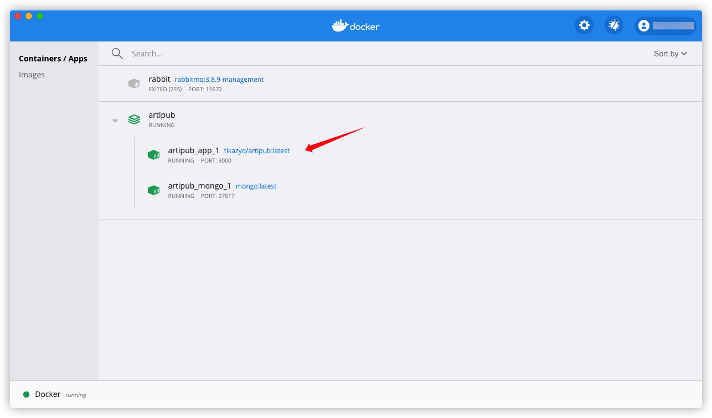
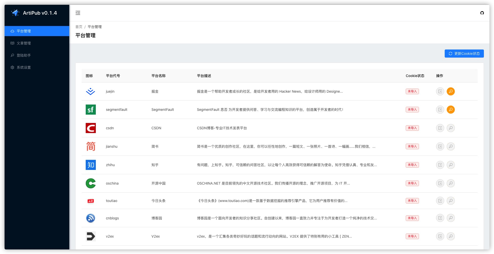
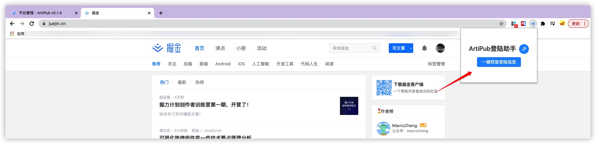
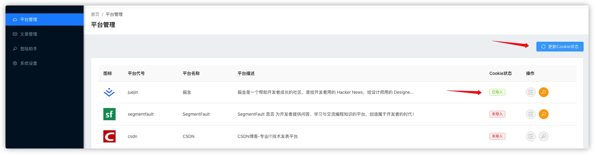
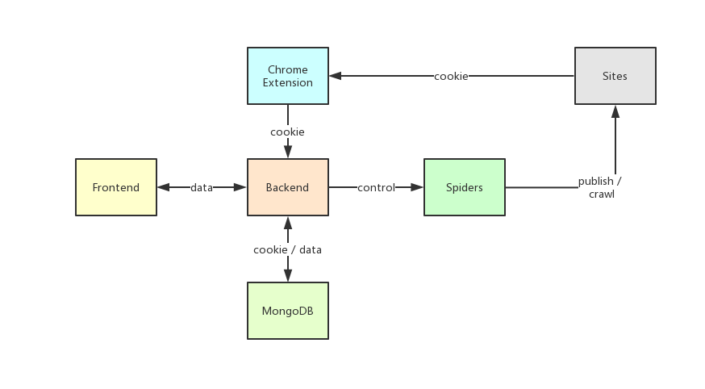

# 内容创作者不要再复制粘贴啦，一劳永逸自建个文章多发平台吧！


<p align="center">本文作者：HelloGitHub-<strong>蔡文心</strong></p>

大家好！这里是 HelloGitHub 推出的[《讲解开源项目》](https://github.com/HelloGitHub-Team/Article)系列，今天给大家带来的一款基于 Node.js 实现的**一文多发平台**开源项目——**ArtiPub**（文章发布者）。

## 一、介绍

众所周知文章每发到一个平台，就能增加一丝让更多人看到的机会。所以内容创作者们不仅需要编写高质量的文章，还要手动分发到不同的平台。这个同步可不是简单地复制粘贴，需要重新排版、上传图片等，十分耗时和繁琐。

HelloGitHub 明白你的痛，所以今天带来一款免费开源的文章自动分发管理平台——ArtiPub，它可以帮助内容创作者将编写好的文章自动发布到掘金、SegmentFault、CSDN、知乎、开源中国等技术社区，传播技术内容的同时获取更多的曝光和关注。它不仅能完成文件的在线编辑和同步，还有数据统计的功能，简直是内容创作的必备神器呀！

> 项目地址：https://github.com/crawlab-team/artipub

让我们来跟着本文了解下 ArtiPub 的优点和功能，然后跟着步骤用起来，最后让你从 **手动同步** 内容变为 **自动同步**。

### 1.1 安全性

市面上已经存在一文多发的平台会要求用户将自己的账户信息，例如 Cookie 或账号密码上传到对方服务器这样不安全。因为一旦平台发生问题，自己的账户信息会遭到泄漏。虽然我相信一般平台不会恶意操作用户的账户，但如果出现误操作，您的账户隐私将遭到泄漏，平台上的财产也可能遭到损坏，所以还是要尽可能规避这样的风险。而 ArtiPub 不要求用户上传账户信息，所有账户信息全部保存在用户自己本地或者服务器的数据库中，从而规避了这个安全风险。

### 1.2 Chrome 插件

ArtiPub 有配套的 Chrome 插件，通过 Chrome 插件可以方便地获得用户登陆信息（Cookie），然后将 Cookie 注入到 Puppeteer 操作的 Chromium 浏览器中，浏览器就可以正常登陆网站进行发文操作了。

### 1.3 支持的平台

-  掘金
-  SegmentFault
-  CSDN
-  简书
-  知乎
-  开源中国
-  今日头条
-  博客园

### 1.4 支持的安装方式

ArtiPub 安装简单，提供了多种安装方式，可以一键安装使用，安装一般只要 5 分钟。

- Docker
- Npm
- 源码

考虑到此项目的受众可能包括非程序员人群，接下来本文中将演示最方便的一种方案 **使用 Docker 安装**。

## 二、安装

### 2.1 Docker

**准备**

1. [Docker 安装文档](https://docs.docker.com/engine/install/)
2. [Docker-compose 容器编排安装文档](https://docs.docker.com/compose/install/)

**Step 1 在项目根目录下执行**

`docker-compose up` 命令会根据 `docker-compose.yaml` 文件创建镜像和容器。

```shell
cd ArtiPub
docker-compose up
```

**Step 2 启动容器**



**Step 3 成功**

访问 http://localhost:8000



## 三、使用

### 3.1 登录

上文提到了 ArtiPub 是通过 Chrome 插件获取 Cookie 的，所以还需要安装 Chrome 插件，插件的下载和安装方法作者写在了**登录助手**菜单中。





### 3.2 发布


发布后需要一点时间大约 1 分钟内，就能够看到已经同步发布到勾选的各大平台。


## 四、技术栈

### 4.1 前端

- React 框架
- UI 是基于阿里出品的 Ant Design Pro 改造而成

### 4.2 后端

- 基于 Node.js，使用 TS 编写
- Web 框架则选用了 express
- 爬虫功能基于 puppeteer（Google 开发的自动化测试工具）实现
- 数据库选用了主流的 NoSQL 数据库 Mongodb 主要用于记录文章与 cookie 信息

### 4.3 项目结构

```
.
├── service.json //启动文件，包含路由注册，数据库连接
├── backend
├── config
├── extensions
│   └── src
│       └── popup
├── lib
├── models // 数据库模型
├── nginx // nginx配置
├── public
│   └── icons
├── routes //相当于MVC中的controller
├── spiders // 爬虫相关功能
│   └── import
└── src
    ├── assets
    │   └── img
    ├── components
    │   ├── Authorized
    │   ├── CopyBlock
    │   ├── GlobalHeader
    │   ├── HeaderDropdown
    │   ├── HeaderSearch
    │   ├── NoticeIcon
    │   ├── PageLoading
    │   ├── SelectLang
    │   └── SettingDrawer
    ├── data
    ├── e2e
    │   └── __mocks__
    ├── layouts
    ├── locales
    │   ├── en-US
    │   ├── pt-BR
    │   ├── zh-CN
    │   └── zh-TW
    ├── models
    ├── pages
    │   ├── ArticleEdit
    │   ├── ArticleList
    │   ├── Demo
    │   ├── Environment
    │   ├── Helper
    │   ├── Paste
    │   └── PlatformList
    ├── services
    └── utils
```

虽然前后端代码没有分为两个仓库，但是采用的是前后端分离模式，使用 Nginx 作为反向代理。后端部分与传统 MVC 模式相比有些许改变，但主要的 controller、models 和 service 还是存在（只是名字变了）。

下图是 ArtiPub 的架构示意图：



## 五、最后

ArtiPub 本身并不是一个非常复杂的项目，但是其中包含了很多有趣的功能和思路，比如通过 Chrome 插件获取用户在各大平台的 cookie 来解决当用户账号太多，授权麻烦的问题。还有通过 puppeteer 一种自动化工具来实现发布。通过对 ArtiPub 源码的学习能够学到除 Node.js 以外的很多技术，并且这些技术使用场景也是非常丰富的。

希望今天推荐的 ArtiPub 你能喜欢，也希望你能在读完文章后 clone 项目阅读一番，觉得不错的话可以关注我们，收到第一时间的更新。爱你呦～