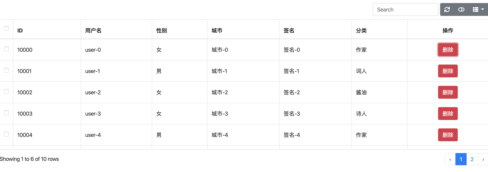

# Bootstrap Table 


<p align="center">本文作者：HelloGitHub-<strong>kalifun</strong></p>
这是 HelloGitHub 推出的[《讲解开源项目》](https://github.com/HelloGitHub-Team/Article)系列，今天给大家推荐一个 基于 Bootstrap 的 jQuery 表格插件 -- Bootstrap-Table

## 一、介绍

**其实从英文翻译就得知了，是一款Bootstrap的表格插件。**

**Bootstrap Table可用快速的建表，查询，分页，排序，等一系列功能。**

## 二、模式

> Boostatrp Table分为两种模式：客户端(client)模式,服务端(server)模式。

- **客户端**

  **通过数据接口将服务器需要加载的数据一次性展现出来，然后装换成Json然后生成table。我们可以自己定义显示行数，分页等。此时就不再会向服务器发送请求了。**

- **服务器**

  **根据设定的每页记录数和当前显示页，发送数据到服务器进行查询。**

## 三、实战操作

> **Tips：** 解释说明均在代码中以注释方式展示，请大家注意阅读。

我们采用的是最简单的CND引入方式，复制代码并将json文件配置即可看到效果。

### 3.1快速上手

示例代码：

```
<!DOCTYPE html>
<html lang="en">
<head>
    <meta charset="UTF-8">
    <title>Hello, Bootstrap Table!</title>
    // 引入css
    <link rel="stylesheet" href="https://stackpath.bootstrapcdn.com/bootstrap/4.2.1/css/bootstrap.min.css" integrity="sha384-GJzZqFGwb1QTTN6wy59ffF1BuGJpLSa9DkKMp0DgiMDm4iYMj70gZWKYbI706tWS" crossorigin="anonymous">
    <link rel="stylesheet" href="https://use.fontawesome.com/releases/v5.6.3/css/all.css" integrity="sha384-UHRtZLI+pbxtHCWp1t77Bi1L4ZtiqrqD80Kn4Z8NTSRyMA2Fd33n5dQ8lWUE00s/" crossorigin="anonymous">
    <link rel="stylesheet" href="https://unpkg.com/bootstrap-table@1.15.3/dist/bootstrap-table.min.css">
</head>
<body>
// 需要填充的表格
<table id="tb_departments" data-filter-control="true" data-show-columns="true"></table>
// 引入js
<script src="https://code.jquery.com/jquery-3.3.1.min.js" integrity="sha256-FgpCb/KJQlLNfOu91ta32o/NMZxltwRo8QtmkMRdAu8=" crossorigin="anonymous"></script>
<script src="https://cdnjs.cloudflare.com/ajax/libs/popper.js/1.14.6/umd/popper.min.js" integrity="sha384-wHAiFfRlMFy6i5SRaxvfOCifBUQy1xHdJ/yoi7FRNXMRBu5WHdZYu1hA6ZOblgut" crossorigin="anonymous"></script>
<script src="https://stackpath.bootstrapcdn.com/bootstrap/4.2.1/js/bootstrap.min.js" integrity="sha384-B0UglyR+jN6CkvvICOB2joaf5I4l3gm9GU6Hc1og6Ls7i6U/mkkaduKaBhlAXv9k" crossorigin="anonymous"></script>
<script src="https://unpkg.com/bootstrap-table@1.15.3/dist/bootstrap-table.min.js"></script>
<script>
        window.operateEvents = {
            // 当点击class=delete时触发
            'click .delete': function (e,value,row,index) {
                // 在console打印出整行数据
                console.log(row);
            }
        };


        $('#tb_departments').bootstrapTable({
            url: '/frontend/bootstrap-table/user.json',         //请求后台的URL（*）
            method: 'get',                      //请求方式（*）
            // data: data,                      // 当不使用上面的后台请求时，使用data来接收数据
            toolbar: '#toolbar',                //工具按钮用哪个容器
            striped: true,                      //是否显示行间隔色
            cache: false,                       //是否使用缓存，默认为true，所以一般情况下需要设置一下这个属性（*）
            pagination: true,                   //是否显示分页（*）
            sortable: false,                     //是否启用排序
            sortOrder: "asc",                   //排序方式
            sidePagination: "client",           //分页方式：client客户端分页，server服务端分页（*）
            pageNumber:1,                       //初始化加载第一页，默认第一页
            pageSize: 6,                       //每页的记录行数（*）
            pageList: [10, 25, 50, 100],        //可供选择的每页的行数（*）
            search: true,                       //是否显示表格搜索，此搜索是客户端搜索，不会进服务端，所以，个人感觉意义不大
            strictSearch: true,                 //启用严格搜索。禁用比较检查。
            showColumns: true,                  //是否显示所有的列
            showRefresh: true,                  //是否显示刷新按钮
            minimumCountColumns: 2,             //最少允许的列数
            clickToSelect: true,                //是否启用点击选中行
            height: 500,                        //行高，如果没有设置height属性，表格自动根据记录条数觉得表格高度
            uniqueId: "ID",                     //每一行的唯一标识，一般为主键列
            showToggle:true,                    //是否显示详细视图和列表视图的切换按钮
            cardView: false,                    //是否显示详细视图
            detailView: false,                   //是否显示父子表
            showExport: true,                     //是否显示导出
            exportDataType: "basic",              //basic', 'all', 'selected'.
            columns: [{
                checkbox: true     //复选框标题，就是我们看到可以通过复选框选择整行。
            }, {
                field: 'id', title: 'ID'       //我们取json中id的值，并将表头title设置为ID
            }, {
                field: 'username', title: '用户名'         //我们取json中username的值，并将表头title设置为用户名
            },{
                field: 'sex', title: '性别'                //我们取json中sex的值，并将表头title设置为性别
            },{
                field: 'city', title: '城市'               //我们取json中city的值，并将表头title设置为城市
            },{
                field: 'sign', title: '签名'               //我们取json中sign的值，并将表头title设置为签名
            },{
                field: 'classify', title: '分类'            //我们取json中classify的值，并将表头title设置为分类
            },{
                //ormatter:function(value,row,index)对后台传入数据 进行操作 对数据重新赋值 返回return到前台
                // events 触发事件
                field: 'Button',title:"操作",align: 'center',events:operateEvents,formatter:function(value,row,index){
                    var del = '<button type="button" class="btn btn-danger delete">删除</button>'
                    return del;
                }
            }
            ],
            responseHandler: function (res) {
                return res.data      //在加载远程数据之前，处理响应数据格式.
                // 我们取的值在data字段中，所以需要先进行处理，这样才能获取我们想要的结果
            }
        });
</script>
</body>
</body>
</html>
```



这里并没有罗列所有的API，还有很多好玩的功能等着你们去发现。

### 3.2拆解

下面对关键点进行阐述，为了更方便使用的小伙伴清楚插件的用法。

```
选择需要初始化表格。
$('#tb_departments').bootstrapTable({})
这个就像table的入口一样。
<table id="tb_departments" data-filter-control="true" data-show-columns="true"></table>
```

------

```js
columns:[{field: 'Key', title: '文件路径',formatter: function(value,row,index){} }]
```

- columns
  - field json中键值对中的Key
  - title是表格头显示的内容
  - formatter 是一个函数类型。当我们对数据内容需要修改时(例：编码转换).

------

```js
events:operateEvents
 window.operateEvents = {
        'click .download': function (e,value,row,index) {
            console.log(row);
        }
   }
```

事件触发器，因为很多时候我们需要针对表格进行处理，所以事件触发器是一个不错的选择。它可以记录我们的行数据，可以利用触发器进行函数执行等。

## 四、扩展

介绍几个扩展，让我们对表格实现更多功能，而不需要自己造轮子，让我们的工作更加高效。(可以进入官网查看扩展的具体使用方法，官方已经收集了大量的扩展)

1.表格导出

```
<script src="js/bootstrap-table-export.js"></script> 
showExport: true,                     //是否显示导出
exportDataType: basic,								//导出数据类型，支持：'基本'，'全部'，'选中'。
exportTypes:['json', 'xml', 'csv', 'txt', 'sql', 'excel']   //导出类型
```

2.自动刷新

```
<script src="extensions/auto-refresh/bootstrap-table-auto-refresh.js"></script>
autoRefresh: true, 									//设置true为启用自动刷新插件。这并不意味着启用自动刷新。
autoRefreshStatus: true,						//设置true为启用自动刷新。这是表加载时状态自动刷新。
autoRefreshInterval: 60,						//每次发生自动刷新的时间（以秒为单位）。
autoRefreshSilent: true							//设置为静默自动刷新。
```

3.复制行

```
<script src="extensions/copy-rows/bootstrap-table-copy-rows.js"></script>
showCopyRows: true,									//设置true为显示复制按钮。此按钮将所选行的内容复制到剪贴板。
copyWithHidden: true,								//设置true为使用隐藏列进行复制。
copyDelimiter: ', ',								//复制时，此分隔符将插入列值之间。
copyNewline: '\n'										//复制时，此换行符将插入行值之间。
```

## 五、总结

其实只是简单的阐述如何使用，正在对表格设计而忧愁的小伙伴，推荐使用这款插件，你会发现网页制作表格还可以如此快捷。期待小伙伴挖掘出更加有意思的功能哦。

注：上面js部分并没有采用函数形式，建议在使用熟悉之后还是采用函数形式，这样也方便复用及让代码看起来更加规范。

## 六、参考资料

[Bootstrap-Table 项目地址](https://github.com/wenzhixin/bootstrap-table)

[Bootstrap-Table 官方文档](https://bootstrap-table.com/docs/getting-started/introduction/)