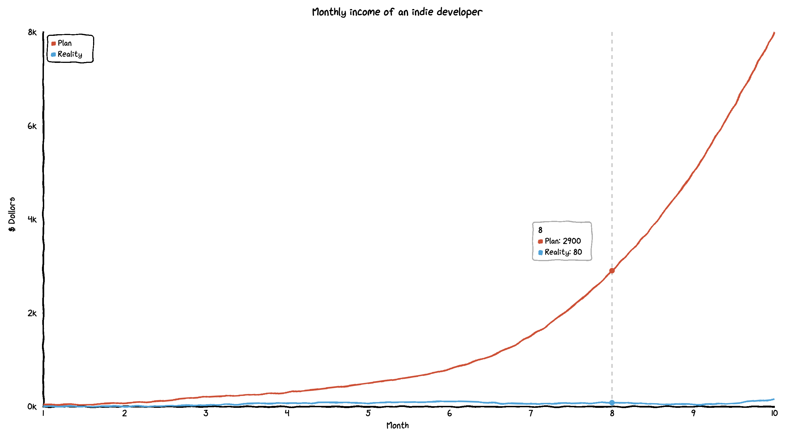
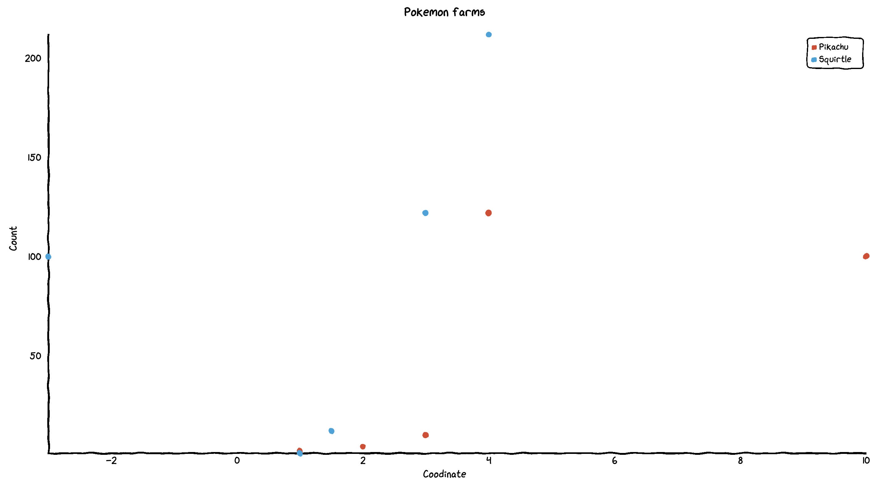
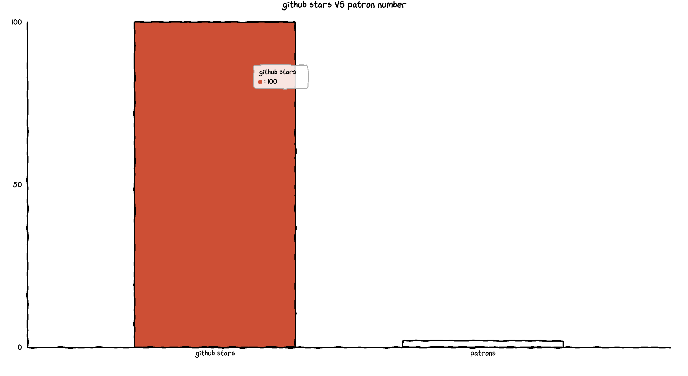
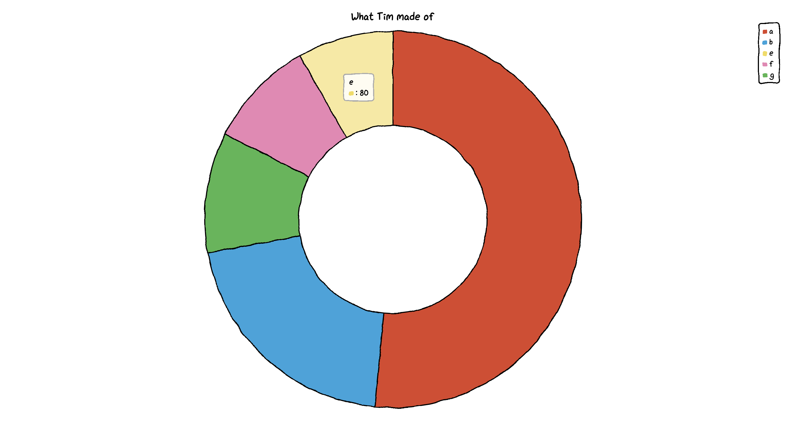
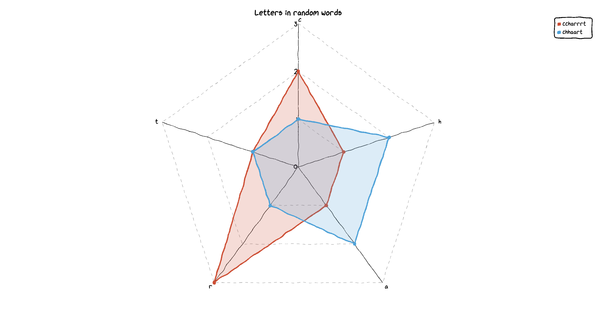

# 手绘风格的 JS 图表库：Chart.xkcd


<p align="center">本文作者：HelloGitHub-<strong>kalifun</strong></p>  

图表库千万个今天 HelloGitHub 给大家推荐个很有“特色”的图表库：一个手绘风格的 JS 图表库 —— Chart.xkcd，快收起你紧绷、严肃的面容让我们一起用手绘风格展示数据的效果。

## 一、介绍

> 项目地址：https://github.com/timqian/chart.xkcd

Chart.xkcd 是一个图表库，可绘制“非精细”、“卡通”或“手绘”样式的图表。


效果是不是很可爱？那下面就跟着 HelloGitHub 发起的[《讲解开源项目》](https://github.com/HelloGitHub-Team/Article)的教程一起学习、上手使用起来吧！

## 二、快速入手

使用 Chart.xkcd 很容易，只需页面中包含库的引用和一个用于显示图表的 `<svg>` 节点即可。

### 2.1 代码示例

先用一段简短的代码，让大家了解下基本的参数和代码的样子，后面会有可运行的代码示例片段供大家学习和使用 😁。

```html
<!DOCTYPE html>
<html lang="en">
<head>
    <meta charset="UTF-8">
    <title>Title</title>
</head>
<body>
<!--将 SVG 元素直接嵌入 HTML 页面中-->
<svg class="line-chart"></svg>
<!--引入 JS 库-->
<script src="https://cdn.jsdelivr.net/npm/chart.xkcd@1.1/dist/chart.xkcd.min.js"></script>
<script>
	//关键代码块
  const svg = document.querySelector('.line-chart')
  new chartXkcd.Line(svg, {
    title: '',
    xLabel: '',
    yLabel: '',
    data: {...},
    options: {},
  });
</script>
</body>
</html>
```

### 2.2 参数说明

- `title`：图表的标题
- `xLabel`：图表的 x 标签
- `yLabel`：图表的 y 标签
- `data`：需要可视化的数据
- `options`：自定义设置


## 三、图表类型

Chart.xkcd 支持多样的图表类型，下面将逐一讲解和实现：折线图、XY 图、条形图、圆饼/甜甜圈图、雷达图，实现的示例代码完整可运行、注释完整、包含参数说明。

**tips**：下文中的示例代码均可直接运行，保存为 html 文件便可在本机查看效果。

### 3.1 折线图

折线图以折线形式显示一系列数据点，它可以用于显示趋势数据或不同数据集的比较。

**示例代码**

```html
<!DOCTYPE html>
<html lang="en">
<head>
    <meta charset="UTF-8">
    <title>Title</title>
</head>
<body>
<!--将 SVG 元素直接嵌入 HTML 页面中-->
<svg class="line-chart"></svg>
<!--引入 JS 库-->
<script src="https://cdn.jsdelivr.net/npm/chart.xkcd@1.1/dist/chart.xkcd.min.js"></script>
<script>
    // querySelector() 方法返回文档中匹配指定 CSS 选择器的一个元素。获取文档中 class=".line-chart" 的元素。
    const svg = document.querySelector('.line-chart');

    // chartXkcd.Line 创建一个折线图
    const lineChart = new chartXkcd.Line(svg, {
        //图表的标题
        title: 'Monthly income of an indie developer',
        // 图表的 x 标签
        xLabel: 'Month',
        // 图表的 y 标签
        yLabel: '$ Dollors',
        // 需要可视化的数据
        data: {
            // x 轴数据
            labels: ['1', '2', '3', '4', '5', '6', '7', '8', '9', '10'],
            // y 轴数据
            datasets: [{
                // 第一组数据
                label: 'Plan',
                data: [30, 70, 200, 300, 500, 800, 1500, 2900, 5000, 8000],
            }, {
                // 第二组数据
                label: 'Reality',
                data: [0, 1, 30, 70, 80, 100, 50, 80, 40, 150],
            }],
        },
        // 可选配置以自定义图表的外观
        options: {
            // 自定义要在 y 轴上看到的刻度号（默认为 3）
            yTickCount: 3,
            // 指定要放置图例的位置
            legendPosition: chartXkcd.config.positionType.upLeft
        }
    });
</script>
</body>
</html>
```

**参数说明**

- `yTickCount`：自定义要在y轴上看到的刻度号（默认为 3）
- `legendPosition`：指定要放置图例的位置（默认为 `chartXkcd.config.positionType.upLeft`）。
  - 左上位置：`chartXkcd.config.positionType.upLeft`
  - 顶右上位置：`chartXkcd.config.positionType.upRight`
  - 左下位置：`chartXkcd.config.positionType.downLeft`
  - 右下位置：`chartXkcd.config.positionType.downRight`
- `dataColors`：不同颜色的数据集数组
- `fontFamily`：定制图表中使用的字体系列
- `unxkcdify`：禁用 xkcd 效果（默认为 false）

**效果展示**




### 3.2 XY 图

XY 图表用于通过指定点的 XY 坐标来绘制点，您也可以通过连接这些点来绘制 XY 折线图。

**示例代码**

```html
<script>
    // querySelector() 方法返回文档中匹配指定 CSS 选择器的一个元素。获取文档中 class=".xy-chart" 的元素。
    const svg = document.querySelector('.xy-chart');
    //chartXkcd.XY 创建一个XY图
    new chartXkcd.XY(svg, {
        //图表的标题
        title: 'Pokemon farms',
        // 图表的 x 标签
        xLabel: 'Coodinate',
        // 图表的 y 标签
        yLabel: 'Count',
        // 需要可视化的数据
        data: {
            datasets: [{
                // 第一组数据
                label: 'Pikachu',
                data: [{ x: 3, y: 10 }, { x: 4, y: 122 }, { x: 10, y: 100 }, { x: 1, y: 2 }, { x: 2, y: 4 }],
            }, {
                // 第二组数据
                label: 'Squirtle',
                data: [{ x: 3, y: 122 }, { x: 4, y: 212 }, { x: -3, y: 100 }, { x: 1, y: 1 }, { x: 1.5, y: 12 }],
            }],
        },
        options: {
            // 自定义要在 x 轴上看到的刻度号（默认为 3）
            xTickCount: 5,
            // 自定义要在 y 轴上看到的刻度号（默认为 3）
            yTickCount: 5,
            // 指定要放置图例的位置
            legendPosition: chartXkcd.config.positionType.upRight,
            // 用线连接点（默认 false）
            showLine: false,
            // 指定时间格式
            timeFormat: undefined,
            // 更改点的大小（默认为 1）
            dotSize: 1,
        },
    });
</script>
```


**参数说明**

- `xTickCount`：自定义要在x轴上看到的刻度号（默认为 3）
- `yTickCount`：自定义要在y轴上看到的刻度号（默认为 3）
- `legendPosition`：指定要放置图例的位置
- `showLine`: 点连接成线。
- `timeFormat`：指定时间格式
- `dotSize`：更改点的大小（默认为 1）
- `dataColors`：不同颜色的数据集数组
- `fontFamily`：定制图表中使用的字体系列
- `unxkcdify`：禁用 xkcd 效果（默认为 false）

**效果展示**



如果你想将这些点连接起来，让数据对比更加明显的话。请修改 `showLine：true` 再刷新页面你就可以看到连线的效果了。

### 3.3 条形图

条形图提供了一种显示以竖条表示的数据值的方式。

**示例代码**

```html
<script>
    // querySelector() 方法返回文档中匹配指定 CSS 选择器的一个元素。获取文档中 class=".bar-chart" 的元素。
    const svg = document.querySelector('.bar-chart');
    // chartXkcd.Bar 创建一个条形图
    const barChart = new chartXkcd.Bar(svg, {
        // 图表的标题
        title: 'github stars VS patron number',
        // xLabel: '', // optional
        // yLabel: '', // optional
        // 图表数据
        data: {
            labels: ['github stars', 'patrons'],
            datasets: [{
                data: [100, 2],
            }],
        },
        options: {
            // 自定义要在 y 轴上看到的刻度号（默认为 3）
            yTickCount: 2,
        },
    });
</script>
```

**参数说明**

- `yTickCount`：自定义要在y轴上看到的刻度号（默认为 3）
- `dataColors`：不同颜色的数据集数组
- `fontFamily`：定制图表中使用的字体系列
- `unxkcdify`：禁用xkcd效果（默认为 false）

**效果展示**




### 3.4 圆饼/甜甜圈图

饼图广泛得应用在各个领域，用于表示不同分类的占比情况，通过弧度大小来对比各种分类。饼图通过将一个圆饼按照分类的占比划分成多个区块，整个圆饼代表数据的总量，每个区块（圆弧）表示该分类占总体的比例大小，所有区块（圆弧）的加和等于 100%。

**示例代码**

```html
<script>
    // querySelector() 方法返回文档中匹配指定 CSS 选择器的一个元素。获取文档中 class=".pie-chart" 的元素。
    const svg = document.querySelector('.pie-chart');
    // chartXkcd.Pie 创建一个圆饼图
    const pieChart = new chartXkcd.Pie(svg, {
        // 图表的标题
        title: 'What Tim made of',
        // 需要可视化的数据
        data: {
            labels: ['a', 'b', 'e', 'f', 'g'],
            datasets: [{
                data: [500, 200, 80, 90, 100],
            }],
        },
        options: {
            // 指定空的饼图半径
            innerRadius: 0.5,
            // 指定要放置图例的位置
            legendPosition: chartXkcd.config.positionType.upRight,
        },
    });

</script>
```

**参数说明**

- `innerRadius`：指定空的饼图半径（默认值：0.5）
  - 需要饼图吗？将 `innerRadius` 设置为 0
- `legendPosition`：指定要放置图例的位置
- `dataColors`：不同颜色的数据集数组
- `fontFamily`：定制图表中使用的字体系列
- `unxkcdify`：禁用 xkcd 效果（默认为 false）

**效果展示**




### 3.5 雷达图

雷达图（Radar Chart）又被叫做蜘蛛网图，适用于显示三个或更多的维度的变量。雷达图是以在同一点开始的轴上显示的三个或更多个变量的二维图表的形式来显示多元数据的方法，其中轴的相对位置和角度通常是无意义的。

**示例代码**

```html
<script>
    // querySelector() 方法返回文档中匹配指定 CSS 选择器的一个元素。获取文档中 class=".radar-chart" 的元素。
    const svg = document.querySelector('.radar-chart');
    // chartXkcd.Radar 创建一个雷达图
    const radarChart = new chartXkcd.Radar(svg, {
        // 图表的标题
        title: 'Letters in random words',
        // 需要可视化的数据
        data: {
            labels: ['c', 'h', 'a', 'r', 't'],
            datasets: [{
                label: 'ccharrrt',
                data: [2, 1, 1, 3, 1],
            }, {
                label: 'chhaart',
                data: [1, 2, 2, 1, 1],
            }],
        },
        options: {
            // 在图表中显示图例
            showLegend: true,
            // 点的大小
            dotSize: 0.8,
            // 在每行附近显示标签
            showLabels: true,
            // 指定要放置图例的位置
            legendPosition: chartXkcd.config.positionType.upRight,
            // unxkcdify: true,
        },
    });
</script>
```

**参数说明**

- `showLabels`：在每行附近显示标签（默认为 false）
- `ticksCount`：自定义要在主行上看到的刻度号（默认为 3）
- `dotSize`：更改点的大小（默认为 1）
- `showLegend`：在图表附近显示图例（默认为 false）
- `legendPosition`：指定要放置图例的位置
- `dataColors`：不同颜色的数据集数组
- `fontFamily`：定制图表中使用的字体系列
- `unxkcdify`：禁用 xkcd 效果（默认为 false）

**效果展示**




## 四、最后

以上就是讲解的全部内容，相信教程至此 Chart.xkcd  库的基本用法你已经基本掌握，后面就可以用来今天学到的东西，提高自己项目的颜值了。

有了 Chart.xkcd 让数据可爱地展示出来并不难，快动手自己实现一个吧～

## 五、参考资料

[CHART.XKCD 官方文档](https://timqian.com/chart.xkcd/)

[CHART.XKCD 项目地址](https://github.com/timqian/chart.xkcd)

