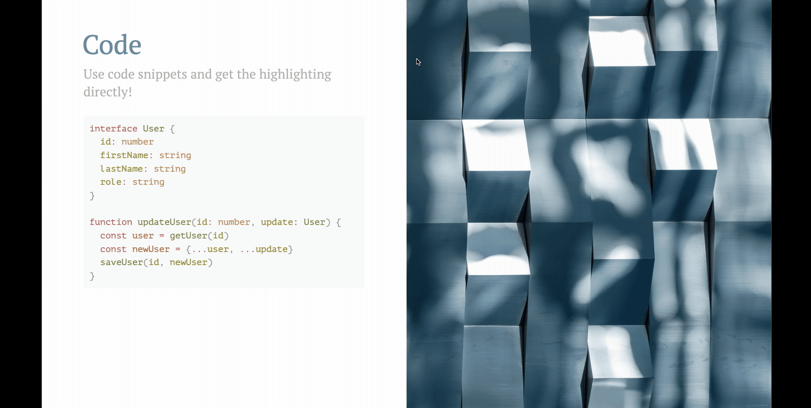
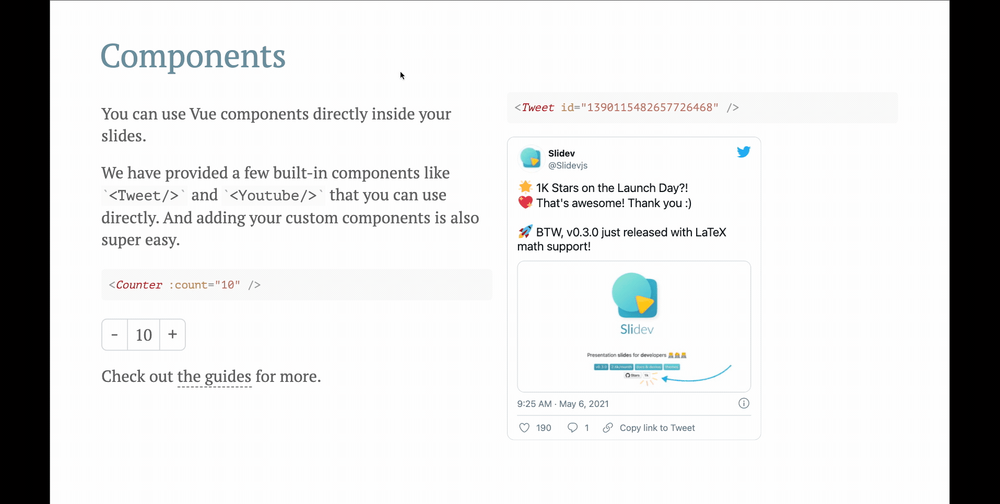
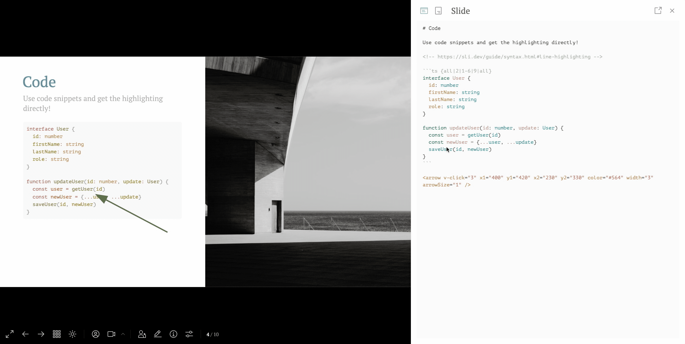
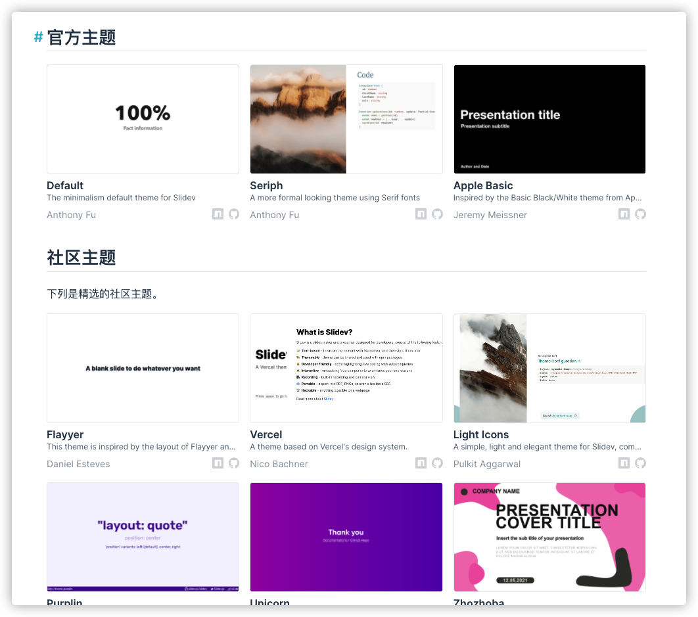

# 未曾想过能用Markdown做PPT

本文作者：HelloGitHub-<strong>蔡文心</strong>

哈喽呀~各位，有没有注意到今天的头图呀(我从官网偷来的)，这是我在 github 上发现的开源项目—— Slidev。

> https://cn.sli.dev/

## 先一起来看看官方介绍

### 为开发者打造的演示文稿工具

- 📄 在单一 Markdown 文件中编写幻灯片
- 🌈 主题，代码高亮，可交互的组件
- 🎙 可以使用另一个窗口，甚至是你的手机来控制幻灯片
- 🧮 内置了对 LaTeX 数学公示的支持
- 📰 使用文本描述语言创建图表
- 🎥 内置录制功能和摄像头视图
- 📤 能够导出 PDF、PNG 文件，甚至是一个可以托管的单页应用

就是可以用 **Markdown** 语法来**制作 PPT**，同时在 **PPT 中**为**代码片段**提供编辑和实时预览效果，为开发者提供了**扩展**能力。

Markdown 相信大家多少都写过。别人我不知道哈，在我这 Markdown 除了语法简单，易上手和足够流行以外，更重要的一点是：它拉高了我的创作内容的颜值**下限**。

不会吧，不会吧，都2021年了，不会还有人觉得颜值不重要吧？

我们开发者在日常工作中用PPt的机会多吗？与产品经理和项目经理之类的 **Manager** 相比肯定是非常少的，所以既然难得用，那还不抓紧机会装装一装？

想象一下，公司要开技术分享会了，别的同事可能都是准备了一份 Markdown 外加几张页面（用 Word 的我就不说了，毕竟太欺负人了）。阿巴阿巴……一通讲完，这样的方式好吗？好但又不完全好。

如果使用 PPT 来分享内容将更容易让大家沉浸其中，仿佛这不是一场技术分享会而是一场发布会。

## 来给大家演示一下

### 代码嵌入

### Vue 组件

### 编辑器集成

Slidev 带有一个集成的 CodeMirror 编辑器，可以立即重新加载并保存更改到文件中。

Slidev 得益于 Vite，Vue 3 和 Windi CSS，为你带来了最美妙的创作体验。你所做的每一个改变都会**立即反映**到你的幻灯片上。

### 主题

## 技术栈

- [Vite](https://vitejs.dev/) —— 一款极速的前端工具
- 基于 [Vue 3](https://v3.vuejs.org/) 的 [Markdown](https://daringfireball.net/projects/markdown/syntax) —— 专注内容的同时，具备 HTML 和 Vue 组件的能力
- [Windi CSS](https://github.com/windicss/windicss) —— 按需、实用类优先的 CSS 框架，轻松定制你的幻灯片样式
- [Prism](https://github.com/PrismJS/prism), [Shiki](https://github.com/shikijs/shiki), [Monaco Editor](https://github.com/Microsoft/monaco-editor) —— 具有实时编码能力的一流代码片段支持
- [RecordRTC](https://recordrtc.org/) —— 内置录制功能和摄像头视图
- [VueUse](https://vueuse.org/) 家族 —— [`@vueuse/core`](https://github.com/vueuse/vueuse)、[`@vueuse/head`](https://github.com/vueuse/head)、[`@vueuse/motion`](https://github.com/vueuse/motion) 等
- [Iconify](https://iconify.design/) —— 图标库集合
- [KaTeX](https://katex.org/) —— LaTeX 数学渲染
- [Mermaid](https://mermaid-js.github.io/mermaid) —— 文本描述语言创建图表

Slidev 一个特别的地方在于它是完全基于 Vue3 进行开发的，整套技术栈在目前都属于是最前沿的。对于想从Vue2跨入Vue3的同志们，Slidev 的源码有很大的价值。

## 最后

今天给大家简单介绍了一下 Slidev 项目，Slidev 的更多功能还隐藏在它的文档中等待大家发现。

从产品角度来讲 Slidev 的的确确让我感受到了它的价值和它想做的事。它并不是一个单纯的可以用 Markdown 制作 PPT 的产品，它的核心是为开发者提供更专业、更方便、更美观的 PPT 制作工具。就像本篇标题中的四个字**未曾想过**，未曾想过应该有为开发者设计的专业 PPT 工具。

谢谢大家，我是蔡文心，我们下次再见

各位老爷喜欢别忘了给我点个赞