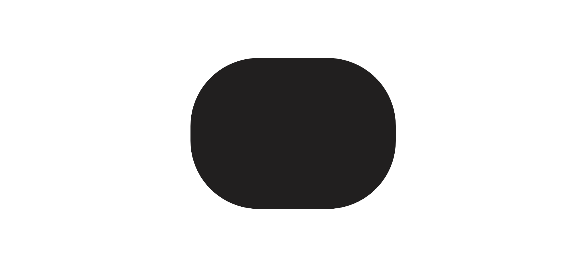
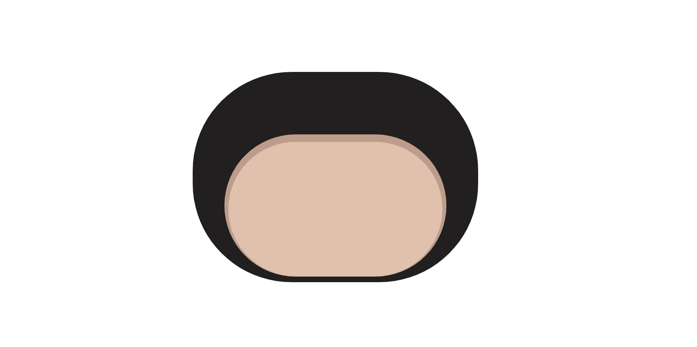
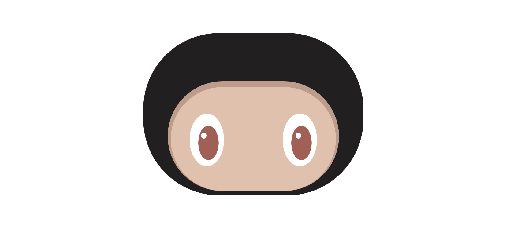
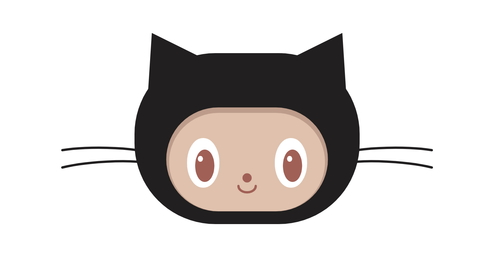

# 教你利用代码画GitHub喵-Zdog

> 在之前我们就介绍了Zdog如何使用，接下来我将带领各位利用zdog画出一个github喵（和官方的还是有些差别的）。


## 一、分析

通过上面的动画，我们可以对GitHub喵进行分析，给我们最直观的就是7部分。头部，脸，眼睛，鼻子，嘴巴，胡须，耳朵。

- 头部：由一个规则的实体圆角矩形组成。
- 脸：有两个规则的实体圆角矩形组成。第一层是制作阴影，第二层是脸。
- 眼睛：由三个椭圆形组成的眼睛，然后利用复制生成另一只眼睛。
- 鼻子：由一个椭圆形组成。
- 嘴巴：由一个椭圆形变成一个半圆形则是嘴巴啦。
- 胡须：由两条曲线进行复制完成。
- 耳朵：由带圆形底座的方形圆柱组成。

通过上面分析我们需要使用的技术栈：

- Zdog.Anchor：将多个形状或项目合并成一个项目来进行渲染等。
- Zdog.Group：控制渲染顺序，继承Anchor。形状将按照添加到组中的顺序呈现。
- Zdog.RoundedRect：圆角矩形，使用cornerRadius设置圆角半径。
- Zdog.Cone：带圆形底座的方形圆柱。
- Zdog.Shape：自定义形状的形状类。Shape的形状由其路径定义。
- Zdog.TAU:以弧度为单位的完整旋转。Math.PI * 2 == TAU,但比PI更加友好，因为TAU直接映射到完整旋转。
- copy：针对相同的形状进行复制。
- copyGraph：复制带有子项的项目。

## 二、步骤

### 创建画布

```
<!DOCTYPE html>
<html lang="en">
<head>
    <meta charset="UTF-8">
    <title>github喵</title>
    <style>
        .zdog-canvas{
            display: block;
            margin: 0px auto;
        }
    </style>
</head>
<body>
<!--Zdog在<canvas>或<svg>元素上呈现。width和height属性以设置大小。-->
<canvas class="zdog-canvas" width="1200" height="800" style="width: 600px;height: 400px"></canvas>
<!--引入js文件-->
<script src="https://unpkg.com/zdog@1/dist/zdog.dist.min.js"></script>
<script>
		// 1.将选定画布，进行创作
    let illo = new Zdog.Illustration({
        element: ".zdog-canvas",
        dragRotate: true,
    });
    
		//下面是准备的配色
    // 瞳孔的颜色
    const colorFeatures = "#AB5C53";
    // 头的颜色
    const black         = "#211F1F";
    // 阴影的颜色
    const colorShadow   = "#C39B88";
    // 皮肤的颜色
    const colorSkin     = "#E5C0AA";
    // 眼睛最外圈的颜色
    const white         = "#FFF";
    
    //----------------------------
    //下面的所有代码将都在这里书写
    //----------------------------
    
    illo.updateRenderGraph();
</script>
</body>
</html>
```

### 画头

```
// 可以添加到Zdog场景的所有项目都充当锚点。
    const head = new Zdog.Anchor({
        addTo: illo,
        translate: {
        		// 向y轴移动
            y: 15
        },
    });

    // 具有分离渲染顺序的项目。继承Anchor。
    const domepiece = new Zdog.Group({
        addTo: head
    });

    // 真正进行画头，是一个实体矩形
    const noggin = new Zdog.RoundedRect({
        addTo: domepiece,
        // 设置高度和宽度
        width: 160,
        height: 66,
        // 渲染形状线并设置线宽。默认笔划：1。
        stroke: 230,
        // 使用cornerRadius设置圆角半径
        cornerRadius: 20,
        // 设置颜色
        color: black,
        path: [
            { x: -4.5 },
            { x: 5.5 }
        ]
    });
```



###画脸 

```
// 我们需要画下一组图形，那就是脸。脸被定义为一组
    const face = new Zdog.Group({
        addTo: head,
        // 将阴影部分进行位置的调节
        translate: {
            // x轴我们不动，保持正中
            x: 0,
            // y轴进行往下移动
            y: 36,
            // 为了3D更加真实，我们需要将脸部往外突出一点。这样才更加逼真
            z: 20
        },
    });

    // 下面我们开始进行阴影的绘画，它是由一个实体矩形组成
    const skinShadow = new Zdog.RoundedRect({
        addTo: face,
        // 设置高度和宽度
        width: 100,
        height: 0,
        // 渲染形状线并设置线宽。默认笔划：1。
        stroke: 180,
        //使用cornerRadius设置圆角半径
        cornerRadius: 40,
        // 设置颜色
        color: colorShadow,
    });

    // 下面开始画脸的部分
    const skin = new Zdog.RoundedRect({
        addTo: face,
        // 高宽和上面需要一直，为了产生阴影的效果，我们只需要将我们的画笔的宽度小一点并就可以看到想要的效果。
        width: 100,
        height: 0,
        // 比之前的阴影部分减小一点
        stroke: 170,
        // 圆角半径和阴影部分是一致的
        cornerRadius: 40,
        // 设置颜色
        color: colorSkin,
        // 为了和阴影的下半部分重叠，需要将其往下移动
        translate: {
            y: 4.5
        }
    });
```



### 画眼睛

```
// 眼睛最外部分为纯白色
    const iris = new Zdog.Ellipse({
        addTo: eye,
        // 渲染内部形状区域
        fill: true,
        width: 40,
        height: 56,
        // 圆角半径
        stroke: 2,
        // 放大或缩小项目几何体
        scale: 1.5,
        color: white,
    });

    // 瞳孔部分
    const pupil = new Zdog.Ellipse({
        addTo: eye,
        // 设置长宽
        width: 37,
        height: 56,
        stroke: 0,
        fill: true,
        color: colorFeatures,
        // 由于它的位置需要更靠近右边
        translate: {
            x: 3,
            y: 5,
            z: 0
        },
    });

    // 然后是瞳孔里的小白点
    const anotherpupil = new Zdog.Ellipse({
        addTo: pupil,
        // 设置宽度
        width: 10,
        height: 10,
        color: white,
        fill: true,
        stroke: 0,
        // 设置位置
        translate: {
            x: -7,
            y: -12,
            z: 3
        }
    });

    // 这里将刚绘画好的左眼复制出来
    const eyeright = eyeleft.copyGraph({
        // 并调整好眼睛的位置
        translate: {
            x: 76,
            y: 6,
            z: 80
        },
        rotate: {
            y: TAU / -14
        }
    });
```



### 画鼻子

```
// 画鼻子部分，相对很简单，因为就是一个圆形
    const nose = new Zdog.Ellipse({
        addTo: face,
        // 设置宽度
        width: 6,
        height: 6,
        fill: true,
        stroke: 10,
        // 设置颜色
        color: colorFeatures,
        // 调整位置
        translate: {
            x: 0,
            y: 32,
            z: 74
        },
    });
```


### 画嘴巴

```
//接下来是画嘴巴部分
    const mouth = new Zdog.Ellipse({
        addTo: face,
        // 设置圆的直径
        diameter: 30,
        // 将其设置为1/4的圆，我们取值为2，所以获得半圆
        quarters: 2,
        // 设置圆角半径
        stroke: 4,
        // 将半圆进行缩放，使其更加逼真
        scale: {
            x: 0.8,
            y: 1
        },
        color: colorFeatures,
        // 将半圆进行旋转，让开口向上
        rotate: {
            x: TAU / 2.3,
            z: TAU / -4
        },
        // 然后再对其调整合理的位置
        translate: {
            x: 0,
            y: 46,
            z: 74
        },
    });
```


### 画耳朵

```
// 画耳朵
    // 带圆形底座的方形圆柱
    // 绘画左耳
    const ear = new Zdog.Cone({
        addTo: head,
        // 设置圆的直径
        diameter: 120,
        // 设置长度
        length: 90,
        stroke: false,
        color: black,
        // 调整位置
        translate: {
            x: -120,
            y: -105
        },
        // 圆角朝向为正z轴，因此需要对其旋转
        rotate: {
            x: TAU/4,
            y: TAU/12
        },
    });

    // 绘画右耳，将左耳进行复制，移动，旋转
    ear.copy({
        translate: {
            x: 120,
            y: -105
        },
        rotate: {
            x: TAU/4,
            y: TAU/-12
        },
    });
```


### 画胡须

```
// 开始进行画胡须
    // shape自定义形状
    const whisker = new Zdog.Shape({
        addTo: whiskers,
        path: [
            // 起始点
            { x: 100, y: 0 },
            // 曲线的椭圆适合由前一个拐角和终点形成的矩形。
            { arc: [
                    // 拐角
                    { x: 30, y: -10 }, // corner
                    // 终点
                    { x: -30, y: 0 }, // end point
                ]}
        ],
        closed: false,
        // 胡须的宽度
        stroke: 4,
        color: black,
    });

    // 左侧的另一条胡须，只需要按照上面的设置进行下移即可
    whisker.copy ({
        path: [
            { x: 100, y: 0 },
            { arc: [
                    { x: 30, y: -5 }, // corner
                    { x: -30, y: 10 }, // end point
                ]}
        ],
        // 将胡须往下移
        translate: {
            y: 20
        },
    });

    // 将左侧的胡须复制进行移动并旋转
    const whiskersright = whiskersleft.copyGraph({
        translate: {
            x: 290,
            y: 20
        },
        rotate: {
            y: TAU/2,
        },
    });
```



## 总结

当我们对代码进行分析时，其实感觉并没有想象中的复杂，我们需要精心去进行分析。把需要的形状先构思好，然后再参考zdog文档，有没有快捷的方式获得你想要的形状。

## 参考资料

[Zdog官方文档](https://zzz.dog/)

[效果来源](https://www.17sucai.com/preview/1750622/2019-08-08/ztocat/index.html)