# 谁会拒绝一款开源的 3D 博客呢？

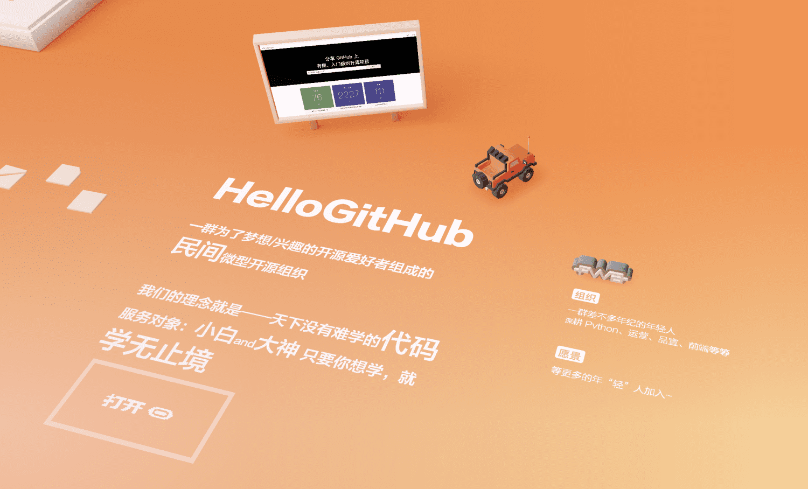

说到博客大家一定都不陌生，不管你是深耕职场多年的老鸟，还是在学校努力学习的小鸟，应该都有过一段“装扮”博客的经历，比如：放上喜欢的图片、添加炫酷的交互、换上 DIY 的博客主题等等。但不管再怎么“打扮”，也跳脱不出平面的“凡胎”。

今天 HelloGitHub 给大家带来的是一款开源的 3D 博客项目，实话说我第一次访问这个博客的时候都惊呆了，颠覆了我对博客的认知。进去后需要通过操控一辆 3D 的小汽车，自己“找到”文章才可以阅读，特别有意思！


> 在线：https://bruno-simon.com/
>
> 项目：https://github.com/brunosimon/folio-2019 

接下来，本文会先介绍如何在本地把项目运行起来，然后讲解其源码和相关技术，最后教你如何修改代码把自己的博文放进去，升级到 3D 博客！下面让就让我们一起走进这个开源的 3D 博客，将惊喜转化为兴趣。

## 一、介绍

### 1.1 安装步骤

话不多说先跑起来再说，只需 4 步。命令如下：

```
# 1.下载项目
git clone git@github.com:brunosimon/folio-2019.git
# 2.安装了 Parcel（Web 应用打包工具）
npm install -g parcel-bundler
# 3.安装依赖（仅第一次需要）
npm i
# 4.运行
npm run dev
```

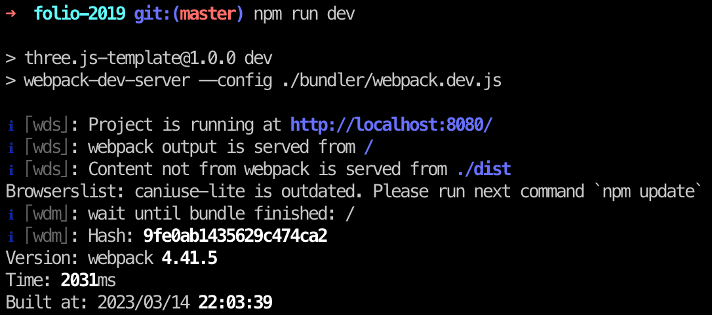

> 提示：这里就不过多介绍 [如何安装 Node.js](https://nodejs.org/zh-cn/) 啦！

### 1.2 运行效果

首先，我们来看看这个博客长什么样子：

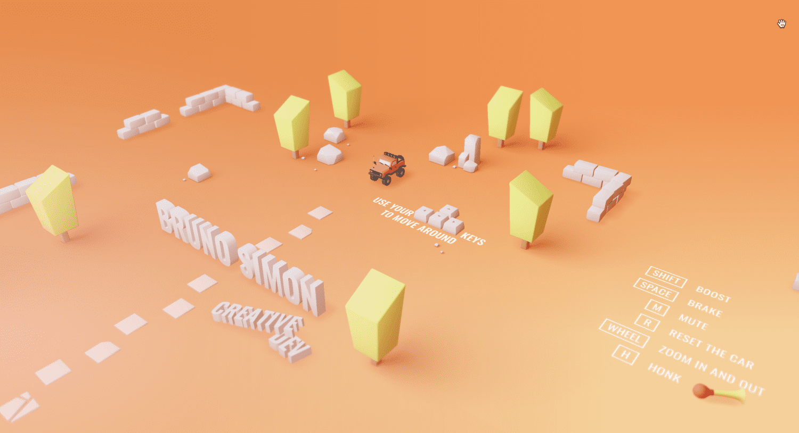

一辆红色、可爱的小吉普车，在漫无边际的地图上自由的驰骋，还可以按按喇叭助助兴，是的没错！这个博客还自带音效。

### 1.3 小游戏

正当你“开”着小车唱着歌，突然就被作者创造的这一个 3D 世界给“绑架”了！因为他不止有简单的模型，还附带了一些非常有意思的小游戏。

比如你可以猛地加速撞击这三面“泡沫墙体”：

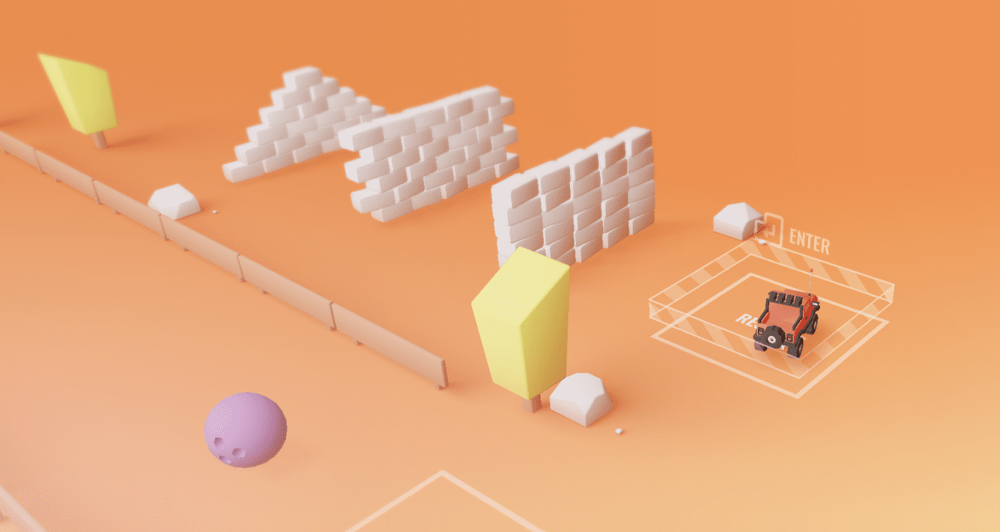

又或者是开着小吉普车“打保龄球”：

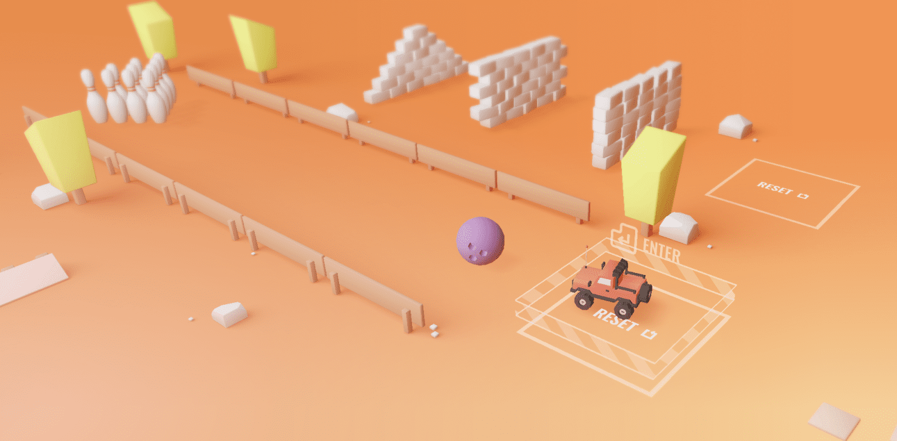

又或者是做一些“刺激”的越野训练：

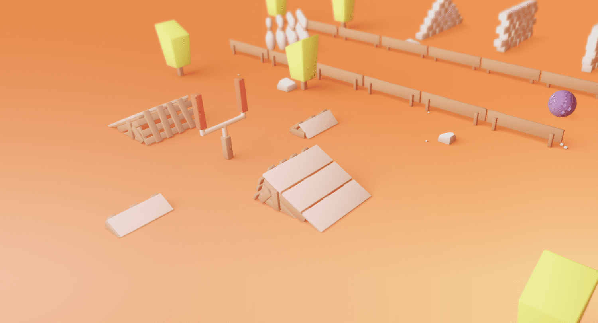

这些小游戏是不是非常有意思呢？

### 1.4 关于作者

能写出这么有意思的 3D 博客的作者，也是一定是位非常有意思的人，这不他把自己的生活也“刻画”到了这个项目里。

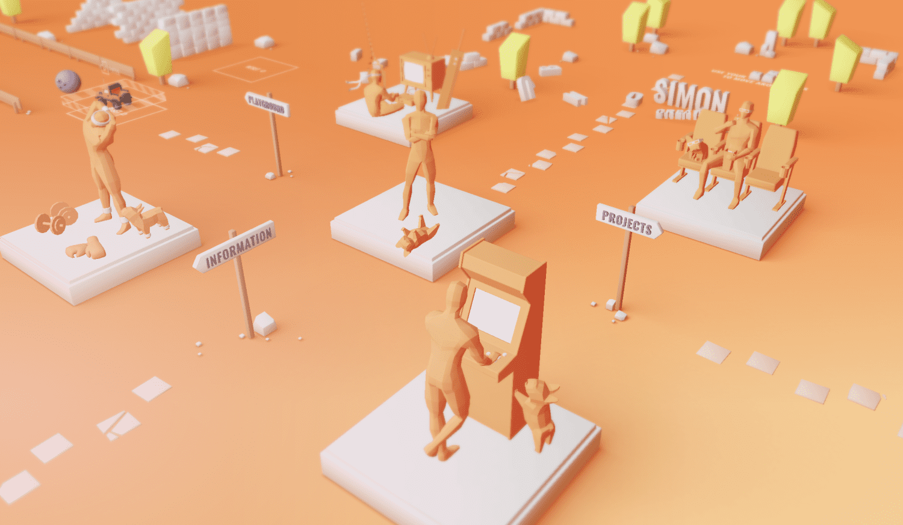

我们大致可以猜到这位大佬的日常生活大致是“一人一狗”，而且他非常爱自己的狗狗。除了打游戏，健身、出门还有其他一些活动都是和它在一起。

啊！多么惬意的生活呀~这哪里是程序员的生活呢？这明明就是财富自由的生活啊！你以为这个博客就只是记录生活点滴那你就错了，当我们的小吉普驾驶到 “project” 的时候，我们会看到很多作者写的技术博文。

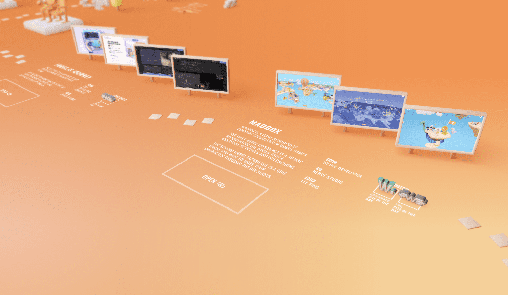

聊完闲篇，下面进入代码的世界！

## 二、项目概览

### 2.1 项目结构

我们先看一下项目结构：

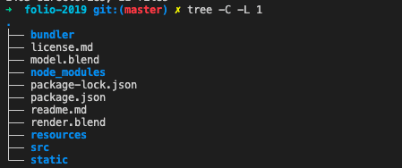

简单地对这些目录做一个概述：

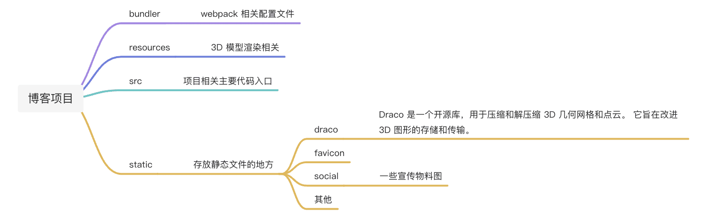

是不是有很多文件看不懂？没关系，我们先从最主要的文件开始，也就大家最熟悉的 `src` 文件夹，这里放的都是核心代码。而且其中最主要的代码文件，相信你一眼就能看出来，没错！就是 `index.js`。

```javascript
import './style/main.css'
import Application from './javascript/Application.js'

window.application = new Application({
    $canvas: document.querySelector('.js-canvas'),
    useComposer: true
})
```

这个 `index.js` 是不是非常简单，它就是告诉我们其实刚刚看到的所有效果，都是一个 `canvas`！而处理逻辑的代码都来自于 `Application.js`，我们这里摘出一些比较重要的技术栈、项目用到的核心库相，做一个简单的介绍。

相信很多小伙伴早就猜到了，对！就是 `Three.js`。

### 2.2 Three.js

Three.js 是一个 3D 的 JavaScript 库，可以让开发者在 Web 上创造 3D 体验，它和 WebGL 是最佳拍档。

> 地址：https://github.com/mrdoob/three.js

那 WebGL 又是个什么东西呢？WebGL 是一个 JavaScript API，它与大多数现代浏览器兼容，且直接使用图形处理单元 (GPU)，这可以实现出色的优化和更多的控制，而且速度很快。

不过原生的 WebGL 难且复杂，使用原生的 WebGL 在画布上**绘制一个三角形至少需要 100 行代码**，在这种情况下再去添加透视、灯光、模型和动画等等一切东西，可想而知有多令人头秃了。为了保住程序员为数不多的头发，就诞生了 Three.js 库。它的价值是简化处理上述所有内容的过程，**只需几行代码即可获得动画 3D 场景**。

### 2.3 dat.gui

这个 3D 博客项目用到的另外一库是：dat.gui.js，它是一个用于在 JavaScript 中更改变量的轻量级图形用户界面，使用这个库可以很容易地创建出能够改变代码变量的界面组件。实现的界面大致样子如下：

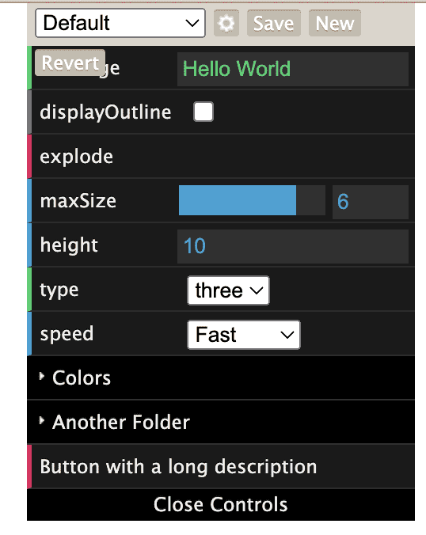


## 三、讲解源码

介绍完重要的技术点，下面继续回到逻辑处理的核心文件 `Application.js` 开始讲解源码。

### 3.1 构建世界

从代码结构上看，可以看到入口就在 `this.setWorld` 里，让我们来简单看看这里的代码：

```javascript
constructor(_options)
{
  // Options
  this.config = _options.config
  this.debug = _options.debug
  ...
  // Set up
  this.container = new THREE.Object3D()
  this.container.matrixAutoUpdate = false

  this.setSounds() // 声音
  this.setControls() // 一些按键控制等
  this.setFloor() // 地板设置
  this.setAreas() // 区域设置
  this.setStartingScreen() // 首屏动画（loading > start）
}
```

相信上面的一些设置你一眼就看懂了，这里挑几个可能产生疑惑的方法名再简单说明一下。`this.setControls` 主要包含了两个方法：`this.setActions` 和 `this.setKeyboard`，这里就是小吉普车行驶和按喇叭等的按键控制。

而 `this.setFloor` 主要是针对当前场景的地板样式的配置文件，如果你不喜欢原始的配色方案，你大可以自定义一个“五彩斑斓”的颜色，但前提是要具备一定的审美不然可能就翻车如下图了。

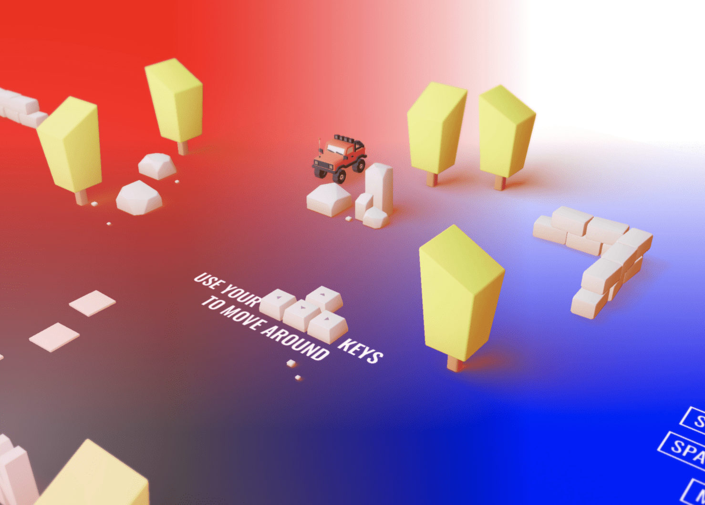

这里只是针对场景四个角（左上角、右上角、左下角、右下角）的颜色做了自定义，代码片段如下：

```javascript
 // Colors 修改前
this.colors = {}
this.colors.topLeft = '#f5883c'
this.colors.topRight = '#ff9043'
this.colors.bottomRight = '#fccf92'
this.colors.bottomLeft = '#f5aa58'

// Colors 修改后
this.colors = {}
this.colors.topLeft = 'red'
this.colors.topRight = 'yello'
this.colors.bottomRight = 'blue'
this.colors.bottomLeft = 'black'
```

剩下的 `this.setAreas` 主要是针对一些鼠标事件做了处理，便于我们用鼠标拖动和探索整个“世界”，包含了 `mousemove`、`mousedown`、`touchstart` 等，相关代码就不贴出来了，感兴趣的可以自行探索~

### 3.2 开始之后

以上这些构建都是在开始页面出现的时候执行的代码，相当于提前做了一部分资源加载，那剩下的一些加载就在我们点击「start」之后开始。

在 `World.js` 文件里，我们也可以找到相应的代码 `this.start`。

```javascript
// On interact, reveal 点击 start 的交互
this.startingScreen.area.on('interact', () =>
  {
  TweenLite.to(this.startingScreen.startLabel.material, 0.3, { opacity: 0, delay: 0.4 })
  // 剩下的资源加载
  this.start()

  window.setTimeout(() =>
  {
    this.reveal.go()
  }, 600)
  })
```

在 `start` 这个方法里面我们会看到更多内容的加载，比如小吉普车的加载，还有我们最想知道的文章列表的加载。

```javascript
start()
{
  this.setCar() // 汽车加载
  this.areas.car = this.car
  this.setSections() // 文章加载
}
```

没错就是它，接下来我们要找文章入口的方向标。即 x 和 y 轴表示这个对象在画布上的坐标位置，我们也可以挪到自己喜欢的位置上去。

```javascript
// Projects
this.sections.projects = new ProjectsSection({
  ...options,
  x: 30,
  y: - 30
})
```

这里需要稍微介绍下 `Three.js` 的坐标轴系，它采用右手坐标系, 如下图所示，与此对应的还有左手坐标系：

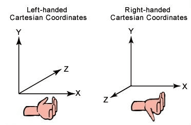

所以，当我们加大 x 的值后，我们会发现整个文章距离变得远了，同理修改 y 值也是同样的效果。

### 3.3. 文章列表

查看 `ProjectsSection.js` 文件，我们发现里面有很多的图片，先别管往下看就会看到一个 `setList`，改动如下：

```javascript
setList()
    {
        this.list = [
            {
                name: 'HelloGitHub',
                imageSources:
                [
                    projectsThreejsJourneySlideESources
                ],
                floorTexture: this.resources.items.projectsThreejsJourneyFloorTexture,
                link:
                {
                    href: 'https://hellogithub.com/',
                    // 控制按钮的位置
                    x: - 5.8,
                    y: - 4.5,
                    // 控制open按钮大小（0,0）的时候无边框
                    halfExtents:
                    {
                        x: 2,
                        y: 1
                    }
                },
                distinctions:
                [
                    // 一个3d模型的图标,xy是坐标轴位置
                    { type: 'fwa', x: 4.15, y: 5.15 }
                ]
            }
        ]
    }
```

如此一来，你就拥有了“自己”的 3D 博客，**只不过谦虚一点来说，3D 是别人的，博客是你自己的**。来张特写看看：


结合图片我们对上面的代码做一些解释：

1\. `imageSources`：就是“广告牌”上面的图片，我这里只弄了一张 HelloGitHub 社区首页的图片，你也可以按照原博客那样放上好几张图。

图片存放的地址和引入规则：
```javascript
import projectsThreejsJourneySlideESources from '../../../models/projects/threejsJourney/slideE.jpg'
```

2\. `floorTexture` 即“地板贴图”，也就是我们看到“躺”在地上的那个图，或许你会问：为什么不能直接把图放上去还需要变成一个 `texture` 贴图呢？

因为，这是一个 3D 世界，随着鼠标上下拖动，我们对于这个图的视觉会发生变化，所以需要把图也“放”到一个 3D 容器中去，这样我们所构建的 3D 世界才真实可信。所以这里我们跟着代码去倒推这个图是怎么生成。

```javascript
floorTexture: this.resources.items.projectsThreejsJourneyFloorTexture,
```

我们得知它是“挂”在 `resources` 对象下面的。一层一层查下去，我们发现他是在 `Application.js` 的时候加载进来的。进到 `Resources.js` 文件，我们可以发现有非常多的资源文件例如 `.png`、`.glb` 之类的。 

**什么是 glb 文件?**

上文提到的 `.glb` 后缀的文件，它包含以 GL 传输格式（glTF）保存的三维模型。它以二进制格式存储有关三维模型的信息，例如节点层次结构、摄影机和材质、动画和网格。`.glb` 文件是 `.glTF` 文件的二进制版本。

### 3.4 再深入一点

接着上面探究：贴图是怎么生成的，顺着 `Resources.js` 文件接着看。

如果，直接在 `Resources.js` 里面直接搜上面的 `projectsThreejsJourneyFloorTexture` 关键词是搜不到的，那就删掉后面的一些英文再试试，我们会发现这样的一行代码在 `this.loader.load` 这个方法里：

```javascript
{ name: 'projectsThreejsJourneyFloor', source: projectsThreejsJourneyFloorSource, type: 'texture' },
```

跟着它的 `source` 字段再搜，会发现它关联的图片文件：

```javascript
import projectsThreejsJourneyFloorSource from '../models/projects/threejsJourney/floorTexture2.png'
```

你肯定好奇，为什么直接搜搜不到呢？让我们折叠长代码再来看一下，你就会发现有一个名字的处理函数：

```javascript
this.loader.on('fileEnd', (_resource, _data) =>
  {
      this.items[_resource.name] = _data

      // Texture
      if(_resource.type === 'texture')
      {
          const texture = new THREE.Texture(_data)
          texture.needsUpdate = true

          this.items[`${_resource.name}Texture`] = texture
      }

      // Trigger progress
      this.trigger('progress', [this.loader.loaded / this.loader.toLoad])
  })
```

没错，处理函数会自动加上 `Texture` 作为对象名的后缀，可以说是非常严谨了，因为他从一个普通的图片文件变成了一个“贴图”文件，要贴合在 3D 容器里面。

现在，我们再回到上面的 `setList` 方法。其它的文件链接、模型的坐标轴位置，相信你已经对它们一目了然！

## 结尾

阅读源码一定不是一个容易的过程，尤其是从初学者开始。虽然难熬但也经常有一些小惊喜激励着我，比如：一遍又一遍地阅读源码的过程中，突然发小一个小小的知识点，还是挺有意思的。

举个例子，这个 3D 博客项目中很多这样的图片：

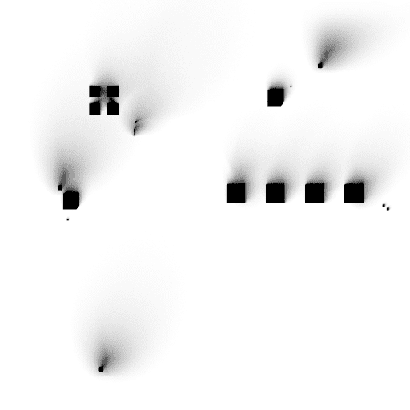

点开就是一张黑不溜秋的图片，起初我根本就不知道这是什么东西，但随着我对代码的理解加深。突然恍然大悟，原来这些是模型的位置和阴影效果渲染。

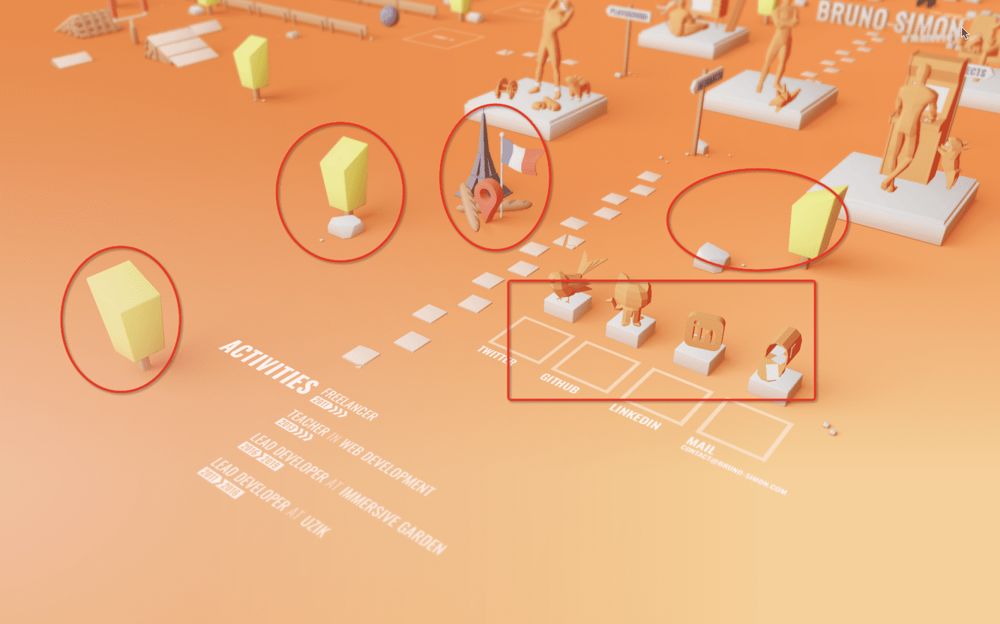

最后，这一趟短暂的 3D 博客入门之旅到这里，就要跟各位乘客说再见了。其实整个原文件的内容非常丰富，包括很多 3D 模型的文件、打包的配置优化等等，值得更加深入和系统地学习，但是由于篇幅和能力有限，今天就先写到这里。如果你有兴趣翻阅源码的话，你会有更多意想不到的发现。

以上就是本文的所有内容，如果您觉得这篇文章写得还不错，就请给我点一个赞，您的支持就是我更新的动力。