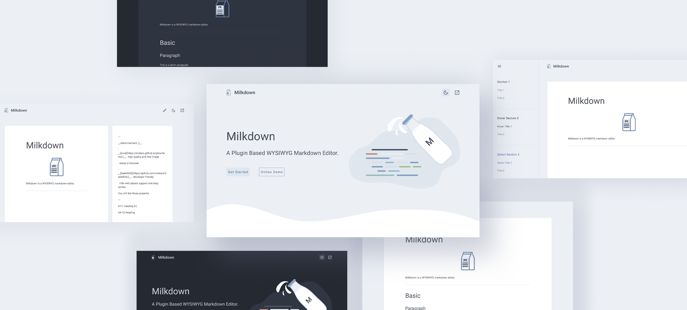
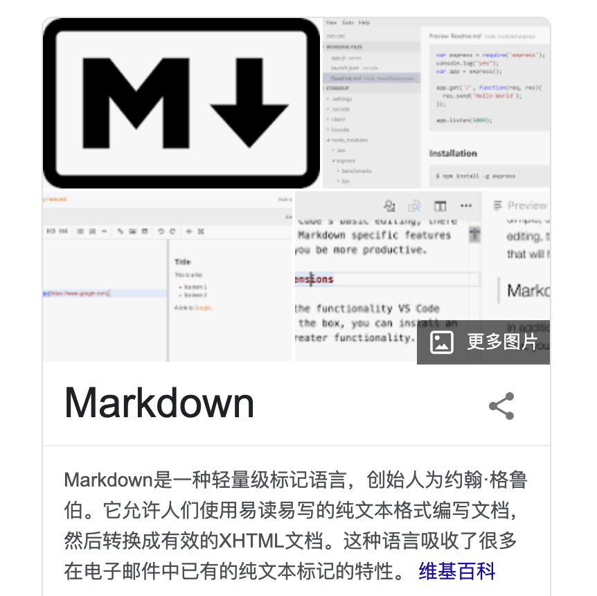
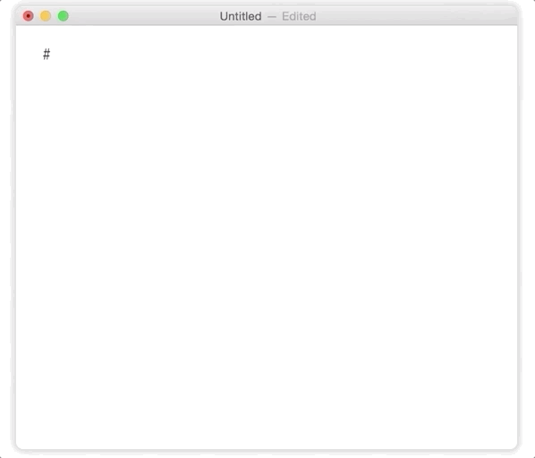
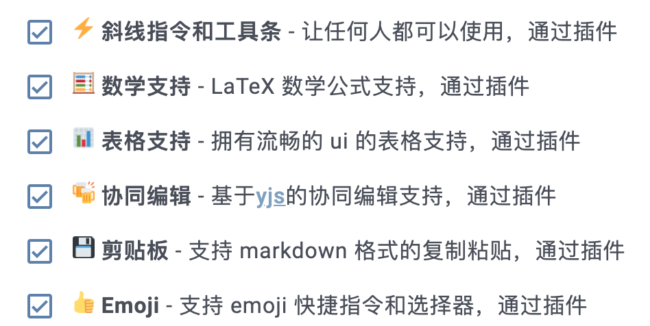
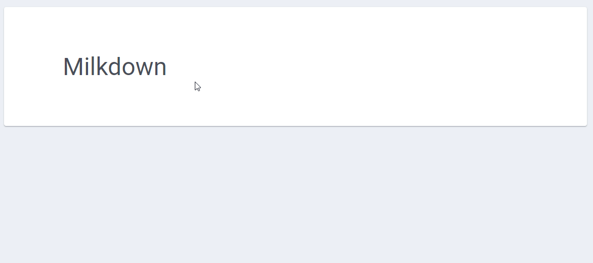
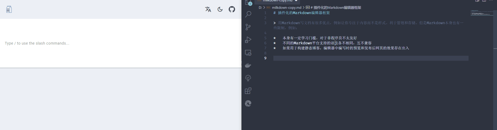
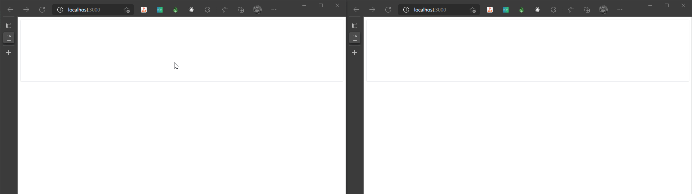
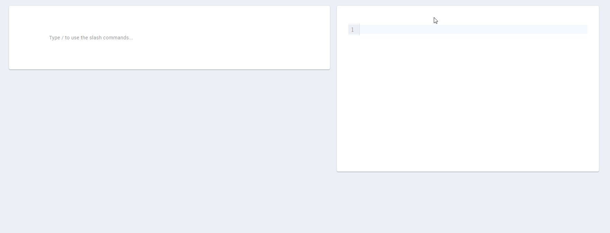
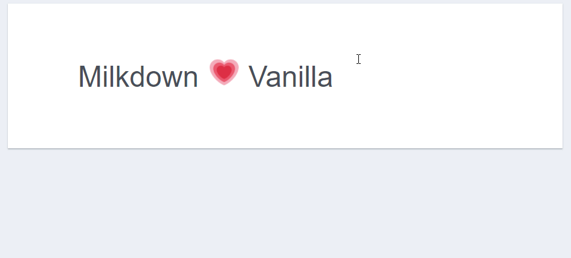
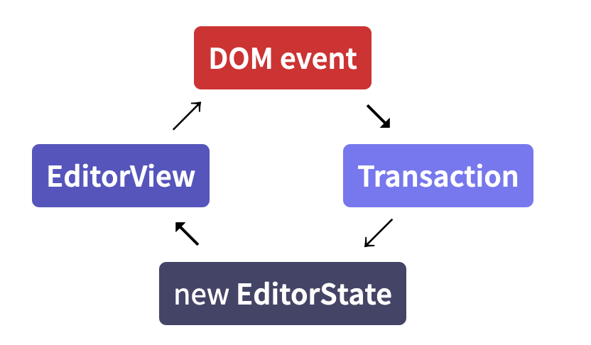

# 任由文字肆意流淌，更自由的开源 Markdown 编辑器



对于创作平台来说内容编辑器是十分重要的功能，强大的编辑器可以让创作者专注于创作“笔”下生花。而最好取悦程序员创作者的方法之一就是支持 Markdown 写作，因为大多数程序员都是用 Markdown 来写文章。



Markdown 作为程序员写作的心头爱，有很多优点：
- 通过语法实现排版，不需要点选手动设置样式

- 快速实现复杂内容，如：代码块、超链接、公式等

- 让创作者有更多时间专注于内容

但，同样的也有些缺点：

- 有一定的学习门槛，对于非程序员不太友好

- 看原文档就像看“代码”，预览效果需要工具或编辑器支持

那有没有能够即保留 Markdown 带来的便利，同时又降低门槛的办法呢？大多数老玩家会脱口而出：[Typora](https://typora.io/)



Typora 直接使用完全没有问题，但由于它没有开源。如果想在自己的项目实现类似的 Markdown 编辑器，就需要另寻方案了。

如果你正在寻找**功能强大、易于接入、所见即所得的 Markdown 编辑器、组件、插件，就请花 5 分钟读完本文！** 

接下来 HelloGitHub 带来的开源项目完全满足上述需求。Milkdown 一款高颜值+自由（插件）的所见即所得，集合 Markdown 编辑器、组件、插件于一身的开源项目。


> https://github.com/Saul-Mirone/milkdown

你想要的功能它都有，不要的功能也可以通过删减插件，减少体积。插件的设计思想+完善的中文文档，让你分分钟定制出最适合自己的 Markdown 编辑器！



下面跟着项目作者一起来感受 Milkdown 的魅力吧。


## 一、上手

下面提供了 2 种方式，可直接体验：


> 在线尝试：https://milkdown.dev/#/online-demo
>
> VS Code 插件：https://marketplace.visualstudio.com/items?itemName=mirone.milkdown


### 1.1 功能展示

方便的编写表格：



直接粘贴和复制 Markdown 文本：



甚至协同编辑：



双栏 Markdown 编辑器很常见。但 *双向绑定* 的 Markdown 编辑器，目前仅此一家：



功能方面就介绍这么多，下面用 Milkdown 轻松实现个编辑器。

### 1.2 第一个编辑器

Milkdown 的核心以及各种插件都是独立的 NPM 包，可以直接通过 NPM 来进行安装。

```bash
npm i @milkdown/core @milkdown/preset-commonmark @milkdown/theme-nord
```

上手也十分简单：

```typescript
import { Editor } from '@milkdown/core';
import { nord } from '@milkdown/theme-nord';
import { commonmark } from '@milkdown/preset-commonmark';

Editor
  .make()
  .use(nord)
  .use(commonmark)
  .create();
```

我们先使用 `make` 来初始化编辑器，然后使用 `use` 来加载插件，最后使用 `create` 来创建编辑器。



### 1.3 丰富的插件
插件是 Milkdown 的核心，它本质上就是一个插件加载器，一切功能都是通过插件来提供的。表格是一个插件、主题是一个插件、甚至一行简单的文本也是一个插件。

目前官方已经提供了许多插件，确保可以开箱即用。下面仅列举了部分插件：

| 名称                                                                                             | 描述                                                       |
| :--------------------------------------------------------------------------------------------- | :------------------------------------------------------- |
| [plugin-clipboard](https://www.npmjs.com/package/@milkdown/plugin-clipboard)         | 添加 markdown 格式的复制粘贴能力                                    |
| [plugin-cursor](https://www.npmjs.com/package/@milkdown/plugin-cursor)               | 添加 drop 和 gap 光标                                         |
| [plugin-listener](https://www.npmjs.com/package/@milkdown/plugin-listener)           | 添加监听器支持                                                  |
| [plugin-collaborative](https://www.npmjs.com/package/@milkdown/plugin-collaborative) | 添加协同编辑支持                                                 |
| [plugin-table](https://www.npmjs.com/package/@milkdown/plugin-table)                 | 添加表格语法支持（已经包含在 gfm 中）                                    |
| [plugin-prism](https://www.npmjs.com/package/@milkdown/plugin-prism)                 | 添加 [prism](https://prismjs.com/) 用于支持代码块高亮               |


也可以自己动手编写插件，[更多详情](https://milkdown.dev/#/zh-hans/writing-syntax-plugins)


## 二、技术栈

Milkdown 基于下面的工具实现：

* [Prosemirror](https://prosemirror.net/)：一个用于在 web 端构建富文本编辑器的工具包
* [Remark](https://github.com/remarkjs/remark)：正确的 Markdown 解析器
* [TypeScript](https://www.typescriptlang.org/)：以 TypeScript 编写
* [Emotion](https://emotion.sh/)：用于构建样式的强大的 css in js 工具
* [Prism](https://prismjs.com/)：代码块支持
* [Katex](https://katex.org/)：高性能的渲染数学公式


富文本编辑器本身是一个天坑。虽然 [ContentEditable](https://developer.mozilla.org/zh-CN/docs/Web/Guide/HTML/Editable_content) 看起来很美好，但实际用起来就会发现问题层出不穷。因此我们基于 [Prosemirror](https://prosemirror.net/) 来实现富文本编辑器。因为它足够成熟、久经工业的锤炼，并且拥有良好的架构和 API 设计。

## 三、架构

Prosemirror 的核心逻辑其实类似于 React，它通过一种**函数式的数据映射**来体现编辑器的 UI 和内部状态的关系，如图：



编辑器**通过 EditorState 来保存当前状态，并由 EditorState 产生出 EditorView，即 UI 视图。** 用户在 UI 视图上进行的操作最终会产生 DOM event，例如：input 事件、click 事件。**DOM event 事件会产生 Transaction，代表了对 State 的修改，类似于 Redux 或 Vuex 中的 Action。** 这些 Transaction 会与原来的 EditorState 进行计算，产生新的 EditorState，如此循环。

Prosemirror 通过这样的方式将编辑器中的每个状态以 EditorState 的方式保存了下来，它是一颗树状结构。而有一点编译原理基础的朋友都知道，任何编程语言都有对应的 AST（抽象语法树）。因此我们需要的就是**建立 Prosemirror 中的 EditorState 与 Markdown 的抽象语法树之间的联系。** [Remark](https://github.com/remarkjs/remark) 完美契合我们的需求，因为它有设计良好的 AST，并且易于扩展自己的语法。

这样一来 Milkdown 的架构也逐渐清晰：

> Markdown <-> Remark AST <-> Prosemirror State <-> UI

## 四、结语

在开始这个项目前，我尝试过各种各样的 Markdown 编辑器，但没有找到一款特别满意的。**因为它们都是闭源，而且功能由开发商提供，有的功能太过于臃肿、有的又太过简单。** 既然这样，我索性自己做一款能够轻松定制功能，非程序员也能轻松使用的 Markdown 编辑器，也就有了大家看到的 Milkdown。

希望开源的 Milkdown 让用户有更自由的选择，打破 Markdown 编辑器的“垄断”。开源不易如果 Milkdown 对您有帮助，也请给个 Star✨。

> https://github.com/Saul-Mirone/milkdown

最后，感谢 HelloGithub 的支持和帮助。Milkdown 先是有幸入选了 [第 65 期](https://mp.weixin.qq.com/s/JXYEhHWNT5CtjkidFoRyzw) 月刊，然后受邀合作了这篇文章，让更多人知道我的开源项目。


