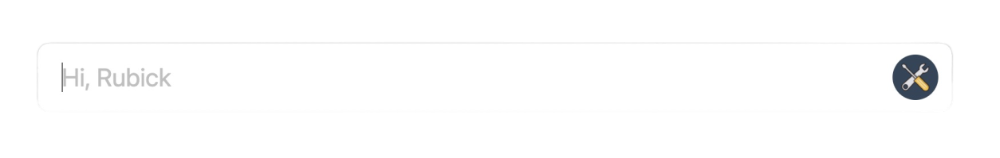
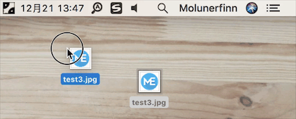
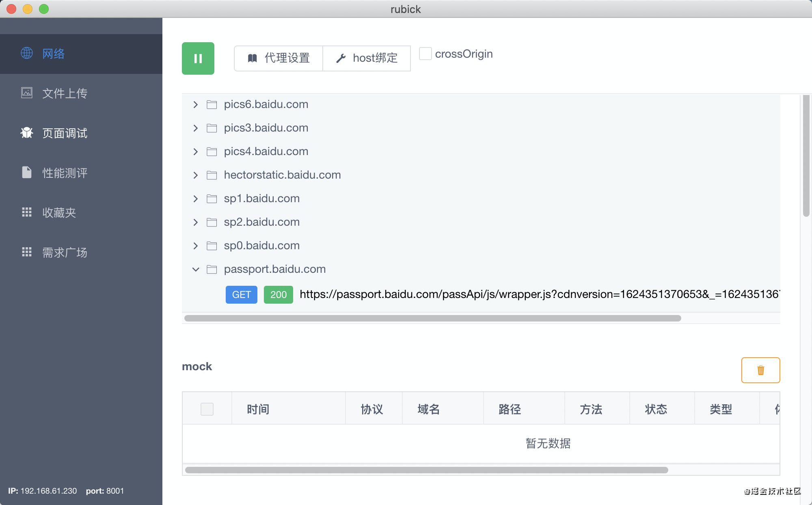
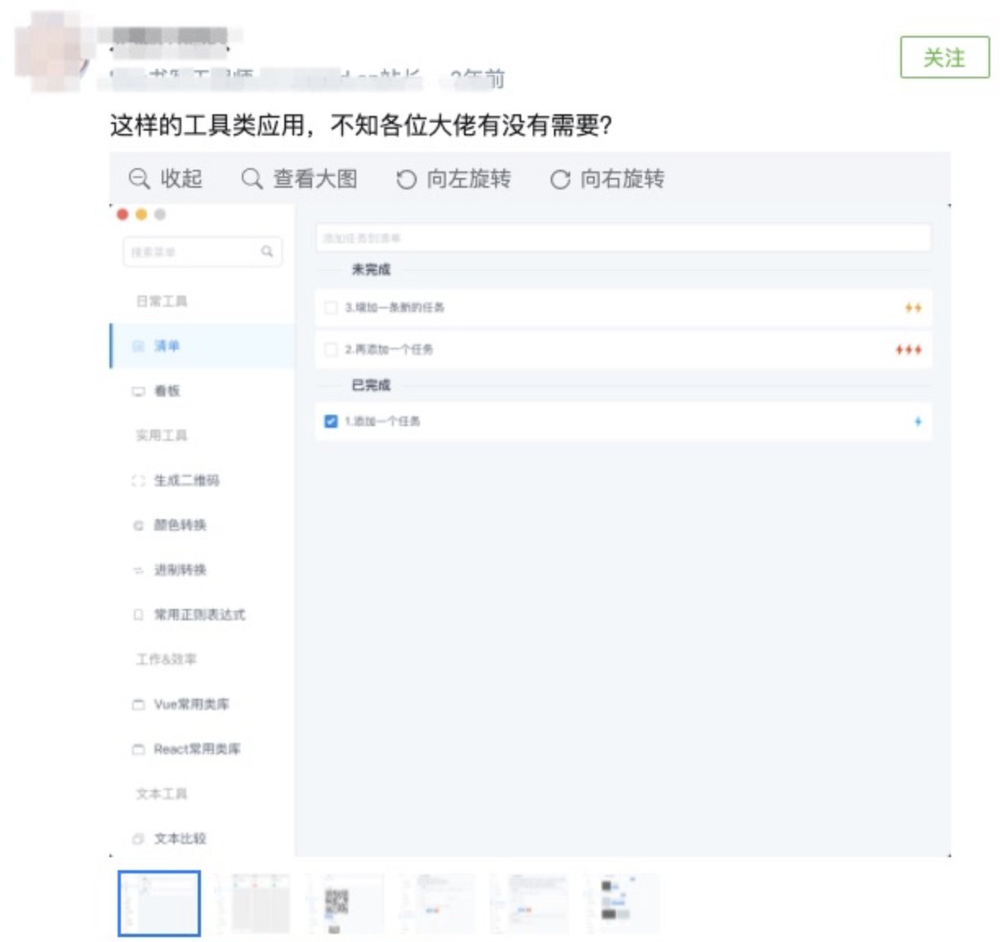
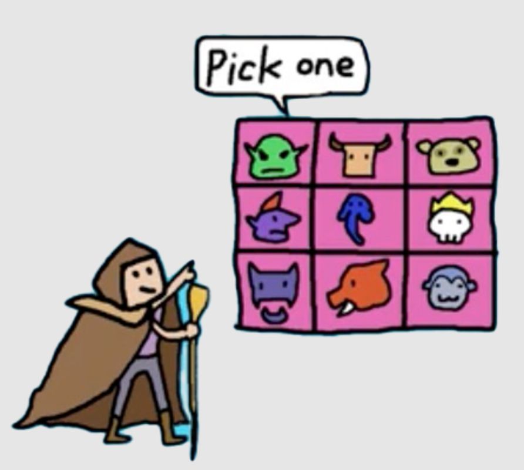
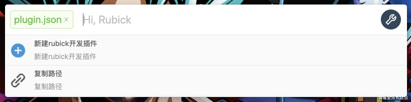
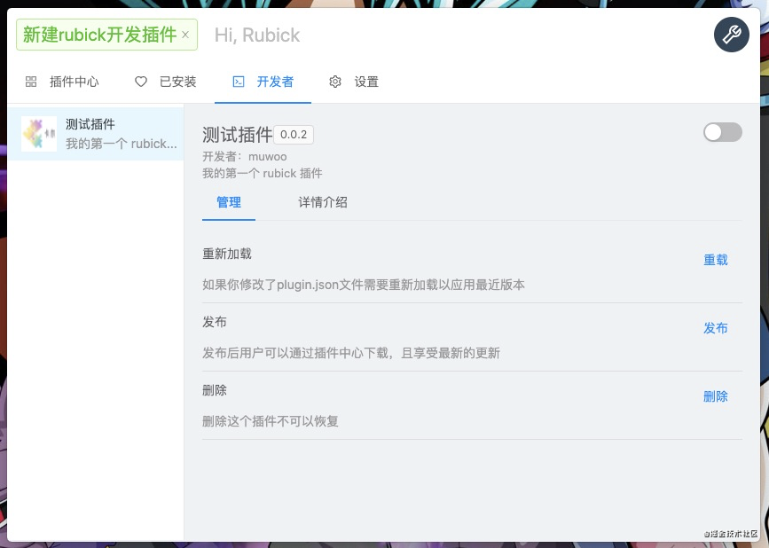
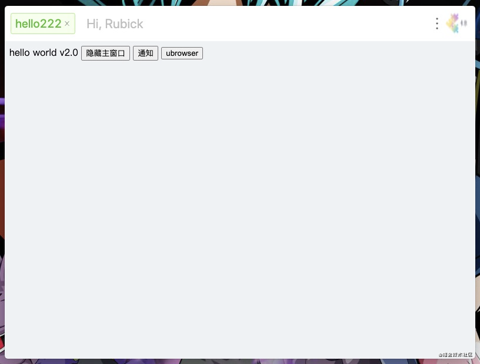
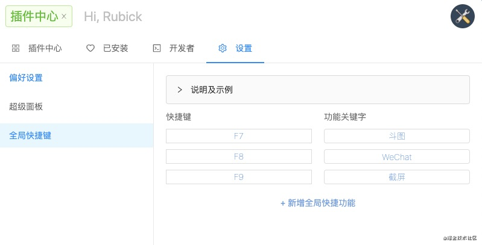

# 实现工具自由，开源的桌面工具箱


在一切开始之前，首先要致敬 uTools！​如果没有它就没有 Rubick。



大家好，我是“拉比克”（Rubick）项目的作者木偶。我做的 Rubick 是一款基于 Electron 的开源桌面工具箱，简单讲就是好多工具的集合，然后加上快速启动、丰富的插件扩展等功能于一体。


没错！它的使用方式和外观几乎和 uTools 一摸一样。那我为什么放着免费的 uTools 不用，非要自己搞一个呢？

事情的起因是这样的，出于安全方面的考虑有一些仅适用于公司内部的插件不能发布到插件市场，所以不能接入 uTools。但实在眼馋 uTools 式的便捷、用完即走的极简操作体验。在搜寻解决方案无果，同时也发现其他的小伙伴也有同样的诉求，所以我动手做了，然后把它开源了。

**Rubick 一款呼出超快、用完即走的开源工具箱，因为开源所以更自由！**

> 项目地址：https://github.com/clouDr-f2e/rubick

希望它能帮助你解决同样的烦恼，但目前仅支持 [Windows 和 macOS](https://github.com/clouDr-f2e/rubick#%E5%AE%89%E8%A3%85%E5%8C%85)，Linux 版本正在开发中。想借助开源的力量让 Rubick 变强，成为金牌辅助！帮助大家轻松“超神”！

在做 Rubick 的过程中还是遇到了不少问题和挑战，下面就分享下我的心路历程。


## 一、缘起
### 1.1 初识 Electron
Electron 是 GitHub 开源的一个框架。它通过 Node.js 和 Chromium 的渲染引擎完成跨平台的桌面 GUI 应用程序的开发。我起初没有接触过 Electron，最开始接触它是因为看到了 PicGo 的一个核心功能非常吸引我，就是 macOS 下可以直接拖拽图片进入任务托盘上传图片：



当时正好我们团队也需要搞一个内部的 CDN 图片资源管理图床，用于项目图片资源压缩并直接上传到 CDN 上，之前我们做了个网页版。而这里我深刻的感受到了 Electron 的强大，可以极大的提高工作效率，参考 PicGo 我尝试做了第一个 Electron 项目，完成了图片压缩上传到内部 CDN 的桌面端应用。

### 1.2 演化
之后公司内部因为开发和后端进行接口联调测试环境时，经常会涉及到一些状态改变要看交互样式的问题。比如测试需要测商品的待支付、支付中、支付完成等各种节点的交互样式是否符合预期，这种情况测试一般会去造数据或者让后端改数据库接口。有的小伙伴可能会用 Charles 修改返回数据进行测试，但 Charles 的抓包体验和配置体验感觉有点麻烦，对新人不是很友好所以我们自己做了个非常易用 抓包&mock 工具：



**这也是 Rubick 最早的雏形**。随后，我们发现当页面发布线上的时候，没有办法在微信环境内对线上页面进行调试，所以开发了一个基于 winner 的远程调试功能。

但随着该 Rubick 在内部不断推广和使用，所需功能也越来越多。我们需要 需求管理、性能评估、埋点检测 等等工具。这些工具的增加一方面导致 Rubick 体积暴增，一方面又导致了用户需要不断更新软件，导致用户体验非常差。

其次，我们在推广给测试、UI 同学使用的时候，发现他们其实并不关注前面的页面调试、性能测评等功能，可能只是用到其中某一项，所以整个项目对他们来说就显得很臃肿。

### 1.3 灵感
直到有一天，我在掘金上看到这样一个沸点：



下面有个评论提到了 uTools 这是我第一次和 uTools 产生了交集，在体验了 uTools 功能后，我长吸一口气：这不就是我想要的嘛！然后就去 GitHub 上找 uTools 的源码，发现它并没有开源。

所以就想把上面提到的那些工具， 发布到 uTools 市场在 uTools 里通过插件的方式使用他们。但我发现发布插件只能发布到公网，但这又涉及到数据安全的问题。

无奈，难道真的要自己做一个这样的工具吗？真的是有点头大。不过想想也挺有意思的。至此，我萌生了要开发一个媲美 uTools 的开源工具箱的念头。

## 二、研发

开篇第一步，按照我之前的套路都是先取好名字先占个坑。我是个 Dota 玩家，之前写了一本《从0开始可视化搭建》的小册，里面使用了 Dota 中一个英雄的名字 coco（船长）。这次我取名的是 rubick 即 拉比克。Rubick(拉比克) 也是 Dota 里面的英雄之一，其核心技能是插件化使用其他英雄的技能，用完即走。非常符合本工具的设计理念，所以取名 Rubick。



我的核心目标就是需要让 Rubick 支持插件化，解决前面提到的问题：
- 每个人的工具箱不同
- 软件体积暴增
- 每增加一个工具就需要更新版本

其次，通过调研了解到团队内有些同学已经在使用 uTools 了，要想让他们从 uTools 上把插件零成本迁移到 Rubick 上，就必须实现 uTools 的部分 API 能力，以及插件的定义和写法也需要和 uTools 规范保持一致。

### 2.1 开发者模式

插件开发需要和 Rubick 进行联调，所以 Rubick 需要支持开发者模式，帮助开发者更好的开发插件。首先先建一个 `plugin.json` 用于描述插件的基础信息：

```json
{
  "pluginName": "测试插件",
  "author": "muwoo",
  "description": "我的第一个 rubick 插件",
  "main": "index.html",
  "version": "0.0.2",
  "logo": "logo.png",
  "name": "rubick-plugin-demo",
  "gitUrl": "",
  "features": [
    {
      "code": "hello",
      "explain": "这是一个测试的插件",
      "cmds":["hello222", "你好"]
    }
  ],
  "preload": "preload.js"
}
```

#### 2.1.1 核心字段
* `name` 插件仓库名称
* `pluginName` 插件名称
* `description` 插件描述，简洁的说明这个插件的作用
* `main` 入口文件，如果没有定义入口文件，此插件将变成一个模版插件
* `version` 插件的版本，用于版本更新提示
* `features` 插件核心功能列表
* `features.code` 插件某个功能的识别码，可用于区分不同的功能
* `features.cmds` 通过哪些方式可以进入这个功能


#### 2.1.2 示例
开发插件的方式是复制 `plugin.json` 进入到 Rubick 的搜索框，所以需要监听搜索框的 `change` 事件，用于读取当前剪切板复制的内容：
```js
onSearch ({ commit }, paylpad) {
  // 获取剪切板复制的文件路径
  const fileUrl = clipboard.read('public.file-url').replace('file://', '');
  
  // 如果是复制 plugin.json 文件
  if (fileUrl && value === 'plugin.json') {
     // 读取 json 文件
     const config = JSON.parse(fs.readFileSync(fileUrl, 'utf-8'));
     // 生成插件配置
     const pluginConfig = {
        ...config,
        // 记录 index.html 存方的路径
        sourceFile: path.join(fileUrl, `../${config.main || 'index.html'}`),
        id: uuidv4(),
        // 标记为开发者
        type: 'dev',
        // 读取 icon
        icon: 'image://' + path.join(fileUrl, `../${config.logo}`),
        // 标记是否是模板
        subType: (() => {
          if (config.main) {
            return ''
          }
          return 'template';
        })()
      };
  }
}
```
到这里我们已经可以根据复制的 `plugin.json` 能获取到插件的最基础的信息，接下来就是需要展示搜索框：

```js
 commit('commonUpdate', {
    options: [
      {
        name: '新建rubick开发插件',
        value: 'new-plugin',
        icon: 'https://xxx.com/img.png',
        desc: '新建rubick开发插件',
        click: (router) => {
          commit('commonUpdate', {
            showMain: true,
            selected: {
              key: 'plugin',
              name: '新建rubick开发插件'
            },
            current: ['dev'],
          });
          ipcRenderer.send('changeWindowSize-rubick', {
            height: getWindowHeight(),
          });
          router.push('/home/dev')
        }
      },
      {
        name: '复制路径',
        desc: '复制路径',
        value: 'copy-path',
        icon: 'https://xxx.com/img.png',
        click: () => {
          clipboard.writeText(fileUrl);
          commit('commonUpdate', {
            showMain: false,
            selected: null,
            options: [],
          });
          ipcRenderer.send('changeWindowSize-rubick', {
            height: getWindowHeight([]),
          });
          remote.Notification('Rubick 通知', { body: '复制成功' });
        }
      }
    ]
});

```

到这里，当复制 `plugin.json` 进入搜索框时，变可直接出现 2 个选项，一个新建插件，一个复制路径的功能：



当点击 `新建 rubick 插件` 功能时，则需要跳转到 `home` 页，加载插件的基础类容，唯一需要注意的是 `home` 页加载的内容高度应该是 Rubick 最大窗口的高度。所以需要调整窗口大小：
```js
 ipcRenderer.send('changeWindowSize-rubick', {
    height: getWindowHeight(),
 });
```

关于 `renderer` 里面的 Vue 代码这里就不再详细介绍了，因为大多是 css 画一下就好了，直接来看展示界面：



到这里，就完成了开发者模式，接下来再聊聊插件是如何在 Rubick 中跑起来的。

### 2.3 插件运行原理

运行插件需要容器 Electron 提供了一个 `webview` 的容器来加载外部网页。所以可以借助 `webview` 的能力实现动态网页渲染，这里所谓的网页就是插件。但是网页无法使用 node 的能力，而且做插件的目的就是为了开放与约束，需要对插件开放一些内置的 API 能力。好在 `webview` 提供了一个 `preload` 的能力，可以在页面加载的时候去预置一个脚本来执行。

也就是说可以给自己的插件写一个 `preload.js` 来加载。但这里需要注意既要保持插件的个性又得向插件内注入全局 `API` 供插件使用，所以可以直接加载 Rubick 内置 `preload.js`，在 `preload.js` 内再加载个性化的 `preload.js`：

```html
// webview plugin.vue
<webview id="webview" :src="path" :preload="preload"></webview>
<script>
export default {
  name: "index.vue",
  data() {
    return {
      path: `File://${this.$route.query.sourceFile}`,
      // 加载当前 static 目录中的 preload.js
      preload: `File://${path.join(__static, './preload.js')}`,
      webview: null,
      query: this.$route.query,
      config: {},
    }
  }
}
</script>
```

对于 `preload.js` 就可以这么用啦：

```js
if (location.href.indexOf('targetFile') > -1) {
  filePath = decodeURIComponent(getQueryVariable('targetFile'));
} else {
  filePath = location.pathname.replace('file://', '');
}


window.utools = {
  // utools 所有的 api 实现
}
// 加载插件 preload.js
require(path.join(filePath, '../preload.js'));
```

到这里就已经实现了一个最基础的插件加载，效果如下：



### 2.4 支持更多体验能力
随后为了更加贴近 uTools 的体验，我又开始着手让 Rubick 支持更多原生体验增强的特性：超级面板、模版、系统命令、全局快捷键等





## 三、最后

再次致敬 uTools！我做 Rubick 旨在技术分享，并不以商业化为目的。

这就是我和 Rubick 的故事，如果它对您有帮助请给个 Star ✨ 鼓励一下：

> https://github.com/clouDr-f2e/rubick

---

机缘巧合我发现了 **HelloGitHub 一个推荐开源项目的平台**，了解到卤蛋也是喜欢打 Dota，我想那他应该能感受到 Rubick 的魅力，所以我就抱着试一试的心态投稿了。先是有幸入选了月刊[第 64 期](https://mp.weixin.qq.com/s/5vWG0-n-NMVl0KWz6FXneg)，然后受邀写了这篇关于 Rubick 的故事。

最后，感谢 HelloGitHub 让 Rubick 被更多人发现和喜欢，特别感谢卤蛋对文章的润色和修改，让本文增色不少。
