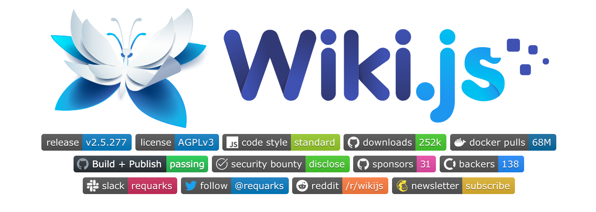

## 支持中文！秒建 wiki 知识库的开源项目，构建私人知识网络


不知道有没人和我一样，觉得自建的东西是互联网上的“自留地”、私人空间，有一种自己的一亩三分地随心所欲的痛快。

比如自建的博客想些什么随笔就写什么，不用取悦读者可以自娱自乐；再比如自建的 wiki 有不会的知识点就可以直接记录，不用担心被嘲笑低级。抛开共建这块不聊，Wiki 不同于博客的随性，记录的内容更注重知识点和分类，可以用来构建自己的知识网络。


如果把博客比作“日记本”，那 wiki 就是“笔记本”它用来记录知识点，方便用时查阅和更新，有清晰的目录而且一个知识点还可以关联到其它知识点，逐步拓展成“百科全书”。

## 一、介绍

知识在于积累，还不能忘记梳理。

今天，我们要介绍的开源项目是专门用来构建 wiki 平台，助你梳理知识点的 wiki.js



> 地址：https://github.com/requarks/wiki

它是一款轻量级、功能强大的 wiki 开源项目，拥有评论、Markdown 编辑器、图片上传、标签、全局搜索、协同编辑、编辑历史、用户管理、谷歌分析等功能，而且支持高度自定义。


用到的技术栈也不同于老旧的 wiki 系统，它采用了 Node.js、PostgreSQL、Vue.js、Docker 等技术。基于 Docker 实现的一键部署，颇有 WordPress 之风，不要太爽！


重点是支持中文，而且界面简洁还不失美感，这点足以让它在众多同类项目中脱颖而出。

看到这儿，你是不是手痒了呢？下面就和我一起来让它跑起来吧！

## 二、安装

开源项目成功的必要因素之一就是有详细易懂的文档，而安装说明又是重中之重。

Wiki.js [官方文档](https://docs.requarks.io/install)提供了多种部署方法，包括：Linux、macOS、Windows、Docker、k8s 等，涵盖了几乎所有可能性，十分全面。

下面我就介绍其中最快捷和通用的一种，即基于 Docker 的 Docker Compose 部署。


**Tips**：如果你不懂 Docker 建议跟着[这里](https://docs.requarks.io/install/ubuntu)逐步执行

下面我将主要介绍 Linux 下的安装步骤，其它系统有桌面版不再赘述。

**如果你机器上有 Docker 仅需两步即可完成安装。**


**第一步**，安装 docker-compose：

1、下载

```
curl -L https://get.daocloud.io/docker/compose/releases/download/v2.4.1/docker-compose-`uname -s`-`uname -m` > /usr/local/bin/docker-compose
```

2、加执行权限

```
$ sudo chmod +x /usr/local/bin/docker-compose
```

3、创建快捷方式

```
$ sudo ln -s /usr/local/bin/docker-compose /usr/bin/docker-compose
```

至此，你就可以在任何地方使用 `docker-compose` 命令了。

**第二步**，运行 docker-compose：

1、创建配置文件 `docker-compose.yml` 内容如下：


整个项目分为 **数据库** 和 **项目代码** 两部分，与之对应的是 `pg 容器` 和 `wiki 容器`。

```shell
version: "3"
services:

  db:
    container_name: pg
    image: postgres:11-alpine
    environment:
      POSTGRES_DB: wiki
      POSTGRES_PASSWORD: wikijsrocks
      POSTGRES_USER: wikijs
    logging:
      driver: "none"
    restart: unless-stopped
    volumes:
      - db-data:/var/lib/postgresql/data

  wiki:
    container_name: wiki
    image: ghcr.io/requarks/wiki:2
    depends_on:
      - db
    environment:
      DB_TYPE: postgres
      DB_HOST: db
      DB_PORT: 5432
      DB_USER: wikijs
      DB_PASS: wikijsrocks
      DB_NAME: wiki
    restart: unless-stopped
    ports:
      - "8001:3000"

volumes:
  db-data:
```

2、在配置所在的目录下，执行命令：

- 运行：`docker-compose up -d` 
- 查看容器：`docker ps`
- 停止：`docker-compose down`


最后，如果你想开启 HTTPS 的话，我这里推荐用 Caddy 服务器。没用过没关系，我们写过介绍使用 Caddy 的[文章](https://mp.weixin.qq.com/s?__biz=MzA5MzYyNzQ0MQ==&mid=2247511790&idx=1&sn=8d1641426d6e53fa23e9a9364fc8f05d&chksm=90581bb0a72f92a6ca0044c35f1259d29aa8dc33024b37040caeaf306225f86468abceb25e9e&token=502374771&lang=zh_CN#rd)特别简单。

Caddyfile 的配置内容如下：

8001 端口对应的是上面 wiki 容器的 ports 端口映射

```
域名 {
    reverse_proxy 127.0.0.1:8001
}
```

执行 `caddy start` 启动 Caddy 服务器，浏览器中访问对应的域名，网站初始化的引导界面，就会出现在你的面前了。


至此，以上就是 wiki.js 安装的全过程，你跑起来了吗？

## 三、瑕不掩瑜

Wiki.js 并不是十全十美的，虽然我只是刚上手，但还是发现了一些美中不足：

- 第一次访问加载速度较慢

- 虽然 wiki.js 更新积极、提交频繁，但目前它还不支持自定义主题

- 对中文搜索不友好，默认不支持中文搜索，需要采用 ES 但这样就不再轻量，或者采用 pg 插件让 pg 支持中文分词

- 中文翻译覆盖率并不像官网展示的 100%，管理后台里还是有未翻译的地方

但是瑕不掩瑜，它基本上实现了我对 wiki 想要的所有功能。而且总好过自己从头实现一个 wiki 系统吧，接下来我会用 wiki.js 做一个新的网站：

> https://cheatsheet.store/

等我玩顺手了搞通上面的问题就去给它提 PR 做贡献，期待更强大的 wiki.js！

## 四、最后

知识需要融会贯通。


知识本是杂乱无章的，需要通过实践经验，让它们建立联系，变得井然有序，才会得心应手，释放出强大的创造力。

最后，用 wiki.js 构建你的知识网络，梳理已有的知识不断推陈出新，让它在你寻求更高突破的路上，助你一臂之力！

更多讲解开源项目的文章尽在 **HelloGitHub**