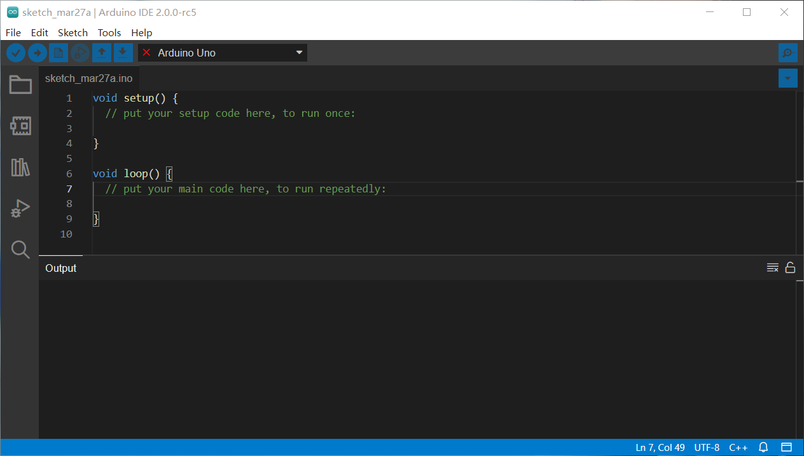
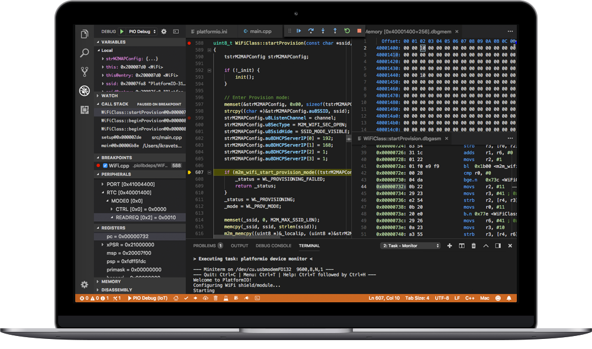
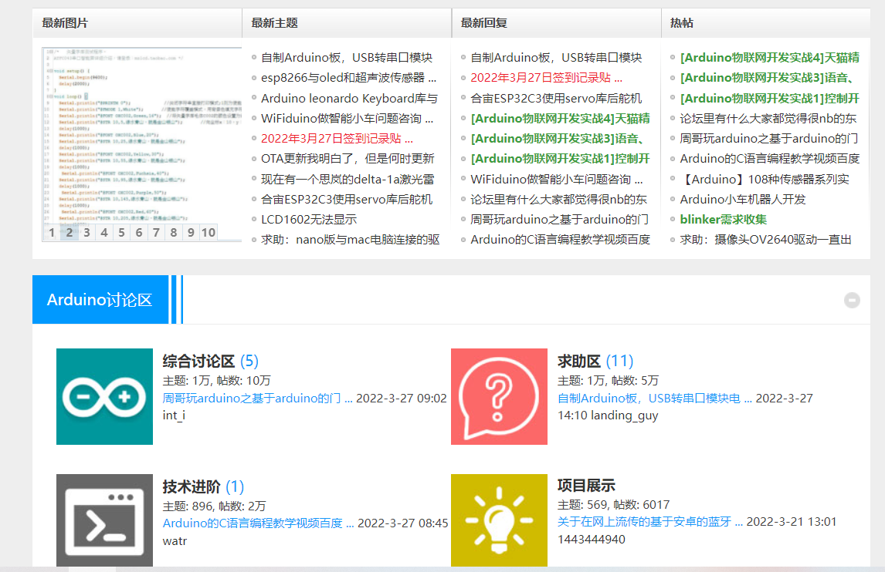
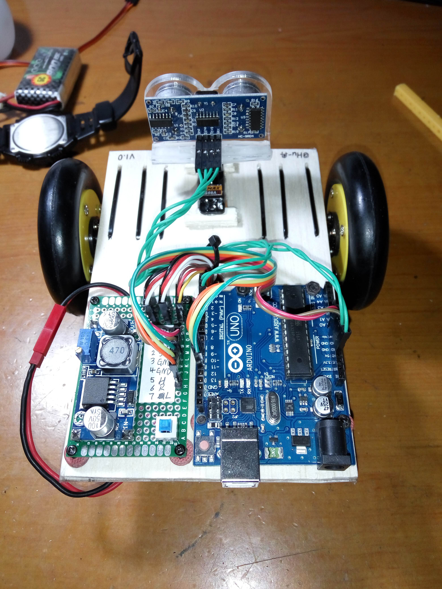
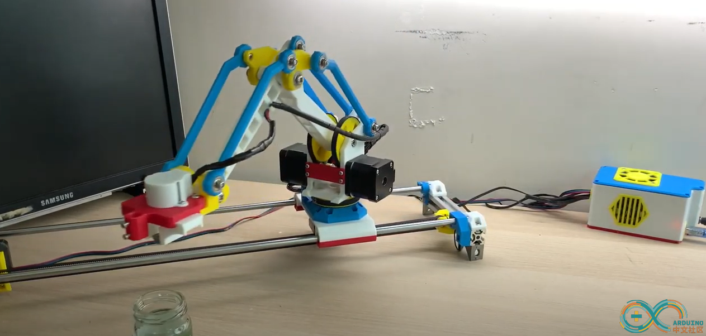
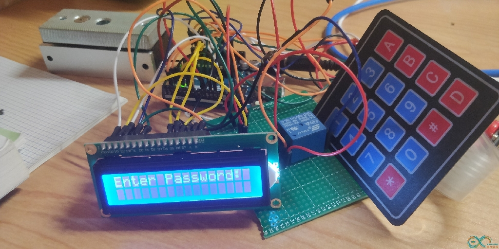

# 想学嵌入式？听说很多大佬都是用它入门的

本文作者 HelloGitHub-Anthony

HelloGitHub 推出的[《讲解开源项目》](https://github.com/HelloGitHub-Team/Article)系列，本期介绍开源硬件平台 **Arduino**.

> 项目地址：https://github.com/arduino/Arduino

你是否想过成为一名 Geek，随手就可以鼓捣出各种新奇有趣的电子设备，但奈何无论是 51单片机 还是 Stm32 **对零基础的爱好者来讲无法做到快速上手**，往往一个成品还没出来自信心就已经被打击没了。

现在，Arduino 来了，它是一个**非常容易上手**的开源硬件平台，包括 开发板（例如 Arduino UNO） 和 软件（Arduino IDE） 两部分，而且**拥有完善的中文社区**和**大量的开源项目**。笔者是在初中接触到 Arduino 的，在当年 C 语言都不是很熟练的情况下只花了一天就能跟着教程实现一些花哨的功能，足见 **Arduino 非常的适合作为电子爱好者的第一块开发板**。

## 1. 型号推荐

Arduino 到目前为止有很多种类的开发板，笔者这里推荐大家使用 UNO 作为您的第一块开发板。原因有以下几点：

1. UNO 使用的人很多，很多教程都是基于 UNO 进行编写的
2. 便宜，相比较其他类型开发板 UNO 真的非常便宜了
3. 芯片可拆卸，一块板子用的时间长了难免出现各种问题，如果只是芯片坏了可以直接买一块换上去。

## 2. UNO R3 开发板介绍

截止目前，市面上常见的 UNO 开发板为 UNO R3，其开发板如图所示：

Arduino 使用一根数据线连接电脑即可实现 供电/编程/调试/通信 等功能。

以下是开发板硬件的详细参数

| 微控制器              | ATmega328P                                                 |
| --------------------- | ---------------------------------------------------------- |
| 工作电压              | 5伏特                                                      |
| 输入电压(推荐)        | 7-12伏特                                                   |
| 输入电压(极限)        | 6-20伏特                                                   |
| 数字输入输出引脚      | 14个（其中有6个引脚可作为PWM引脚）                         |
| PWM引脚               | 6个                                                        |
| 模拟输入引脚          | 6个                                                        |
| 输入/输出引脚直流电流 | 20 毫安                                                    |
| 3.3V引脚电流          | 50 毫安                                                    |
| Flash Memory(闪存)    | 32 KB (ATmega328P) 其中由 0.5 KB用于系统引导（bootloader） |
| SRAM（静态存储器）    | 2 KB (ATmega328P)                                          |
| 时钟频率              | 16 MHz                                                     |
| EEPROM                | 1 KB (ATmega328P)                                          |
| 内置LED引脚           | 13                                                         |
| 长                    | 68.6 mm                                                    |
| 宽                    | 53.4 mm                                                    |
| 重                    | 25克                                                       |

不要惊讶于开发板相比电脑竟然只有如此有限的资源，对于嵌入式来讲，这个参数足以适用于绝大多数场合。充足的电压输入范围可以让设备使用包括电脑 USB 接口、干电池、充电宝等多种方式供电而不会烧毁。

## 3. Arduino 开发环境

前面讲到 Arduino 还配套有自己的跨平台（支持 Windows/Linux/Mac OS X）编程环境——**Arduino IDE**，它集成了 Arduino 所需的全部环境和支持库，只需要选择开发板然后鼠标点击几下即可实现编译、烧录、串口监控等功能。此外，Arduino 也在近些年推出了网页版编辑器以及 Arduino CLI，进一步降低了 Arduino 的开发门槛。

此外，如果您不喜欢 Arduino 或者想使用其他 IDE，也可以选择安装 Platform IO 插件进行开发，Platform IO 也提供了开发包括 Arduino 在内大部分嵌入式开发所需环境，一样可以实现一键编译、下载、调试。

当然，Arduino 语言也不仅限于在 Arduino 开发板上进行开发，包括 Stm32、ESP32 在内的许多芯片都能使用 Arduino 语言进行开发。

## 4. Arduino 社区

Arduino 拥有非常活跃的中文社区（https://www.arduino.cn/），所提问题大都能得到网友的热心解答且有很多人分享自己的作品，保证了即使是零基础小白也能在这里快速成长。

## 5. Arduino 项目展示

Arduino 超声波避障小车(https://m.elecfans.com/article/717553.html)

三自由度机械臂（https://www.arduino.cn/thread-104895-1-1.html）

简易密码锁的制作（https://www.arduino.cn/thread-82408-1-1.html）

当然，除此之外 Arduino 还能做很多很多事情，笔者无法全部将其列出，可以说只要不违反科学原理 Arduino 都能将你的电子梦变为现实！