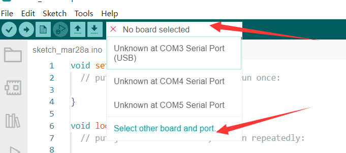
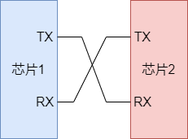
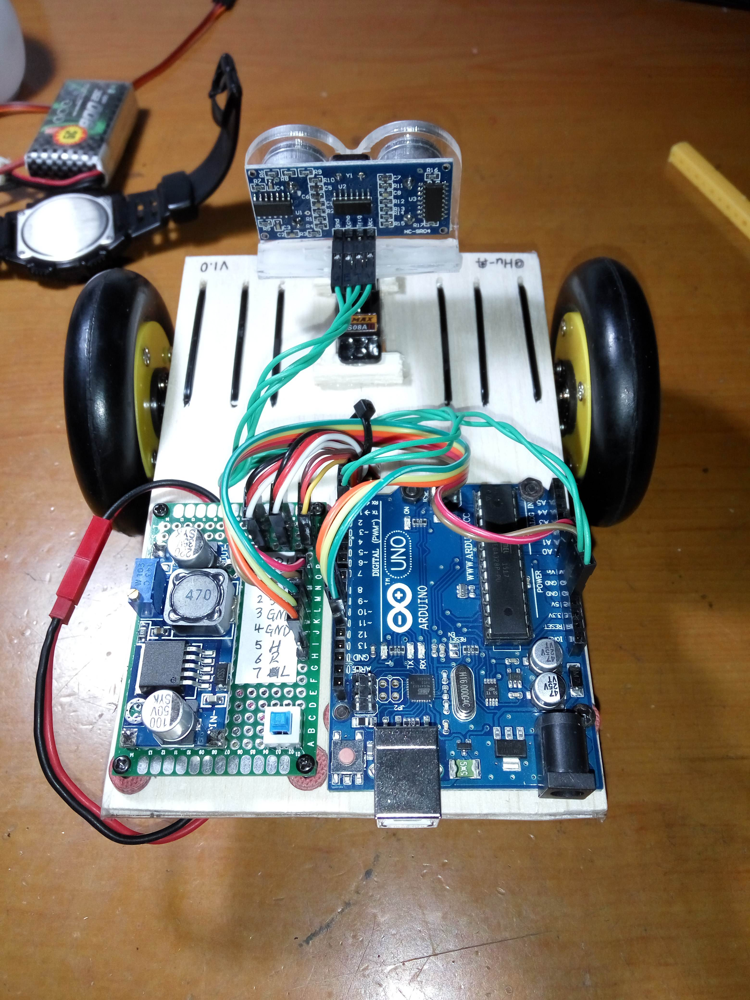

# 想做钢铁侠？听说很多大佬都是用它入门的


<p align="center">作者：HelloGitHub-<strong>Anthony</strong></p>

你是否想过成为一名 Geek，就像“野生钢铁侠”稚晖君那样自己能做出各种新奇有趣的电子设备，但却不知道从哪里入手、如何开始？今天我们不聊嵌入式、电路板、单片机原理，直接上手开始搞！

我认为对于零基础的电子爱好者来说，一块容易上手的开发板至关重要。否则复杂的安装步骤和调试流程就能把最初的热情消失殆尽，从而还没看到一个成品就放弃了。所以，今天 HelloGitHub 带来的 Arduino 就是一个**非常容易上手**的开源硬件平台：

> 项目地址：https://github.com/arduino/Arduino

该项目包含 开发板（例如 Arduino UNO）和 软件（Arduino IDE）两部分，而且它**拥有完善的中文社区**和**大量开源项目的示例**，让你遇到问题很容易就能找到解决办法，想做项目也有完整的代码和项目可以参照。

我当年在 C 语言都不是很熟练的情况下，只花了一天时间就能跟着教程用 Arduino 实现一些比较花哨的功能，由此足以见得 Arduino 真的非常适合作为电子爱好者的**第一块开发板**。

下面我将通过：闻道（入门）、见道（上手）、入道三部分，帮助零基础的电子爱好者快速入门 Arduino，开启你的“钢铁侠”之旅。

## 一、闻道（介绍）

### 1.1 推荐型号

Arduino 到目前为止有很多种类的开发板，我这里推荐大家使用 UNO 作为您的第一块开发板。原因有以下几点：

1. 普及：玩 UNO 的人很多，网上有很多 UNO 的教程
2. 便宜：相比较其他类型开发板 UNO 真的非常便宜了
3. 可拆卸：板子用的时间长了难免出现各种问题，可拆卸支持仅替换有问题的零部件

### 1.2 UNO R3 开发板

截止目前，市面上常见的 UNO 开发板为 UNO R3 开发板如图所示：


Arduino UNO R3 使用一根数据线连接电脑即可实现 **供电、编程、通信** 等功能。

| 硬件详细参数 | |
| --- | --- |
| 微控制器              | ATmega328P                                                 |
| 工作电压              | 5 伏特                                                      |
| 输入电压(推荐)        | 7-12 伏特                                                   |
| 输入电压(极限)        | 6-20 伏特                                                   |
| 数字输入输出引脚      | 14 个                     |
| PWM 引脚               | 6 个                                                        |
| 模拟输入引脚          | 6 个                                                        |
| 输入/输出引脚直流电流 | 20 毫安                                                    |
| 3.3V 引脚电流          | 50 毫安                                                    |
| Flash Memory(闪存)    | 32 KB (ATmega328P) 其中有 0.5 KB 用于系统引导 |
| SRAM(静态存储器)    | 2 KB (ATmega328P)                                          |
| 时钟频率              | 16 MHz                                                     |
| EEPROM                | 1 KB (ATmega328P)                                          |
| 内置 LED 引脚           | 13                                                         |
| 长                    | 68.6 mm                                                    |
| 宽                    | 53.4 mm                                                    |
| 重                    | 25 克                                                       |

不要惊讶于开发板相比电脑竟然只有如此有限的资源，对于嵌入式来讲这个参数足以适用于绝大多数场合。充足的电压输入范围可以让设备使用包括电脑 USB 接口、干电池、充电宝等多种方式供电而不会被烧毁。

关于购买方式，可以去各大电商平台通过关键字“Arduino UNO R3”就能找出一大堆。

你可以选择直接买套餐也可以自己买板子和然后根据需求购入的配件，**买套餐的话图个省心，如果是自行搭配能比套餐便宜百八十块钱。**


### 1.3 开发环境

Arduino 开源项目有自己配套的跨平台，编程环境——**Arduino IDE** 支持 Windows/Linux/macOS 操作系统。

它集成了 Arduino 开发所需的全部环境和支持库，只需要选择开发板然后鼠标点击几下即可实现编译、烧录、串口监控等功能。

此外，Arduino 也在近些年推出了网页版编辑器以及 Arduino CLI，进一步降低了 Arduino 的开发门槛。


如果你不喜欢 Arduino 或者想使用其它 IDE，也可以选择安装 VSCode+Platform IO 插件进行开发，Platform IO 也提供了开发包括 Arduino 在内大部分嵌入式开发所需环境，同样可以实现一键编译、下载、调试。


**注意**：本教程后续采用的是 Arduino IDE 进行讲解和演示。


### 1.4 配置环境

网上已经有很多 1.8 版本的使用教程，因为 v1 版本对于代码自动补全做得不是很好。

所以，这里采用 Arduino IDE 2.0 RC 版本，在 Windows 操作系统做的演示。

> 官方下载地址：https://www.arduino.cc/en/software

进入下载网址后，下滑网页即可看到 Arduino IDE 2.0 RC 的下载入口：


> 由于服务器位于国外，下载速度可能不是很快需要耐心等待

下载以后根据提示进行安装后启动程序可以看到如下界面：


> 注：这里大家的配色可能不同，默认是黑底白字，可以在 File->Preference->Theme 处更改

下面我们点开 “板级支持库管理” 安装 “Arduino AVR Boards” 的库：


> **警告**：由于 Arduino CLI 本身问题，这里可能会出现诸如 Access is denied 等错误，**这时需要关闭杀毒软件后才能正常安装！！！**

**在此过程中会自动安装驱动，请在提示中选择 “是” 进行确认**

安装完成后应该会有如下文字输出：


驱动安装完成后插上我们的开发板，然后在 `开发板选择` 下拉框进行选择：




> 根据大家连接 USB 口的不同，这个不一定都是 COM3，大家需要自行判断。或者**在设备管理器中查看串口**，或者**拔插开发板看新增的是哪个 COM 口**


### 1.5 运行段代码

下面运行一段点灯的代码，类似于“Hello World”，万物始于点灯！

选择好后开发板后，复制如下内容到 `编辑窗口`：

```c++
void setup() {
  pinMode(LED_BUILTIN, OUTPUT);
}

void loop() {
  delay(300);
  digitalWrite(LED_BUILTIN, HIGH);
  delay(300);
  digitalWrite(LED_BUILTIN, LOW);
}
```

目前这段代码现在看不懂不要紧，下面会有逐行的讲解。

点击 `烧录` 按钮，终端会出现如下提示：


并且开发板上的 LED 开始闪烁：


至此，环境就配置成功啦！


## 二、见道（上手）

这里将介绍如何编写 Arduino 的代码。

Arduino 库是使用 C++ 编写的，官方将很多功能包装成了一个个函数，但是对于初学者来讲不需要了解这么多，**只要有一点 C 语言基础即可流畅使用**。

**Arduino 库屏蔽了 AVR 单片机的底层细节，让我们即使不了解模数电或者单片机相关知识也能轻松上手**，现在就让我们先简单了解一下 Arduino 语言相关内容。

### 2.1 启动流程

一般来讲，我们的 C 语言程序都是从一个 `main` 函数开始的，但是在之前的教程中我们发现 IDE 生成的文件中只有 `setup` 和 `loop` 两个函数，那么 Arduino 是如何调用它们的呢？

实际上，真正的 `main` 函数存在于我们的 Arduino 库文件中（位于 Arduino->main.cpp），其定义如下：

```c++
int main(void)
{
    // 进行一些硬件和变量初始化工作
	init();
	initVariant();
#if defined(USBCON)
	USBDevice.attach();
#endif
	// 调用我们编写的 setup() 函数
	setup();
    
	for (;;) {
        // 调用我们编写的 loop() 函数
		loop();
		if (serialEventRun) serialEventRun();
	}
	return 0;
}
```

可以看到我们编写的 `setup` 和 `loop` 两个函数会在 `main` 中进行调用。当然，相关文件是如何组织和编译的这就是 Arduino 工具链所提供的功能了，这里我们不做深入了解，**在初学阶段我们只关心如何使用即可**。

### 2.2 常用的函数

Arduino 为我们提供了多种函数以供使用，具体细节可以查看 Arduino API 手册。

> 不去记忆相关函数，善用 IDE 的智能补全和搜索引擎，便可快速上手

接下来我们通过讲解上面的点灯代码，简单介绍几个常用的函数：

`void setup()`：初始化相关引脚和变量

在 Arduino 中程序运行会先调用 `setup()` 函数，用于初始化变量、设置针脚的输出\输入类型、配置串口、引入类库文件等等。每次 Arduino 上电或重启后，setup 函数只运行一次，例如：

```c++
void setup()
{
  pinMode(LED_BUILTIN, OUTPUT); // 设置内置 LED 端口为输出模式
}
```

之后会执行 `loop()` 函数，顾名思义该函数在程序运行过程中不断地循环，直到芯片断电为止。


```C++
void loop()
{
  delay(300); // 等待 300ms
  digitalWrite(LED_BUILTIN, HIGH);// 内置 LED 输出高电平，点亮灯
  delay(300);
  digitalWrite(LED_BUILTIN, LOW);// 内置 LED 输出低电平，熄灭等
}
```

循环中的代码每隔 300ms 点亮/熄灭灯，实现灯闪烁的效果。下面是用到的常量和函数详解：

**常量**

- `HIGH | LOW`：表示数字 IO 口的电平，HIGH 表示高电平（1 即输出电压“点亮”），LOW 表示低电平（0 即不输出电压“熄灭”）
- `INPUT | OUTPUT`：表示数字 IO 口的方向，INPUT 表示输入（高阻态，即相当于电阻极大可以读取输入电压信号），OUTPUT 表示（输出电压信号）

**数字 I/O**

- `pinMode(pin, mode)`：数字 IO 口输入输出模式定义函数，参数 mode 可为 INPUT 或 OUTPUT
- `digitalWrite(pin, value)`：数字 IO 口输出电平定义函数，参数 value 可为 HIGH 或 LOW，可用来点亮 LED
- `int digitalRead(pin)`：数字 IO 口读输入电平函数，返回值为 HIGH 或 LOW，可以用来读数字传感器

> 注：参数 pin 值的范围为 0～13，代指 14 根引脚。

**时间函数**  

- `delay(ms)`：延时函数（单位 ms）

以上为常见函数，不需要记忆有个印象即可，后面经常用就记住了。

### 2.3 什么是串口

在写代码之前，需要先搞清楚什么是串口。

这个问题各种百科已经给出了答案，但是对于初学者来讲这些文字难免有些官方。通俗来讲，**串口就是芯片之间通话的渠道**。

一般来讲我们使用开发板上的 UART 串口进行通信，它使用两根信号线进行通信，一个名为 `TX`（消息发送端）一个名为 `RX`（消息接收端），他们的职责非常单一。

- `TX`：只能发送消息
- `RX`：只能收听消息

所以使用的时候应该将 `TX` 和 `RX` 交叉连接：



此外，串口在使用的时候如果没有额外的线缆给出同步时钟信号则还需要指定串口的波特率，这相当于两芯片之间的约定：我说我一分钟能输出 100 个二进制信号，那么平均来讲每个信号的时长就是 1/100 秒，你只需要每 1/100 秒接收一次即可跟上我的脚步。

> 当然，这里的比喻存在些许漏洞，实际上的通信过程会稍微复杂一些以保证通信的可靠性和正确性。

我们现在开始实践！由于篇幅关系，具体使用到的函数大家可以参考 [API 手册](https://wiki.arduino.cn/?file=005-串口通信/004-其他函数)。

### 2.4 发送 HelloGitHub

这里 Arduino 已经为我们准备好了 Serial（串口），只需要简单几步即可实现消息的发送。

这里使用的是一个 Arduino 官方库，为我们准备好的 Serial 对象。如果您不了解 C++ 对象相关概念也不影响您的使用，类似 `Serial.begin()` 这种语法相当于函数调用（或者更官方的称呼是“方法”），它只不过是 Serial 特有的函数而已。代码如下：

```C++
#include <Arduino.h>

void setup()
{
    // 设置波特率为 9600，我们的电脑读取的时候也要保持相同
  Serial.begin(9600);
}

void loop()
{
  // 串口输出一行文字，会自动加换行符
  Serial.println("HelloGitHub");
  // 等待一会儿，防止发送太快卡死
  delay(1000);
}
```

将上面的程序“烧录”到开发板中，然后点击 “Serial Monitor”（类似浏览器的开发者模式）查看串口。


这时就可以在控制台，看到发送的消息了：


### 2.5 接收消息

上面讲完了如何发送，现在我们来说说如何让 Arduino 从电脑或者什么其他地方接收消息。

下面是一段“回声”代码：

```C++
#include <Arduino.h>

int count; // 记录缓冲区字节数
char buffer[65]; // 存储从缓冲区读出来的字符

void setup()
{
  // 做一些初始化工作
  Serial.begin(9600);
  count = 0;
}
void loop()
{
  // 这个 Serial.available() 会返回当前接受了多少字符存储再缓存区
  count =  Serial.available();
    
  if (count > 0) // 如果缓存区存了东西
  {
    // 读取 count 个字符到 buffer 中
    Serial.readBytes(buffer, count);
    // 添加结尾，为了后面发送
    buffer[count] = '\0';
    // 发送
    Serial.println(buffer);
  }
  // 给一点时间多接收一点消息，不然只能一个字母一个字母的返回
  delay(800);
}
```

烧录以上程序，按照之前的方法查看串口。需要在这个框框里输入要发送的内容，然后使用快捷键 Ctrl+Enter 发送。


这里将在控制台看到消息是**板子接收电脑发送的消息后发送给电脑的**，接收到的和发送的一摸一样，故称为“回声”。

至此，关于串口的基本使用就讲完了。虽然这里实现的功能很简陋，但这是所有大神的必经之路。所有复杂的功能其实都是用这些看似简陋的基础功能实现的。

## 三、入道

### 3.1 社区

Arduino 拥有非常活跃的[中文社区](https://www.arduino.cn/)，新手提的问题大都能得到网友的热心解答。社区里还有很多人分享自己的作品，即使是零基础的小白也能在这里快速地成长。


### 3.2 作品展示

[超声波避障小车](https://m.elecfans.com/article/717553.html)



[三自由度机械臂](https://www.arduino.cn/thread-104895-1-1.html)


[简易密码锁的制作](https://www.arduino.cn/thread-82408-1-1.html)


[多功能透明显示屏桌面站](https://github.com/peng-zhihui/HoloCubic)


相信不久的将来的你也可以做出，如此炫酷的电子玩意儿。

## 四、最后

以上就是 HelloGitHub 讲解开源系列之《Arduino 教程》入门篇的全部内容，如果你对 DIY 电子产品感兴趣，不妨关注 HelloGitHub 能够第一时间收到后续内容的更新。

预告：下一篇将介绍如何用 Arduino 做一个温湿度显示器，通过实战加深对 Arduino 了解。