# Arduino 点灯指南

本文作者：HelloGitHub-Anthony

HelloGitHub 推出的[《讲解开源项目》](https://github.com/HelloGitHub-Team/Article)系列，本期介绍开源硬件平台 **Arduino** 的环境配置指南。

本期文章将会介绍几种不同的 Arduino 开发环境，各位读者可以根据自己的喜好挑选一个进行安装。

## 1. Arduino IDE

这里笔者使用的 Arduino IDE 2.0 RC 版本，**1.8 版本的使用网络上已有很多教程**且 v1 版本对于代码自动补全做的不是很好所以这里用 V2 版本做演示。

> 官方下载地址：https://www.arduino.cc/en/software

进入下载网址后，下滑网页即可看到 Arduino IDE 2.0 RC 的下载入口：

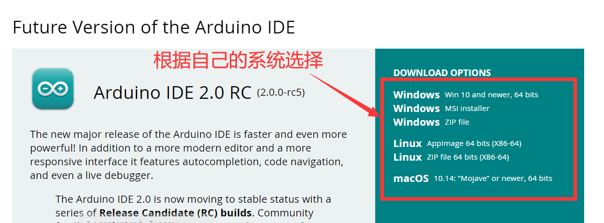

> 由于服务器位于国外，下载速度可能不是很快，需要大家耐心等待

下载以后根据提示进行安装后启动程序可以看到如下界面：

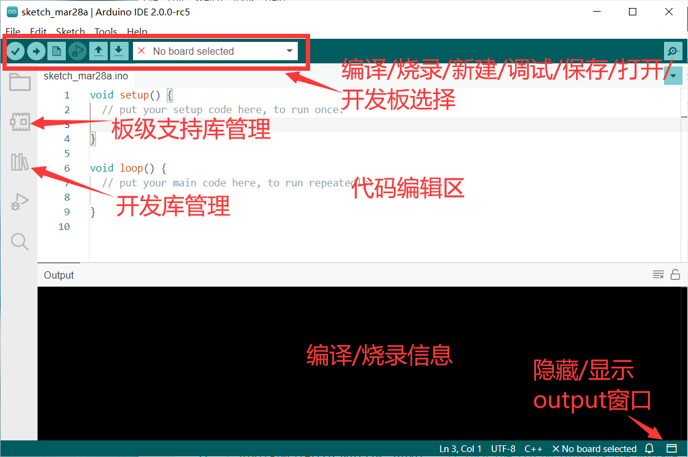

> 注：这里大家的配色可能不同，默认是黑底白字，可以在 File->Preference->Theme 处更改

这里我们点开 板级支持库管理 安装 ``Arduino AVR Boards`` :

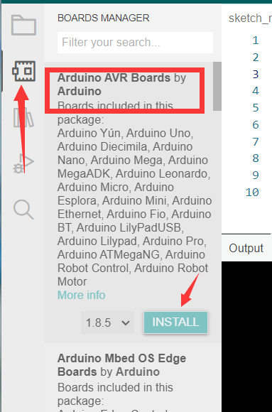

 

> **警告**：由于 Arduino CLI 本身问题，这里可能会出现诸如 Access is denied 等错误，这里**！！！需要关闭杀毒软件后才能正常安装！！！**

**在此过程中会自动安装驱动，请在提示中选择 “是” 进行确认**

安装完成后应该会有如下文字输出：

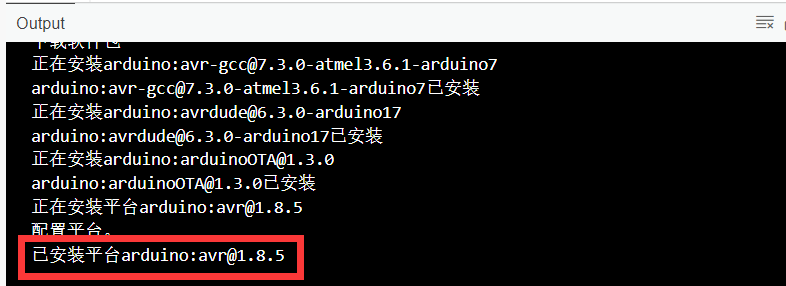

接下来，插上我们的开发板然后在 ``开发板选择`` 窗口进行选择：

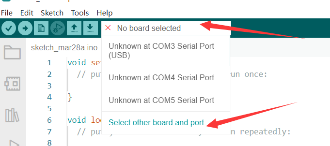

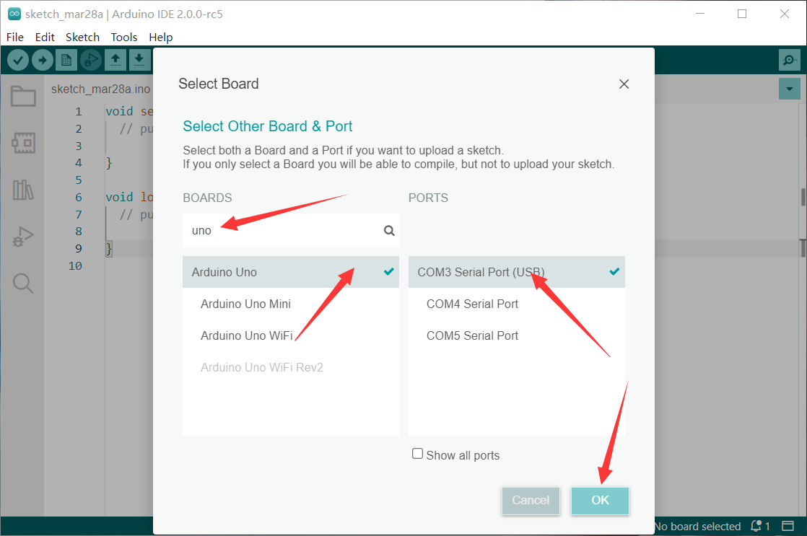

> 根据大家连接 USB 口的不同，这个不一定都是 COM3，大家需要自行判断。或者**在设备管理器中查看串口**，或者**拔插开发板看新增的是哪个** COM 口

之后复制如下内容到 ``编辑窗口`` 

```c++
void setup() {
  pinMode(LED_BUILTIN, OUTPUT);
}

void loop() {
  delay(300);
  digitalWrite(LED_BUILTIN, HIGH);
  delay(300);
  digitalWrite(LED_BUILTIN, LOW);
}
```

> 代码补全默认快捷键：Ctrl+i，如果补全选项为空说明您没有正确安装板级支持库

点击 ``烧录`` 按钮，会出现如下提示，并且开发板上的 LED 开始闪烁：


至此，环境配置成功。

## 2. VSCode+PlatformIO

> 提示：由于 PlatformIO 服务器位于国外，可能下载速度会很慢

首先在 VSCode 扩展页面搜索 PlatformIO 并安装扩展，之后 PlatformIO 会自动安装所需组件

> 在此之前您需要安装 Python3.6 以上版本的 Python

安装完成后重启 VSCode 会在左侧栏看见 PlO 图标，点击后选择 `Open->Platforms->Embedded` 搜索 `avr` 

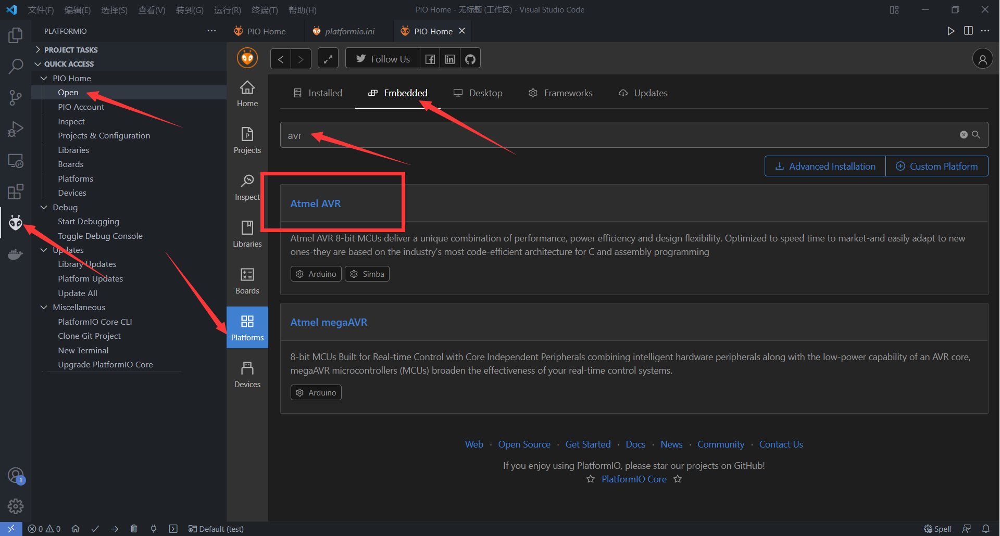

点击 `Atmel AVR` 选项后点击 `Install` 

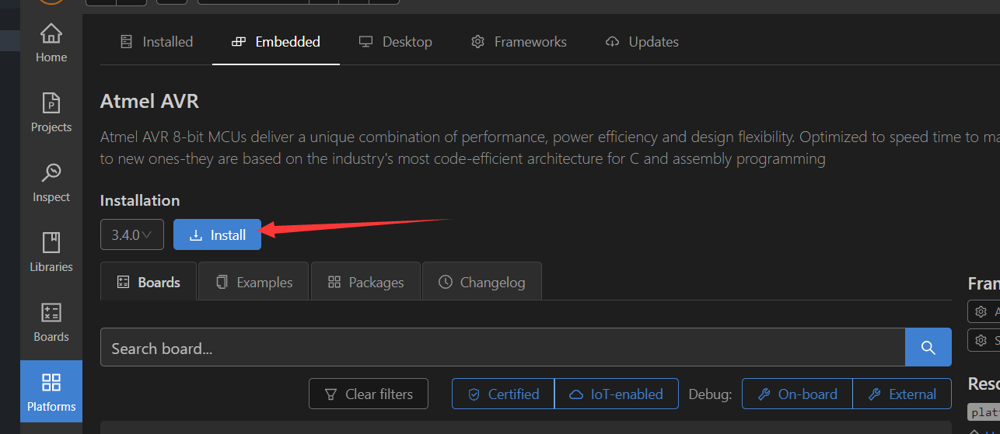

> 根据网络情况，此步骤可能会花费很久

之后我们在 `Projects` 选项中创建新项目：

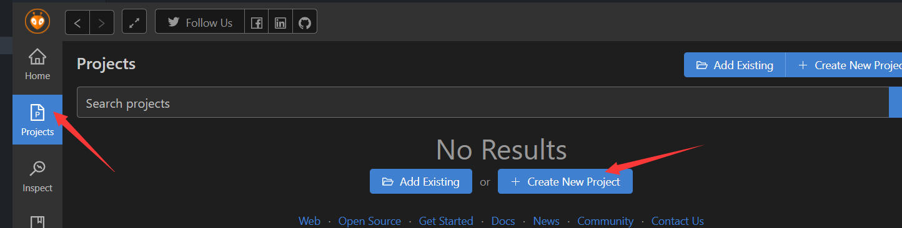

分别填写名称选择开发板，`Framework` 选项保持 `Arduino` 不变，`Location` 根据情况可以自行调整，最后点击右下角蓝色的 `Finish` 即可。

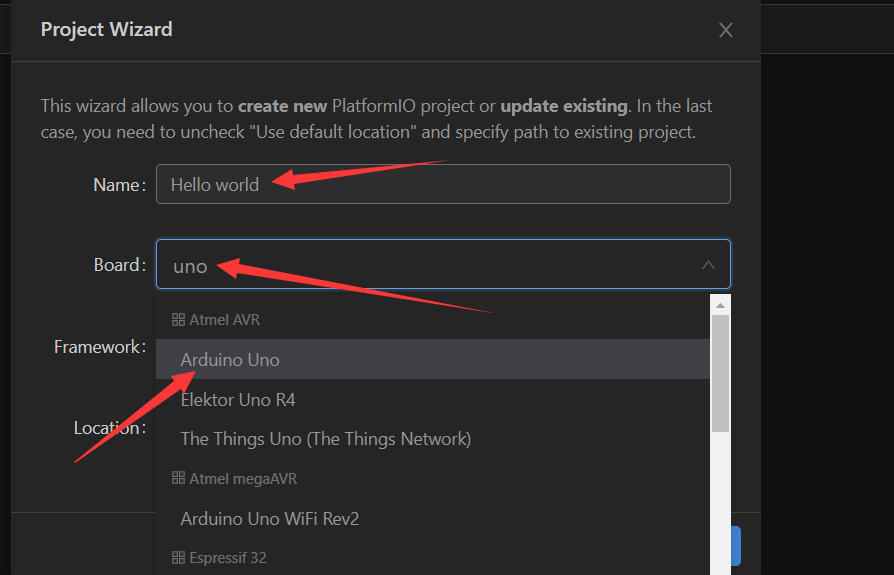

之后会看到如下界面说明项目配置中，配置完成后 VSC 会询问你是否信任该文件夹，请点击 `是`

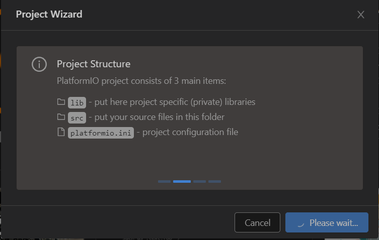

> 如果之前没有安装 Platform 的支持库，这里会自动下载，但是**有概率会卡住表现为一直 Please wait**，**这时候需要停止后检查 Platform 中 `Atmel AVR`是否已经安装成功了。**

成功后在工作区的 `src` 目录下保存着我们的源代码：

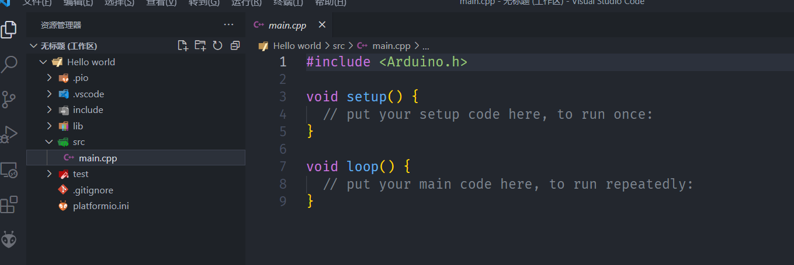

使用如下代码替换：

```C++
#include <Arduino.h>
void setup()
{
  pinMode(LED_BUILTIN, OUTPUT);
}
void loop()
{
  delay(300);
  digitalWrite(LED_BUILTIN, HIGH);
  delay(300);
  digitalWrite(LED_BUILTIN, LOW);
}
```

插上开发板，在窗口的下方点击烧录按钮，期间会自动下载所需工具链：

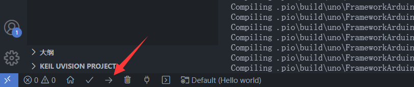

成功后会有如下输出：

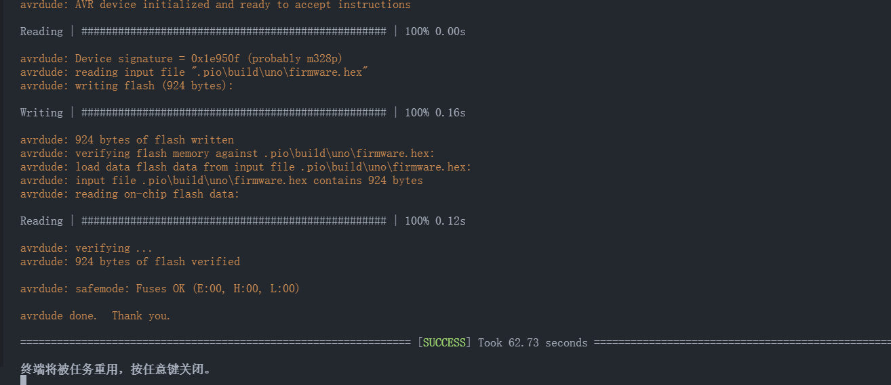

观察开发板，内置LED开始闪烁。
