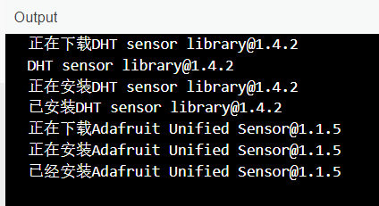

# 想学嵌入式？那我教你玩 Arduino 吧


<p align="center">作者：HelloGitHub-<strong>Anthony</strong></p>

这里是 HelloGitHub 推出的[《讲解开源项目》](https://github.com/HelloGitHub-Team/Article)系列，本期介绍的是如何用开源硬件开发平台 **Arduino**，自己动手做一个温湿度显示器。

书接上回，上一章我们知晓了什么是 Arduino、能用它来做什么，以及 `Hello World` 的实现，内容十分简单和容易上手。没看过的小伙伴可以[点击阅读]()，从而做到无缝连接本章的内容。

接下来，我们将更进一步学习 Arduino 的知识，为避免枯燥的文字教程，本文将结合实际的开发进行讲解。首先会介绍 **温湿度传感器** 和 **OLED 屏幕** 的开发，接着将这两部分的知识进行组合，最后你将得到一个有意思的温湿度显示器。

不要担心，本文所有内容均已脱“难”，只要跟着文章一步步进行下去，肯定就能做出来！

下面，就让我们一起开始制作你的第一个 Arduino 成品吧！

## 一、温湿度传感器

本节我们会用到名为 `DHT 11` 的温湿度传感器，`DHT 11` 是一款常用的温湿度数字传感器，它虽然精度不是很高但价格低廉，只用到三根线 VCC、GND、DATA 即可工作（简单），是我们学习使用传感器的不二之选！

这里我使用的是进行过二次封装的 `DHT 11` 传感器，它长这个样子：


### 1.1 连接传感器

根据购买的店铺不同，最终实物可能会有所不同。如果你无法分辨每个引脚具体含义，一定要先咨询卖家再进行接线，**防止烧坏传感器**！

我这里的三个引脚从左到右依次为 DATA、VCC、GND，连接方式为：
- GND -- GND
- VCC -- 5V
- DATA -- Digital 8

### 1.2 读取数据

读取 `DHT 11` 传感器的数据方式也非常简单，我们可以根据 `数据手册` 中 `4、串行接口` 一节提供的信息自行编写数据解析的程序。

但我认为这已经**超出了初学者的能力范围**而且实现起来也会花不少功夫，所以这时候我们就需要 **Arduino 的 Libraries 功能上场了**！

Arduino 官方提供了一个 `Library` 平台，收集了很多开发者提供的开源支持库，灵活使用这些库进行开发，可以节省我们大量的时间以及头发。

下面将介绍如何使用 Arduino IDE 的 Libraries 功能。

### 1.3 DHT 11 支持库

在这里我们选择 `Adafruit` 提供的 `DHT sensor library` 支持库，它还依赖 `Adafruit Unified Sensor` 库，下面我们详细操作：

**安装**

点击左侧 Libraries 栏目，在搜索框中输入 `DHT11` 找到 `DHT sensor library by Adafruit`，点击 `INSTALL` 进行安装，然后会提示我们需要安装一些依赖项目：


这里 Arduino IDE 自动提示我们想要使用 `DHT sensor library` 还需要安装 `Adafruit Unified Sensor`，我们直接点击 `Install all` 让它自动安装，成功后可以在输出界面看到这样的提示：



**使用**

安装好之后我们找到 Arduino IDE 上方选项卡打开：`File->Examples->DHT sensor library->DHTtester` 即可打开 `DHT sensor library` 使用例程。


这里我们只需要根据实际情况修改开头几行配置，就能直接编译到开发板上进行测试啦！

上传到开发板后打开我们的 `Serial Monitor` 即可看到 Arduino 正在回传温湿度信息：


### 1.4 传感器小结

本节我们简单学习了**如何安装 Arduino 的支持库**、**如何查看支持库提供的例程**，以及 `DHT11` 库的使用方法。

下一节，我们将学习如何使用 **LCD 屏幕显示内容**。

## 二、OLED 屏幕

本节我们会用到名为 `SH1106` 的 1.3寸 OLED 显示屏，我用的是 `SH1106` 使用 `I2C` 方式进行操作，只用到四根线 VCC、GND、SDA、SCL 分辨率为 `128x64` ，它长这个样子：


### 1.1 接线

使用时接线为：
- GND -- GND
- VCC -- 5V
- SDA -- A4
- SCL -- A5

根据使用方式和屏幕不同，实际接线可能会有出入。**如果不懂可以搜索关键词**：“Arudino+屏幕型号+通信方式”（I2C 或 SPI）

对于显示屏如果直接进行操作使用起来非常复杂，但好在开源社区为其提供了强大的支持库。

### 1.2 开源库 U8g2

`U8g2` 是一个单色显示屏的开源库，支持市面上绝大多数单色显示屏，能非常方便地从库管理器进行安装。

**安装**

上一节的支持库安装方式相同，在 `Libraries` 页面进行搜索后安装即可。

但由于其体积较大或是网络问题，可能会存在下载缓慢或者失败等问题。如果一直无法安装成功，可以手动[下载官方版本](https://github.com/olikraus/U8g2_Arduino/archive/master.zip)进行安装

**使用**

`U8g2` 同样提供了丰富的例程供我们学习，打开 `examples` 文件夹可以看到如下结构：


需要注意的是 `U8g2` 提供了两个版本：`U8g2` 本身（例程中 `full_buffer` 与 `page_buffer`）和 `u8x8`（例程中 `u8x8`）。**前者支持完整绘图功能**，但是速度一般且需要额外的内存支持，**后者只支持显示字库中图形**但是速度快不需要额外的内存。

`full_buffer` 与 `page_buffer` 的区别在于：
- `full_buffer`：会在内存中维护全部的图形缓存会占用大量内存。渲染速度快，但在 UNO 上只有部分例程能够成功运行。
- `page_buffer`：一次只维护一小部分缓存并分批次进行更新。渲染速度稍慢，在 UNO 上全部例程都可成功运行。

大家可以自行运行例程中的代码，进行一个粗略的了解。

**每段脚本只需要解除相应屏幕的注释就能运行**，比如我用的 `SH1106 128x64` 使用 I2C 通信，用到的代码片段如下：

 

> 具体规范只要有屏幕型号、分辨率、连接方式（I2C 还是 SPI）就能轻松找到

除此之外还有详细的[官方文档](https://github.com/olikraus/u8g2/wiki)。包括[函数说明](https://github.com/olikraus/u8g2/wiki/u8g2reference)、[屏幕类列表](https://github.com/olikraus/u8g2/wiki/u8g2setupcpp) 等等

## 三、温湿度显示器

前面我们已经了解了如何分别使用**温湿度传感器**和 **OLED 屏幕**，现在我们只需将它们组合起来。

下面就变得非常非常简单了，我们只需要将传感器数据搬运到屏幕上显示即可。

完整的代码如下：

```c++
#include <Arduino.h>
#include <U8g2lib.h>
#include "DHT.h"

// DHT11 DATA 引脚连接的数字引脚编号
#define DHT_DATA_PIN 8

DHT dht11(DHT_DATA_PIN, DHT11, 1);
U8G2_SH1106_128X64_NONAME_1_HW_I2C oled(U8G2_R0, U8X8_PIN_NONE);

float t, f, h;
float head_index;
const char URL[] = "http://www.HelloGitHub.com";
int url_width = 0;
bool Fahrenheit = false;

void update_data()
{
  h = dht11.readHumidity();
  t = dht11.readTemperature();
  f = dht11.readTemperature(true);
  head_index = dht11.computeHeatIndex(t, h, false);
}

void setup()
{
  t = f = h = 0;

  dht11.begin();
  oled.begin();
  oled.enableUTF8Print();
  oled.setFontMode(0);
  url_width = oled.getUTF8Width(URL); # 符号需要启动
  update_data();
}
void loop()
{
  static int url_x_pos = -url_width;
  oled.firstPage();
  do
  {
    if (millis() % 200 == 0) // 每 200ms 更新一次
      update_data();
    oled.setFont(u8g2_font_t0_11_mr);
    oled.drawBox(0, 0, 128, 17);
    oled.setDrawColor(0);
    oled.setCursor(url_x_pos, 14);
    oled.print(URL);
    oled.setDrawColor(1);

    oled.setCursor(0, 32);
    oled.setFont(u8g2_font_7x13_mf);
    oled.print("Temp: ");
    if (Fahrenheit) // 每隔一段时间自动切换单位显示
    {
      oled.print(f);
      oled.print("°F");
    }
    else
    {
      oled.print(t);
      oled.print("°C");
    }

    oled.setCursor(0, 47);
    oled.print("Humi: ");
    oled.print(h);
    oled.print(" %");

    oled.setCursor(0, 62);
    oled.print("HeadIndex: ");
    oled.print(head_index);
    oled.print("°C");

  } while (oled.nextPage());

  Fahrenheit = (millis() % 4000 == 0) ? (!Fahrenheit) : Fahrenheit; // 每 4s 更换一次单位
  url_x_pos += 3;
  if (url_x_pos > 128)
    url_x_pos = -url_width;
}
```

最终效果如下：


## 结语

如果你跟着本文一步步走下来，到这里应该已经收获了自己第一个 Arduino 成品，恭喜你！

其实，本文更侧重的是“授人以渔”！毕竟再好的教程也做不到面面俱到，解决你所有的问题，所以解决问题的方法最重要。文中对于如何上手开源库、查阅文档、查看代码示例、搜索资料等方面做了详尽步骤的讲解。相信有了这些知识，你可以打开新的世界，而不是仅限于本文所讲的例子。

下面你就可以发挥想象力，结合所学到的知识和方法，自己动手做出好玩的电子产品啦！如果你做出了好玩的东西可以发给我，如果作品够多的话我可以做一期 Arduino 作品秀！把你做的让人眼前一亮的作品，让更多的人发现和喜欢。

本期的内容就是这些，这里是 HelloGitHub 分享 GitHub 上有趣、入门级的开源项目。

感谢您的阅读！您的每个点赞、留言、分享，都是对我们最大的鼓励～我们下期再见！
