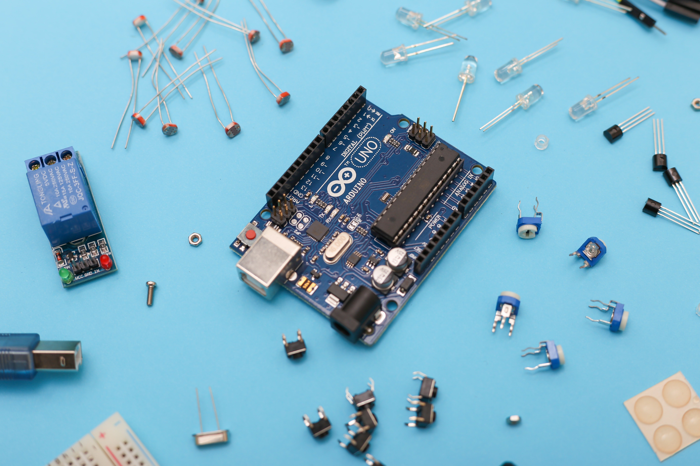
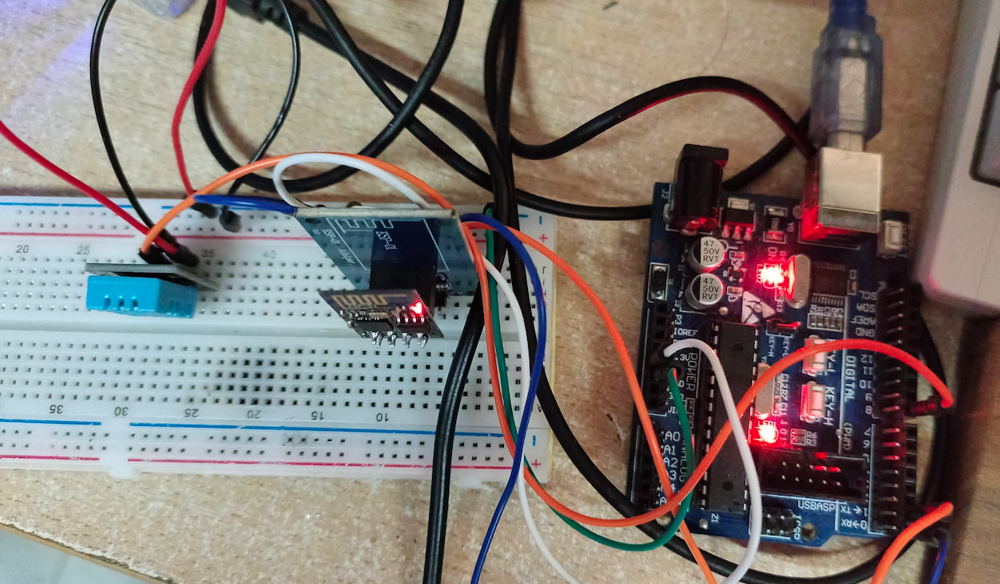

# 物联网？快来看 Arduino 上云啦！



作者：HelloGitHub-**Anthony**

这里是 HelloGitHub 推出的讲解开源硬件开发平台 **Arduino** 的系列教程。

- [第一篇：Arduino 介绍和开发环境搭建](https://mp.weixin.qq.com/s/VcJv_n9QgcIW4fQJy73R1w)
- [第二篇：制作温湿度显示器](https://mp.weixin.qq.com/s/4DCZbG50NEXOyE15rSa3XQ)

上一篇文章，我们介绍了如何安装 Arduino 支持库、DHT 11 温湿度传感器以及 OLED 屏幕的使用，并用 Arduino 制作了一个小型温湿度显示器。

在这个讲究**万物互联**的时代，也让咱们的 Arduino 温湿度去“云上”玩玩，有个学名叫物联网。

> 物联网(IoT) 是由物理对象组成的网络，这些物理对象嵌入了传感器、软件和其他技术，以便可以通过互联网与其他设备和系统建立连接并交换数据。

是不是瞬间感觉高大上了一些，但是不用担心本期的知识超纲，因为高深的我也不会！

今天我们讲解：如何把上一期做的温湿度设备上云，通过物联网平台完成**实时数据上传**和**远程控制设备**。实现将 Arduino 设备测量的温湿度数据上传到物联网平台，然后接收平台发送指令控制设备上 LED 灯光开关。

你是否已经开始摩拳擦掌了呢？下面我们开始“上云”！

## 一、实现联网功能

### 1.1 模块介绍

首先，如果想要 Arduino 连接到物联网平台的服务器，必然需要先让设备能够连接到网络（比如家里的 WiFi），这里我们就需要用到 **ESP-01(s)** 模块，来实现这个功能。

其使用方法和前文介绍过的组件类似，只需要用到 VCC(3.3v)、GND、TX、RX 四根线，就能和 Arduino 进行通信。我这里使用的是 ESP-01+转接板，转接板实现了 `5v->3.3v` 的变压以及 `Rx` 和 `Tx` 接口的引出，方便后续使用。


大多数 ESP-01(s) 模块在出厂时，都已经内置了 **AT** 指令固件，在使用时只需要向模块发送 AT 指令即可进行网络连接、数据传输等操作。

> 关于什么是 AT 指令，简单来讲就是设备间一种**通信消息规范**，更具体的定义和应用场景读者可以自行了解。

### 1.2 模块使用

ESP-01 模块接线方式如下：

- GND -> GND
- VCC -> 3.3v(单独模块) 5.5v(带转接板)
- Tx -> Rx 
- Rx -> TX

用到的 AT 指令如下：

- AT+RST：重置模块
- AT+CWMODE=1：切换模式
- AT+CWQAP：断开 WiFi 连接
- AT+CWJAP="WiFi名","密码"：连接 WiFi
- AT+CIPSTART="TCP","IP",端口：连接服务器
- AT+CIPMODE=1：切换到 TCP 透传模式
- AT+CIPSEND：开始发送数据

### 1.3 代码

Arduino 连接 WiFi 的代码：

```c
#include <Arduino.h>

boolean at_exec(char *data, char *keyword, unsigned long time_out)
{
  Serial.println(data);
  Serial.flush();
  delay(100); // 等待响应
  unsigned long start = millis();

  while (Serial.available() < strlen(keyword))
  {
    if (millis() - start > time_out)
      return false;
  }
  if (Serial.find(keyword))
    return true;
  else
    return false;

  while (Serial.available())
    Serial.read(); //清空串口缓存
}

void setup()
{
  Serial.begin(115200);
  while (!at_exec("AT+RST", "OK", 1000));
  while (!at_exec("AT+CWMODE=1", "OK", 1000));
  while (!at_exec("AT+CWQAP", "OK", 1000));
  while (!at_exec("AT+CWJAP=\"HelloGithub\",\"PassWord\"", "WIFI CONNECTED", 2000));
  while (!at_exec("AT+CIPSTART=\"TCP\",\"183.230.40.40\",1811", "CONNECT", 1000));
  while (!at_exec("AT+CIPMODE=1", "OK", 500));
  while (!at_exec("AT+CIPSEND", "OK", 500));
  //Serial.println("*产品ID#鉴权信息#脚本名称*"); // 下文会将如何获取这部分信息
}
```

**注意：**

- 下载之前要断开 Arduino 和 ESP-01 的连接，否则可能会下载失败
- 执行 `AT+CIPSEND` 后，模块将不再响应 AT 指令，如果需要修改配置则必须断电重启模块
- 记得改 `AT+CWJAP` 的参数，对应 WiFi 用户名和密码

烧录后，连接模块重启 Arduino。如果在路由器管理界面的“已连接设备”页面，看到我们的 WiFi 设备，则表示成功！


## 二、物联网平台

这里我们使用的是 OneNet 物联网平台，它是由中国移动打造的物联网 PaaS 开放平台，通过这个平台可以轻松（免费）实现设备”上云“。


下面，将介绍从注册开始到完成设备上云，所需的所有云端配置步骤。

### 2.1 注册

打开 [OneNet 官网](https://open.iot.10086.cn/)，点击右上角的“注册”注册账号。


### 2.2 新建产品

完成注册登录账号后，点击右上角的“控制台”进入控制页面。

进入后点击 “全部产品服务”->“多协议接入”：


在“多协议接入界面”选择 TCP 透传->添加产品：


在弹出的侧边栏填写相关信息，“产品行业”和“类别”随便填写即可，最后点击“确定”完成新建产品。


### 2.3 添加设备

找到刚刚创建的产品我的是 “HelloGitHub”，然后点击左侧栏的“设备列表”，在新出现的页面中点击“添加设备”，填写完相关信息最后点击“添加”，完成增添设备的操作。


### 2.4 编写数据解析脚本

接下来，我们配置云端的数据解析脚本，不用自己动手写直接下载[官方脚本](https://open.iot.10086.cn/doc/v5/develop/detail/495)到本地改一改就能用。


在解压下载好的文件夹中，找到 `sample.lua` 文件里的 `device_timer_init` 函数（第 303 行），改成如下内容：

```lua
function device_timer_init(dev)
    -- 定时发送开关灯指令 --
	dev:timeout(0)
	dev:add(10,"open","open")
	dev:add(12,"close","close")
end
```

找到 `device_data_analyze` 函数（在文件的最后），修改为如下内容：

```lua
function device_data_analyze(dev)
	local t={}
	local a=0
	local s = dev:size()
    -- 我们定义 一次发送 十个 字节，分别为 温度 湿度 --
	add_val(t,"Temperature",a,dev:bytes(1,5))
	add_val(t,"Humidity",a,dev:bytes(6,5))
	dev:response()
	dev:send("received")
	return s,to_json(t)
end
```

如果大家对脚本使用方法感兴趣的话，可以查看代码的注释和官网上接入文档，这里就不做过多讲解了。

### 2.5 上传脚本

将该文件保存后，回到刚刚打开过的“设备列表”点击“上传解析脚本”。


至此，云端配置完毕。


### 2.6 连接物联网平台

修改 1.3 的代码，将 **“下文会将如何获取这部分信息”** 这行代码改成：

```
Serial.println("*产品ID#ILoveHelloGitHub#HG*");
```

将云端配置完成后，获得的**产品 ID**、**鉴权信息**、**脚本名称**等参数，替换到对应位置。（`*产品ID#鉴权信息#脚本名称*`）

最后，重新烧录代码并重启 ESP-01 模块。稍等片刻，在云端刷新“设备列表”页面，看到我们的设备，证明设备成功连接上了物联网平台。


## 三、Arduino 上云

经过前面的铺垫，我们“上云”的旅程即将迎来最激动人心的部分。**将设备所在环境的温湿度数据上传到云端！**

### 3.1 代码

既然是上传温湿度数据，就需要用到我们[上期](https://mp.weixin.qq.com/s/4DCZbG50NEXOyE15rSa3XQ)讲的 DHT11 模块（温湿度传感器），然后结合本期连接网络的代码，分分钟就可以完成啦。

但是为了增加项目的趣味性，我额外添加了个解析物联网平台发送命令，远程控制开关 LED 的函数。

代码片段如下：

```c++
void setup()
{
  // 改成自己云端的参数
  Serial.println("*产品ID#ILoveHelloGitHub#HG*");
}

// 根据从串口收到的 字符串 执行相应的指令
bool command_parse(String command){
  ...
  if (command == "open")
  {
    digitalWrite(LED_BUILTIN, HIGH);
  } else if (command == "close")
  {
    digitalWrite(LED_BUILTIN, LOW);
  }
}
```

> 完整代码：https://github.com/HelloGitHub-Team/Article/blob/master/contents/Other/Arduino/3/code.cpp

最后，修改完整代码中的 **WiFi 名和密码**，以及 **产品 ID** 后，重新烧录代码即可。


### 3.2 上传温湿度数据

稍等片刻后，查看物联网平台的“设备信息”，如果看到 Arduino 上传的室内温湿度信息，就证明我们的代码运行成功啦。


### 3.3 远程控制

下面演示如何通过物联网平台，远程控制灯的开关。

打开物联网平台，点击“设备界面”的“下发指令”，在弹出的表单上选择“字符串”选项，输入 “open” 或 “close” 指令。


到这里，就完成了远程控制 Arduino 内置 LED 灯开/关的效果！



成功！撒花🎉 

## 四、总结

这篇文章，结合 Arduino、传感器、WiFi 以及 OneNet 物联网平台，通过边做边讲的方式，讲述了一个设备从联网到上云的完整过程。虽然是入门级的教程，但是这些知识已经可以帮助你完成，诸如智能开关、自动喂食器等实用和有趣的项目。

不小看每一次小的进步，不积跬步无以至千里。

如果说移动互联网的浪潮已经过去，那么下一个浪潮中会不会有**物联网**的影子呢？反正我觉得技多不压身，对此你怎么看？欢迎在评论区发表你的看法。

---

至此，整个 Arduino 系列教程，到这里就结束了。完结！再次撒花🎉

希望，HelloGitHub 的 **Arduino** 系列教程，能够勾起你对物联网的兴趣，毕竟兴趣才是最好的好老师。

本期的内容就是这些，这里是 HelloGitHub 分享 GitHub 上有趣、入门级的开源项目。

感谢您的阅读，如果觉得内容还不错，一定要记得点赞、留言、分享，我们下期见！
