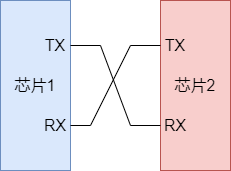
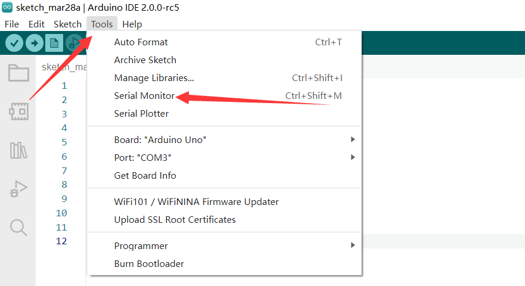
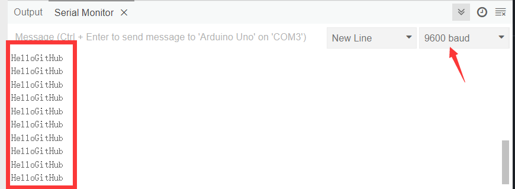
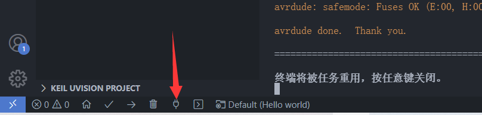
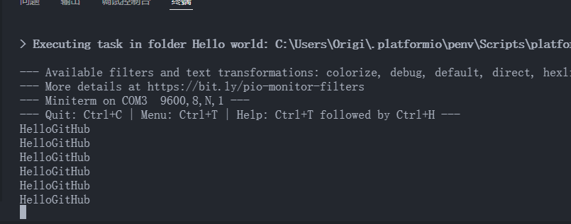
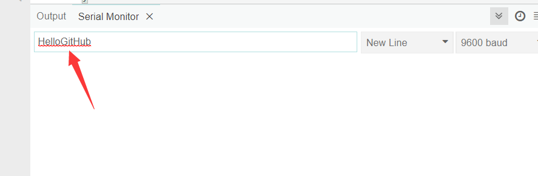
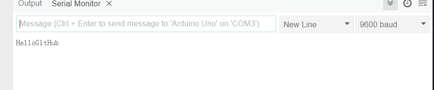
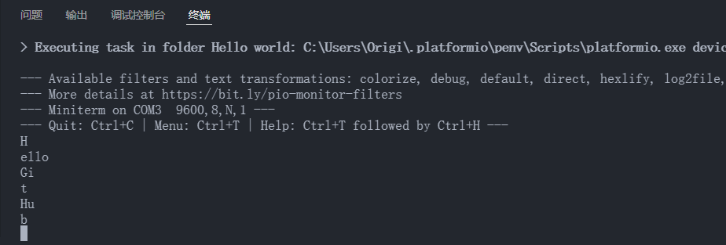

# Arduino 串口使用

本文作者 HelloGitHub-Anthony

## 1. 什么是串口

这个问题各种百科已经给出了答案，但是对于初学者来讲难这些文字难免有些官方。通俗来讲，**串口就是芯片之间通话的渠道**。

一般来讲我们使用开发板上的 UART 串口进行通信，它使用两根信号线进行通信，一个名为 `TX` （消息发送端）一个名为 `RX`（消息接收端），他们的职责非常单一，`TX` 只能发送消息，`RX` 只能收听消息，所以使用的时候应该将 `TX` 和 `RX` 交叉连接：



此外，串口在使用的时候如果没有额外的线缆给出同步时钟信号（比如这里使用的 uart）则还需要指定串口的波特率，这相当于两芯片之间的约定：我说我一分钟能输出 100 个二进制信号，那么平均来讲每个信号的时长就是 1/100 秒，你只需要每 1/100 秒接收一次即可跟上我的脚步。

> 当然，这里的比喻存在些许漏洞，实际上的通信过程会稍微复杂一些以保证通信的可靠性和正确性。

我们现在开始实践！具体使用到的函数大家可以参考 API 手册：https://wiki.arduino.cn/?file=005-串口通信/004-其他函数

## 2. HelloGitHub

Arduino 已经为我们准备好了 Serial（串口），只需要简单几步即可实现消息的发送：

```C++
#include <Arduino.h>

void setup()
{
    // 设置波特率为 9600，我们的电脑读取的时候也要保持相同
  Serial.begin(9600);
}

void loop()
{
  // 串口输出一行文字，会自动加换行符
  Serial.println("HelloGitHub");
  // 等待一会儿，防止发送太快卡死
  delay(1000);
}
```

> 这里使用的是一个 Arduino 官方库为我们准备好的 Serial 对象，如果您不了解 C++ 对象相关概念也不影响您的使用，类似 Serial.begin() 这种语法相当于函数调用（或者更官方的称呼是`方法`），它只不过是 Serial 特有的函数而已。

将以上程序烧录到开发板中，使用查看串口：

Arduino IDE：





PlatformIO：





> PlatformIO 的串口工具设置波特率方式如下（默认 9600）：
>
> 选中终端，按下 `Ctrl+T` 松开后再按 ` 之后输入新的波特率，比如 `115200`，之后再按回车即可。其他设置内容可以使用 Ctrl+T 紧接着 Ctrl+H 进行查看

## 3. 回声

上面讲完了如何发送，现在我们来说说如何让 Arduino 从电脑或者什么其他地方接收消息。

```C++
#include <Arduino.h>

int count; // 记录缓冲区字节数
char buffer[65]; // 存储从缓冲区读出来的字符

void setup()
{
  // 做一些初始化工作
  Serial.begin(9600);
  count = 0;
}
void loop()
{
  // 这个 Serial.available() 会返回当前接受了多少字符存储再缓存区
  count =  Serial.available();
    
  if (count > 0) // 如果缓存区存了东西
  {
    // 读取 count 个字符到 buffer 中
    Serial.readBytes(buffer, count);
    // 添加结尾，为了后面发送
    buffer[count] = '\0';
    // 发送
    Serial.println(buffer);
  }
  // 给一点时间多接收一点消息，不然只能一个字母一个字母的返回
  delay(800);
}
```

烧录以上程序，按照之前的方法查看串口：

Arduino IDE：

需要在这个框框里输入要发送的内容然后使用快捷键 Ctrl+Enter 发送：



可以看到返回的消息：



PlatformIO：

直接在终端里输入即可：



至此，关于串口的基本使用就讲完了，虽然实现的功能很简陋，但要相信这是所有大神的必经之路，利用这种看似简陋的功能我们也能实现很多花哨的功能。
