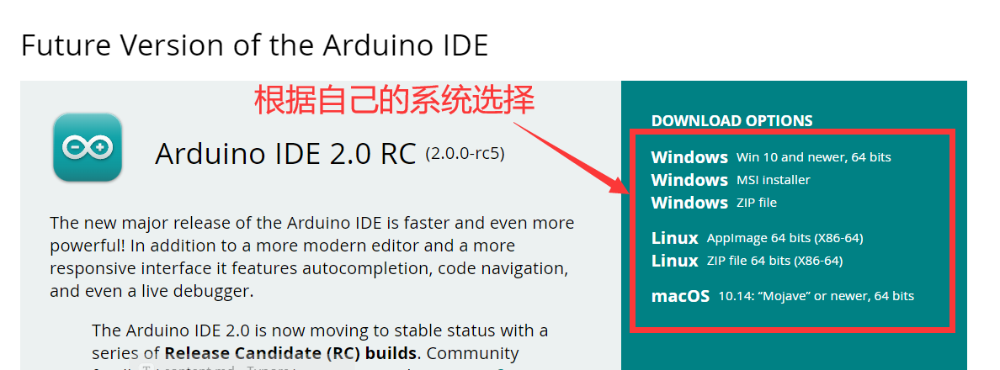
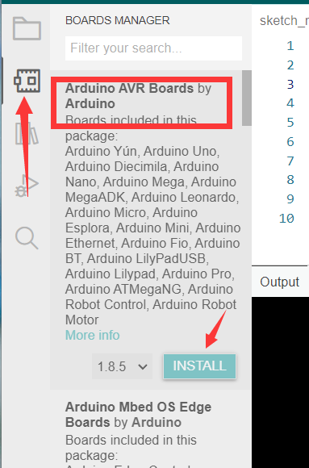

# 想学嵌入式？听说很多大佬都是用它入门的


本文作者 HelloGitHub-Anthony

HelloGitHub 推出的[《讲解开源项目》](https://github.com/HelloGitHub-Team/Article)系列，本期介绍开源硬件平台 **Arduino**.

> 项目地址：https://github.com/arduino/Arduino

你是否想过成为一名 Geek，随手就可以鼓捣出各种新奇有趣的电子设备，但奈何无论是 51单片机 还是 Stm32 **对零基础的爱好者来讲无法做到快速上手**，往往一个成品还没出来自信心就已经被打击没了。

现在，Arduino 来了，它是一个**非常容易上手**的开源硬件平台，包括 开发板（例如 Arduino UNO） 和 软件（Arduino IDE） 两部分，而且**拥有完善的中文社区**和**大量的开源项目**。笔者是在初中接触到 Arduino 的，在当年 C 语言都不是很熟练的情况下只花了一天就能跟着教程实现一些花哨的功能，足见 **Arduino 非常的适合作为电子爱好者的第一块开发板**。

## 闻道

### 1. 型号推荐

Arduino 到目前为止有很多种类的开发板，笔者这里推荐大家使用 UNO 作为您的第一块开发板。原因有以下几点：

1. UNO 使用的人很多，很多教程都是基于 UNO 进行编写的
2. 便宜，相比较其他类型开发板 UNO 真的非常便宜了
3. 芯片可拆卸，一块板子用的时间长了难免出现各种问题，如果只是芯片坏了可以直接买一块换上去。

### 2. UNO R3 开发板介绍

截止目前，市面上常见的 UNO 开发板为 UNO R3，其开发板如图所示：


Arduino 使用一根数据线连接电脑即可实现 供电/编程/调试/通信 等功能。

以下是开发板硬件的详细参数

| 微控制器              | ATmega328P                                                 |
| --------------------- | ---------------------------------------------------------- |
| 工作电压              | 5伏特                                                      |
| 输入电压(推荐)        | 7-12伏特                                                   |
| 输入电压(极限)        | 6-20伏特                                                   |
| 数字输入输出引脚      | 14个（其中有6个引脚可作为PWM引脚）                         |
| PWM引脚               | 6个                                                        |
| 模拟输入引脚          | 6个                                                        |
| 输入/输出引脚直流电流 | 20 毫安                                                    |
| 3.3V引脚电流          | 50 毫安                                                    |
| Flash Memory(闪存)    | 32 KB (ATmega328P) 其中由 0.5 KB用于系统引导（bootloader） |
| SRAM（静态存储器）    | 2 KB (ATmega328P)                                          |
| 时钟频率              | 16 MHz                                                     |
| EEPROM                | 1 KB (ATmega328P)                                          |
| 内置LED引脚           | 13                                                         |
| 长                    | 68.6 mm                                                    |
| 宽                    | 53.4 mm                                                    |
| 重                    | 25克                                                       |

不要惊讶于开发板相比电脑竟然只有如此有限的资源，对于嵌入式来讲，这个参数足以适用于绝大多数场合。充足的电压输入范围可以让设备使用包括电脑 USB 接口、干电池、充电宝等多种方式供电而不会烧毁。

### 3. Arduino 开发环境

前面讲到 Arduino 还配套有自己的跨平台（支持 Windows/Linux/Mac OS X）编程环境——**Arduino IDE**，它集成了 Arduino 所需的全部环境和支持库，只需要选择开发板然后鼠标点击几下即可实现编译、烧录、串口监控等功能。此外，Arduino 也在近些年推出了网页版编辑器以及 Arduino CLI，进一步降低了 Arduino 的开发门槛。


此外，如果您不喜欢 Arduino 或者想使用其他 IDE，也可以选择安装 Platform IO 插件进行开发，Platform IO 也提供了开发包括 Arduino 在内大部分嵌入式开发所需环境，一样可以实现一键编译、下载、调试。


当然，Arduino 语言也不仅限于在 Arduino 开发板上进行开发，包括 Stm32、ESP32 在内的许多芯片都能使用 Arduino 语言进行开发。

### 4. Arduino 社区

Arduino 拥有非常活跃的中文社区（https://www.arduino.cn/），所提问题大都能得到网友的热心解答且有很多人分享自己的作品，保证了即使是零基础小白也能在这里快速成长。


### 5. Arduino 项目展示

Arduino 超声波避障小车(https://m.elecfans.com/article/717553.html)


三自由度机械臂（https://www.arduino.cn/thread-104895-1-1.html）


简易密码锁的制作（https://www.arduino.cn/thread-82408-1-1.html）


当然，除此之外 Arduino 还能做很多很多事情，笔者无法全部将其列出，可以说只要不违反科学原理 Arduino 都能将你的电子梦变为现实！

下面将会介绍几种不同的 Arduino 开发环境，各位读者可以根据自己的喜好挑选一个进行安装。

### 6. Arduino IDE

这里笔者使用的 Arduino IDE 2.0 RC 版本，**1.8 版本的使用网络上已有很多教程**且 v1 版本对于代码自动补全做的不是很好所以这里用 V2 版本做演示。

> 官方下载地址：https://www.arduino.cc/en/software

进入下载网址后，下滑网页即可看到 Arduino IDE 2.0 RC 的下载入口：



> 由于服务器位于国外，下载速度可能不是很快，需要大家耐心等待

下载以后根据提示进行安装后启动程序可以看到如下界面：


> 注：这里大家的配色可能不同，默认是黑底白字，可以在 File->Preference->Theme 处更改

这里我们点开 板级支持库管理 安装 ``Arduino AVR Boards`` :



 

> **警告**：由于 Arduino CLI 本身问题，这里可能会出现诸如 Access is denied 等错误，这里**！！！需要关闭杀毒软件后才能正常安装！！！**

**在此过程中会自动安装驱动，请在提示中选择 “是” 进行确认**

安装完成后应该会有如下文字输出：


接下来，插上我们的开发板然后在 ``开发板选择`` 窗口进行选择：


> 根据大家连接 USB 口的不同，这个不一定都是 COM3，大家需要自行判断。或者**在设备管理器中查看串口**，或者**拔插开发板看新增的是哪个** COM 口

之后复制如下内容到 ``编辑窗口`` 

```c++
void setup() {
  pinMode(LED_BUILTIN, OUTPUT);
}

void loop() {
  delay(300);
  digitalWrite(LED_BUILTIN, HIGH);
  delay(300);
  digitalWrite(LED_BUILTIN, LOW);
}
```

> 代码补全默认快捷键：Ctrl+i，如果补全选项为空说明您没有正确安装板级支持库

点击 ``烧录`` 按钮，会出现如下提示，并且开发板上的 LED 开始闪烁：


至此，环境配置成功。

### 7. VSCode+PlatformIO

> 提示：由于 PlatformIO 服务器位于国外，可能下载速度会很慢

首先在 VSCode 扩展页面搜索 PlatformIO 并安装扩展，之后 PlatformIO 会自动安装所需组件

> 在此之前您需要安装 Python3.6 以上版本的 Python

安装完成后重启 VSCode 会在左侧栏看见 PlO 图标，点击后选择 `Open->Platforms->Embedded` 搜索 `avr` 


点击 `Atmel AVR` 选项后点击 `Install` 


> 根据网络情况，此步骤可能会花费很久

之后我们在 `Projects` 选项中创建新项目：


分别填写名称选择开发板，`Framework` 选项保持 `Arduino` 不变，`Location` 根据情况可以自行调整，最后点击右下角蓝色的 `Finish` 即可。


之后会看到如下界面说明项目配置中，配置完成后 VSC 会询问你是否信任该文件夹，请点击 `是`


> 如果之前没有安装 Platform 的支持库，这里会自动下载，但是**有概率会卡住表现为一直 Please wait**，**这时候需要停止后检查 Platform 中 `Atmel AVR`是否已经安装成功了。**

成功后在工作区的 `src` 目录下保存着我们的源代码：


使用如下代码替换：

```C++
#include <Arduino.h>
void setup()
{
  pinMode(LED_BUILTIN, OUTPUT);
}
void loop()
{
  delay(300);
  digitalWrite(LED_BUILTIN, HIGH);
  delay(300);
  digitalWrite(LED_BUILTIN, LOW);
}
```

插上开发板，在窗口的下方点击烧录按钮，期间会自动下载所需工具链：


成功后会有如下输出：


观察开发板，内置LED开始闪烁。

## 见道

Arduino 库是使用 C++ 编写的，官方将很多功能包装成了一个个函数，但是对于初学者来讲不需要了解这么多，**只要有一点 C 语言基础即可流畅使用**。**Arduino 库屏蔽了 AVR 单片机的底层细节，让我们即使不了解模数电或者单片机相关知识也能轻松上手**，现在就让我们简单了解以下 Arduino 语言相关内容。

### 1. 启动流程

一般来讲，我们的 C 语言程序都是从一个 `main` 函数开始的，但是在之前的教程中我们发现 IDE 生成的文件中只有 `setup` 和 `loop` 两个函数，那么 Arduino 是如何使用他们的呢？

实际上，真正的 `main` 函数存在于我们的 Arduino 库文件中（位于 Arduino->main.cpp），其定义如下：

```c++
int main(void)
{
    // 进行一些硬件和变量初始化工作
	init();
	initVariant();
#if defined(USBCON)
	USBDevice.attach();
#endif
	// 调用我们编写的 setup() 函数
	setup();
    
	for (;;) {
        // 调用我们编写的 loop() 函数
		loop();
		if (serialEventRun) serialEventRun();
	}
	return 0;
}
```

可以看到我们编写的 `setup` 和 `loop` 两个函数会在 `main` 中进行调用。当然，相关文件是如何组织和编译的这就是 Arduino 工具链所提供的功能了，在这里我们不做深入了解，**在初学阶段我们只关心如何使用**。

### 2. 基础功能

Arduino 为我们提供了多种函数以供使用，具体细节可以查看 Arduino API 手册，其中常用功能如下：

> 不要浪费时间去背诵相关函数，善用 IDE 的智能补全和搜索引擎，使用多了自然可以记住

**常量**

- HIGH | LOW 表示数字IO口的电平，HIGH 表示高电平（1，即输出电压），LOW 表示低电平（0，即不输出电压）。 
- INPUT | OUTPUT 表示数字IO口的方向，INPUT 表示输入（高阻态，即相当于电阻极大可以读取输入电压信号），OUTPUT 表示（输出电压信号）

**结构**

- void setup() 初始化相关引脚和变量
- void loop()  开机后循环执行的函数

**数字 I/O**

- pinMode(pin, mode )数字IO口输入输出模式定义函数，pin表示为0～13， mode表示为INPUT或OUTPUT。 
- digitalWrite(pin, value)  数字IO口输出电平定义函数，pin表示为0～13，value 表示为HIGH或LOW。比如定义HIGH可以驱动LED。 
- int digitalRead(pin)   数字IO口读输入电平函数，pin表示为0～13，value 表示为HIGH或LOW。比如可以读数字传感器。  

**模拟 I/O**  

- int analogRead(pin) 模拟IO口读函数，pin表示为0～5。比如可以读模拟传感器（10位AD，0～5V表示为0～1023）。
- analogWrite(pin, value)  PWM 数字IO口PWM输出函数，Arduino数字IO口 标注了PWM的IO口可使用该函数，pin表示3, 5, 6, 9, 10, 11，value表示为0～255。  

**时间函数**  

- delay(ms)   延时函数（单位ms）。 
- delayMicroseconds(us)  延时函数（单位us）。  

**数学函数** 

- z  min(x, y)  求最小值 
- max(x, y)   求最大值 
- abs(x)    计算绝对值 
- constrain(x, a, b)   约束函数，下限a，上限b，x必须在ab之间才能返回。 
- map(value, fromLow, fromHigh, toLow, toHigh)  约束函数，value必须在fromLow与toLow之间和fromHigh与toHigh之间。 
- pow(base, exponent) 开方函数，base的exponent次方。
- sq(x) 平方 
- sqrt(x) 开根号

### 3. 万物始于点灯

 Arduino 中程序运行时将首先调用 setup() 函数。用于初始化变量、设置针脚的输出 \输入类型、配置串口、引入类库文件等等。每次 Arduino 上电或重启后，setup 函数只运 行一次，例如：

```c++
void setup()
{
  pinMode(LED_BUILTIN, OUTPUT); // 设置内置 LED 端口为输出模式
}
```

之后会执行 loop() 函数。顾名思义,该函数在程序运行过程中不断的循环，直到芯片断电为止：

```C++
void loop()
{
  delay(300); // 等待 300ms
  digitalWrite(LED_BUILTIN, HIGH);// 内置 LED 输出高电平
  delay(300);
  digitalWrite(LED_BUILTIN, LOW);// 内置 LED 输出低电平
}
```


### 4. 什么是串口

这个问题各种百科已经给出了答案，但是对于初学者来讲难这些文字难免有些官方。通俗来讲，**串口就是芯片之间通话的渠道**。

一般来讲我们使用开发板上的 UART 串口进行通信，它使用两根信号线进行通信，一个名为 `TX` （消息发送端）一个名为 `RX`（消息接收端），他们的职责非常单一，`TX` 只能发送消息，`RX` 只能收听消息，所以使用的时候应该将 `TX` 和 `RX` 交叉连接：


此外，串口在使用的时候如果没有额外的线缆给出同步时钟信号（比如这里使用的 uart）则还需要指定串口的波特率，这相当于两芯片之间的约定：我说我一分钟能输出 100 个二进制信号，那么平均来讲每个信号的时长就是 1/100 秒，你只需要每 1/100 秒接收一次即可跟上我的脚步。

> 当然，这里的比喻存在些许漏洞，实际上的通信过程会稍微复杂一些以保证通信的可靠性和正确性。

我们现在开始实践！具体使用到的函数大家可以参考 API 手册：https://wiki.arduino.cn/?file=005-串口通信/004-其他函数

### 5. HelloGitHub

Arduino 已经为我们准备好了 Serial（串口），只需要简单几步即可实现消息的发送：

```C++
#include <Arduino.h>

void setup()
{
    // 设置波特率为 9600，我们的电脑读取的时候也要保持相同
  Serial.begin(9600);
}

void loop()
{
  // 串口输出一行文字，会自动加换行符
  Serial.println("HelloGitHub");
  // 等待一会儿，防止发送太快卡死
  delay(1000);
}
```

> 这里使用的是一个 Arduino 官方库为我们准备好的 Serial 对象，如果您不了解 C++ 对象相关概念也不影响您的使用，类似 Serial.begin() 这种语法相当于函数调用（或者更官方的称呼是`方法`），它只不过是 Serial 特有的函数而已。

将以上程序烧录到开发板中，使用查看串口：

Arduino IDE：


PlatformIO：


> PlatformIO 的串口工具设置波特率方式如下（默认 9600）：
>
> 选中终端，按下 `Ctrl+T` 松开后再按 ` 之后输入新的波特率，比如 `115200`，之后再按回车即可。其他设置内容可以使用 Ctrl+T 紧接着 Ctrl+H 进行查看

### 6. 回声

上面讲完了如何发送，现在我们来说说如何让 Arduino 从电脑或者什么其他地方接收消息。

```C++
#include <Arduino.h>

int count; // 记录缓冲区字节数
char buffer[65]; // 存储从缓冲区读出来的字符

void setup()
{
  // 做一些初始化工作
  Serial.begin(9600);
  count = 0;
}
void loop()
{
  // 这个 Serial.available() 会返回当前接受了多少字符存储再缓存区
  count =  Serial.available();
    
  if (count > 0) // 如果缓存区存了东西
  {
    // 读取 count 个字符到 buffer 中
    Serial.readBytes(buffer, count);
    // 添加结尾，为了后面发送
    buffer[count] = '\0';
    // 发送
    Serial.println(buffer);
  }
  // 给一点时间多接收一点消息，不然只能一个字母一个字母的返回
  delay(800);
}
```

烧录以上程序，按照之前的方法查看串口：

Arduino IDE：

需要在这个框框里输入要发送的内容然后使用快捷键 Ctrl+Enter 发送：


可以看到返回的消息：


PlatformIO：

直接在终端里输入即可：


至此，关于串口的基本使用就讲完了，虽然实现的功能很简陋，但要相信这是所有大神的必经之路，利用这种看似简陋的功能我们也能实现很多花哨的功能。