# 想做智能家居？快来用 Arduino 上云吧

作者：HelloGitHub-**Anthony**

这里是 HelloGitHub 推出的《讲解开源项目》系列，本期介绍的是如何将开源硬件开发平台 **Arduino** 与 **OneNet** 物联网平台进行连接并上传温湿度数据。

在上一篇文章中我们学习了如何安装 Arduino 支持库、**DHT 11 温湿度传感器** 以及 **OLED 屏幕** 的使用，并用 **Arduino** 制作了一个小型温度显示器。我相信只是本地显示并不能满足各位读者的野心，在讲究 **万物互联** 的时代我们的 **Arduino** 也要 ”上云“ 才行。

本期笔者将带领大家将 **Arduino** 获取到的 温湿度数据 上传到 **OneNet** 平台，并能通过 **OneNet** 平台发送指令控制 **Arduino** 上 LED 灯光开关。

不必担心知识超纲，本期不涉及网络编程。

下面，就让我们”上云“吧！

## 一、ESP-01(S) 模块

### 1.1 模块介绍

想要我们的 **Arduino** 连接到 **OneNet** 的服务器，必然需要先让其连接到网络（比如 家里的 WIFI），这里我们用 **ESP-01(s)** 模块实现这个功能。

其使用方法和前文介绍过的组件类似，只需要用到 **VCC** (3.3v)、**GND**、**TX**、**RX** 四根线即可和 **Arduino** 进行通信。笔者这里使用的是 **ESP-01** + 转接板，转接板实现了 5v -> 3.3v 的变压 和 **Rx** **Tx** 接口的引出，方便后续使用，读者可以根据情况购买：

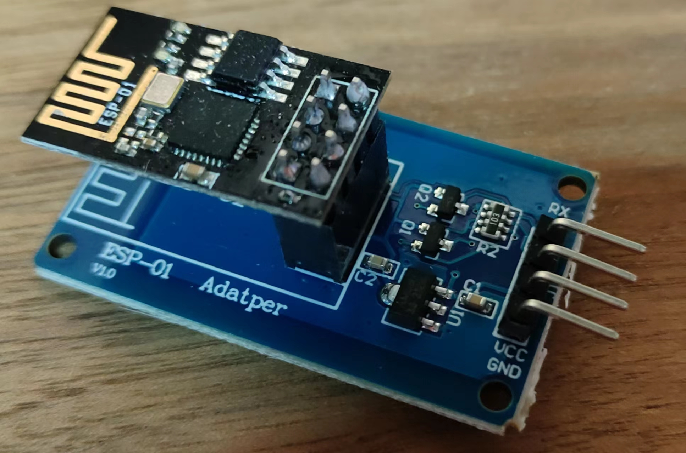

网上的 **ESP-01(s)** 模块在出厂时都应该已经内置了 **AT** 指令固件，在使用时只需要向模块发送 AT 指令即可进行 网络连接、数据接法等 操作。

> 关于什么是 AT 指令，简单来讲就是设备间一种 通信消息规范，更具体的定义和应用场景读者可以自行了解

### 1.2 模块使用

**ESP-01** 模块接线方式如下：

GND -- GND

VCC -- 3.3v(单独模块) 5.5v(带转接板)

Tx -- Rx 

Rx -- TX

我们使用到的 AT 指令有如下几条：

- AT+RST —— 重置模块

- AT+CWMODE=1 —— 切换模式

- AT+CWQAP ——断开 WIFI 连接
- AT+CWJAP="WIFI名","密码" ——连接WIFI
- AT+CIPSTART="TCP","183.230.40.40",1811 —— 连接 OneNet 服务器
- AT+CIPMODE=1 —— 切换到 TCP 透传模式
- AT+CIPSEND —— 开始发送数据

使用 **Arduino** 连接 WIFI 代码如下：

```c
#include <Arduino.h>

boolean at_exec(char *data, char *keyword, unsigned long time_out)
{
  Serial.println(data);
  Serial.flush();
  delay(100); // 等待响应
  unsigned long start = millis();

  while (Serial.available() < strlen(keyword))
  {
    if (millis() - start > time_out)
      return false;
  }
  if (Serial.find(keyword))
    return true;
  else
    return false;

  while (Serial.available())
    Serial.read(); //清空串口缓存
}
void setup()
{
  Serial.begin(115200);
  while (!at_exec("AT+RST", "OK", 1000));
  while (!at_exec("AT+CWMODE=1", "OK", 1000));
  while (!at_exec("AT+CWQAP", "OK", 1000));
  while (!at_exec("AT+CWJAP=\"HelloGithub\",\"PassWord\"", "WIFI CONNECTED", 2000));
  while (!at_exec("AT+CIPSTART=\"TCP\",\"183.230.40.40\",1811", "CONNECT", 1000));
  while (!at_exec("AT+CIPMODE=1", "OK", 500));
  while (!at_exec("AT+CIPSEND", "OK", 500));
  //Serial.println("*产品ID#鉴权信息#脚本名称*"); // 下文会将如何获取这部分信息
}

void loop()
{
  
}
```

> 下载之前应断开 Arduino 和 ESP-01 的连接，否则可能会下载失败
>
> 执行 AT+CIPSEND 后 模块将不再响应 AT 指令，如果需要重新配置则要断电重启模块

烧录后连接模块，重启 Arduino 后在路由器管理界面即可看到模块连接到 WIFI：

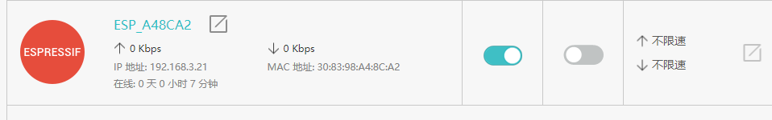

## 二、OneNet 平台配置

OneNet 是由中国移动打造的PaaS物联网开放平台，我们可以通过这个平台轻松实现设备”上云“

### 2.1 注册账号

打开 OneNet 官网 https://open.iot.10086.cn/ 点击右上角的注册按钮注册账号（这里可以不进行实名认证）：


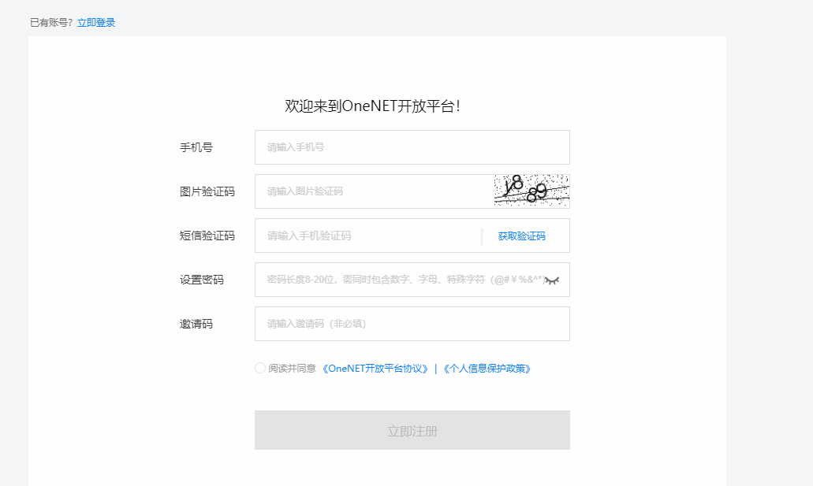

### 2.2 云端配置

登陆账号，点击控制台按钮：


进入后点击 **全部产品服务** -> **多协议接入**

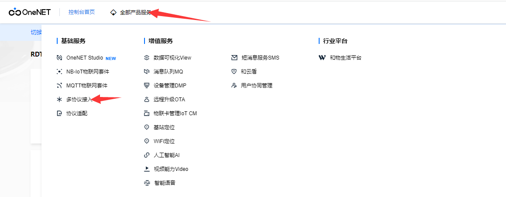

在 **多协议接入** 界面选择 **TCP 透传** -> **添加产品**

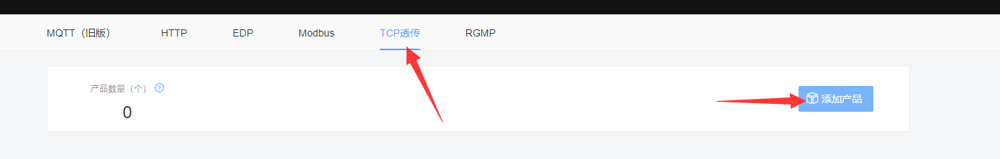

> TCP 透传协议官方介绍：https://open.iot.10086.cn/doc/v5/develop/detail/496

在弹出的侧边栏填写相关信息（产品行业 和 类别 随便填写即可）后点击确定：

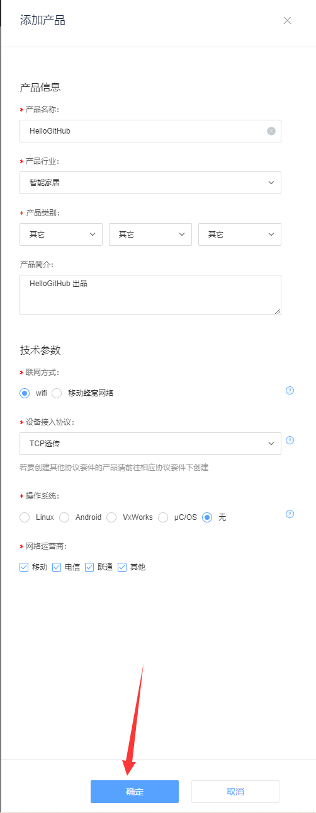

之后点击我们刚刚创建的产品：

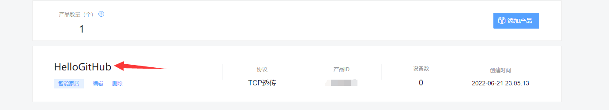

点击左侧栏的设备列表：

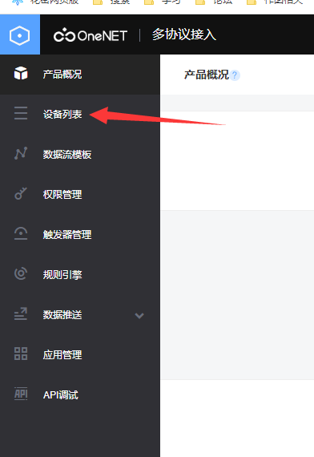

在新出现的页面中点击 **添加设备** :

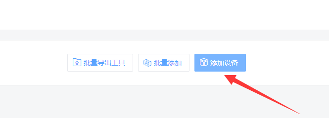

填写相关信息后点击 **添加**：

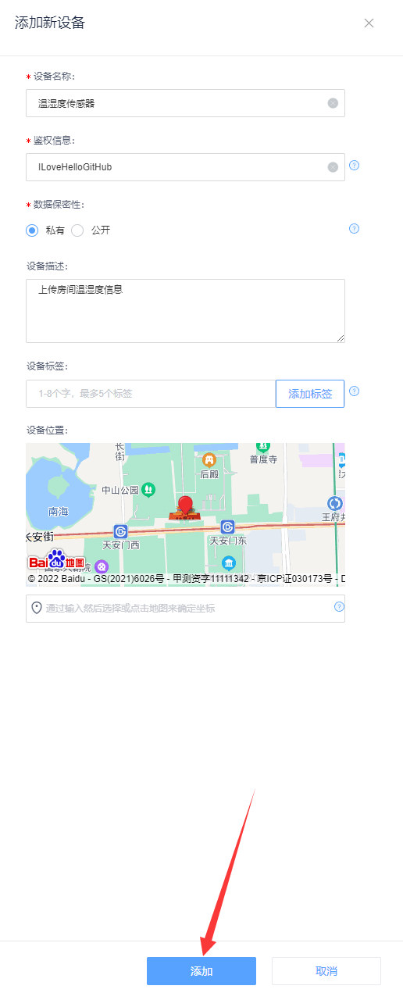

接下来，我们配置 云端 的数据解析脚本，这里我们直接拿官方脚本来改即可。

官方样例地址：https://open.iot.10086.cn/doc/v5/develop/detail/495

我们直接下载 样例 脚本：


找到 **sample.lua** 

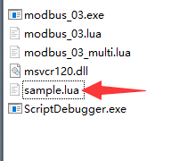

找到 **device_timer_init** 函数（303 行），修改为如下内容：

```lua
function device_timer_init(dev)
    -- 定时发送开关灯指令 --
	dev:timeout(0)
	dev:add(10,"open","open")
	dev:add(12,"close","close")
end
```


找到 **device_data_analyze** 函数（在脚本的最后），修改为如下内容：

```lua
function device_data_analyze(dev)
	local t={}
	local a=0
	local s = dev:size()
    -- 我们定义 一次发送 十个 字节，分别为 温度 湿度 --
	add_val(t,"Temperature",a,dev:bytes(1,5))
	add_val(t,"Humidity",a,dev:bytes(6,5))
	dev:response()
	dev:send("received")
	return s,to_json(t)
end
```

> 如果大家有兴趣了解脚本使用方法，可以查看其中的注释和官网上接入文档

将该文件保存后，回到刚刚打开过的 **设备列表** 点击 **上传解析脚本** ：


在弹出的侧边栏选择文件并给该脚本一个名称后点击上传：

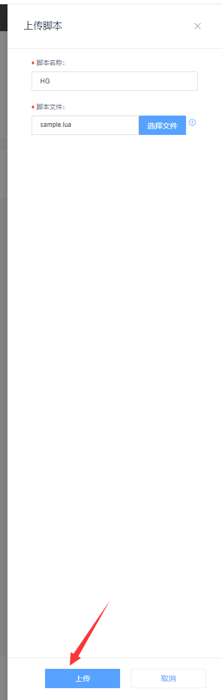

至此，云端配置完毕。

取消之前代码中 ``Serial.println("*产品ID#鉴权信息#脚本名称*"); // 下文会将如何获取这部分信息`` 的注释，修改相应信息。例如这是

```Serial.println("*产品ID#ILoveHelloGitHub#HG*");``` 

烧录代码，并重启 **ESP-01** 模块，稍等片刻刷新设备列表即可看到我们的设备在线：


## 三、上传数据

经过前面的铺垫，我们的旅程即将来到最激动人心的部分：将我们的房间温湿度数据上传到云端！

首先连接我们的 温湿度传感器 DHT11 到我们的 **Arduino** 上，连接和配置方法和上一篇文章中相同，下载好 **DHT sensor library** 这个库。

这里我直接给出完整代码，其内容非常简单：

```c++
#include <Arduino.h>
#include "DHT.h"

// DHT11 DATA 引脚连接的数字引脚编号
#define DHT_DATA_PIN 8
#define UPDATE_INTERVAL 10*1000
DHT dht11(DHT_DATA_PIN, DHT11, 1);
float t, h;
unsigned long start;

String get_data()
{
  char c[100];

  h = dht11.readHumidity();
  t = dht11.readTemperature();
    // sprintf 在 Arduino 中无法转换浮点数
  dtostrf(t, 2, 2, c); 
  dtostrf(h, 2, 2, c+5);
  return String(c);
}

boolean at_exec(char *data, char *keyword, unsigned long time_out)
{
  Serial.println(data);
  Serial.flush();
  delay(100); // 等待响应
  unsigned long start = millis();

  while (Serial.available() < strlen(keyword))
  {
    if (millis() - start > time_out)
      return false;
  }
  if (Serial.find(keyword))
    return true;
  else
    return false;

  while (Serial.available())
    Serial.read(); //清空串口缓存
}
void setup()
{
  Serial.begin(115200);
  dht11.begin();
  pinMode(LED_BUILTIN, OUTPUT);
  while (!at_exec("AT+RST", "OK", 1000));
  while (!at_exec("AT+CWMODE=1", "OK", 1000));
  while (!at_exec("AT+CWQAP", "OK", 1000));
  while (!at_exec("AT+CWJAP=\"HelloGithub\",\"PassWord\"", "WIFI CONNECTED", 2000));
  while (!at_exec("AT+CIPSTART=\"TCP\",\"183.230.40.40\",1811", "CONNECT", 1000));
  while (!at_exec("AT+CIPMODE=1", "OK", 500));
  while (!at_exec("AT+CIPSEND", "OK", 500));
  Serial.println("*产品ID#ILoveHelloGitHub#HG*");
  start = millis();
}

// 根据从串口收到的 字符串 执行相应的指令
bool command_parse(String command){
  command.trim();
  command.toLowerCase();
  if (command == "open")
  {
    digitalWrite(LED_BUILTIN, HIGH);
  }else if (command == "close")
  {
    digitalWrite(LED_BUILTIN, LOW);
  }
  else if (command == "received");
}

void loop()
{
    // 定时上报消息
  if (millis() - start > UPDATE_INTERVAL)
  {
    String data = get_data();
    Serial.println(data);
    start = millis();
  }
    // 收到消息进行解析
  if (Serial.available()){
    delay(10); // 等待全部数据接收完毕
    command_parse(Serial.readString());
    while (Serial.available())
      Serial.read(); //清空串口缓存
  }
  
}
```

将 WIFI 名称密码 和 产品 ID 进行更改后烧录代码，稍等片刻查看 OneNet 平台设备信息即可看到我们室内的温湿度信息：

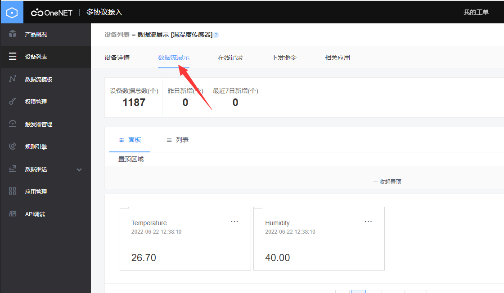

并且注意观察，Arduino 上内置 LED 灯也会在大概 10s 左右 闪烁一次。

此外，我们也可以手动下发开关灯指令，点击 设备界面 中 下发指令 选项卡：

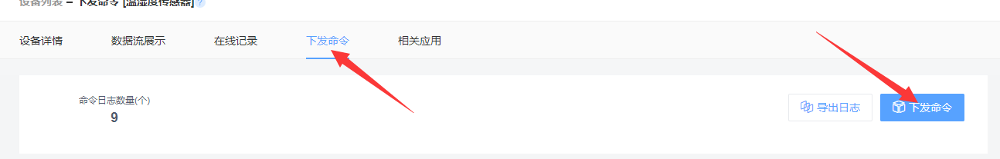

点击 下发指令 按钮，在弹出的 侧边栏 中输入 open 或 close 控制 灯光开关：

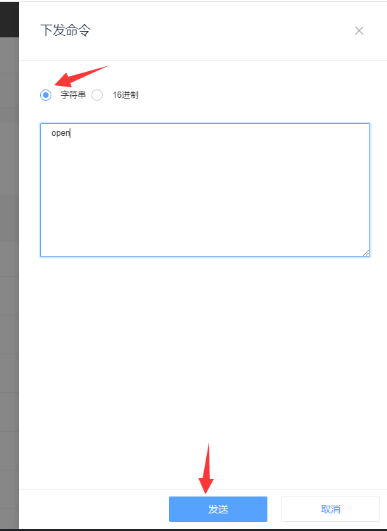

即可看到 Arduino 内置 LED 灯的开关效果！

## 结语

Arduino 教程到这里就结束了，对于物联网本文也仅仅起到抛砖引玉的作用。结合各种 传感器、继电器 以及 OneNet 平台数据推送服务等，我们可以轻松做出类似 智能开关、自动喂食器 等实用有趣的项目！

下面你就可以发挥想象力，结合所学到的知识和方法，自己动手做出好玩的电子产品啦！如果你做出了好玩的东西可以发给我，如果作品够多的话我可以做一期 Arduino 作品秀！把你做的让人眼前一亮的作品，让更多的人发现和喜欢。

本期的内容就是这些，这里是 HelloGitHub 分享 GitHub 上有趣、入门级的开源项目。

感谢您的阅读！您的每个点赞、留言、分享，都是对我们最大的鼓励～我们下期再见！
