# 想学嵌入式？我教你啊


本文作者 HelloGitHub-Anthony

HelloGitHub 推出的[《讲解开源项目》](https://github.com/HelloGitHub-Team/Article)系列，本期介绍开源硬件平台 **Arduino** 的中级应用。

> 项目地址：https://github.com/arduino/Arduino


书接上回，我们了解了什么是 Arduino，它能做什么以及它的`Hello World`。接下来我们将更进一步学习 Arduino，通过两个例子做一个有意思的温湿度显示器。

## 温湿度传感器

本节我们会用到名为 `DHT 11` 的温湿度传感器，`DHT 11` 是一款常用的温湿度数字传感器，其虽然精度不是很高但价格低廉且只用三根线（`VCC` `GND` `DATA`）即可工作，是我们学习使用传感器的不二之选

> DHT 11 数据手册：https://cdn-shop.adafruit.com/datasheets/DHT11-chinese.pdf

在这里，笔者使用的是进行过二次封装的 `DHT 11` 传感器，它长这个样子：

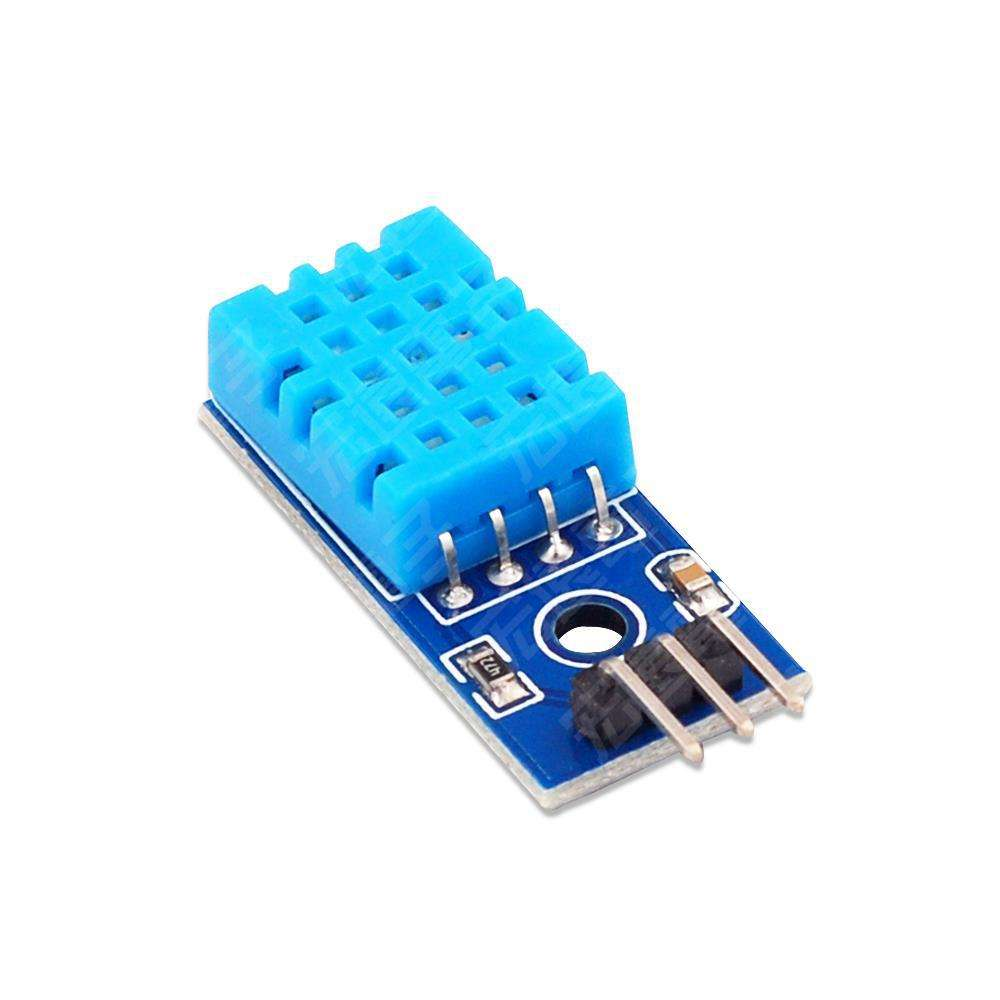

> 根据购买的店铺不同，最总实物可能会有所不同，如果您无法分辨每个引脚具体含义一定要先咨询卖家再进行接线以防烧坏传感器

三个引脚从左到右依次为`DATA` `VCC` `GND` 使用的，笔者的连接方式为：`GND -- GND` `VCC -- 5V` `DATA -- Digital 8`

读取 `DHT 11` 数据的方式也非常简单，我们可以根据 ``数据手册`` 中 ``4、串行接口`` 一节提供的信息自行编写数据解析的程序，**但我认为这明显超出了初学者的能力范围**且实现起来也要花上不少功夫，**这时候我们就需要 `Arduino` 的 `Libraries` 功能出场了**。Arduino 官方提供了一个 `Library` 平台搜集了很多开发者提供的开源支持库，灵活使用这些库进行开发可以节省我们大量的时间以及头发。

### DHT 11 支持库

在这里我们选择 `Adafruit` 提供的 `DHT sensor library` 支持库，其还依赖 `Adafruit Unified Sensor` 库，下面我们详细操作：

#### Arduino IDE

##### 安装

点击左侧 Libraries 栏目，在搜索框中输入 `DHT11` 找到 `DHT sensor library by Adafruit`，点击 `INSTALL` 进行安装，然后会提示我们需要安装一些依赖项目：

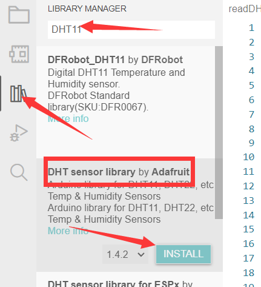

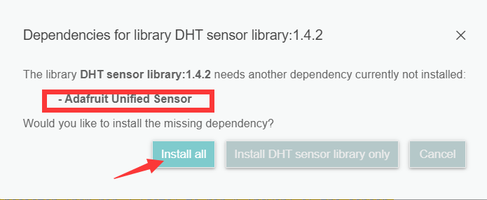

这里 Arduino IDE 自动提示我们想要使用 `DHT sensor library` 还需要安装 `Adafruit Unified Sensor`，我们直接点击 `Install all` 让它自动安装，成功后可以在输出界面看到这样的提示：

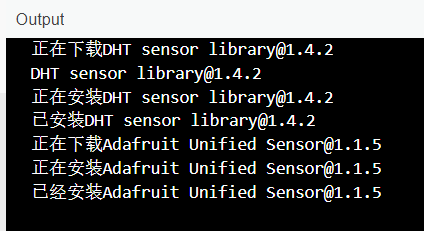

##### 使用

安装好之后我们找到 Arduino IDE 上方选项卡打开 `File->Examples->DHT sensor library->DHTtester`

即可打开 `DHT sensor library` 使用例程，这里我们只需要根据实际情况修改开头几行配置即可直接编译到开发板上进行测试：

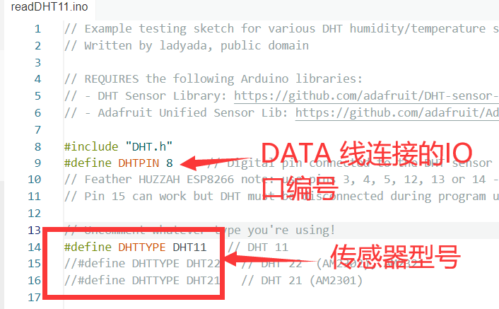

上传到开发板后打开我们的 `Serial Monitor`即可看到 Arduino 正在回传温湿度信息：


#### PlatformIO

##### 安装

相比于 Arduino IDE 能自动帮我们检索依赖库，`Platform IO` 则需要我们分别安装两个库。

首先新建一个工程，然后打开 `Libraries` 页面搜索 `DHT11`，找到 `DHT sensor library by Adafruit`，点进去：

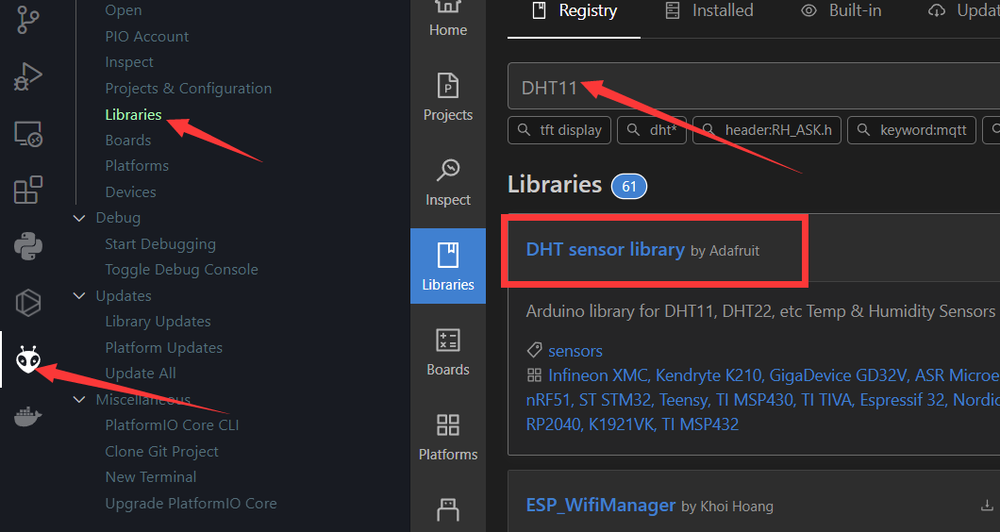

点击 `Add to Project`：

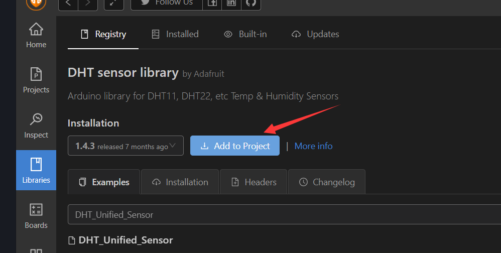

选择好要安装的工程，点击 `Add`

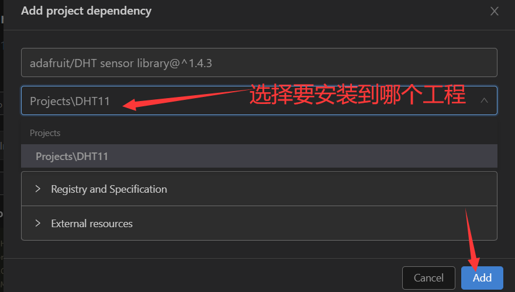

稍等片刻即可成功安装。这时候如果我们尝试进行编译，编译器会提示如下错误：

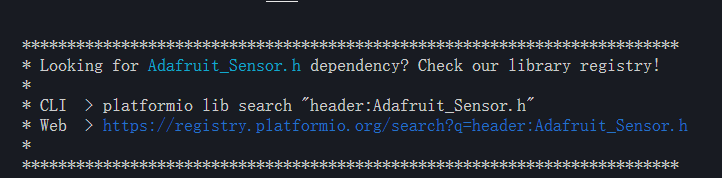

说明我们缺少一个依赖项目，按照安装 `DHT sensor library` 的方法，我们搜索 `Adafruit_Sensor` 进行安装，即可正常编译：

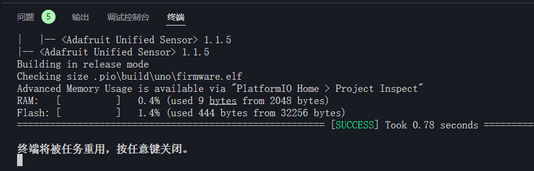

##### 使用

打开项目中 `.pio/libdeps/uno/DHT sensor library/examples/DHTtester/DHTtester.ino` 即可看到 `DHT11` 的使用例程，

我们将其内容复制到 `src/main.cpp`

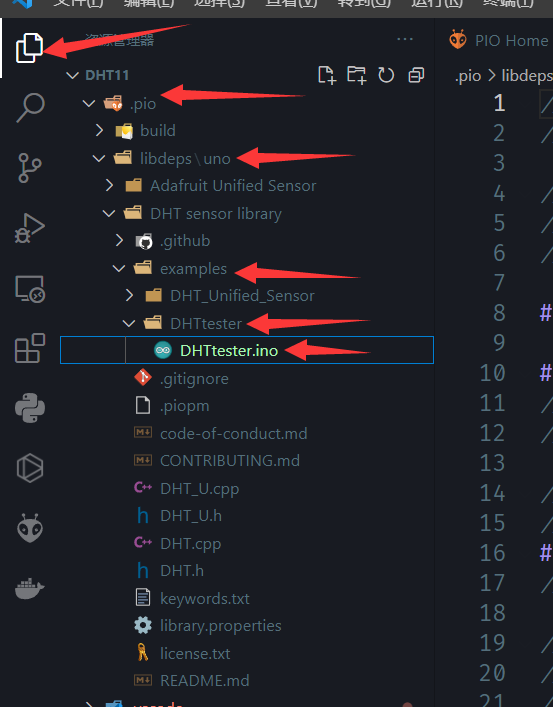

修改一下配置参数，然后连接我们的 Arduino 将程序进行烧录：

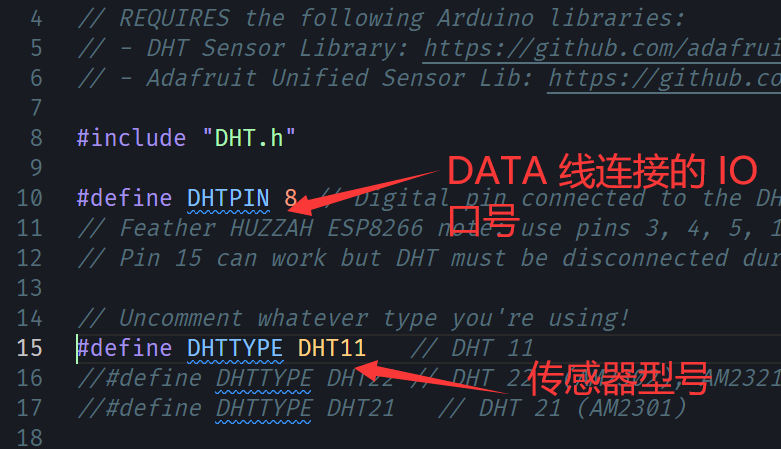

完成后打开我们的`Serial monitor` 查看串口输出：

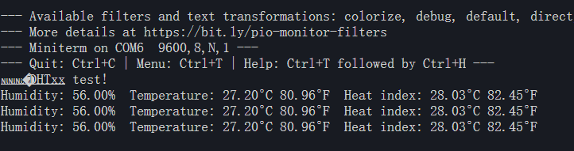

可以成功看到的串口输出传感器数据。

#### DH11 库使用简单说明

首先需要初始化一个全局变量，输入 DHT 连接的引脚编号和 DHT 的类型：

```cpp
DHT dht(DHTPIN, DHTTYPE)
```

这里，DHT 有以下几种方法（函数）可供使用：

```cpp
  // 使用方法见上文中的例子
  void begin(uint8_t usec = 55); // 初始化类中的一些参数
  float readTemperature(bool S = false, bool force = false); // 读取温度，不传参数返回 摄氏度，传入一个 true 返回 华摄氏度
  float convertCtoF(float); // 摄氏度转华摄氏度
  float convertFtoC(float); // 华摄氏度转摄氏度
  float computeHeatIndex(bool isFahrenheit = true); // 计算体感温度，参数为 传入的温度是否是华摄氏度，这里温湿度会自动读取
  float computeHeatIndex(float temperature, float percentHumidity, // 功能同上，是面那个函数的具体实现，多了温度和湿度两个参数
                         bool isFahrenheit = true);
  float readHumidity(bool force = false); // 读取湿度
  bool read(bool force = false); // 读取数据（内部使用，一般不主动调用）
```

> 需要注意的是 DHT11 刷新频率并不高，所以在例程中会存在一些延迟函数防止刷新过快出现读取问题。

###　小结

本节我们简单学习了如何安装 Arduino 的支持库以及如何查看支持库提供的例程，进一步了解了 DHT11 库的使用方法，下一节我们将学习如何使用 LCD 屏幕显示字符，组后将两者组合起来实现一个迷你温度显示器。

## OLED 屏幕的使用

本节我们会用到名为 `SH1106` 的 1.3寸 OLED 显示屏，笔者用的 `SH1106` 使用 `I2C` 方式进行操作，只用到四根线（`VCC` `GND` `SDA` `SCL`) 分辨率为 `128x64` ，大概长这个样子：

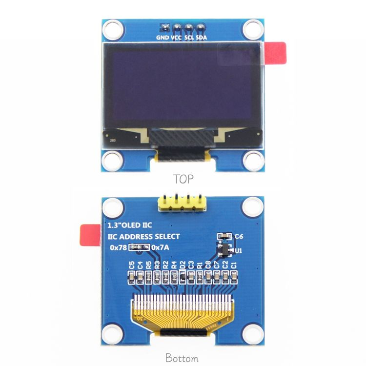

使用时接线为 `GND -- GND` `VCC -- 5V` `SDA -- A4` `SCL -- A5`

> 根据使用方式和屏幕不同，实际接线可能会有出入，如果不懂可以百度关键词 Arudino+屏幕型号+通信方式（I2C 或 SPI）

对于显示屏如果直接进行操作使用起来非常复杂，但好在开源社区为其提供了强大的支持库。

### U8g2 库

`U8g2` 是一个单色显示屏的支持库，支持市面上绝大多数单色显示屏，能非常方便的从库管理器进行安装。

#### 安装

和 `温湿度传感器` 一节中 `DHT sensor library` 支持库的安装方式相同，在 `Libraries` 页面进行搜索后安装即可，但由于其体积较大因为网络问题可能会存在下载缓慢或者失败等问题，如果一直无法安装成功请尝试直接下载官方的发布版本（https://github.com/olikraus/U8g2_Arduino/archive/master.zip)进行手动安装

#### 使用

`U8g2` 同样提供了丰富的例程供我们学习，除此之外还有详细的官方文档：

>U8g2 wiki：https://github.com/olikraus/u8g2/wiki
>
>U8g2 函数说明：https://github.com/olikraus/u8g2/wiki/u8g2reference
>
>U8g2 屏幕类列表：https://github.com/olikraus/u8g2/wiki/u8g2setupcpp
>
>U8x8 函数说明：https://github.com/olikraus/u8g2/wiki/u8x8reference
>
>U8x8 屏幕类列表：https://github.com/olikraus/u8g2/wiki/u8x8setupcpp

打开` examples` 文件夹可以看到如下结构：


需要注意的是，`U8g2` 提供了两个版本：`U8g2` 本身（例程中 `full_buffer` 与 `page_buffer` ）和 `u8x8` （例程中 `u8x8`），**前者支持完整绘图功能**，但是速度一般且需要额外的内存支持，**后者只支持显示字库中图形**但是速度快不需要额外的内存。

 `full_buffer` 与 `page_buffer` 的区别在于，`full_buffer` 会在内存中维护全部的图形缓存会占用大量内存（渲染速度快，但在 UNO 上只有部分例程能够成功运行）而 `page_buffer` 一次只维护一小部分缓存并分批次进行更新（渲染速度稍慢，在 UNO 上全部例程都可成功运行），大家可以自行运行例程中的代码进行一个粗略的了解，每段脚本只需要解除相应屏幕的注释即可，比如笔者用的 `SH1106 128x64` 使用 I2C 通信就使用这个：

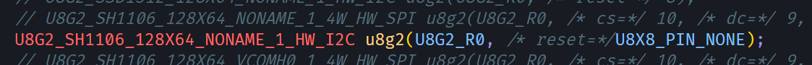 

> 其具体明明规范可以见：
>
> u8x8: https://github.com/olikraus/u8g2/wiki/u8x8setupcpp#constructor-name
>
> u8g2: https://github.com/olikraus/u8g2/wiki/u8g2setupcpp#constructor-name
>
> 只要直到屏幕型号、分辨率、连接方式（I2C 还是 SPI）即可轻松找到

## 组合技-温湿度显示器

前面我们已经了解了如何分别使用 温湿度传感器 和 OLED 屏幕，现在我们将它们组合起来，先看效果：

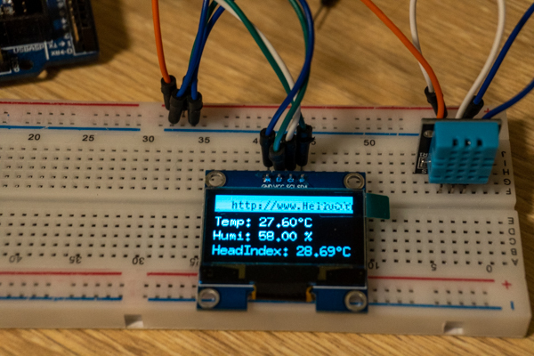

这里的实现非常简单，器件与开发板连线与上文相同。我们只需要将传感器数据搬运到屏幕上显示即可：

```c++
#include <Arduino.h>
#include <U8g2lib.h>
#include "DHT.h"

// DHT11 DATA 引脚连接的数字引脚编号
#define DHT_DATA_PIN 8

DHT dht11(DHT_DATA_PIN, DHT11, 1);
U8G2_SH1106_128X64_NONAME_1_HW_I2C oled(U8G2_R0, U8X8_PIN_NONE);

float t, f, h;
float head_index;
const char URL[] = "http://www.HelloGitHub.com";
int url_width = 0;
bool Fahrenheit = false;

void update_data()
{
  h = dht11.readHumidity();
  t = dht11.readTemperature();
  f = dht11.readTemperature(true);
  head_index = dht11.computeHeatIndex(t, h, false);
}

void setup()
{
  t = f = h = 0;

  dht11.begin();
  oled.begin();
  oled.enableUTF8Print();
  oled.setFontMode(0);
  url_width = oled.getUTF8Width(URL); # 符号需要启动
  update_data();
}
void loop()
{
  static int url_x_pos = -url_width;
  oled.firstPage();
  do
  {
    if (millis() % 200 == 0) // 每 200ms 更新一次
      update_data();
    oled.setFont(u8g2_font_t0_11_mr);
    oled.drawBox(0, 0, 128, 17);
    oled.setDrawColor(0);
    oled.setCursor(url_x_pos, 14);
    oled.print(URL);
    oled.setDrawColor(1);

    oled.setCursor(0, 32);
    oled.setFont(u8g2_font_7x13_mf);
    oled.print("Temp: ");
    if (Fahrenheit) // 每隔一段时间自动切换单位显示
    {
      oled.print(f);
      oled.print("°F");
    }
    else
    {
      oled.print(t);
      oled.print("°C");
    }

    oled.setCursor(0, 47);
    oled.print("Humi: ");
    oled.print(h);
    oled.print(" %");

    oled.setCursor(0, 62);
    oled.print("HeadIndex: ");
    oled.print(head_index);
    oled.print("°C");

  } while (oled.nextPage());

  Fahrenheit = (millis() % 4000 == 0) ? (!Fahrenheit) : Fahrenheit; // 每 4s 更换一次单位
  url_x_pos += 3;
  if (url_x_pos > 128)
    url_x_pos = -url_width;
}
```

## 结语

本期的内容就是这些，市面上大部分的传感器都有其相应的支持库且使用起来非常便捷，接下来大家可以发挥想象进行制作。

最后，感谢您的阅读！！！

这里是 HelloGitHub 分享 GitHub 上有趣、入门级的开源项目。您的每个点赞、留言、分享都是对我们最大的鼓励！
