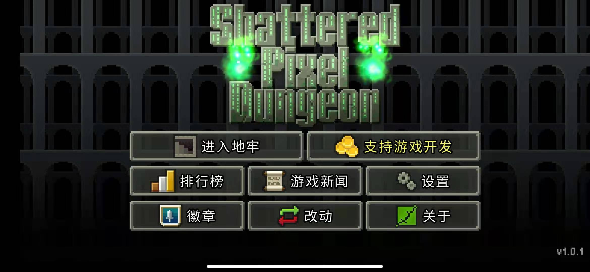
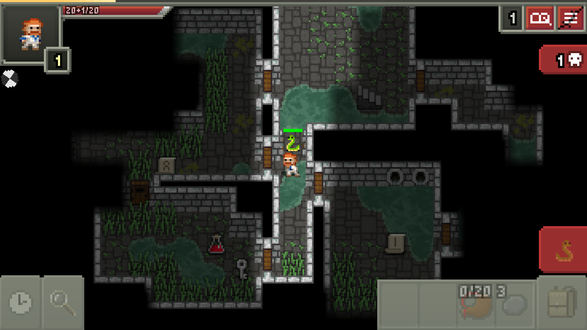
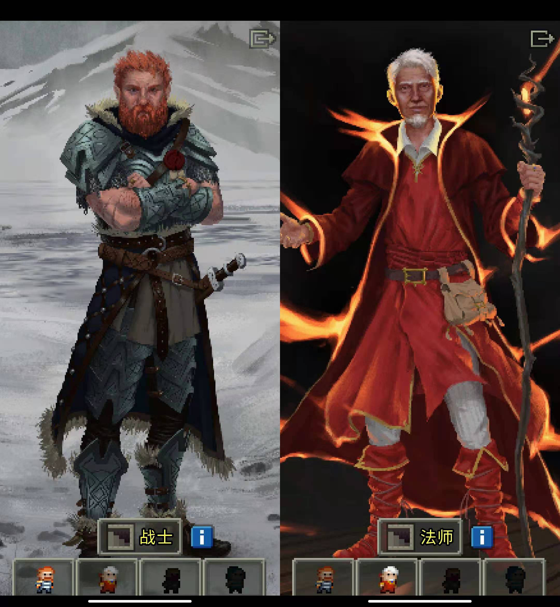
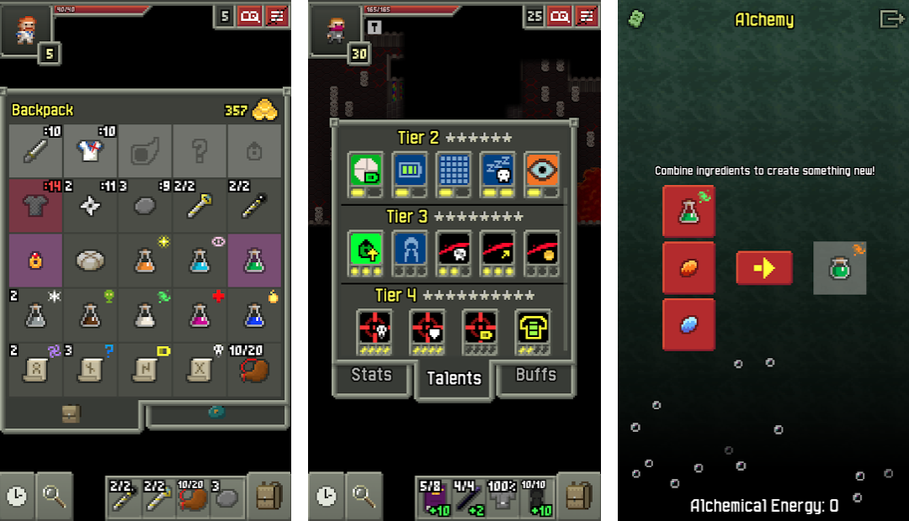
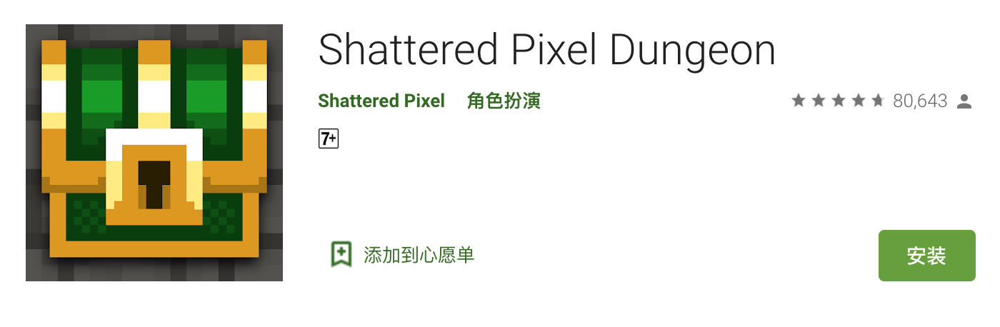
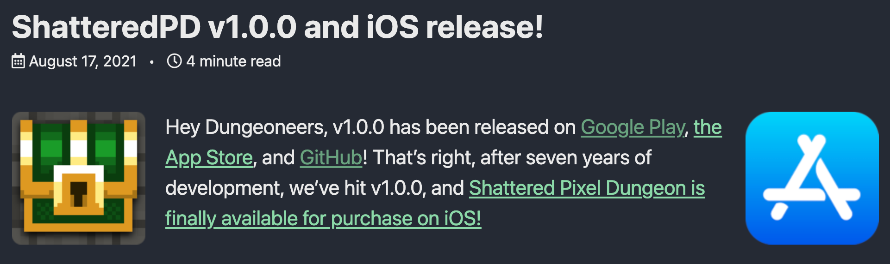
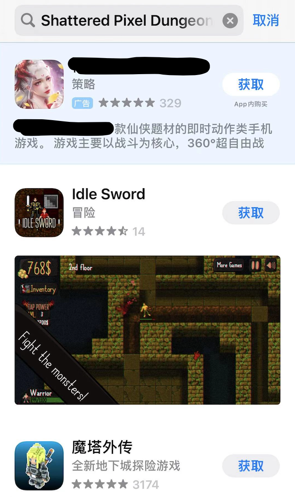
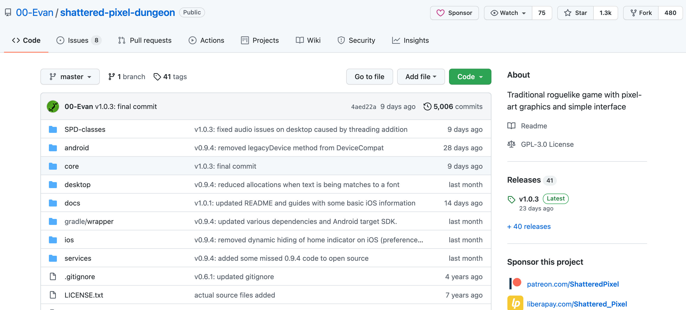

# 这款打怪升级的像素小游戏，7 年前在 GitHub 社区出生，如今在谷歌商店有 8 万人给了满分

今天我在 GitHub 摸鱼寻找新的“目标”时，发现了一个开源项目是 RougeLike 类的角色扮演游戏「破碎版像素地牢」（Shattered Pixel Dungeon）类似魔塔的游戏。

**游戏简介**：一个 RougeLike 类 RPG 游戏，以像素风、多样性为特色，游戏中每场探险都独一无二，每次开局都有新的乐趣。游戏拥有 4 个可选角色，而且会随机生成关卡和敌人，超过 150 种可供收集并使用的道具，**支持中文、苹果和安卓手机**。游戏操作简单但想通关游戏不是件容易的事情。

嘿，看起来不错。我这个 RPG 游戏爱好者，立马去把玩了一番。

太好玩了！没谁了，今儿就它了。

> 项目地址：https://github.com/00-Evan/shattered-pixel-dungeon

## 上手

这个游戏一共才 8MB 我很快就安装好了，录了个试玩视频：

<iframe src="//player.bilibili.com/player.html?aid=762987894&bvid=BV1S64y1h7K7&cid=405352952&page=1" scrolling="no" border="0" frameborder="no" framespacing="0" allowfullscreen="true"> </iframe>

> 安卓和 PC 的安装包下载地址在文末

## 良心游戏

游戏画面是暗黑风，进入游戏先选择角色，有战士、法师、射手、盗贼，但刚开始只能选择战士。

因为第一次玩，我瞎逛几步得到了一些看不懂的道具，玩了 2 分钟我就死了😂。

我又玩了几把，虽然 10 分钟内死了 5 次，但体验到了游戏的职业、天赋、装备、药水、鉴定、药水、食物等系统，还有一些机关和任务之类的。虽然游戏有些难上手，但是这也正是 RougeLike 类游戏的乐趣所在。

总而言之可玩性很高，只是我太菜挂的快，好多都没体验到。

破碎版像素地牢具备：
- **高复玩性**：随机生成的楼层、敌人和道具。每局都有崭新体验！
- **4 种英雄职业**：战、法师、盗贼、猎手。每个英雄都有独特玩法。
- **8 种专精**：成功过关斩将的英雄可以精进他们的技巧，变得更加强大。
- **5 种极具特色的地牢区域**：每一个区域都有独特的敌人、陷阱还有任务。
- **超过 150 种道具**：包括各种强力法杖、戒指、武器和护甲。
- **50 余种敌人、30 种陷阱、5 个关卡**首领将会来考验你的技术。
- **独特的神器**：其力量随着使用而成长。
- **持续更新**：大约每隔一月便会带来全新内容。

然后，我去 Google Play 看了下大家的评价，有 8 万人给出了将近满分的评价，总分 4.7。

大部分​打低分的玩家都是因为游戏太难了，但这种 RougeLike 类的 RPG 游戏，上手就是有一定的难度。我还记得当时玩魔塔，卡在一层好长时间，重来好几次才过去。

「破碎版像素地牢」这个游戏不仅好玩而且 100% 免费，没有广告和内购，仅靠捐赠开发了 7 年，最近终于发布了 v1.0.0 版本并上线了 App Store。

因为我的是安卓手机，所以让朋友在 App Store 搜了下，然而国内的 App Store 没搜到 😢

**它除了是款好玩的游戏，还​是个维护了 7 年的开源项目。**

## 出生于开源社区

「破碎版像素地牢」（shattered-pixel-dungeon）诞生于 GitHub 社区是一个 Java 开源项目，它基于另一个已经停止维护的项目 Pixel Dungeon 开发。

最初作者只是想修复 Pixel Dungeon 的 BUG，但经过 7 年的开发和迭代（5000 次提交）已经变成一个完全不同于 Pixel Dungeon 的项目了。

作者本身不是从事游戏开发的程序员，但出于对游戏开发的热爱，才有了这个开源项目。开源的方式也让 shattered-pixel-dungeon 充满活力，开源的力量正在让它变得越来越好。比如：多语言的翻译，就是通过社区的贡献。

> 参与翻译：https://www.transifex.com/shattered-pixel/shattered-pixel-dungeon

## 最后

今天推荐的「破碎版像素地牢」就聊到这里，最后希望它开源的故事能给你带来些启发。

不要总问自己会什么，或许阻碍参与开源的不是技术。还是那句话：“兴趣是最好的老师！”

​这里是 HelloGitHub 分享 GitHub 上有趣、入门级的开源项目，帮你找到开源的乐趣。

---

> 游戏下载链接: https://pan.baidu.com/s/1edPJ0p1aHiTyZEJZaKhwhQ  密码: fkb9

友情提示：下载需谨慎！请合理安排时间！

别问我为什么这么说，因为我蹲的腿都麻了！