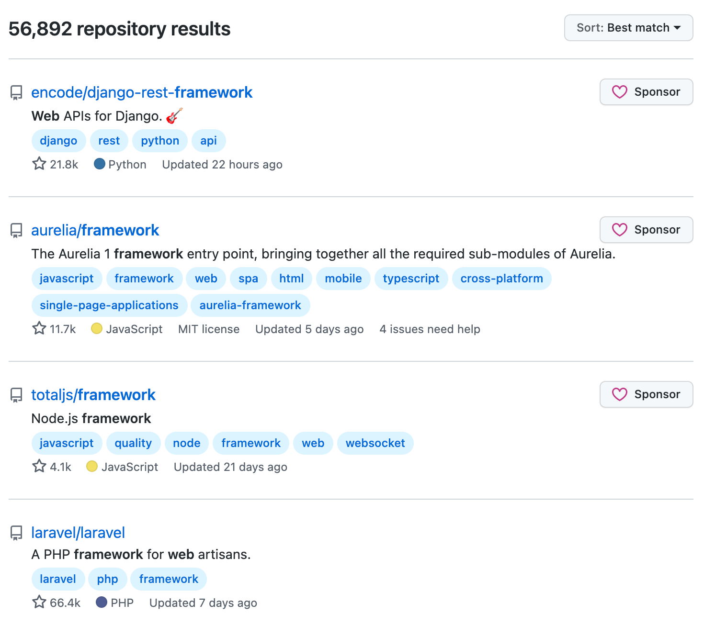
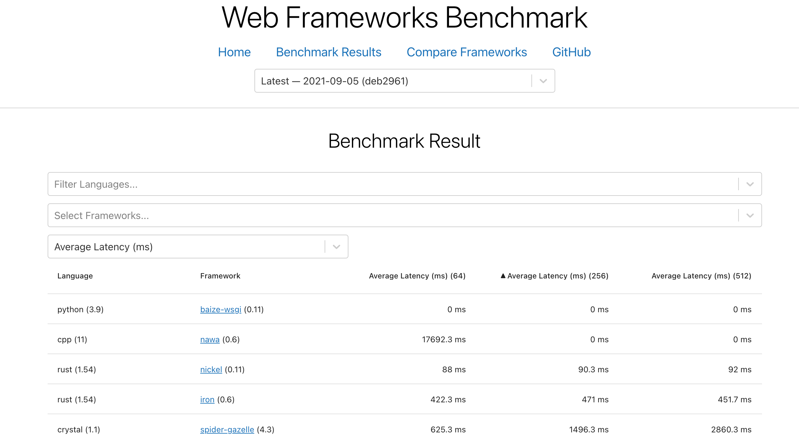
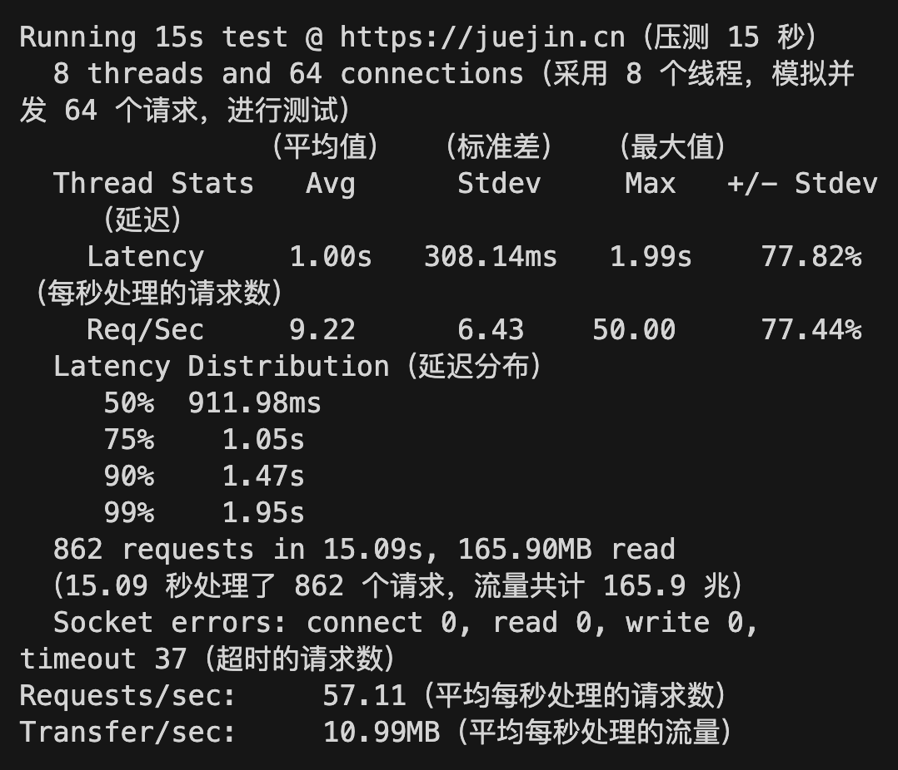
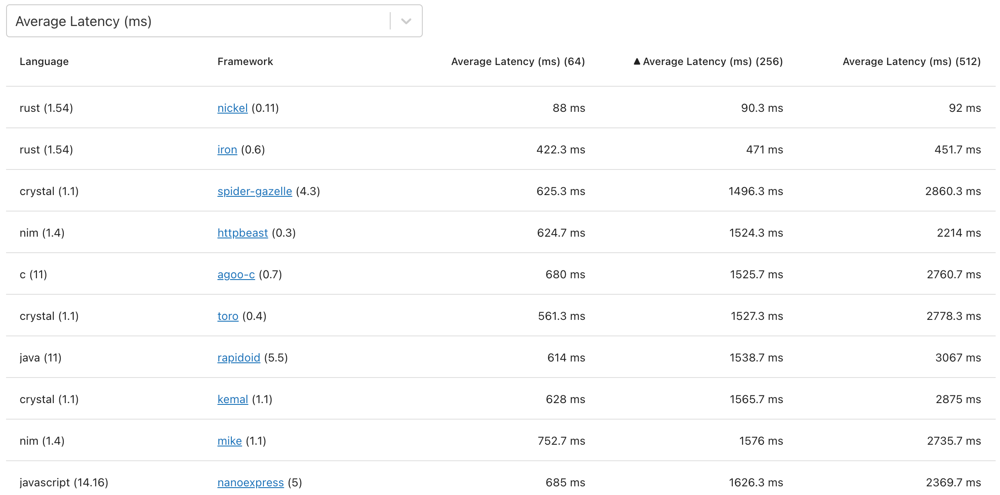
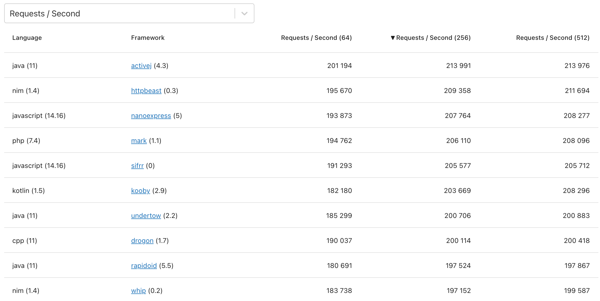
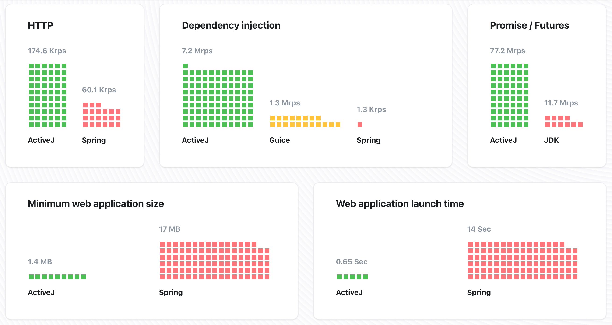

# 开源的 Web 框架哪个快？我在 GitHub 找到了答案


在开源这片自由的土地上，孕育了太多开源 Web 框架。我在 GitHub 上搜了一下“web framework”关键字显示有 **56000+** 匹配的开源项目，它们百花齐放各有特色，覆盖多种语言。



相信做过 Web 开发的程序员，都能说出好几个 Web 框架，如数家珍般地说出它们的好。比如我用过的 Python Web 框架有：Django、Tornado、Flask、FastAPI。这些 Web 框架各有特色：
- Django 的大而全
- Flask 的微小上手快
- 专门开发接口的 FastAPI

不同的 Web 框架，在应对不同场景和需求时各有千秋，所以很难片面的说那个 Web 框架就是最好的，但如果**单从速度方面比较的话，还是可以比出个高低的！** 今天介绍的开源项目，就试图找出**最快的开源 Web 框架。**

> 项目地址：https://github.com/the-benchmarker/web-frameworks


## 介绍

web-frameworks 定时发布多种开源 Web 框架性能测试报告的项目，告诉你谁是最快的 Web 框架！



它采用 Ruby 语言编写，首先通过 Docker 启动待压测的 Web 框架，启动后通过 wrk 压测服务，最后把测试报告发布到网站上，结果支持搜索和排序功能，整个过程完全自动化。

**具体的测试参数和机器配置：**

**wrk**：HTTP 基准测试工具，支持压测和输出测试报告。

wrk 的相关参数：8 线程(-t)，压 15 秒(-d)，分别采用并发(-c) 64、256、512 模式压测了三次。我在本机用 wrk 对掘金网站做了压测，用来讲解报告的相关数据。

> 命令：wrk -t8 -d15s -c64 --latency https://juejin.cn

结果及名词解释：



**机器配置**：
- CPU: 8 Cores (AMD FX-8320E Eight-Core Processor)
- RAM: 16 GB
- OS: Linux

项目中涉及的所有测试，用的都是相同配置的机器，相关的所有代码均已开源。尽可能公平公正，完全透明。测试结果还会随着 Web 框架的版本迭代而更新，

下面来看看 web-frameworks 最新一期的测试报告。

## 最快的框架

web-frameworks 测出来的**平均延迟**，​从低到高排序：



### 1、nickel

**Star 数**：2.9k｜**语言**：Rust

> https://github.com/nickel-org/nickel.rs

一个受 Express.js 启发的 Rust Web 框架。示例代码：

```rust
#[macro_use] extern crate nickel;

use nickel::{Nickel, HttpRouter};

fn main() {
    let mut server = Nickel::new();
    server.get("**", middleware!("Hello World"));
    server.listen("127.0.0.1:6767");
}
```

### 2、iron

**Star 数**：5.9k｜**语言**：Rust

> https://github.com/iron/iron

示例代码：

```rust
extern crate iron;
extern crate time;

use iron::prelude::*;
use iron::{typemap, AfterMiddleware, BeforeMiddleware};
use time::precise_time_ns;

struct ResponseTime;

impl typemap::Key for ResponseTime { type Value = u64; }

impl BeforeMiddleware for ResponseTime {
    fn before(&self, req: &mut Request) -> IronResult<()> {
        req.extensions.insert::<ResponseTime>(precise_time_ns());
        Ok(())
    }
}

impl AfterMiddleware for ResponseTime {
    fn after(&self, req: &mut Request, res: Response) -> IronResult<Response> {
        let delta = precise_time_ns() - *req.extensions.get::<ResponseTime>().unwrap();
        println!("Request took: {} ms", (delta as f64) / 1000000.0);
        Ok(res)
    }
}

fn hello_world(_: &mut Request) -> IronResult<Response> {
    Ok(Response::with((iron::StatusCode::OK, "Hello World")))
}

fn main() {
    let mut chain = Chain::new(hello_world);
    chain.link_before(ResponseTime);
    chain.link_after(ResponseTime);
    Iron::new(chain).http("localhost:3000");
}
```

由于篇幅问题，这里仅介绍报告中**前 2 名**的框架。

## 最能扛的框架

web-frameworks 测出来的**平均每秒处理请求数**，从高到低排序：



### 1、activej

**Star 数**：286｜**语言**：Java

> https://github.com/activej/activej

适用于 Web、高负载和微服务的 Java 框架。示例代码：
```java
class Main extends HttpServerLauncher {
  @Provides
  AsyncServlet servlet() {
    return request -> HttpResponse.ok200()
      .withPlainText("Hello World");
  }
  
  public static void main(String[] args) throws Exception {
    Launcher launcher = new HttpHelloWorldExample();
    launcher.launch(args);
  }
}
```




### 2、httpbeast

**Star 数**：239｜**语言**：Nim

> https://github.com/dom96/httpbeast

示例代码：
```nim
import options, asyncdispatch

import httpbeast

proc onRequest(req: Request): Future[void] =
  if req.httpMethod == some(HttpGet):
    case req.path.get()
    of "/":
      req.send("Hello World")
    else:
      req.send(Http404)

run(onRequest)
```

由于篇幅问题，这里仅介绍报告中**前 2 名**的框架。

## 感受

本文内容有限无法展示所有的指标，[点击这里](https://web-frameworks-benchmark.netlify.app/result)查看更多指标和分类的报告。

看完这份 Web 框架测试报告，我发现 Rust 写的 Web 框架在不同的性能指标的测试结果中都名列前茅，看来 Rust 在性能方面真的是名不虚传。

当然性能不是评判一个 Web 框架的唯一标准，今天写这个项目也是希望可以给大家在选择 Web 的时候提供一个参考。而且报告中有冷门但具有特点的 Web 框架，可作为玩具项目玩一玩，如果那天突然火起来的时候，你可能已经抢占先机、轻车熟路了。

最后，web-frameworks 的测试结果共包含 237 个 Web 框架，虽然不多但是这个数字还在不断增加...而且 issues 里还有很多 Web 框架申请“出战”，开源社区的力量正在让这个项目越来越好，看到这里我就放心了。

以上就是本文的全部内容，希望通过这个开源项目可以让你找到最快、最能扛的 Web 框架，性能上快人一步！

